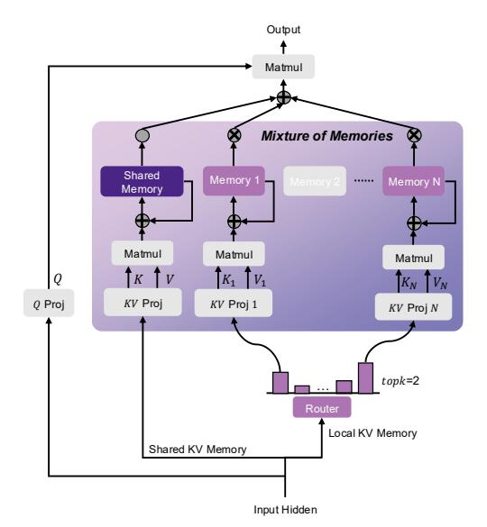

# 3 METHOD

### 3.1 MOTIVATION

Linear sequence models compress the entire sequence data into a fixed-size memory state. Despite numerous efforts to minimize information loss, such as introducing gating mechanisms and employing more precise control over memory modifications [\(Orvieto et al.,](#page-11-5) [2023;](#page-11-5) [De et al.,](#page-9-2) [2024;](#page-9-2) [Beck](#page-9-3) [et al.,](#page-9-3) [2024;](#page-9-3) [Yang et al.,](#page-12-2) [2023;](#page-12-2) [Zhang et al.,](#page-12-3) [2024\)](#page-12-3), some degradation in this compression process is inevitable. Expanding the memory capacity has been shown to mitigate this issue to some extent, with studies indicating that increasing memory capacity can enhance model performance [\(Qin et al.,](#page-11-2) [2024d;](#page-11-2) [Peng et al.,](#page-11-1) [2024\)](#page-11-1).

However, previous approaches that simply increased the size of the RNN state, essentially expanding a single memory state, struggled to capture the full spectrum of information within an entire sequence. We propose that this difficulty arises because sequence information is often multifaceted, and a single, expanded memory may not be capable of simultaneously capturing multiple aspects of the data. Inputs that introduce new or orthogonal information may interfere with existing memory content when using a shared memory. Rather than discarding these inputs through gating mechanisms or overwriting the existing memory state, it may be more effective to consider alternative strategies that allow for the preservation of diverse information without interference.

### 3.2 MOM: MIXTURE-OF-MEMORIES

To address the challenge outlined above, we propose a novel approach for encoding multiitem memory such as theta-gamma oscillations [\(Lisman & Jensen,](#page-10-3) [2013\)](#page-10-3), and concepts from Mixture-of-Experts (MoE) [\(Shazeer et al.,](#page-12-4) [2017\)](#page-12-4), where different experts handle specific tokens. In this approach, we leverage multiple memory states, each of which is selectively updated by different inputs. This increases the memory capacity and enables the model to retain diverse pieces of information by storing various types of inputs in separate memory states.

In our framework, the memory states function similarly to the experts in MoE. However, instead of relying on completely separate networks, these modules are individual RNN states embedded within a linear recurrent mechanism. This design allows for the isolation of memory updates while concurrently managing distinct types of information. It is important to note that MoM fundamentally differs from traditional MoE, as we will discuss in Appendix [B.](#page-13-0) Figure [1](#page-2-0) provides an overview of the MoM architecture. Below, we introduce the structure of the MoM layer and explain how this multi-

Figure 1: MoM Architecture. Each input token selectively activates and updates K memory states, leaving non-activated memory states unchanged to avoid interference from current input. Additionally, we introduce a continuously activated shared memory. This figure presents the basic memory update mechanism; other mechanisms involving gating or more complex updates follow a similar approach.

memory architecture is implemented in the context of linear sequence modeling.

#### 3.2.1 ROUTER

We use a router to assign inputs to different memory states. Utilizing the top-k concept, each token is routed to the top-k memories based on its importance scores. Specifically, we use a simple linear layer to generate these scores for each input token. After applying a softmax function, we select the top-k scores and normalize them.

$$\mathbf{scores}_t = \operatorname{TopK}(\operatorname{softmax}(\boldsymbol{x}_t \boldsymbol{W}_q)) \in \mathbb{R}^k,$$
 (3)

$$g_t = \frac{\mathbf{scores}_t}{\sum \mathbf{scores}_t} \in \mathbb{R}^k, \tag{4}$$

where  $x_t \in \mathbb{R}^d$ , k is the top-k number,  $W_g \in \mathbb{R}^{d \times M}$  is learnable weight,  $g_t$  is the normalized importance scores of the input  $x_t$ .

#### 3.2.2 Linear Recurrent Memory Module

After the router network, the input  $x_t$  is directed to top-k linear recurrent modules, meaning that the top-k memories are activated while the others remain inactive.

**Each Memory.** For each activated memory, indexed by m, we perform the following operation:

1. Key and Value Projections: We project the input  $x_t$  to  $k_t^m$  and  $v_t^m$  using  $W_k^m$  and  $W_n^m$ :

$$\boldsymbol{k}_{t}^{m} = \boldsymbol{x}_{t} \boldsymbol{W}_{k}^{m}, \boldsymbol{v}_{t}^{m} = \boldsymbol{x}_{t} \boldsymbol{W}_{v}^{m} \in \mathbb{R}^{d}, \tag{5}$$

where  $W_k^m$ ,  $W_v^m$  are learnable projection weights for kv of the m-th memory module.

2. **Memory Update**: We update the activated memory state using  $k_t^m$ ,  $v_t^m$ :

$$\boldsymbol{M}_{t}^{m} = \boldsymbol{M}_{t-1}^{m} + (\boldsymbol{k}_{t}^{m})^{T} \boldsymbol{v}_{t}^{m} \in \mathbb{R}^{d \times d}. \tag{6}$$

The equation above represents the simplest form of memory update for clarity. Our approach is flexible and does not rely on a specific memory update mechanism. To enhance performance, we can incorporate mechanisms such as forget gates (Sun et al., 2023).

More generally, our method can be adapted to incorporate various memory update methods proposed in previous work. Detailed descriptions of these methods are provided in Table 1.

**Memory Mixing.** After updating the activated memory states, we perform a weighted sum of these memory states using the importance scores obtained from Equation(4).

$$\tilde{\mathbf{M}}_t = \sum g_t^{(m)} \mathbf{M}_t^m \in \mathbb{R}^{d \times d}, \tag{7}$$

where  $\boldsymbol{M}_t^m$  is one activated memory and  $\boldsymbol{g}_t^{(m)}$  is the importance score of  $\boldsymbol{M}_t^m$ .

We then obtain the output of the MoM by applying query vector  $q_t$  to the mixed memory  $\tilde{M}_t$ :

$$o_t = q_t \tilde{M}_t \in \mathbb{R}^d.$$
 (8)

Finally, the output of the MoM layer is computed by applying an activation function, normalization, and a linear transformation.

Throughout the recurrent process, only a subset of memory states is activated and updated at each time step, while memory states that are not routed remain inactive and unchanged. When the input passes through the key-value

Table 1: **Memory Update Rules.** We demonstrate that several linear sequence models can be viewed as recurrent models in terms of memory updates, where  $a_t, b_t \in (0,1)$  are data-dependent scaler,  $a_t$  is data-dependent vector, and  $\gamma$  is a data-independent constant.

| Method      | Memory Update Rule                                                                                                                                                 |
|-------------|--------------------------------------------------------------------------------------------------------------------------------------------------------------------|
| Linear Attn | $\boldsymbol{M}_t = \boldsymbol{M}_{t-1} + \boldsymbol{k}_t^T \boldsymbol{v}_t$                                                                                    |
| RetNet      | $\boldsymbol{M}_t = \gamma \boldsymbol{M}_{t-1} + \boldsymbol{k}_t^T \boldsymbol{v}_t$                                                                             |
| GLA         | $\boldsymbol{M}_t = (\boldsymbol{a}_t^T \boldsymbol{1}) \boldsymbol{M}_{t-1} + \boldsymbol{k}_t^T \boldsymbol{v}_t$                                                |
| DeltaNet    | $\boldsymbol{M}_t = (\boldsymbol{I} - \boldsymbol{k}_t^T \boldsymbol{k}_t) \boldsymbol{M}_{t-1} + b_t \boldsymbol{k}_t^T \boldsymbol{v}_t$                         |
| G-DeltaNet  | $\boldsymbol{M}_{t} = a_{t}(\boldsymbol{I} - \boldsymbol{k}_{t}^{T} \boldsymbol{k}_{t}) \boldsymbol{M}_{t-1} + b_{t} \boldsymbol{k}_{t}^{T} \boldsymbol{v}_{t}$    |
| TTT         | $M_t = M_{t-1} + b_t \nabla l(M_{t-1}; k_t, v_t)$                                                                                                                  |
| Titans      | $\mathbf{M}_t = a_t \mathbf{M}_{t-1} + b_t \nabla_M l(\mathbf{M}_{t-1}; \mathbf{k}_t, \mathbf{v}_t)$                                                               |
| Mamba2      | $\boldsymbol{M}_t = a_t \boldsymbol{M}_{t-1} + b_t \boldsymbol{k}_t^T \boldsymbol{v}_t$                                                                            |
| HGRN2       | $M_t = (a_t^T 1) M_{t-1} + (1 - a_t)^T v_t$                                                                                                                        |
| RWKV6       | $\boldsymbol{M}_t = a_t \boldsymbol{M}_{t-1} + \boldsymbol{k}_t^T \boldsymbol{v}_t$                                                                                |
| RWKV7       | $\boldsymbol{M}_{t} = (\boldsymbol{a}_{t}^{T} \boldsymbol{1}) \boldsymbol{M}_{t-1} + b_{t} \nabla l(\boldsymbol{M}_{t-1}; \boldsymbol{k}_{t}, \boldsymbol{v}_{t})$ |

projection layer, it generates multiple sets of keys and values that are fed into different memory modules. This design enables the model to maintain multiple memory states, each preserving distinct pieces of information. By aggregating the activated memories into a comprehensive mixed

memory by weighted summation, the query can effectively retrieve information from this mixed memory, and generate attention output followed by other layers.

**Shared Memory.** To enhance our model's ability to capture long-term dependencies, we introduce a *shared memory* mechanism. This shared memory has access to the entire sequence information, allowing it to effectively store and retrieve long-term information. By integrating shared memory into our model, we ensure that it can leverage the complete historical context, resulting in significant improvements in performance and robustness.

Figure 2: **Hardware-efficient Implementation of MoM.** Tokens sharing the same color are routed to the same memory. ① Tokens are first split into groups according to memory routing results, ② then concatenated into a varlen input sequence, ③ processed by the Triton kernel, ④ the outputs are returned, ⑤ split back into their respective memories, and ⑥ finally restored to the original sequence order. For clarity, the illustration shows the top-1 routing case, and the qkv projection is omitted.

#### 3.3 HARDWARE-EFFICIENT IMPLEMENTATION

In the implementation of MoM, mixing memories before query multiplication is equivalent to multiplying each memory by the query and then mixing the results, allowing us to reuse efficient Triton-based operators from prior linear sequence models. We first reorder the sequence tokens according to the routing results so that they follow the memory layout. The reordered tokens are then concatenated with varlen for operator computation, after which the results are aggregated via weighted summation. In this way, MoM's computation can be effectively reduced to **varlen operations**, enabling efficient execution. We elaborate on this process below.

Given input tokens  $x_{b,t} \in \mathbb{R}^d$  for batch  $b \in \{1,\ldots,B\}$  and time step  $t \in \{1,\ldots,T\}$ , each token is routed to one or more memories  $m \in \{1,\ldots,M\}$  with routing weights  $\alpha_{b,t,m} \geq 0$  satisfying  $\sum_{m=1}^{M} \alpha_{b,t,m} = 1$ .

For each (b, m), define the ordered index set

$$\mathcal{I}_{b,m} = (t_{b,m}(1), \dots, t_{b,m}(L_{b,m})),$$

where  $t_{b,m}(j)$  is the original sequence index of the j-th token assigned to memory m, and  $L_{b,m} = |\mathcal{I}_{b,m}|$ . We index buckets lexicographically by p = (b-1)M + m and define cumulative boundaries

$$s_0 = 0,$$
  $s_p = \sum_{q=1}^{p} L_q \quad (p = 1, \dots, BM).$ 

The flattened sequence  $\tilde{\bm{X}}$  is obtained by

$$\tilde{x}_{s_{n-1}+j} = x_{b,t_{b,m}(j)}, \quad j = 1, \dots, L_{b,m},$$

with varlen representation  $(\tilde{X}, s)$ , where  $s = (s_0, \dots, s_{BM})$ .

For each bucket p=(b-1)M+m, queries share a projection matrix  $W_Q$ , while keys and values use memory-specific projections  $W_K^{(m)}, W_V^{(m)}$ :

$$\tilde{\boldsymbol{q}}_u = \boldsymbol{W}_Q \tilde{\boldsymbol{x}}_u, \quad \tilde{\boldsymbol{k}}_u = \boldsymbol{W}_K^{(m)} \tilde{\boldsymbol{x}}_u, \quad \tilde{\boldsymbol{v}}_u = \boldsymbol{W}_V^{(m)} \tilde{\boldsymbol{x}}_u, \quad u \in \{s_{p-1}+1,\ldots,s_p\}.$$

A memory-specific kernel  $\mathcal{F}_m$  with parameters  $\boldsymbol{\theta}^{(m)}$  is applied independently to each segment:

$$\boldsymbol{o}_{s_{p-1}+1:s_p} = \mathcal{F}_m(\tilde{\boldsymbol{q}}_{s_{p-1}+1:s_p},\,\tilde{\boldsymbol{k}}_{s_{p-1}+1:s_p},\,\tilde{\boldsymbol{v}}_{s_{p-1}+1:s_p};\,\boldsymbol{\theta}^{(m)}).$$

Mapping outputs back to the original sequence, the j-th token in Ib,m has per-memory output

$$\hat{\bm{o}}_{b,t_{b,m}(j),m} = \bm{o}_{s_{p-1}+j}.$$

Finally, token-level representations are reconstructed by weighted summation:

$$\mathbf{y}_{b,t} = \sum_{m=1}^{M} \alpha_{b,t,m} \, \hat{\mathbf{o}}_{b,t,m}.$$

