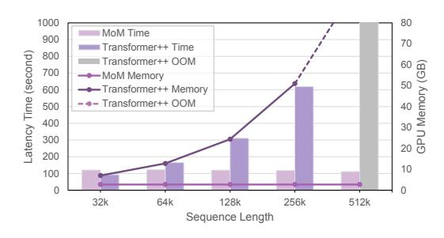
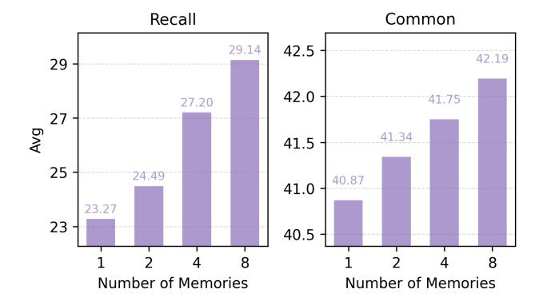

# 4 EXPERIMENTS

### 4.1 EXPERIMENTAL SETUPS

Models. In our experiments, we employ the Gated DeltaNet [\(Yang et al.,](#page-12-6) [2024\)](#page-12-6) as the memory update mechanism in MoM. The model is configured with four memory states, two of which are activated at each time step, along with a shared memory.

Baselines. We evaluate MoM against several linear recurrent models and Transformers, including RetNet [\(Sun et al.,](#page-12-5) [2023\)](#page-12-5), GLA [\(Yang et al.,](#page-12-2) [2023\)](#page-12-2), Gated DeltaNet [\(Yang et al.,](#page-12-6) [2024\)](#page-12-6), and Transformer++ [\(Touvron et al.,](#page-12-7) [2023\)](#page-12-7), which incorporates Rotary Position Embeddings [\(Su et al.,](#page-12-8) [2024\)](#page-12-8) and GLU [\(Shazeer,](#page-12-9) [2020\)](#page-12-9) into the Transformer architecture. To ensure a fair comparison, we train all baseline models from scratch using the exact same number of tokens.

Training. We follow the training procedure described by [Yang et al.](#page-12-2) [\(2023\)](#page-12-2), utilizing the SlimPajama dataset [\(Soboleva et al.,](#page-12-10) [2023\)](#page-12-10) sampled with 100B tokens and tokenized using the Mistral tokenizer [\(Jiang et al.,](#page-10-5) [2023\)](#page-10-5). We train models from scratch with parameter sizes of 380M and 1.3B, respectively. For the 380M models, we train on 15B tokens with a batch size of 0.5M tokens. More detailed training configuration is provided in Appendix [C.](#page-14-0) We utilized publicly available pretrained weights from [Zhang et al.](#page-12-3) [\(2024\)](#page-12-3) with exactly same configuration [1](#page-5-0) .

Parameter Explanation. We report model sizes using the common shorthand, where "380M" denotes a configuration with 24 layers and hidden size 1024, and "1.3B" denotes 24 layers with hidden size 2048. The main goal of MoM is to expand the memory capacity of linear sequence models through sparse activation. To this end, we apply sparse activation only to the key and value projections, which results in a small increase in activated parameters that is well justified by the performance gains. A detailed discussion on fairness is provided in Appendix [G.](#page-15-0)

### 4.2 MAIN RESULTS

### 4.2.1 RECALL-INTENSIVE TASKS

Linear sequence models, due to their limited memory capacity, often exhibit a significant performance gap compared to Transformer models, especially in recall-intensive tasks where extensive context is crucial. These tasks highlight notable performance differences among various linear models, making them a more accurate benchmark for evaluating a linear model's capabilities in handling contextual information.

To thoroughly assess our model's proficiency in such scenarios, we test six recall-intensive tasks following [Arora et al.](#page-9-4) [\(2024\)](#page-9-4): FDA [\(Arora et al.,](#page-9-5) [2023\)](#page-9-5), SWDE [\(Arora et al.,](#page-9-5) [2023;](#page-9-5) [Lockard et al.,](#page-10-6) [2019\)](#page-10-6), SQuAD [\(Rajpurkar et al.,](#page-11-6) [2018\)](#page-11-6), NQ [\(Kwiatkowski et al.,](#page-10-7) [2019\)](#page-10-7), TriviaQA [\(Joshi et al.,](#page-10-8) [2017\)](#page-10-8) and Drop [\(Dua et al.,](#page-10-9) [2019\)](#page-10-9). These tasks are designed to challenge a model's ability to perform context-based retrieval and comprehension.

As shown in Table [2,](#page-6-0) our proposed approach, benefiting from increased memory capacity and memory mixing mechanism, achieves significant improvements over other linear sequence models. Specifically, our model effectively narrows the performance gap with Transformer models. This improvement underscores the advantage of our method in capturing and utilizing long-range dependencies, thereby enhancing performance on tasks that require extensive contextual understanding.

### 4.2.2 LONG CONTEXT TASKS

1Models marked with an asterisk † use open-source pretrained weights with identical training configurations.

Table 2: **Results on Recall-Intensive Tasks.** All inputs are truncated to a maximum length of 2K tokens. MoM significantly outperforms all other linear models across both model sizes. In the 1.3B model, MoM even achieves performance very close to that of Transformer models.

| Scale          | Model                      | FDA   | SWDE  | SQUAD | NQ    | TriviaQA | Drop  | Avg.  | Avg. (no FDA) |
|----------------|----------------------------|-------|-------|-------|-------|----------|-------|-------|------------------|
| 380M Params    | Transformer++              | 46.14 | 25.87 | 33.22 | 18.94 | 45.97    | 20.03 | 31.70 | 28.81            |
| 15B Tokens     | RetNet                     | 5.90  | 9.28  | 22.41 | 6.91  | 40.05    | 18.59 | 17.19 | 19.45            |
| L=24, $d=1024$ | HGRN2                      | 11.53 | 17.34 | 24.08 | 12.67 | 43.84    | 17.35 | 21.14 | 23.06            |
|                | GLA                        | 11.26 | 16.78 | 27.85 | 12.77 | 43.90    | 17.68 | 21.71 | 23.80            |
|                | GSA                        | 6.36  | 16.87 | 21.90 | 14.60 | 42.18    | 16.72 | 19.77 | 22.45            |
|                | Gated DeltaNet             | 20.53 | 23.24 | 28.55 | 14.98 | 44.91    | 16.48 | 24.78 | 25.63            |
|                | MoM                        | 22.98 | 29.90 | 29.69 | 16.60 | 48.82    | 20.99 | 28.16 | 29.20            |
| 1.3B Params    | Transformer++ † | 44.32 | 32.43 | 42.59 | 24.49 | 58.47    | 21.56 | 37.31 | 35.91            |
| 100B Tokens    | RetNet †        | 13.62 | 22.59 | 33.46 | 15.43 | 53.79    | 19.79 | 26.45 | 29.01            |
| L=24, $d=2048$ | HGRN2 †         | 12.35 | 23.24 | 33.19 | 19.10 | 55.27    | 19.65 | 27.13 | 30.09            |
|                | $GLA^{\dagger}$            | 27.61 | 30.93 | 35.04 | 22.27 | 56.28    | 19.45 | 31.93 | 32.79            |
|                | $GSA^{\dagger}$            | 23.25 | 32.80 | 35.57 | 22.96 | 57.05    | 20.65 | 32.05 | 33.81            |
|                | Gated DeltaNet             | 30.25 | 27.65 | 34.06 | 23.22 | 58.23    | 20.36 | 32.30 | 32.70            |
|                | MoM                        | 41.14 | 34.30 | 37.08 | 24.11 | 58.59    | 21.03 | 36.04 | 35.02            |

Assessing performance on long-context tasks is crucial for linear models, as it reflects their ability to handle long-range dependencies effectively. We evaluated our model's comprehension of long contexts using the Long-Bench benchmark (Bai et al., 2024; Contributors, 2023). In Table 3, we present the average results across various categories, including summarization, few-shot learning, synthetic tasks, and code completion, along with the overall mean across all tasks. The complete detailed results are provided in Appendix I.

Table 3: **LongBench Benchmark Results.** *Note:* Sum = Summarization, FS = Few-shot, Syn = Synthetic.

| Model               | Sum  | FS    | Syn  | Code  | Avg.  |
|---------------------|------|-------|------|-------|-------|
| RetNet † | 6.30 | 15.76 | 2.64 | 40.52 | 13.61 |
| HGRN2 †  | 6.51 | 15.50 | 2.61 | 40.11 | 13.02 |
| $GSA^\dagger$       | 7.75 | 20.29 | 1.92 | 42.83 | 14.61 |
| Gated DeltaNet      | 7.14 | 18.00 | 2.10 | 41.52 | 13.98 |
| MoM                 | 6.89 | 21.26 | 2.63 | 47.79 | 15.64 |

Table 4: **Comparison of Mixture of Memories and Single Memory Expanded.** We constructed MoM models using different memory update mechanisms. Separate memory segments yielded better performance compared to simply increasing the memory capacity of a single memory.

| Model                                         | Params       | ARC-e                 | e ARC-e acc n ↑ |                       | Lamb. acc↑         | PIQA acc↑             | Wino. acc↑         | Avg.                  |
|-----------------------------------------------|--------------|-----------------------|----------------------------|-----------------------|-----------------------|-----------------------|-----------------------|-----------------------|
| GLA expanded GLA MoM                       | 425M 395M | 42.34 <b>42.85</b> | 22.95 <b>24.15</b>      |                       | 20.45 <b>23.23</b> | 63.00 <b>63.22</b> | <b>50.12</b> 49.88    | 38.90 <b>39.99</b> |
| Gated DeltaNet expanded Gated DeltaNet MoM | 550M 444M | 43.60 <b>44.65</b> | 24.66 <b>24.74</b>      |                       | 26.90 <b>27.93</b> | 64.47 <b>66.16</b> | 50.51 <b>51.78</b> | 41.32 <b>41.97</b> |
| Model                                         | Params       | FDA                   | SWDE                       | SQUAD                 | NQ                    | TriviaQA              | Drop                  | Avg.                  |
| GLA expanded GLA MoM                       | 425M 395M | <b>15.08</b> 9.90     | 20.15 <b>21.65</b>      | 28.28 <b>29.36</b> | 13.30 <b>14.16</b> | 41.65 <b>45.20</b> | 18.74 <b>20.89</b> | 22.87 <b>23.53</b> |

24.27

29.90

30.03

29.69

17.74

16.60

48.34

48.82

19.26

20.99

26.32

28.16

#### 4.2.3 MIXED MEMORY VS. SINGLE MEMORY

550M

444M

18.26

22.98

Gated DeltaNet expanded

Gated DeltaNet MoM

To validate the effectiveness of our mixed memory mechanism, we compare our MoM model with mixed memories to a baseline model that uses an expanded single memory with the same activated memory capacity. We adopt the same memory update method as existing linear models and extend it within our MoM framework. For comparison, we employed the commonly used method of expanding the single memory by expanding the dimension of  $\boldsymbol{v}$  to match the total size of all activated memories in the MoM model. We evaluate their performance on common-sense reasoning tasks and recall-intensive tasks in Table 4.

Figure 3: **Inference Efficiency of MoM.** We Figure 4: **Length Extrapolation.** We extrapdemonstrate the inference time and GPU memolated models trained on 2K sequences to a ory consumption required to generate 1K tokens length of 32K for perplexity (ppl) evaluation. at specific sequence lengths.

The experimental results demonstrated that using multiple mixed memories leads to a greater improvement than simply expanding the capacity of a single memory with less parameters. This confirms that mixed memory can effectively reduce interference from different inputs. Assigning inputs specifically to different memories, combined with the use of a forget gate, proves to be a more effective approach for reducing interference than relying solely on a forget gate.

### 4.2.4 EFFICIENCY

We compare the inference speed and memory usage of MoM and Transformer++ with flash attention in Fig 3. Our analysis demonstrates that MoM exhibits linear complexity, showcasing significant advantages over the Transformer model when handling long sequences. Specifically, MoM's efficient memory update mechanisms allow it to process longer inputs with reduced computational overhead, positioning it as a more scalable solution for large-scale natural language processing tasks.

### 4.2.5 LENGTH EXTRAPOLATION

We pretrained the models on the Slimpajama dataset with a 2K context length and conducted extrapolation experiments on various lengths using the Fineweb(Penedo et al., 2024) dataset. We extended the length to 32K to calculate perplexity (ppl). As shown in Fig 4, the Transformer model experienced a significant increase in ppl due to its poor extrapolation capability. Among the linear models, MoM achieved the best results.

#### 4.2.6 Memory Analysis

**Memory Load Balance Analysis.** To evaluate whether each memory segment in MoM is effectively balanced during inference on downstream tasks, we analyzed the number of tokens routed to each layer using around 300k tokens from the ARC-easy benchmark. We visualized the results with auxiliary loss (following the formulation introduced in Switch Transformer Fedus et al. (2022)) in Fig 5 with heatmaps and we also visualized results with auxiliary loss in Fig 9. Due to the adoption of auxiliary loss, the memory segments in each layer are almost uniformly routed and activated.

**Functions of Different Memories.** We analyzed the memory routing within the model and identified the categories of tokens processed by each of the four memories. By examining an intermediate layer, we observed that, unlike traditional MoE in FFN layers where experts often lack clear specialization and focus on syntactic punctuation(Jiang et al., 2023), MoM displays specialization among its memories. This finding suggests potential for exploring an MoE architecture where each memory serves a specific role. These distinctions among different memories are presented in Table 5.

#### 4.2.7 MOM SCALING UP & ABLATION STUDY

We examine the effect of scaling both the number of memory states and the number of top-k activations in MoM. To ensure comparability, Fig. 6 reports results with a fixed activation ratio of 0.5. Increasing the number of memories from 1 to 8 consistently improves performance across both recall-intensive and commonsense benchmarks. These results indicate that enlarging the memory

Table 5: **Functions of Different Memories.** By analyzing the types of tokens routed to the model's intermediate layer, we observed a degree of specialization among the different memories.

| Mem               | ory    | Inc  | lex  |      |                                                                 |      | 1    | уре  | of   | Tol  | ens  | 5                                                                   |      |      |      |      |      |      | Pot  | ent  | ial ] | Fun  | ctio | n    |  |          |
|-------------------|--------|------|------|------|-----------------------------------------------------------------|------|------|------|------|------|------|---------------------------------------------------------------------|------|------|------|------|------|------|------|------|-------|------|------|------|--|----------|
|                   | 1 2    |      |      |      | Basic nouns/verbs/prepositions Proper nouns/scientific terms    |      |      |      |      |      |      | Simplify semantic information/causal logic Specialized knowledge |      |      |      |      | gic  |      |      |      |       |      |      |      |  |          |
|                   | 3 4 |      |      | 7    | Technical terms/adjectives Interrogative words/incomplete nouns |      |      |      |      |      |      | Detailed memory Fragmented/open information                         |      |      |      |      |      |      |      |      |       |      |      |      |  |          |
|                   |        |      |      |      |                                                                 |      |      |      |      |      |      |                                                                     |      |      |      |      |      |      |      |      |       |      |      |      |  | 0.40     |
| Mem-1             | 0.26   | 0.25 | 0.28 | 0.23 | 0.25                                                            | 0.24 | 0.21 | 0.22 | 0.22 | 0.25 | 0.26 | 0.23                                                                | 0.19 | 0.33 | 0.37 | 0.28 | 0.28 | 0.22 | 0.24 | 0.34 | 0.31  | 0.27 | 0.14 | 0.25 |  | - 0.35   |
|                   |        |      |      |      |                                                                 |      |      |      |      |      |      |                                                                     |      |      |      |      |      |      |      |      |       |      |      |      |  | - 0.30   |
| Mem-2             | 0.25   |      | 0.19 | 0.21 | 0.24                                                            | 0.27 | 0.26 | 0.26 | 0.26 | 0.24 | 0.23 | 0.29                                                                | 0.25 | 0.18 | 0.14 | 0.27 | 0.23 | 0.34 | 0.28 |      | 0.25  | 0.28 | 0.27 | 0.23 |  | - 0.25   |
| Memories Mem-3 | 0.23   | 0.26 | 0.25 | 0.29 | 0.21                                                            | 0.25 | 0.24 | 0.23 | 0.26 | 0.30 | 0.25 | 0.29                                                                | 0.32 |      | 0.29 | 0.23 | 0.21 | 0.21 | 0.12 | 0.22 | 0.21  | 0.21 | 0.27 | 0.25 |  | - 0.20 g |
|                   |        |      |      |      |                                                                 |      |      |      |      |      |      |                                                                     |      |      |      |      |      |      |      |      |       |      |      |      |  | - 0.10   |
| Mem-4             | 0.26   | 0.26 | 0.27 | 0.27 | 0.30                                                            | 0.25 | 0.29 | 0.30 | 0.26 | 0.20 | 0.26 |                                                                     | 0.24 | 0.30 |      | 0.22 | 0.27 | 0.24 | 0.36 | 0.23 | 0.24  | 0.25 | 0.33 | 0.26 |  | - 0.05   |
|                   | Ξ      | L-2  | L-3  | L-4  | F-5                                                             | F-6  | L-7  | F-8  | 6-7  | L-10 | 1177 | Lav                                                                 | ers  | L-14 | L-15 | L-16 | L-17 | L-18 | L-19 | L-20 | L-21  | L-22 | L-23 | L-24 |  | - 0.00   |

Figure 5: Memory Load Balance Analysis. Token Routing Distribution Across Layers and Memories with Aux Loss.

pool effectively mitigates interference and enhances capacity. More comprehensive results covering other activation ratios and activation settings are provided in Appendix H.

We further study the influence of auxiliary loss and shared memory in MoM, using a 380M-parameter model trained on 15B tokens. As shown in Table 6, auxiliary loss improves stability and performance when applied with a suitable weight. In addition, shared memory consistently benefits performance with global information. These results highlight the complementary roles of auxiliary loss and shared memory in stabilizing and enhancing MoM.

### 5 CONCLUSION

In this paper, we propose MoM, a novel architecture that enhances memory capacity and eliminates memory interference. By leveraging multiple independent memory states, MoM significantly improves performance on recall-intensive tasks while maintaining the efficiency advantages of linear models. Instead of simply discarding tokens as done in gating mechanisms, our memory separation paradigm provides a more effective way to preserve sequence information. Our experimental results demonstrate that MoM outperforms existing linear sequence modeling methods, particularly on tasks requiring strong recall, and achieves performance comparable to Transformer models. This makes MoM a promising approach for applications need strong efficiency and recall-intensive performance, paving the way for efficient sequence modeling.

#### 6 ETHICS STATEMENT

This work does not involve human subjects, sensitive data, or high-risk applications. All experiments are conducted on publicly available datasets. We encourage responsible and ethical use of the proposed methods in line with community standards.

#### REFERENCES

Josh Achiam, Steven Adler, Sandhini Agarwal, Lama Ahmad, Ilge Akkaya, Florencia Leoni Aleman, Diogo Almeida, Janko Altenschmidt, Sam Altman, Shyamal Anadkat, et al. GPT-4 technical report. arXiv preprint arXiv:2303.08774, 2023.

Figure 6: Scaling performance with increasing number of memories with a fixed activation ratio of 0.5.

Table 6: Ablation on memory count and shared memory, showing average accuracy across recall-intensive tasks.

|                   |       | Recall ↑ Common ↑ |
|-------------------|-------|-------------------|
| Aux Loss Scale    |       |                   |
| 1e-2              | 27.59 | 42.10             |
| 5e-3              | 26.55 | 41.71             |
| 1e-3              | 28.16 | 41.97             |
| 0                 | 27.23 | 41.58             |
| Shared Memory     |       |                   |
| w/ shared memory  | 28.16 | 41.97             |
| w/o shared memory | 26.06 | 40.38             |

Simran Arora, Brandon Yang, Sabri Eyuboglu, Avanika Narayan, Andrew Hojel, Immanuel Trummer, and Christopher Re. Language models enable simple systems for generating structured views ´ of heterogeneous data lakes, 2023.

Simran Arora, Sabri Eyuboglu, Michael Zhang, Aman Timalsina, Silas Alberti, Dylan Zinsley, James Zou, Atri Rudra, and Christopher Re. Simple linear attention language models balance ´ the recall-throughput tradeoff. *arXiv preprint arXiv:2402.18668*, 2024.

Yushi Bai, Xin Lv, Jiajie Zhang, Hongchang Lyu, Jiankai Tang, Zhidian Huang, Zhengxiao Du, Xiao Liu, Aohan Zeng, Lei Hou, Yuxiao Dong, Jie Tang, and Juanzi Li. Longbench: A bilingual, multitask benchmark for long context understanding, 2024. URL [https://arxiv.org/abs/](https://arxiv.org/abs/2308.14508) [2308.14508](https://arxiv.org/abs/2308.14508).

Maximilian Beck, Korbinian Poppel, Markus Spanring, Andreas Auer, Oleksandra Prudnikova, ¨ Michael Kopp, Gunter Klambauer, Johannes Brandstetter, and Sepp Hochreiter. xlstm: Extended ¨ long short-term memory. *arXiv preprint arXiv:2405.04517*, 2024.

Ali Behrouz, Peilin Zhong, and Vahab Mirrokni. Titans: Learning to memorize at test time. *arXiv preprint arXiv:2501.00663*, 2024.

Yonatan Bisk, Rowan Zellers, Ronan Le Bras, Jianfeng Gao, and Yejin Choi. Piqa: Reasoning about physical commonsense in natural language. In *Thirty-Fourth AAAI Conference on Artificial Intelligence*, 2020.

Gyorgy Buzs ¨ aki. Theta oscillations in the hippocampus. ´ *Neuron*, 33(3):325–340, 2002.

Peter Clark, Isaac Cowhey, Oren Etzioni, Tushar Khot, Ashish Sabharwal, Carissa Schoenick, and Oyvind Tafjord. Think you have solved question answering? try arc, the ai2 reasoning challenge. *ArXiv*, abs/1803.05457, 2018.

OpenCompass Contributors. Opencompass: A universal evaluation platform for foundation models. <https://github.com/open-compass/opencompass>, 2023.

Damai Dai, Chengqi Deng, Chenggang Zhao, RX Xu, Huazuo Gao, Deli Chen, Jiashi Li, Wangding Zeng, Xingkai Yu, Y Wu, et al. Deepseekmoe: Towards ultimate expert specialization in mixtureof-experts language models. *arXiv preprint arXiv:2401.06066*, 2024.

Tri Dao and Albert Gu. Transformers are ssms: Generalized models and efficient algorithms through structured state space duality. *arXiv preprint arXiv:2405.21060*, 2024.

Soham De, Samuel L Smith, Anushan Fernando, Aleksandar Botev, George Cristian-Muraru, Albert Gu, Ruba Haroun, Leonard Berrada, Yutian Chen, Srivatsan Srinivasan, et al. Griffin: Mixing gated linear recurrences with local attention for efficient language models. *arXiv preprint arXiv:2402.19427*, 2024.

- Licurgo de Almeida, Marco Idiart, and John E Lisman. A second function of gamma frequency oscillations: an e%-max winner-take-all mechanism selects which cells fire. *Journal of Neuroscience*, 29(23):7497–7503, 2009.
- Dheeru Dua, Yizhong Wang, Pradeep Dasigi, Gabriel Stanovsky, Sameer Singh, and Matt Gardner. Drop: A reading comprehension benchmark requiring discrete reasoning over paragraphs. *arXiv preprint arXiv:1903.00161*, 2019.
- William Fedus, Barret Zoph, and Noam Shazeer. Switch transformers: Scaling to trillion parameter models with simple and efficient sparsity. *Journal of Machine Learning Research*, 23(120):1–39, 2022.
- Leo Gao, Jonathan Tow, Baber Abbasi, Stella Biderman, Sid Black, Anthony DiPofi, Charles Foster, Laurence Golding, Jeffrey Hsu, Alain Le Noac'h, Haonan Li, Kyle McDonell, Niklas Muennighoff, Chris Ociepa, Jason Phang, Laria Reynolds, Hailey Schoelkopf, Aviya Skowron, Lintang Sutawika, Eric Tang, Anish Thite, Ben Wang, Kevin Wang, and Andy Zou. A framework for few-shot language model evaluation, 07 2024. URL [https://zenodo.org/records/](https://zenodo.org/records/12608602) [12608602](https://zenodo.org/records/12608602).
- Albert Gu and Tri Dao. Mamba: Linear-time sequence modeling with selective state spaces, 2024. URL <https://arxiv.org/abs/2312.00752>.
- Albert Gu, Karan Goel, and Christopher Re. Efficiently modeling long sequences with structured ´ state spaces, 2022. URL <https://arxiv.org/abs/2111.00396>.
- Ankit Gupta, Albert Gu, and Jonathan Berant. Diagonal state spaces are as effective as structured state spaces. In S. Koyejo, S. Mohamed, A. Agarwal, D. Belgrave, K. Cho, and A. Oh (eds.), *Advances in Neural Information Processing Systems*, volume 35, pp. 22982–22994. Curran Associates, Inc., 2022. URL [https://proceedings.neurips.cc/paper\\_files/paper/2022/file/](https://proceedings.neurips.cc/paper_files/paper/2022/file/9156b0f6dfa9bbd18c79cc459ef5d61c-Paper-Conference.pdf) [9156b0f6dfa9bbd18c79cc459ef5d61c-Paper-Conference.pdf](https://proceedings.neurips.cc/paper_files/paper/2022/file/9156b0f6dfa9bbd18c79cc459ef5d61c-Paper-Conference.pdf).
- Albert Q Jiang, Alexandre Sablayrolles, Arthur Mensch, Chris Bamford, Devendra Singh Chaplot, Diego de las Casas, Florian Bressand, Gianna Lengyel, Guillaume Lample, Lucile Saulnier, et al. Mistral 7b. *arXiv preprint arXiv:2310.06825*, 2023.
- Mandar Joshi, Eunsol Choi, Daniel S Weld, and Luke Zettlemoyer. Triviaqa: A large scale distantly supervised challenge dataset for reading comprehension. *arXiv preprint arXiv:1705.03551*, 2017.
- Angelos Katharopoulos, Apoorv Vyas, Nikolaos Pappas, and Franc¸ois Fleuret. Transformers are rnns: Fast autoregressive transformers with linear attention. In *International conference on machine learning*, pp. 5156–5165. PMLR, 2020.
- Tom Kwiatkowski, Jennimaria Palomaki, Olivia Redfield, Michael Collins, Ankur Parikh, Chris Alberti, Danielle Epstein, Illia Polosukhin, Jacob Devlin, Kenton Lee, et al. Natural questions: a benchmark for question answering research. *Transactions of the Association for Computational Linguistics*, 7:453–466, 2019.
- Dmitry Lepikhin, HyoukJoong Lee, Yuanzhong Xu, Dehao Chen, Orhan Firat, Yanping Huang, Maxim Krikun, Noam Shazeer, and Zhifeng Chen. Gshard: Scaling giant models with conditional computation and automatic sharding. *arXiv preprint arXiv:2006.16668*, 2020.
- Aonian Li, Bangwei Gong, Bo Yang, Boji Shan, Chang Liu, Cheng Zhu, Chunhao Zhang, Congchao Guo, Da Chen, Dong Li, et al. Minimax-01: Scaling foundation models with lightning attention. *arXiv preprint arXiv:2501.08313*, 2025.
- John E Lisman and Ole Jensen. The theta-gamma neural code. *Neuron*, 77(6):1002–1016, 2013.
- Colin Lockard, Prashant Shiralkar, and Xin Luna Dong. OpenCeres: When open information extraction meets the semi-structured web. In Jill Burstein, Christy Doran, and Thamar Solorio (eds.), *Proceedings of the 2019 Conference of the North American Chapter of the Association for Computational Linguistics: Human Language Technologies, Volume 1 (Long and Short Papers)*, pp. 3047–3056, Minneapolis, Minnesota, June 2019. Association for Computational Linguistics. doi: 10.18653/v1/N19-1309. URL <https://aclanthology.org/N19-1309>.

- Ilya Loshchilov, Frank Hutter, et al. Fixing weight decay regularization in adam. *arXiv preprint arXiv:1711.05101*, 5, 2017.
- Stephen Merity, Caiming Xiong, James Bradbury, and Richard Socher. Pointer sentinel mixture models, 2016.
- Antonio Orvieto, Samuel L Smith, Albert Gu, Anushan Fernando, Caglar Gulcehre, Razvan Pascanu, and Soham De. Resurrecting recurrent neural networks for long sequences. In *International Conference on Machine Learning*, pp. 26670–26698. PMLR, 2023.
- Denis Paperno, German Kruszewski, Angeliki Lazaridou, Quan Ngoc Pham, Raffaella Bernardi, ´ Sandro Pezzelle, Marco Baroni, Gemma Boleda, and Raquel Fernandez. The lambada dataset: ´ Word prediction requiring a broad discourse context. *arXiv preprint arXiv:1606.06031*, 2016.
- Guilherme Penedo, Hynek Kydl´ıcek, Loubna Ben allal, Anton Lozhkov, Margaret Mitchell, Colin ˇ Raffel, Leandro Von Werra, and Thomas Wolf. The fineweb datasets: Decanting the web for the finest text data at scale. In *The Thirty-eight Conference on Neural Information Processing Systems Datasets and Benchmarks Track*, 2024. URL [https://openreview.net/forum?](https://openreview.net/forum?id=n6SCkn2QaG) [id=n6SCkn2QaG](https://openreview.net/forum?id=n6SCkn2QaG).
- Bo Peng, Daniel Goldstein, Quentin Anthony, Alon Albalak, Eric Alcaide, Stella Biderman, Eugene Cheah, Xingjian Du, Teddy Ferdinan, Haowen Hou, et al. Eagle and finch: Rwkv with matrixvalued states and dynamic recurrence. *arXiv preprint arXiv:2404.05892*, 2024.
- Zhen Qin, Dong Li, Weigao Sun, Weixuan Sun, Xuyang Shen, Xiaodong Han, Yunshen Wei, Baohong Lv, Xiao Luo, Yu Qiao, et al. Transnormerllm: A faster and better large language model with improved transnormer. *arXiv preprint arXiv:2307.14995*, 2023a.
- Zhen Qin, Dong Li, Weigao Sun, Weixuan Sun, Xuyang Shen, Xiaodong Han, Yunshen Wei, Baohong Lv, Fei Yuan, Xiao Luo, et al. Scaling transnormer to 175 billion parameters. *arXiv preprint arXiv:2307.14995*, 2023b.
- Zhen Qin, Xuyang Shen, Dong Li, Weigao Sun, Stan Birchfield, Richard Hartley, and Yiran Zhong. Unlocking the secrets of linear complexity sequence model from a unified perspective. *arXiv preprint arXiv:2405.17383*, 2024a.
- Zhen Qin, Weigao Sun, Dong Li, Xuyang Shen, Weixuan Sun, and Yiran Zhong. Lightning attention-2: A free lunch for handling unlimited sequence lengths in large language models. *arXiv preprint arXiv:2401.04658*, 2024b.
- Zhen Qin, Weigao Sun, Dong Li, Xuyang Shen, Weixuan Sun, and Yiran Zhong. Various lengths, constant speed: Efficient language modeling with lightning attention. *arXiv preprint arXiv:2405.17381*, 2024c.
- Zhen Qin, Songlin Yang, Weixuan Sun, Xuyang Shen, Dong Li, Weigao Sun, and Yiran Zhong. Hgrn2: Gated linear rnns with state expansion. *arXiv preprint arXiv:2404.07904*, 2024d.
- Zhen Qin, Songlin Yang, and Yiran Zhong. Hierarchically gated recurrent neural network for sequence modeling. *Advances in Neural Information Processing Systems*, 36, 2024e.
- Xiaoye Qu, Daize Dong, Xuyang Hu, Tong Zhu, Weigao Sun, and Yu Cheng. Llama-moe v2: Exploring sparsity of llama from perspective of mixture-of-experts with post-training. *arXiv preprint arXiv:2411.15708*, 2024.
- Samyam Rajbhandari, Jeff Rasley, Olatunji Ruwase, and Yuxiong He. Zero: Memory optimizations toward training trillion parameter models. In *SC20: International Conference for High Performance Computing, Networking, Storage and Analysis*, pp. 1–16. IEEE, 2020.
- Pranav Rajpurkar, Robin Jia, and Percy Liang. Know what you don't know: Unanswerable questions for squad, 2018.
- Keisuke Sakaguchi, Ronan Le Bras, Chandra Bhagavatula, and Yejin Choi. Winogrande: An adversarial winograd schema challenge at scale. *arXiv preprint arXiv:1907.10641*, 2019.

- Noam Shazeer. Glu variants improve transformer. *arXiv preprint arXiv:2002.05202*, 2020.
- Noam Shazeer, Azalia Mirhoseini, Krzysztof Maziarz, Andy Davis, Quoc Le, Geoffrey Hinton, and Jeff Dean. Outrageously large neural networks: The sparsely-gated mixture-of-experts layer. *arXiv preprint arXiv:1701.06538*, 2017.
- Xuyang Shen, Dong Li, Ruitao Leng, Zhen Qin, Weigao Sun, and Yiran Zhong. Scaling laws for linear complexity language models. *arXiv preprint arXiv:2406.16690*, 2024.
- Daria Soboleva, Faisal Al-Khateeb, Robert Myers, Jacob R Steeves, Joel Hestness, and Nolan Dey. SlimPajama: A 627B token cleaned and deduplicated version of RedPajama, 2023. URL [https:](https://huggingface.co/datasets/cerebras/SlimPajama-627B) [//huggingface.co/datasets/cerebras/SlimPajama-627B](https://huggingface.co/datasets/cerebras/SlimPajama-627B).
- Jianlin Su, Murtadha Ahmed, Yu Lu, Shengfeng Pan, Wen Bo, and Yunfeng Liu. Roformer: Enhanced transformer with rotary position embedding. *Neurocomputing*, 568:127063, 2024.
- Weigao Sun, Zhen Qin, Dong Li, Xuyang Shen, Yu Qiao, and Yiran Zhong. Linear attention sequence parallelism. *arXiv preprint arXiv:2404.02882*, 2024a.
- Weigao Sun, Zhen Qin, Weixuan Sun, Shidi Li, Dong Li, Xuyang Shen, Yu Qiao, and Yiran Zhong. Co2: Efficient distributed training with full communication-computation overlap. *arXiv preprint arXiv:2401.16265*, 2024b.
- Weigao Sun, Disen Lan, Yiran Zhong, Xiaoye Qu, and Yu Cheng. Lasp-2: Rethinking sequence parallelism for linear attention and its hybrid. *arXiv preprint arXiv:2502.07563*, 2025.
- Yu Sun, Xinhao Li, Karan Dalal, Jiarui Xu, Arjun Vikram, Genghan Zhang, Yann Dubois, Xinlei Chen, Xiaolong Wang, Sanmi Koyejo, et al. Learning to (learn at test time): Rnns with expressive hidden states. *arXiv preprint arXiv:2407.04620*, 2024c.
- Yutao Sun, Li Dong, Shaohan Huang, Shuming Ma, Yuqing Xia, Jilong Xue, Jianyong Wang, and Furu Wei. Retentive network: A successor to transformer for large language models. *arXiv preprint arXiv:2307.08621*, 2023.
- Xiaqiang Tang, Weigao Sun, Siyuan Hu, Yiyang Sun, and Yafeng Guo. Ms-net: A multi-path sparse model for motion prediction in multi-scenes. *IEEE Robotics and Automation Letters*, 2023.
- InternLM Team. Internlm: A multilingual language model with progressively enhanced capabilities, 2023.
- Qwen Team. Qwen1.5-moe: Matching 7b model performance with 1/3 activated parameters", February 2024. URL <https://qwenlm.github.io/blog/qwen-moe/>.
- Hugo Touvron, Thibaut Lavril, Gautier Izacard, Xavier Martinet, Marie-Anne Lachaux, Timothee´ Lacroix, Baptiste Roziere, Naman Goyal, Eric Hambro, Faisal Azhar, et al. Llama: Open and ` efficient foundation language models. *arXiv preprint arXiv:2302.13971*, 2023.
- A Vaswani. Attention is all you need. *Advances in Neural Information Processing Systems*, 2017.
- Songlin Yang, Bailin Wang, Yikang Shen, Rameswar Panda, and Yoon Kim. Gated linear attention transformers with hardware-efficient training. *arXiv preprint arXiv:2312.06635*, 2023.
- Songlin Yang, Jan Kautz, and Ali Hatamizadeh. Gated delta networks: Improving mamba2 with delta rule. *arXiv preprint arXiv:2412.06464*, 2024.
- Rowan Zellers, Ari Holtzman, Yonatan Bisk, Ali Farhadi, and Yejin Choi. Hellaswag: Can a machine really finish your sentence? In *Proceedings of the 57th Annual Meeting of the Association for Computational Linguistics*, 2019.
- Yu Zhang, Songlin Yang, Ruijie Zhu, Yue Zhang, Leyang Cui, Yiqiao Wang, Bolun Wang, Freda Shi, Bailin Wang, Wei Bi, et al. Gated slot attention for efficient linear-time sequence modeling. *arXiv preprint arXiv:2409.07146*, 2024.

Beitong Zhou, Jun Liu, Weigao Sun, Ruijuan Chen, Claire J Tomlin, and Ye Yuan. pbsgd: Powered stochastic gradient descent methods for accelerated non-convex optimization. In *IJCAI*, pp. 3258– 3266, 2020.

Tong Zhu, Xiaoye Qu, Daize Dong, Jiacheng Ruan, Jingqi Tong, Conghui He, and Yu Cheng. Llama-moe: Building mixture-of-experts from llama with continual pre-training. In *Proceedings of the 2024 Conference on Empirical Methods in Natural Language Processing*, pp. 15913– 15923, 2024.

