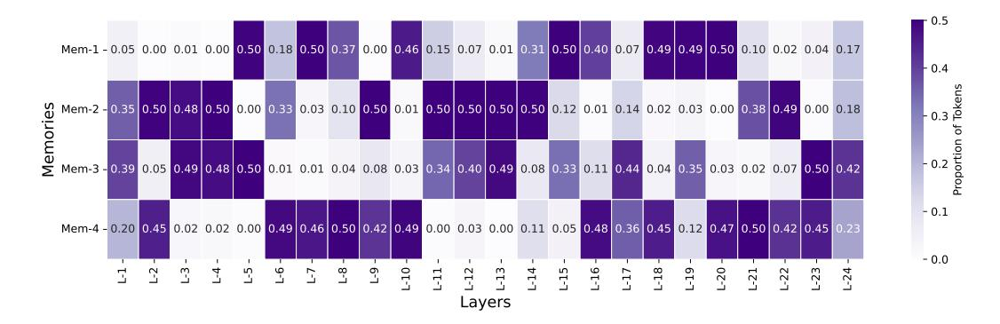

# I FULL RESULTS

| Model          | SQA  | MQA  | Sum  | FS    | Syn  | Code  | Zh-Avg | En-Avg | Avg.  |
|----------------|------|------|------|-------|------|-------|--------|--------|-------|
| RetNet         | 9.23 | 7.23 | 6.3  | 15.76 | 2.64 | 40.52 | 15.44  | 13.5   | 13.61 |
| HGRN2          | 7.38 | 6.02 | 6.51 | 15.5  | 2.61 | 40.11 | 14.28  | 13.12  | 13.02 |
| GSA            | 8.21 | 6.63 | 7.75 | 20.29 | 1.92 | 42.83 | 15.06  | 15.2   | 14.61 |
| Gated DeltaNet | 8.52 | 6.61 | 7.14 | 18    | 2.1  | 41.52 | 14.19  | 14.63  | 13.98 |
| MoM            | 8.14 | 7.11 | 6.89 | 21.26 | 2.63 | 47.79 | 17.33  | 15.71  | 15.64 |

Table 10: **Complete Results of LongBench.** SQA: Single-doc QA, MQA: Multi-doc QA, Sum: Summarization, FS: Few-shot learning, Syn: Synthetic

Figure 9: **Memory Load Balance Analysis.** Token Routing Distribution Across Layers and Memories without Aux Loss.