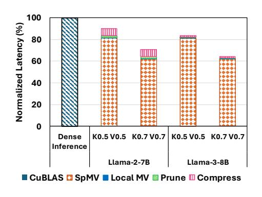

# **Attention Score Computation**

- Dense local window attention score Sparse attention score over compressed KV cache
- 1:  $\mathbf{S}_{L} \in \mathbb{R}^{1 \times N_{d}} \leftarrow \mathbf{Q}_{t} \mathbf{K}_{L}$ 2:  $\mathbf{S}_{C} \in \mathbb{R}^{1 \times N_{s}} \leftarrow \mathbf{Q}_{t} \mathbf{K}_{C}$  Spa 3:  $\mathbf{S}_{t} \in \mathbb{R}^{1 \times (N_{s}+N_{d})} \leftarrow \operatorname{softmax}(\operatorname{concat}(\mathbf{S}_{C}, \mathbf{S}_{L}))$

Full attention score

### **Output Computation**

4:  $[\mathbf{S}_C, \mathbf{S}_L] \leftarrow \operatorname{split}(\mathbf{S}_t; N_s, N_d)$ 5:  $\mathbf{O}_t \in \mathbb{R}^d \leftarrow \mathbf{V}_C \mathbf{S}_C^\top + \mathbf{V}_L \mathbf{S}_L^\top$ 

Partition attention score

Final output vector

Return Ot

Mustafar SpMV kernel follows the load-as-compressed, compute-as-dense paradigm adopted by FlashLLM [43], SpInfer [9], and Coruscant [20], which target sparse matrix—dense matrix multiplication in LLM weight projection layers. The compressed KV cache is loaded from GPU global memory into registers in its compressed form, decompressed into shared memory, and then used for tile-wise dense computation. We evaluate the performance of the Mustafar attention kernel and quantify the runtime overhead of pruning and compression in Section 4.3. We further detail the formulation of the SpMV kernel, as well as the management of the compressed KV cache in Appendix C.

#### **Evaluation**

Methodology: We evaluate Mustafar on two aspects: Accuracy and Efficiency. For accuracy evaluation, we use tasks from LongBench [3] to test the accuracy retention of per-token magnitude-based pruning of KV cache. We evaluate on three models: Llama-2-7B [40], Llama-3-8B-Instruct [12], and Mistral-7B-Instruct-v0.2 [19]. We also explore the impact of Mustafar when jointly used with orthogonal compression techniques, KV cache quantization KIVI [30] and token-wise eviction H2O [51]. For efficiency evaluation, we evaluate the impact on KV cache compression and computational latency with Llama-2-7B and Llama-3-8B-Instruct. Efficiency evaluation is tested on NVIDIA RTX 6000ADA GPU and measured with NVIDIA Nsight Profiling Tool. Additionally, we provide accuracy evaluation on RULER [17] benchmark in Appendix A.3, accuracy comparison of Mustafar's unstructured sparsity with 2:4 semi-structured sparsity in Appendix B, and additional kernel throughput evaluation in Appendix C.3.

### 4.1 LongBench Results

Table 4 shows the extended LongBench evaluation of Mustafar per-token magnitude-based pruning with comparison to dense model and ThinK [44]. Under the same Key cache sparsity, unstructured nature of Mustafar constantly achieves higher accuracy than structured sparsity on ThinK [44] across all tasks. A key advantage of unstructured pruning is its ability to effectively prune the Value cache with minimal accuracy degradation, which structured pruning has struggled to achieve. Even under high sparsity 70% for both the Key and Value caches, unstructured pruning (yellow) consistently outperforms ThinK's Key-only 50% structured pruning (pink) on LLaMA-3 8B and Mistral 7B, and achieves comparable accuracy on LLaMA-2-7B.

Table 4: Mustafar accuracy with Llama and Mistral on LongBench

| Compared to the Document QA | Summarization | Few-shot Learning | Synthetic |
|-----------------------------------

|                | Single- | Docume | nt QA                                                                                                                                                                                                                                                                                                                                                                                                                                                                                                                                                                                                                                                                                                                                                                                                                                                                                                                                                                                                                                                                                                                                                                                                                                                                                                                                                                                                                                                                                                                                                                                                                                                                                                                                                                                                                                                                                                                                                                                                                                                                                                                          |          | -Documen                                                                                                                                                                                                                                                                                                                                                                                                                                                                                                                                                                                                                                                                                                                                                                                                                                                                                                                                                                                                                                                                                                                                                                                                                                                                                                                                                                                                                                                                                                                                                                                                                                                                                                                                                                                                                                                                                                                                                                                                                                                                                                                       | t QA    |                        | mmarizat  |           | Few   | -shot Lea | rning                                                        | Synt      | hetic          | Co    | ode   |       |
|----------------|---------|--------|--------------------------------------------------------------------------------------------------------------------------------------------------------------------------------------------------------------------------------------------------------------------------------------------------------------------------------------------------------------------------------------------------------------------------------------------------------------------------------------------------------------------------------------------------------------------------------------------------------------------------------------------------------------------------------------------------------------------------------------------------------------------------------------------------------------------------------------------------------------------------------------------------------------------------------------------------------------------------------------------------------------------------------------------------------------------------------------------------------------------------------------------------------------------------------------------------------------------------------------------------------------------------------------------------------------------------------------------------------------------------------------------------------------------------------------------------------------------------------------------------------------------------------------------------------------------------------------------------------------------------------------------------------------------------------------------------------------------------------------------------------------------------------------------------------------------------------------------------------------------------------------------------------------------------------------------------------------------------------------------------------------------------------------------------------------------------------------------------------------------------------|----------|--------------------------------------------------------------------------------------------------------------------------------------------------------------------------------------------------------------------------------------------------------------------------------------------------------------------------------------------------------------------------------------------------------------------------------------------------------------------------------------------------------------------------------------------------------------------------------------------------------------------------------------------------------------------------------------------------------------------------------------------------------------------------------------------------------------------------------------------------------------------------------------------------------------------------------------------------------------------------------------------------------------------------------------------------------------------------------------------------------------------------------------------------------------------------------------------------------------------------------------------------------------------------------------------------------------------------------------------------------------------------------------------------------------------------------------------------------------------------------------------------------------------------------------------------------------------------------------------------------------------------------------------------------------------------------------------------------------------------------------------------------------------------------------------------------------------------------------------------------------------------------------------------------------------------------------------------------------------------------------------------------------------------------------------------------------------------------------------------------------------------------|---------|------------------------|-----------|-----------|-------|-----------|--------------------------------------------------------------|-----------|----------------|-------|-------|-------|
| KV Sparsity | Way &   | Qasper | A STATE OF THE STATE OF THE STATE OF THE STATE OF THE STATE OF THE STATE OF THE STATE OF THE STATE OF THE STATE OF THE STATE OF THE STATE OF THE STATE OF THE STATE OF THE STATE OF THE STATE OF THE STATE OF THE STATE OF THE STATE OF THE STATE OF THE STATE OF THE STATE OF THE STATE OF THE STATE OF THE STATE OF THE STATE OF THE STATE OF THE STATE OF THE STATE OF THE STATE OF THE STATE OF THE STATE OF THE STATE OF THE STATE OF THE STATE OF THE STATE OF THE STATE OF THE STATE OF THE STATE OF THE STATE OF THE STATE OF THE STATE OF THE STATE OF THE STATE OF THE STATE OF THE STATE OF THE STATE OF THE STATE OF THE STATE OF THE STATE OF THE STATE OF THE STATE OF THE STATE OF THE STATE OF THE STATE OF THE STATE OF THE STATE OF THE STATE OF THE STATE OF THE STATE OF THE STATE OF THE STATE OF THE STATE OF THE STATE OF THE STATE OF THE STATE OF THE STATE OF THE STATE OF THE STATE OF THE STATE OF THE STATE OF THE STATE OF THE STATE OF THE STATE OF THE STATE OF THE STATE OF THE STATE OF THE STATE OF THE STATE OF THE STATE OF THE STATE OF THE STATE OF THE STATE OF THE STATE OF THE STATE OF THE STATE OF THE STATE OF THE STATE OF THE STATE OF THE STATE OF THE STATE OF THE STATE OF THE STATE OF THE STATE OF THE STATE OF THE STATE OF THE STATE OF THE STATE OF THE STATE OF THE STATE OF THE STATE OF THE STATE OF THE STATE OF THE STATE OF THE STATE OF THE STATE OF THE STATE OF THE STATE OF THE STATE OF THE STATE OF THE STATE OF THE STATE OF THE STATE OF THE STATE OF THE STATE OF THE STATE OF THE STATE OF THE STATE OF THE STATE OF THE STATE OF THE STATE OF THE STATE OF THE STATE OF THE STATE OF THE STATE OF THE STATE OF THE STATE OF THE STATE OF THE STATE OF THE STATE OF THE STATE OF THE STATE OF THE STATE OF THE STATE OF THE STATE OF THE STATE OF THE STATE OF THE STATE OF THE STATE OF THE STATE OF THE STATE OF THE STATE OF THE STATE OF THE STATE OF THE STATE OF THE STATE OF THE STATE OF THE STATE OF THE STATE OF THE STATE OF THE STATE OF THE STATE OF THE STATE OF THE STATE OF THE STATE OF THE STATE OF THE STATE OF THE STATE OF THE STA | Homon P. | A STANSON OF THE STANSON OF THE STANSON OF THE STANSON OF THE STANSON OF THE STANSON OF THE STANSON OF THE STANSON OF THE STANSON OF THE STANSON OF THE STANSON OF THE STANSON OF THE STANSON OF THE STANSON OF THE STANSON OF THE STANSON OF THE STANSON OF THE STANSON OF THE STANSON OF THE STANSON OF THE STANSON OF THE STANSON OF THE STANSON OF THE STANSON OF THE STANSON OF THE STANSON OF THE STANSON OF THE STANSON OF THE STANSON OF THE STANSON OF THE STANSON OF THE STANSON OF THE STANSON OF THE STANSON OF THE STANSON OF THE STANSON OF THE STANSON OF THE STANSON OF THE STANSON OF THE STANSON OF THE STANSON OF THE STANSON OF THE STANSON OF THE STANSON OF THE STANSON OF THE STANSON OF THE STANSON OF THE STANSON OF THE STANSON OF THE STANSON OF THE STANSON OF THE STANSON OF THE STANSON OF THE STANSON OF THE STANSON OF THE STANSON OF THE STANSON OF THE STANSON OF THE STANSON OF THE STANSON OF THE STANSON OF THE STANSON OF THE STANSON OF THE STANSON OF THE STANSON OF THE STANSON OF THE STANSON OF THE STANSON OF THE STANSON OF THE STANSON OF THE STANSON OF THE STANSON OF THE STANSON OF THE STANSON OF THE STANSON OF THE STANSON OF THE STANSON OF THE STANSON OF THE STANSON OF THE STANSON OF THE STANSON OF THE STANSON OF THE STANSON OF THE STANSON OF THE STANSON OF THE STANSON OF THE STANSON OF THE STANSON OF THE STANSON OF THE STANSON OF THE STANSON OF THE STANSON OF THE STANSON OF THE STANSON OF THE STANSON OF THE STANSON OF THE STANSON OF THE STANSON OF THE STANSON OF THE STANSON OF THE STANSON OF THE STANSON OF THE STANSON OF THE STANSON OF THE STANSON OF THE STANSON OF THE STANSON OF THE STANSON OF THE STANSON OF THE STANSON OF THE STANSON OF THE STANSON OF THE STANSON OF THE STANSON OF THE STANSON OF THE STANSON OF THE STANSON OF THE STANSON OF THE STANSON OF THE STANSON OF THE STANSON OF THE STANSON OF THE STANSON OF THE STANSON OF THE STANSON OF THE STANSON OF THE STANSON OF THE STANSON OF THE STANSON OF THE STANSON OF THE STANSON OF THE STANSON OF THE STANSON OF THE STANSON OF THE STANSON OF THE STANSON OF THE STAN | Masique | दुर्व क्षेत्र दुर्व | Owenin    | Mannivens | REC   | Pringle   | S. A. A. S. Market S. C. C. C. C. C. C. C. C. C. C. C. C. C. | A Company | Ž e | Le.   | Age.  | Avg.  |
|                |         |        |                                                                                                                                                                                                                                                                                                                                                                                                                                                                                                                                                                                                                                                                                                                                                                                                                                                                                                                                                                                                                                                                                                                                                                                                                                                                                                                                                                                                                                                                                                                                                                                                                                                                                                                                                                                                                                                                                                                                                                                                                                                                                                                                |          |                                                                                                                                                                                                                                                                                                                                                                                                                                                                                                                                                                                                                                                                                                                                                                                                                                                                                                                                                                                                                                                                                                                                                                                                                                                                                                                                                                                                                                                                                                                                                                                                                                                                                                                                                                                                                                                                                                                                                                                                                                                                                                                                |         | Llam                   | a-3 8B In | struct    |       |           |                                                              |           |                |       |       |       |
| Dense          | 23.39   | 43.38  | 43.22                                                                                                                                                                                                                                                                                                                                                                                                                                                                                                                                                                                                                                                                                                                                                                                                                                                                                                                                                                                                                                                                                                                                                                                                                                                                                                                                                                                                                                                                                                                                                                                                                                                                                                                                                                                                                                                                                                                                                                                                                                                                                                                          | 46.39    | 38.66                                                                                                                                                                                                                                                                                                                                                                                                                                                                                                                                                                                                                                                                                                                                                                                                                                                                                                                                                                                                                                                                                                                                                                                                                                                                                                                                                                                                                                                                                                                                                                                                                                                                                                                                                                                                                                                                                                                                                                                                                                                                                                                          | 23.22   | 29.91                  | 22.56     | 27.77     | 74.50 | 90.28     | 42.11                                                        | 4.50      | 70.00          | 57.11 | 54.05 | 43.19 |
| ThinK0.5       | 22.38   | 40.96  | 43.48                                                                                                                                                                                                                                                                                                                                                                                                                                                                                                                                                                                                                                                                                                                                                                                                                                                                                                                                                                                                                                                                                                                                                                                                                                                                                                                                                                                                                                                                                                                                                                                                                                                                                                                                                                                                                                                                                                                                                                                                                                                                                                                          | 44.01    | 38.37                                                                                                                                                                                                                                                                                                                                                                                                                                                                                                                                                                                                                                                                                                                                                                                                                                                                                                                                                                                                                                                                                                                                                                                                                                                                                                                                                                                                                                                                                                                                                                                                                                                                                                                                                                                                                                                                                                                                                                                                                                                                                                                          | 22.59   | 26.61                  | 22.20     | 26.08     | 74.00 | 88.83     | 36.79                                                        | 6.00      | 65.00          | 27.95 | 31.17 | 38.53 |
| K0.5 V0.0      | 23.40   | 43.68  | 43.63                                                                                                                                                                                                                                                                                                                                                                                                                                                                                                                                                                                                                                                                                                                                                                                                                                                                                                                                                                                                                                                                                                                                                                                                                                                                                                                                                                                                                                                                                                                                                                                                                                                                                                                                                                                                                                                                                                                                                                                                                                                                                                                          | 46.00    | 38.60                                                                                                                                                                                                                                                                                                                                                                                                                                                                                                                                                                                                                                                                                                                                                                                                                                                                                                                                                                                                                                                                                                                                                                                                                                                                                                                                                                                                                                                                                                                                                                                                                                                                                                                                                                                                                                                                                                                                                                                                                                                                                                                          | 22.72   | 29.39                  | 22.33     | 27.64     | 74.50 | 90.66     | 41.09                                                        | 5.00      | 68.50          | 55.89 | 52.39 | 42.84 |
| ThinK0.7       | 17.58   | 27.40  | 30.80                                                                                                                                                                                                                                                                                                                                                                                                                                                                                                                                                                                                                                                                                                                                                                                                                                                                                                                                                                                                                                                                                                                                                                                                                                                                                                                                                                                                                                                                                                                                                                                                                                                                                                                                                                                                                                                                                                                                                                                                                                                                                                                          | 40.59    | 29.50                                                                                                                                                                                                                                                                                                                                                                                                                                                                                                                                                                                                                                                                                                                                                                                                                                                                                                                                                                                                                                                                                                                                                                                                                                                                                                                                                                                                                                                                                                                                                                                                                                                                                                                                                                                                                                                                                                                                                                                                                                                                                                                          | 19.16   | 18.13                  | 17.28     | 17.70     | 34.00 | 83.09     | 17.56                                                        | 4.71      | 29.00          | 17.88 | 20.42 | 26.55 |
| K0.7 V0.0      | 22.91   | 42.36  | 41.33                                                                                                                                                                                                                                                                                                                                                                                                                                                                                                                                                                                                                                                                                                                                                                                                                                                                                                                                                                                                                                                                                                                                                                                                                                                                                                                                                                                                                                                                                                                                                                                                                                                                                                                                                                                                                                                                                                                                                                                                                                                                                                                          | 45.53    | 38.50                                                                                                                                                                                                                                                                                                                                                                                                                                                                                                                                                                                                                                                                                                                                                                                                                                                                                                                                                                                                                                                                                                                                                                                                                                                                                                                                                                                                                                                                                                                                                                                                                                                                                                                                                                                                                                                                                                                                                                                                                                                                                                                          | 22.16   | 26.63                  | 21.90     | 27.00     | 73.00 | 90.83     | 39.68                                                        | 4.50      | 65.50          | 51.94 | 50.99 | 41.55 |
| K0.0 V0.5      | 23.80   | 43.14  | 43.32                                                                                                                                                                                                                                                                                                                                                                                                                                                                                                                                                                                                                                                                                                                                                                                                                                                                                                                                                                                                                                                                                                                                                                                                                                                                                                                                                                                                                                                                                                                                                                                                                                                                                                                                                                                                                                                                                                                                                                                                                                                                                                                          | 46.28    | 39.42                                                                                                                                                                                                                                                                                                                                                                                                                                                                                                                                                                                                                                                                                                                                                                                                                                                                                                                                                                                                                                                                                                                                                                                                                                                                                                                                                                                                                                                                                                                                                                                                                                                                                                                                                                                                                                                                                                                                                                                                                                                                                                                          | 22.97   | 29.18                  | 22.70     | 27.13     | 74.50 | 90.50     | 41.74                                                        | 5.00      | 67.50          | 57.23 | 54.30 | 43.04 |
| K0.0 V0.7      | 24.19   | 42.78  | 43.92                                                                                                                                                                                                                                                                                                                                                                                                                                                                                                                                                                                                                                                                                                                                                                                                                                                                                                                                                                                                                                                                                                                                                                                                                                                                                                                                                                                                                                                                                                                                                                                                                                                                                                                                                                                                                                                                                                                                                                                                                                                                                                                          | 45.82    | 39.11                                                                                                                                                                                                                                                                                                                                                                                                                                                                                                                                                                                                                                                                                                                                                                                                                                                                                                                                                                                                                                                                                                                                                                                                                                                                                                                                                                                                                                                                                                                                                                                                                                                                                                                                                                                                                                                                                                                                                                                                                                                                                                                          | 22.53   | 26.92                  | 22.52     | 26.12     | 74.00 | 90.36     | 39.88                                                        | 5.50      | 65.50          | 59.18 | 56.05 | 42.77 |
| K0.5 V0.5      | 23.40   | 46.63  | 42.98                                                                                                                                                                                                                                                                                                                                                                                                                                                                                                                                                                                                                                                                                                                                                                                                                                                                                                                                                                                                                                                                                                                                                                                                                                                                                                                                                                                                                                                                                                                                                                                                                                                                                                                                                                                                                                                                                                                                                                                                                                                                                                                          | 46.28    | 39.27                                                                                                                                                                                                                                                                                                                                                                                                                                                                                                                                                                                                                                                                                                                                                                                                                                                                                                                                                                                                                                                                                                                                                                                                                                                                                                                                                                                                                                                                                                                                                                                                                                                                                                                                                                                                                                                                                                                                                                                                                                                                                                                          | 23.13   | 28.29                  | 22.78     | 27.07     | 74.00 | 90.58     | 39.97                                                        | 5.00      | 67.00          | 55.54 | 53.46 | 42.65 |
| K0.7 V0.7      | 24.10   | 40.85  | 40.88                                                                                                                                                                                                                                                                                                                                                                                                                                                                                                                                                                                                                                                                                                                                                                                                                                                                                                                                                                                                                                                                                                                                                                                                                                                                                                                                                                                                                                                                                                                                                                                                                                                                                                                                                                                                                                                                                                                                                                                                                                                                                                                          | 44.93    | 38.03                                                                                                                                                                                                                                                                                                                                                                                                                                                                                                                                                                                                                                                                                                                                                                                                                                                                                                                                                                                                                                                                                                                                                                                                                                                                                                                                                                                                                                                                                                                                                                                                                                                                                                                                                                                                                                                                                                                                                                                                                                                                                                                          | 22.36   | 24.02                  | 21.90     | 24.78     | 70.50 | 90.04     | 37.77                                                        | 5.25      | 63.00          | 54.12 | 52.86 | 40.96 |
|                |         |        |                                                                                                                                                                                                                                                                                                                                                                                                                                                                                                                                                                                                                                                                                                                                                                                                                                                                                                                                                                                                                                                                                                                                                                                                                                                                                                                                                                                                                                                                                                                                                                                                                                                                                                                                                                                                                                                                                                                                                                                                                                                                                                                                |          |                                                                                                                                                                                                                                                                                                                                                                                                                                                                                                                                                                                                                                                                                                                                                                                                                                                                                                                                                                                                                                                                                                                                                                                                                                                                                                                                                                                                                                                                                                                                                                                                                                                                                                                                                                                                                                                                                                                                                                                                                                                                                                                                |         | Mistral                | -7B-Instr | uct-v0.2  |       |           |                                                              |           |                |       |       |       |
| Dense          | 26.76   | 32.51  | 49.36                                                                                                                                                                                                                                                                                                                                                                                                                                                                                                                                                                                                                                                                                                                                                                                                                                                                                                                                                                                                                                                                                                                                                                                                                                                                                                                                                                                                                                                                                                                                                                                                                                                                                                                                                                                                                                                                                                                                                                                                                                                                                                                          | 43.49    | 27.48                                                                                                                                                                                                                                                                                                                                                                                                                                                                                                                                                                                                                                                                                                                                                                                                                                                                                                                                                                                                                                                                                                                                                                                                                                                                                                                                                                                                                                                                                                                                                                                                                                                                                                                                                                                                                                                                                                                                                                                                                                                                                                                          | 18.81   | 32.95                  | 24.36     | 27.00     | 71.00 | 86.23     | 42.80                                                        | 2.89      | 86.81          | 55.89 | 54.07 | 42.65 |
| ThinK0.5       | 24.03   | 26.79  | 46.42                                                                                                                                                                                                                                                                                                                                                                                                                                                                                                                                                                                                                                                                                                                                                                                                                                                                                                                                                                                                                                                                                                                                                                                                                                                                                                                                                                                                                                                                                                                                                                                                                                                                                                                                                                                                                                                                                                                                                                                                                                                                                                                          | 38.70    | 24.93                                                                                                                                                                                                                                                                                                                                                                                                                                                                                                                                                                                                                                                                                                                                                                                                                                                                                                                                                                                                                                                                                                                                                                                                                                                                                                                                                                                                                                                                                                                                                                                                                                                                                                                                                                                                                                                                                                                                                                                                                                                                                                                          | 15.73   | 32.72                  | 24.65     | 27.14     | 71.00 | 85.80     | 41.68                                                        | 2.20      | 73.67          | 48.83 | 47.09 | 39.46 |
| K0.5 V0.0      | 26.38   | 33.08  | 49.20                                                                                                                                                                                                                                                                                                                                                                                                                                                                                                                                                                                                                                                                                                                                                                                                                                                                                                                                                                                                                                                                                                                                                                                                                                                                                                                                                                                                                                                                                                                                                                                                                                                                                                                                                                                                                                                                                                                                                                                                                                                                                                                          | 43.90    | 28.57                                                                                                                                                                                                                                                                                                                                                                                                                                                                                                                                                                                                                                                                                                                                                                                                                                                                                                                                                                                                                                                                                                                                                                                                                                                                                                                                                                                                                                                                                                                                                                                                                                                                                                                                                                                                                                                                                                                                                                                                                                                                                                                          | 18.65   | 32.47                  | 24.21     | 27.05     | 71.00 | 86.28     | 42.66                                                        | 3.00      | 84.23          | 55.72 | 54.16 | 42.56 |
| ThinK0.7       | 19.25   | 21.33  | 36.48                                                                                                                                                                                                                                                                                                                                                                                                                                                                                                                                                                                                                                                                                                                                                                                                                                                                                                                                                                                                                                                                                                                                                                                                                                                                                                                                                                                                                                                                                                                                                                                                                                                                                                                                                                                                                                                                                                                                                                                                                                                                                                                          | 27.96    | 20.34                                                                                                                                                                                                                                                                                                                                                                                                                                                                                                                                                                                                                                                                                                                                                                                                                                                                                                                                                                                                                                                                                                                                                                                                                                                                                                                                                                                                                                                                                                                                                                                                                                                                                                                                                                                                                                                                                                                                                                                                                                                                                                                          | 14.08   | 29.32                  | 22.23     | 25.64     | 70.50 | 78.99     | 29.66                                                        | 2.92      | 54.42          | 34.28 | 31.68 | 32.44 |
| K0.7 V0.0      | 27.02   | 34.37  | 49.26                                                                                                                                                                                                                                                                                                                                                                                                                                                                                                                                                                                                                                                                                                                                                                                                                                                                                                                                                                                                                                                                                                                                                                                                                                                                                                                                                                                                                                                                                                                                                                                                                                                                                                                                                                                                                                                                                                                                                                                                                                                                                                                          | 43.77    | 26.37                                                                                                                                                                                                                                                                                                                                                                                                                                                                                                                                                                                                                                                                                                                                                                                                                                                                                                                                                                                                                                                                                                                                                                                                                                                                                                                                                                                                                                                                                                                                                                                                                                                                                                                                                                                                                                                                                                                                                                                                                                                                                                                          | 17.45   | 32.05                  | 24.09     | 27.43     | 71.00 | 87.19     | 42.30                                                        | 4.65      | 77.24          | 54.26 | 53.06 | 41.97 |
| K0.0 V0.5      | 26.29   | 32.54  | 49.01                                                                                                                                                                                                                                                                                                                                                                                                                                                                                                                                                                                                                                                                                                                                                                                                                                                                                                                                                                                                                                                                                                                                                                                                                                                                                                                                                                                                                                                                                                                                                                                                                                                                                                                                                                                                                                                                                                                                                                                                                                                                                                                          | 43.99    | 28.02                                                                                                                                                                                                                                                                                                                                                                                                                                                                                                                                                                                                                                                                                                                                                                                                                                                                                                                                                                                                                                                                                                                                                                                                                                                                                                                                                                                                                                                                                                                                                                                                                                                                                                                                                                                                                                                                                                                                                                                                                                                                                                                          | 19.28   | 32.07                  | 23.74     | 26.98     | 71.00 | 86.56     | 42.79                                                        | 2.71      | 81.77          | 55.14 | 54.16 | 42.25 |
| K0.0 V0.7      | 26.83   | 31.66  | 49.24                                                                                                                                                                                                                                                                                                                                                                                                                                                                                                                                                                                                                                                                                                                                                                                                                                                                                                                                                                                                                                                                                                                                                                                                                                                                                                                                                                                                                                                                                                                                                                                                                                                                                                                                                                                                                                                                                                                                                                                                                                                                                                                          | 44.15    | 27.40                                                                                                                                                                                                                                                                                                                                                                                                                                                                                                                                                                                                                                                                                                                                                                                                                                                                                                                                                                                                                                                                                                                                                                                                                                                                                                                                                                                                                                                                                                                                                                                                                                                                                                                                                                                                                                                                                                                                                                                                                                                                                                                          | 18.36   | 30.58                  | 23.80     | 26.63     | 71.00 | 86.82     | 42.02                                                        | 3.77      | 76.32          | 55.58 | 54.16 | 41.77 |
| K0.5 V0.5      | 26.90   | 32.99  | 48.76                                                                                                                                                                                                                                                                                                                                                                                                                                                                                                                                                                                                                                                                                                                                                                                                                                                                                                                                                                                                                                                                                                                                                                                                                                                                                                                                                                                                                                                                                                                                                                                                                                                                                                                                                                                                                                                                                                                                                                                                                                                                                                                          | 43.90    | 28.90                                                                                                                                                                                                                                                                                                                                                                                                                                                                                                                                                                                                                                                                                                                                                                                                                                                                                                                                                                                                                                                                                                                                                                                                                                                                                                                                                                                                                                                                                                                                                                                                                                                                                                                                                                                                                                                                                                                                                                                                                                                                                                                          | 18.45   | 32.24                  | 24.09     | 26.99     | 71.00 | 86.68     | 42.41                                                        | 3.20      | 80.64          | 55.51 | 54.15 | 42.30 |
| K0.7 V0.7      | 27.11   | 32.23  | 48.90                                                                                                                                                                                                                                                                                                                                                                                                                                                                                                                                                                                                                                                                                                                                                                                                                                                                                                                                                                                                                                                                                                                                                                                                                                                                                                                                                                                                                                                                                                                                                                                                                                                                                                                                                                                                                                                                                                                                                                                                                                                                                                                          | 43.63    | 27.12                                                                                                                                                                                                                                                                                                                                                                                                                                                                                                                                                                                                                                                                                                                                                                                                                                                                                                                                                                                                                                                                                                                                                                                                                                                                                                                                                                                                                                                                                                                                                                                                                                                                                                                                                                                                                                                                                                                                                                                                                                                                                                                          | 17.43   | 29.38                  | 23.99     | 26.79     | 71.00 | 86.59     | 41.14                                                        | 4.69      | 67.57          | 54.86 | 52.82 | 40.95 |
|                |         |        |                                                                                                                                                                                                                                                                                                                                                                                                                                                                                                                                                                                                                                                                                                                                                                                                                                                                                                                                                                                                                                                                                                                                                                                                                                                                                                                                                                                                                                                                                                                                                                                                                                                                                                                                                                                                                                                                                                                                                                                                                                                                                                                                |          |                                                                                                                                                                                                                                                                                                                                                                                                                                                                                                                                                                                                                                                                                                                                                                                                                                                                                                                                                                                                                                                                                                                                                                                                                                                                                                                                                                                                                                                                                                                                                                                                                                                                                                                                                                                                                                                                                                                                                                                                                                                                                                                                |         | I                      | Jama-2 7  | В         | -     |           |                                                              | -         |                |       |       |       |
| Dense          | 15.04   | 9.66   | 21.88                                                                                                                                                                                                                                                                                                                                                                                                                                                                                                                                                                                                                                                                                                                                                                                                                                                                                                                                                                                                                                                                                                                                                                                                                                                                                                                                                                                                                                                                                                                                                                                                                                                                                                                                                                                                                                                                                                                                                                                                                                                                                                                          | 7.69     | 9.95                                                                                                                                                                                                                                                                                                                                                                                                                                                                                                                                                                                                                                                                                                                                                                                                                                                                                                                                                                                                                                                                                                                                                                                                                                                                                                                                                                                                                                                                                                                                                                                                                                                                                                                                                                                                                                                                                                                                                                                                                                                                                                                           | 3.66    | 17.26                  | 21.29     | 3.5       | 66.00 | 87.72     | 41.66                                                        | 1.70      | 6.64           | 66.66 | 59.82 | 27.51 |
| ThinK0.5       | 15.57   | 9.96   | 23.31                                                                                                                                                                                                                                                                                                                                                                                                                                                                                                                                                                                                                                                                                                                                                                                                                                                                                                                                                                                                                                                                                                                                                                                                                                                                                                                                                                                                                                                                                                                                                                                                                                                                                                                                                                                                                                                                                                                                                                                                                                                                                                                          | 6.50     | 9.62                                                                                                                                                                                                                                                                                                                                                                                                                                                                                                                                                                                                                                                                                                                                                                                                                                                                                                                                                                                                                                                                                                                                                                                                                                                                                                                                                                                                                                                                                                                                                                                                                                                                                                                                                                                                                                                                                                                                                                                                                                                                                                                           | 2.77    | 1.84                   | 20.16     | 0.38      | 66.00 | 85.53     | 41.48                                                        | 2.04      | 2.79           | 64.77 | 58.36 | 25.69 |
| K0.5 V0.0      | 14.79   | 9.65   | 21.67                                                                                                                                                                                                                                                                                                                                                                                                                                                                                                                                                                                                                                                                                                                                                                                                                                                                                                                                                                                                                                                                                                                                                                                                                                                                                                                                                                                                                                                                                                                                                                                                                                                                                                                                                                                                                                                                                                                                                                                                                                                                                                                          | 7.48     | 10.10                                                                                                                                                                                                                                                                                                                                                                                                                                                                                                                                                                                                                                                                                                                                                                                                                                                                                                                                                                                                                                                                                                                                                                                                                                                                                                                                                                                                                                                                                                                                                                                                                                                                                                                                                                                                                                                                                                                                                                                                                                                                                                                          | 4.11    | 17.24                  | 20.84     | 3.64      | 66.00 | 87.72     | 41.26                                                        | 1.38      | 6.42           | 67.15 | 59.89 | 27.46 |
| ThinK0.7       | 13.76   | 8.16   | 20.59                                                                                                                                                                                                                                                                                                                                                                                                                                                                                                                                                                                                                                                                                                                                                                                                                                                                                                                                                                                                                                                                                                                                                                                                                                                                                                                                                                                                                                                                                                                                                                                                                                                                                                                                                                                                                                                                                                                                                                                                                                                                                                                          | 4.53     | 6.24                                                                                                                                                                                                                                                                                                                                                                                                                                                                                                                                                                                                                                                                                                                                                                                                                                                                                                                                                                                                                                                                                                                                                                                                                                                                                                                                                                                                                                                                                                                                                                                                                                                                                                                                                                                                                                                                                                                                                                                                                                                                                                                           | 2.23    | 12.96                  | 14.88     | 0.01      | 66.00 | 80.48     | 26.95                                                        | 1.77      | 6.93           | 40.73 | 38.97 | 21.57 |
| K0.7 V0.0      | 14.57   | 8.18   | 20.55                                                                                                                                                                                                                                                                                                                                                                                                                                                                                                                                                                                                                                                                                                                                                                                                                                                                                                                                                                                                                                                                                                                                                                                                                                                                                                                                                                                                                                                                                                                                                                                                                                                                                                                                                                                                                                                                                                                                                                                                                                                                                                                          | 6.64     | 9.95                                                                                                                                                                                                                                                                                                                                                                                                                                                                                                                                                                                                                                                                                                                                                                                                                                                                                                                                                                                                                                                                                                                                                                                                                                                                                                                                                                                                                                                                                                                                                                                                                                                                                                                                                                                                                                                                                                                                                                                                                                                                                                                           | 3.28    | 13.80                  | 20.25     | 0.88      | 66.00 | 86.64     | 38.32                                                        | 2.12      | 4.04           | 64.86 | 58.59 | 26.17 |
| K0.0 V0.5      | 15.71   | 10.02  | 21.12                                                                                                                                                                                                                                                                                                                                                                                                                                                                                                                                                                                                                                                                                                                                                                                                                                                                                                                                                                                                                                                                                                                                                                                                                                                                                                                                                                                                                                                                                                                                                                                                                                                                                                                                                                                                                                                                                                                                                                                                                                                                                                                          | 7.38     | 9.64                                                                                                                                                                                                                                                                                                                                                                                                                                                                                                                                                                                                                                                                                                                                                                                                                                                                                                                                                                                                                                                                                                                                                                                                                                                                                                                                                                                                                                                                                                                                                                                                                                                                                                                                                                                                                                                                                                                                                                                                                                                                                                                           | 3.75    | 16.86                  | 21.37     | 2.38      | 66.00 | 87.72     | 41.04                                                        | 1.65      | 6.75           | 66.79 | 60.09 | 27.40 |
| K0.0 V0.7      | 15.57   | 8.98   | 20.97                                                                                                                                                                                                                                                                                                                                                                                                                                                                                                                                                                                                                                                                                                                                                                                                                                                                                                                                                                                                                                                                                                                                                                                                                                                                                                                                                                                                                                                                                                                                                                                                                                                                                                                                                                                                                                                                                                                                                                                                                                                                                                                          | 7.33     | 10.14                                                                                                                                                                                                                                                                                                                                                                                                                                                                                                                                                                                                                                                                                                                                                                                                                                                                                                                                                                                                                                                                                                                                                                                                                                                                                                                                                                                                                                                                                                                                                                                                                                                                                                                                                                                                                                                                                                                                                                                                                                                                                                                          | 3.82    | 15.40                  | 20.77     | 1.83      | 66.00 | 87.72     | 40.69                                                        | 1.40      | 6.50           | 66.12 | 59.57 | 27.05 |
| K0.5 V0.5      | 15.49   | 9.17   | 20.97                                                                                                                                                                                                                                                                                                                                                                                                                                                                                                                                                                                                                                                                                                                                                                                                                                                                                                                                                                                                                                                                                                                                                                                                                                                                                                                                                                                                                                                                                                                                                                                                                                                                                                                                                                                                                                                                                                                                                                                                                                                                                                                          | 7.51     | 10.04                                                                                                                                                                                                                                                                                                                                                                                                                                                                                                                                                                                                                                                                                                                                                                                                                                                                                                                                                                                                                                                                                                                                                                                                                                                                                                                                                                                                                                                                                                                                                                                                                                                                                                                                                                                                                                                                                                                                                                                                                                                                                                                          | 3.78    | 16.46                  | 21.02     | 3.36      | 66.00 | 87.72     | 40.81                                                        | 1.22      | 5.88           | 66.78 | 59.53 | 27.23 |
| K0.7 V0.7      | 13.76   | 7.83   | 19.27                                                                                                                                                                                                                                                                                                                                                                                                                                                                                                                                                                                                                                                                                                                                                                                                                                                                                                                                                                                                                                                                                                                                                                                                                                                                                                                                                                                                                                                                                                                                                                                                                                                                                                                                                                                                                                                                                                                                                                                                                                                                                                                          | 6.57     | 10.26                                                                                                                                                                                                                                                                                                                                                                                                                                                                                                                                                                                                                                                                                                                                                                                                                                                                                                                                                                                                                                                                                                                                                                                                                                                                                                                                                                                                                                                                                                                                                                                                                                                                                                                                                                                                                                                                                                                                                                                                                                                                                                                          | 3.51    | 8.70                   | 20.04     | 0.47      | 64.50 | 86.89     | 36.37                                                        | 1.64      | 3.62           | 63.95 | 56.75 | 25.26 |

#### 4.2 Joint Application with Orthogonal KV Cache Compression Techniques

Mustafar's per-token pruning enables seamless integration with orthogonal KV cache compression techniques. We evaluate its effectiveness when combined with token eviction from H2O [51] and KV cache quantization from KIVI [30], using a representative subset of LongBench tasks from each category. H2O application is conducted with Llama-2 7B and KIVI application is conducted with LLaMA-3-8B-Instruct.

### **4.2.1** Joint Application with Token Eviction

H2O [51] retains a fixed budget of recent tokens and critical heavy-hitter tokens. Applying Mustafar to H2O, we retain the same scheme of pruning the KV cache of tokens that exit the local dense window. We configure 10% of KV cache budget each to recent tokens and heavy-hitter tokens. Jointly applied, all heavy-hitter tokens and a part of recent tokens is kept as pruned and compressed. In Table 5, we validate the efficacy of Mustafar's accuracy retention when jointly applied with token eviction, as we see that 50% sparsity in both KV cache retains the dense accuracy with some degradation when pruned to 70% sparsity.

Table 5: LongBench evaluation of Mustafar-H2O joint application on Llama-2-7B

|               | Single-Doc QA NtrvQA | Multi-Doc QA HotpotQA | Summarization GovReport | Few-shot Learning TREC | Synthetic Pcount | Code Lcc |
|---------------|-------------------------|--------------------------|----------------------------|---------------------------|---------------------|-------------|
| Full KV cache | 15.04                   | 7.69                     | 17.26                      | 66.00                     | 1.7                 | 66.66       |
|               |                         | H2O 2                    | 0% KV Budget               |                           |                     |             |
| Dense         | 12.26                   | 8.35                     | 7.76                       | 64.00                     | 1.43                | 64.20       |
| K0.5 V0.0     | 11.83                   | 8.47                     | 7.65                       | 64.00                     | 2.08                | 64.72       |
| K0.7 V0.0     | 11.39                   | 8.46                     | 6.34                       | 64.00                     | 1.69                | 63.92       |
| K0.0 V0.5     | 12.17                   | 8.39                     | 6.84                       | 64.00                     | 1.38                | 64.83       |
| K0.0 V0.7     | 12.39                   | 7.79                     | 5.81                       | 64.00                     | 0.76                | 64.88       |
| K0.5 V0.5     | 12.07                   | 8.16                     | 7.61                       | 64.00                     | 2.05                | 65.15       |
| K0.7 V0.7     | 12.20                   | 8.18                     | 5.22                       | 64.00                     | 1.65                | 63.73       |

#### 4.2.2 Joint Application with Quantization

KIVI [30] applies a per-channel quantization of Key cache and per-token quantization of Value cache. Following findings of Harma et al. [14], we first prune each token's KV cache before quantization is performed. However, we note that current Mustafar sparse attention kernel implementation does not support low-bit precision. Therefore, the accuracy measurement was performed on a sparse quantized KV cache. Table 6 shows the performance of Mustafar and KIVI applied together. Similar to joint application with H2O, we see that model accuracy is retained across the tasks for 50% on Key cache, Value cache, as well as both Key and Value caches. We observe a decrease in accuracy at 70% pruning, with Summarization task seeing the most significant drop. However, other tasks, such as Single-Document QA maintain the same performance as naive 16-bit model, suggesting the potential for applying varying degrees of compression tailored to specific tasks.

Table 6: LongBench evaluation of Mustafar-KIVI joint application on Llama-3-8B-Instruct

|              | Single-Doc QA NtrvQA | Multi-Doc QA HotpotQA | Summarization GovReport | Few-shot Learning TREC | Synthetic Pcount | Code Lcc |
|--------------|-------------------------|--------------------------|----------------------------|---------------------------|---------------------|-------------|
| Naive 16-bit | 23.39                   | 46.39                    | 29.91                      | 74.50                     | 4.50                | 57.11       |
|              |                         |                          | KIVI 4-bit                 |                           |                     |             |
| Dense        | 23.60                   | 46.39                    | 29.84                      | 74.50                     | 5.00                | 57.35       |
| K0.5 V0.0    | 23.46                   | 46.21                    | 28.90                      | 74.50                     | 5.50                | 56.05       |
| K0.7 V0.0    | 23.35                   | 45.40                    | 26.46                      | 73.50                     | 4.83                | 52.41       |
| K0.0 V0.5    | 23.68                   | 46.39                    | 29.10                      | 74.50                     | 5.50                | 58.30       |
| K0.0 V0.7    | 24.10                   | 45.66                    | 27.21                      | 74.00                     | 5.50                | 59.30       |
| K0.5 V0.5    | 23.22                   | 46.06                    | 28.18                      | 74.00                     | 6.00                | 56.04       |
| K0.7 V0.7    | 23.74                   | 45.50                    | 23.57                      | 70.50                     | 6.25                | 54.12       |
|              |                         |                          | KIVI 2-bit                 |                           |                     |             |
| Dense        | 23.33                   | 45.47                    | 29.69                      | 74.50                     | 6.50                | 50.38       |
| K0.5 V0.0    | 22.86                   | 45.29                    | 29.39                      | 74.00                     | 5.50                | 49.92       |
| K0.7 V0.0    | 22.88                   | 44.60                    | 26.91                      | 73.00                     | 4.50                | 43.84       |
| K0.0 V0.5    | 23.65                   | 45.67                    | 29.05                      | 74.00                     | 5.50                | 51.94       |
| K0.0 V0.7    | 23.68                   | 45.47                    | 27.57                      | 74.00                     | 5.50                | 52.90       |
| K0.5 V0.5    | 22.46                   | 45.47                    | 28.61                      | 74.00                     | 4.50                | 48.76       |
| K0.7 V0.7    | 22.72                   | 45.18                    | 23.84                      | 71.00                     | 5.12                | 45.68       |

### 4.3 Efficiency Evaluation

A crucial aspect of Mustafar is to ensure that the exploitation of sparsity for compressing the KV cache does not deter the inference latency. Mustafar compensates the overhead of runtime pruning and compression by achieving speedup in the memory-bound SpMV. Figure 6a compares the normalized latency of dense batched MV of cuBLAS with the components of Mustafar sparse attention kernel (Figure 5b): batched SpMV, dense batched MV of local window, runtime pruning, and compression, for input sequence length 2048 for Llama-2 and 4096 for Llama-3 and generation length 1024. In the multi-head attention of Llama-2-7B, pruning introduces 1.84%, compression introduces 6.25%, and MV of local window introduces 0.62% of the cuBLAS execution time in dense inference. In both 50% and 70%, the speedup gained from SpMV kernel more than compensates for the introduced overheads. In 50% sparsity, SpMV takes 81.07% of cuBLAS execution time and for 70% sparsity, SpMV takes 61.87% of cuBLAS execution time. In Grouped-Query Attention of Llama-3-8B, where there is reduced set of KV cache, compression and pruning overhead reduce down to 1.47% and 0.47% of cuBLAS execution time respectively.

- (a) Normalized kernel latency breakdown.
- (b) Compression ratio-accuracy comparison of Mustafar and ThinK.

Figure 6: Efficiency evaluation of Mustafar. In (b), compression ratio refers to percentage of compressed size compared to dense KV cache.

Figure 6b compares the KV cache compression ratio (% of size in memory compared to dense KV cache) of Mustafar and ThinK along with the LongBench average score achieved with Llama-2-7B and Llama-3-8B-Instruct. In this plot, the red arrow points to the optimal direction, where a model achieves higher LongBench score while achieving high compression of the KV cache. For ThinK [44] which prune only Key cache, 50% sparsity leads to 75% compression ratio to dense KV cache, and 70% Key cache sparsity leads to 65% compression ratio. In the case of Mustafar where both Key and Value Cache can be pruned, KV cache 50% sparsity leads to 65% compression ratio. The reason behind 15% additional memory footprint is due to the tile offset overhead as shown in Figure 5a and the multiples-of-8 padding enforced to coalesce memory access in GPU. KV cache 70% sparsity leads to 45% compression ratio, 50% sparsity to either Key or Value cache leads to 83% compression ratio, and single-cache 70% sparsity leads to 72.5% compression ratio. Overall, we see that Mustafar is able to achieve better accuracy given the compression ratio, with the compression ratio-accuracy curve closer to the optimal direction than ThinK.

Figure 7 shows the throughput comparison to inference with dense models. For Llama-2 7B, we used input sequence length of 2048 and generated 2048 tokens. For Llama-3 8B, we use input sequence length of 4096 and generated 4096 tokens. For dense baseline, FlashAttention [6] was used on prefill and decode phase. Overall, we see that Mustafar is able to achieve higher throughput as well as support larger batch size owing to the reduced memory footprint of KV cache. In Llama-3, we see that enabling batch size of 8 leads to  $2.23 \times$  tokens/sec throughput compared the dense inference of

Figure 7: Throughput comparison of Mustafar to dense inference.

batch size 6. Even within the same batch size, we see an increased throughput upto 1.89×. This is due to the pruning and compression overhead amortized by the speedup of Mustafar sparse attention kernel, leading to faster inference latency. However in batch size 1, we see that throughput is lower than dense inference. This is due to the underutilization of GPU in Mustafar sparse attention kernel with small batch size, where the number of threadblocks is smaller than the number of SMs. We provide additional throughput comparison with different input:output token ratios on Appendix [C.3.](#page-19-0)

