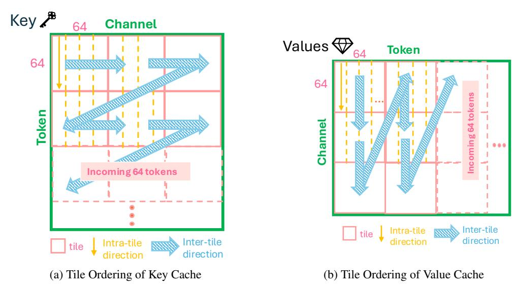

# **C** Sparse Attention Kernel Details

As a supplement to Section 3, we offer more detail onto the Mustafar sparse attention kernel, which accelerates memory-bound batch SpMV.

#### C.1 Load-as-Compressed, Compute-as-Dense Pipeline

Crucial insight of accelerating SpMV involves reducing the data movement between the GPU global memory and the local memory of each GPU Streaming Multiprocessor. First proposed by FlashLLM [43], load-as-compressed, compute-as-dense pipeline as shown in Figure 8 involves sending each matrix tile in the corresponding compressed form to the SM registers ('gmem2reg' in the figure), decompressing the compressed tile into the dense from to the shared memory ('extract'), then initializing computation on the next pipeline stage ('smem2tc'). Computation is mapped to tensor core to utilize

Figure 8: Load-as-compressed, compute-as-compute pipeline of FlashLLM [43]

the high fp16 compute throughput. To map MV, unused N dimensions are padded to zero for computation. Non-zero thread-tile of  $1\times 64$  in Figure 5a represents the granularity of non-zeros that a warp thread decompresses at a pipeline stage. Each warp thread decompresses 2 thread-tile per stage using the corresponding bitmap to determine the correct position of each non-zero. Effectively, each warp operates on a  $64\times 64$  sized matrix tile at a time.

#### C.2 KV Cache Management

Tile size of  $64 \times 64$  of each warp-tile (pink tiles in Figure 9), requires the KV cache to be compressed and appended to the existing KV cache in token groups of 64. Due to the dynamic nature of KV cache where new entries are added during generation, a kernel-compatible management of KV cache update is necessary. That is, (1) column tiling direction of KV cache must be orthogonal to the dimension that is being multiplied with: Key cache is multiplied on the channel-dimension, thus column tiling is across token dimension (yellow arrow in Figure 9a), value cache is multiplied on the token-dimension, thus column-tiling is across the channel dimension (yellow arrow in Figure 9b).

Figure 9: Tile ordering scheme of Key and Value cache

(2), the layout of warp-tile must ensure that newly compressed tokens' KV cache can be appended to the existing compressed KV cache. As newly compressed KV cache are added onto the token

dimension, traversal across multiple warp-tiles is done along channel-major dimension for both Key and and Value caches so that the compressed KV cache of the new tokens can be appended at the end.

### **C.3** Decode Speed Evaluation

Extrapolating on Figure 7, we evaluate Mustafar decoding on various input:output token ratios with batch size 4. For Llama-2-7B, we use input sequence length of 2048. For Llama-3-8B-Instruct, we use input sequence length of 4096. We use output sequence lengths of 512, 1024, and 2048.

Table 14: Decode speed comparison with dense inference

| Model  | KV Format          | TTFT      | Decode Speed (decode 512) | Decode Speed (decode 1024) | Decode Speed (decode 2048) |
|--------|--------------------|-----------|------------------------------|----------------------------|-------------------------------|
| Llama2 | Dense              | 1.396 sec | 88.685 tokens / sec          | 88.512 tokens / sec        | 79.185 tokens / sec           |
|        | Mustafar K0.5 V0.5 | 2.532 sec | 89.452 tokens / sec          | 89.514 tokens / sec        | 85.687 tokens / sec           |
|        | Mustafar K0.7 V0.7 | 2.249 sec | 96.386 tokens / sec          | 97.436 tokens / sec        | 95.120 tokens / sec           |
| Llama3 | Dense              | 2.769 sec | 61.993 tokens / sec          | 61.220 tokens / sec        | 59.242 tokens / sec           |
|        | Mustafar K0.5 V0.5 | 3.269 sec | 78.434 tokens / sec          | 83.768 tokens / sec        | 83.303 tokens / sec           |
|        | Mustafar K0.7 V0.7 | 3.151 sec | 84.065 tokens / sec          | 88.293 tokens / sec        | 89.699 tokens / sec           |

While Figure 7 measured the token throughput by considering both input and output tokens processed, in Table 14 we derived the average decoding speed by measuring the end-to-end duration, and dividing it to the number of tokens generated to penalize Mustafar with the overhead of KV cache pruning and compression in both prefill and decode stages.

While time-to-first-token is delayed due to the overhead of pruning and compressing the KV cache during the prefill stage, the delay is offset by the accelerated attention computation during decoding, resulting in higher overall token generation throughput. Notably, Llama-3 exhibits a larger performance gain compared to Llama-2, as its GQA architecture reduces the overhead of KV cache pruning and compression.