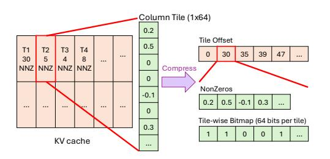

# 3 Sparse Attention Kernel

Our findings establish that unstructured sparsity offers superior sparsity ratios over structured sparsity while preserving accuracy. In turn, a crucial contribution of Mustafar is to leverage this advantage to enable high compression efficiency while minimizing the latency overhead of runtime pruning and compression. Prior compression methods such as quantization, structured pruning, and token eviction reduce matrix dimensions or element bitwidths. In terms of efficiency, speedup from the reduced size of dense matrix operands compensates for the additional latency introduced by compression (i.e. pruning score computation, quantization). In contrast, unstructured sparsity with no regular reduction in dimensions or element bitwidth demands a different approach.

Mustafar is motivated by the observation that attention operations in the autoregressive decode stage, the  $Query \times Key^T$  and  $Attention\ Score \times Value$  computations are batch (different heads) of matrix-vector products (MVs) that are significantly memory-bound on GPUs compared to the prefill stage. To exploit this property, we extend the bitmap-based sparse format of Coruscant [20] as shown in Figure 5a to maximally compress the pruned KV cache. It consists of compressed tiles corresponding to a  $1 \times 64$  column of the pruned cache. Per-tile bitmap of 64 bits is used to represent the position of non-zeros, and tile offset is used to address the correct position of each tile's starting non-zero. Pruning and compression are performed on-the-fly, with compression accelerated on GPU with a Triton kernel, and attention is computed directly on the compressed representation with a custom CUDA kernel that performs batch SpMV on the bitmap-based sparse format. Memory-bound decode-phase attention is accelerated by reducing the data movement from global memory to GPU Streaming Multiprocessors.

- (a) Coruscant [20] bitmap-based sparse format
- (b) Mustafar attention kernel formulation

Figure 5: Overview of Mustafar sparse attention kernel. In (b), multi-head, softmax, and normalization are omitted for simplicity.

Figure 5b and Algorithm 1 presents the Mustafar sparse attention kernel. KV cache generated in prefill stage is pruned and compressed before the start of decode stage, therefore compatible with prefill FlashAttention [6]. KV cache generated in decode stage is kept as-is (dense) while it is within the local window, then pruned and compressed afterwards. This entails the attention computations in the decode stage to be reformulated into two parts: SpMV for compressed KV cache (line 2 and 5 of Algorithm 1) and dense MV for the KV cache within the local window (line 1 and 5 of Algorithm 1).

#### **Algorithm 1** Decode Phase Attention with Dense Local and Compressed KV Caches

**Input:** Query  $\mathbf{Q}_t \in \mathbb{R}^d$ ; Local KV cache  $\mathbf{K}_L, \mathbf{V}_L \in \mathbb{R}^{d \times N_d}$ , where  $N_d$  is size of local window in tokens; Compressed KV cache  $\mathbf{K}_C, \mathbf{V}_C \in \mathbb{R}^{d \times N_s}$ , where  $N_s$  is number of compressed tokens.

