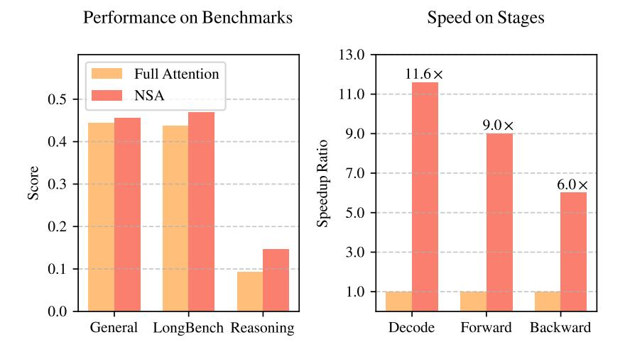
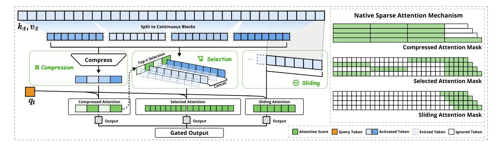

# **1. Introduction**

The research community increasingly recognizes long-context modeling as a crucial capability for next-generation large language models, driven by diverse real-world applications ranging from in-depth reasoning [\(DeepSeek-AI, 2025;](#page-17-0) [Zelikman et al., 2022\)](#page-18-0), repository-level code generation [\(Zhang et al., 2023a;](#page-19-0) [Zhang et al.\)](#page-19-1) and multi-turn autonomous agent systems [\(Park et al.,](#page-17-1) [2023\)](#page-17-1). Recent breakthroughs, including OpenAI's o-series models, DeepSeek-R1 [\(DeepSeek-AI,](#page-17-0) [2025\)](#page-17-0), and Gemini 1.5 Pro [\(Google et al., 2024\)](#page-17-2), enabling models to process entire codebases, lengthy documents, maintain coherent multi-turn conversations over thousands of tokens, and perform complex reasoning across long-range dependencies. However, the high complexity [\(Za](#page-18-1)[heer et al., 2020\)](#page-18-1) of vanilla Attention [\(Vaswani et al., 2017\)](#page-18-2) mechanisms emerges as a critical

Figure 1 | Comparison of performance and efficiency between Full Attention model and our NSA. Left: Despite being sparse, NSA surpasses Full Attention baseline on average across general benchmarks, long-context tasks, and reasoning evaluation. Right: For 64k-length sequence processing, NSA achieves substantial computational speedup compared to Full Attention in all stages: decoding, forward propagation, and backward propagation.

latency bottleneck as sequence length increases. Theoretical estimates indicate that attention computation with softmax architectures accounts for 70–80% of total latency when decoding 64k-length contexts, underscoring the urgent need for more efficient attention mechanisms.

A natural approach to efficient long-context modeling is to take advantage of the inherent sparsity of softmax attention [\(Ge et al., 2023;](#page-17-3) [Jiang et al., 2023\)](#page-17-4), where selectively computing critical query-key pairs can significantly reduce computational overhead while preserving performance. Recent advances demonstrate this potential through diverse strategies: KV-cache eviction methods [\(Li et al., 2024;](#page-17-5) [Zhang et al., 2023b;](#page-19-2) [Zhou et al., 2024\)](#page-19-3), blockwise KV-cache selection methods [\(Gao et al., 2024;](#page-17-6) [Tang et al., 2024;](#page-18-3) [Xiao et al., 2024a\)](#page-18-4), and sampling, clustering or hashing-based selection methods [\(Chen et al., 2024b;](#page-16-0) [Desai et al., 2024;](#page-17-7) [Liu et al., 2024\)](#page-17-8). Despite these promising strategies, existing sparse attention methods often fall short in practical deployments. Many approaches fail to achieve speedups comparable to their theoretical gains; moreover, most methods lack effective training-time support to fully exploit the sparsity patterns of attention.

To address these limitations, the deployment of effective sparse attention must tackle two key challenges: (1) *Hardware-aligned inference speedup*: Converting theoretical computation reductions into actual speed improvements requires hardware-friendly algorithm design during both prefilling and decoding stages to mitigate memory access and hardware scheduling bottlenecks; (2) *Training-aware algorithm design*: Enabling end-to-end computation with trainable operators to reduce training costs while maintaining model performance. These requirements are crucial for real-world applications to achieve fast long-context inference or training. When considering both aspects, existing methods still exhibit a noticeable gap.

To achieve more effective and efficient sparse attention, we present NSA, a Natively trainable Sparse Attention architecture that integrates hierarchical token modeling. As shown in Figure [2,](#page-2-0) NSA reduces per-query computation by organizing keys and values into temporal blocks and processing them through three attention paths: compressed coarse-grained tokens, selectively retained fine-grained tokens, and sliding windows for local contextual information. Then

Figure 2 | Overview of NSA's architecture. Left: The framework processes input sequences through three parallel attention branches: For a given query, preceding keys and values are processed into compressed attention for coarse-grained patterns, selected attention for important token blocks, and sliding attention for local context. Right: Visualization of different attention patterns produced by each branch. Green areas indicate regions where attention scores need to be computed, while white areas represent regions that can be skipped.

we implement specialized kernels to maximize its practical efficiency. NSA introduces two core innovations corresponding to the key requirements above: (1) Hardware-aligned system: Optimize blockwise sparse attention for Tensor Core utilization and memory access, ensuring balanced arithmetic intensity. (2) Training-aware design: Enable stable end-to-end training through efficient algorithms and backward operators. This optimization enables NSA to support both efficient deployment and end-to-end training.

We evaluate NSA through comprehensive experiments on real-world language corpora. Pretraining on a 27B-parameter transformer backbone with 260B tokens, we assess NSA's performance across general language evaluations, long-context evaluations, and chain-of-thought reasoning evaluation. We further compare the kernel speed on A100 GPUs with optimized Triton [\(Tillet et al., 2019\)](#page-18-5) implementations. Experimental results demonstrate that NSA achieves comparable or superior performance to full attention baseline, while outperforming existing sparse attention approaches. Additionally, NSA delivers substantial speedups across decoding, forward, and backward stages compared to Full Attention, with the speedup ratio increasing for longer sequences. These results validate that our hierarchical sparse attention design effectively balances model capability and computational efficiency.

