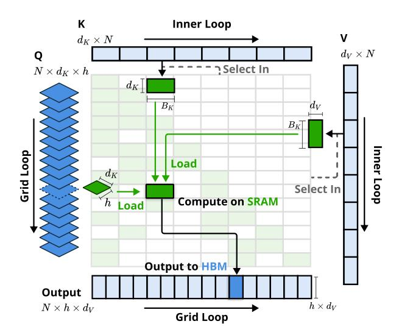
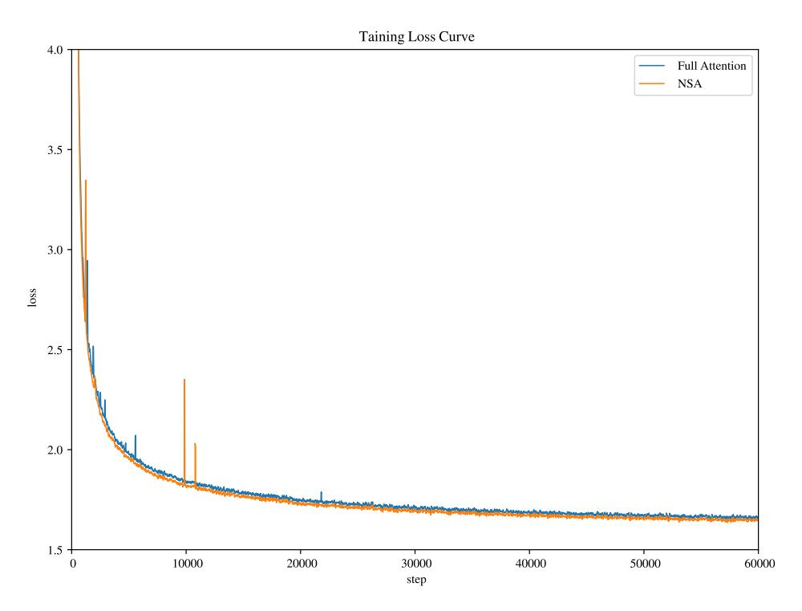

# 3. Methodology

Our technical approach spans algorithm design and kernel optimization. In the following subsections, we first introduce the background of our methodology. Then we present the overall framework of NSA, followed by its key algorithmic components. Finally, we detail our hardware-optimized kernel design that maximizes practical efficiency.

#### 3.1. Background

**Attention Mechanism** is widely used in language modeling where each query token  $\mathbf{q}_t$  computes relevance scores against all preceding keys  $\mathbf{k}_{:t}$  to generate a weighted sum of values  $\mathbf{v}_{:t}$ . Formally, for an input sequence of length t, the attention operation is defined as:

$$\mathbf{o}_t = \operatorname{Attn}\left(\mathbf{q}_t, \mathbf{k}_{:t}, \mathbf{v}_{:t}\right) \tag{1}$$

where Attn denotes the attention function:

Attn 
$$(\mathbf{q}_t, \mathbf{k}_{:t}, \mathbf{v}_{:t}) = \sum_{i=1}^{t} \frac{\alpha_{t,i} \mathbf{v}_i}{\sum_{i=1}^{t} \alpha_{t,i}}, \quad \alpha_{t,i} = e^{\frac{\mathbf{q}_t^{\top} \mathbf{k}_i}{\sqrt{d_k}}}.$$
 (2)

Here,  $\alpha_{t,i}$  represents the attention weight between  $\mathbf{q}_t$  and  $\mathbf{k}_i$ , and  $d_k$  is the feature dimension of keys. As sequence length increases, attention computation becomes increasingly dominant in the overall computational cost, presenting significant challenges for long-context processing.

Arithmetic Intensity is the ratio of compute operations to memory accesses. It intrinsically shapes algorithm optimization on hardware. Each GPU has a critical arithmetic intensity determined by its peak compute capability and memory bandwidth, calculated as the ratio of these two hardware limits. For computation tasks, arithmetic intensity above this critical threshold becomes compute-bound (limited by GPU FLOPS), while below it becomes memory-bound (limited by memory bandwidth).

Specifically for causal self-attention mechanism, during training and prefilling phases, batched matrix multiplications and attention computations exhibit high arithmetic intensity, making these stages compute-bound on modern accelerators. In contrast, auto-regressive decoding becomes memory-bandwidth constrained because it generates one token per forward pass while requiring loading the entire key-value cache, resulting in low arithmetic intensity.

This leads to different optimization goals — reducing computation cost during training and prefilling, while reducing memory access during decoding.

#### 3.2. Overall Framework

To leverage the potential of attention with natural sparse pattern, we propose replacing the original key-value pairs  $\mathbf{k}_{:t}$ ,  $\mathbf{v}_{:t}$  in Equation (1) with a more compact and information-dense set of representation key-value pairs  $\tilde{K}_t$ ,  $\tilde{V}_t$  given each query  $\mathbf{q}_t$ . Specifically, we formally define the optimized attention output as follows:

$$\tilde{K}_t = f_K(\mathbf{q}_t, \mathbf{k}_{:t}, \mathbf{v}_{:t}), \quad \tilde{V}_t = f_V(\mathbf{q}_t, \mathbf{k}_{:t}, \mathbf{v}_{:t})$$
(3)

$$\mathbf{o}_{t}^{*} = \operatorname{Attn}\left(\mathbf{q}_{t}, \tilde{K}_{t}, \tilde{V}_{t}\right) \tag{4}$$

where  $\tilde{K}_t$ ,  $\tilde{V}_t$  are dynamically constructed based on the current query  $\mathbf{q}_t$  and the contextual memory  $\mathbf{k}_{:t}$ ,  $\mathbf{v}_{:t}$ . We can design various mapping strategies to get different categories of  $\tilde{K}_t^c$ ,  $\tilde{V}_t^c$ , and combine them as follows:

$$\mathbf{o}_{t}^{*} = \sum_{c \in C} g_{t}^{c} \cdot \operatorname{Attn}(\mathbf{q}_{t}, \tilde{K}_{t}^{c}, \tilde{V}_{t}^{c}). \tag{5}$$

As illustrated in Figure 2, NSA have three mapping strategies  $C = \{\text{cmp}, \text{slc}, \text{win}\}$ , representing compression, selection, and sliding window for keys and values.  $g_t^c \in [0,1]$  is the gate score for corresponding strategy c, derived from input features via an MLP and sigmoid activation. Let  $N_t$  denote the total number of remapped keys/values:

$$N_t = \sum_{c \in C} \operatorname{size}[\tilde{K}_t^c]. \tag{6}$$

We maintain a high sparsity ratio by ensuring  $N_t \ll t$ .

#### 3.3. Algorithm Design

In this subsection, we introduce the design of our remapping strategies  $f_K$  and  $f_V$ : token compression, token selection, and sliding window.

#### 3.3.1. Token Compression

By aggregating sequential blocks of keys or values into block-level representations, we obtain compressed keys and values that capture the information of the entire block. Formally, the compressed key representation is defined as:

$$\tilde{K}_{t}^{\text{cmp}} = f_{K}^{\text{cmp}}(\mathbf{k}_{:t}) = \left\{ \varphi(\mathbf{k}_{id+1:id+l}) \middle| 0 \le i \le \left\lfloor \frac{t-l}{d} \right\rfloor \right\}$$
 (7)

where l is the block length, d is the sliding stride between adjacent blocks, and  $\phi$  is a learnable MLP with intra-block position encoding to map keys in a block to a single compressed key.  $\tilde{K}_t^{\text{cmp}} \in \mathbb{R}^{d_k \times \left \lfloor \frac{t-l}{d} \right \rfloor}$  is tensor composed by compresion keys. Usually, we adopt d < l to mitigate information fragmentation. An analogous formulation holds for the compressed value representation  $\tilde{V}_t^{\text{cmp}}$ . Compressed representations capture coarser-grained higher-level semantic information and reduce computational burden of attention.

#### 3.3.2. Token Selection

Using only compressed keys, values might lose important fine-grained information, motivating us to selectively preserve individual keys, values. Below we describe our efficient token selection mechanism that identifies and preserves the most relevant tokens with low computational overhead.

Blockwise Selection. Our selection strategy processes key and value sequences in spacial continuous blocks, motivated by two key factors: hardware efficiency considerations and inherent distribution patterns of attention scores. *Blockwise selection is crucial to achieve efficient computation on modern GPUs*. That is because modern GPU architectures exhibit significantly higher throughput for continuous block accesses compared to random index-based reads. Also, blockwise computation enables optimal utilization of Tensor Cores. This architectural characteristic has established blockwise memory access and computation as a fundamental principle in high-performance attention implementations, as exemplified by FlashAttention's block-based design. *Blockwise selection follows the inherent distribution patterns of attention scores*. Prior works (Jiang et al., 2024) have shown that attention scores often exhibit spatial continuity, suggesting that neighboring keys tend to share similar importance levels. Our visualization in Section 6.2 also shows this spatial continuous pattern.

To implement blockwise selection, we first divide key, value sequences into selection blocks. To identify the most important blocks for attention computation, we need to assign importance scores to each block. Below we present our method for computing these block-level importance scores.

**Importance Score Computation.** Computing block importance scores could introduce significant overhead. Fortunately, the attention computation of compression tokens produces intermediate attention scores that we can leverage to induce selection block importance scores, formulated as:

$$\mathbf{p}_{t}^{\text{cmp}} = \text{Softmax}\left(\mathbf{q}_{t}^{T} \tilde{K}_{t}^{\text{cmp}}\right), \tag{8}$$

where  $\mathbf{p}_t^{\mathrm{cmp}} \in \mathbb{R}^{\left\lfloor \frac{t-l}{d} \right\rfloor + 1}$  is the attention scores between  $q_t$  and compression keys  $\tilde{K}_t^{\mathrm{cmp}}$ . Let l' denote the selection block size. When compression blocks and selection blocks share the same blocking scheme, i.e., l' = l = d, we can directly obtain the selection block importance scores  $\mathbf{p}_t^{\mathrm{slc}}$  by  $\mathbf{p}_t^{\mathrm{slc}} = \mathbf{p}_t^{\mathrm{cmp}}$  straightforwardly. For cases where the blocking schemes differ, we derive the importance scores for selection blocks according to their spatial relationship. Given  $l \leq l'$ ,  $d \mid l$  and  $d \mid l'$ , we have:

$$\mathbf{p}_{t}^{\text{slc}}[j] = \sum_{m=0}^{\frac{l'}{d}-1} \sum_{n=0}^{l-1} \mathbf{p}_{t}^{\text{cmp}} \left[ \frac{l'}{d} j - m - n \right], \tag{9}$$

where [·] denotes the indexing operator for accessing vector element. For models employing GQA or MQA where key-value caches are shared across query heads, consistent block selection across these heads has to be ensured to minimize KV cache loading during decoding. The shared importance scores across heads in a group are formally defined as:

$$\mathbf{p}_t^{\mathrm{slc'}} = \sum_{h=1}^{H} \mathbf{p}_t^{\mathrm{slc},(h)},\tag{10}$$

where (*h*) in the superscript denotes the head index, and *H* is the number of query heads in each group. This aggregation ensures consistent block selection across heads within the same group.

**Top-***n* **Block Selection.** After obtaining the selection block importance scores, We retain tokens within the top-*n* sparse blocks ranked by block importance scores, formulated as:

$$I_t = \{i \mid \operatorname{rank}(\mathbf{p}_t^{\operatorname{slc}'}[i]) \leqslant n\} \tag{11}$$

$$\tilde{K}_t^{\text{slc}} = \text{Cat}\left[\left\{\mathbf{k}_{il'+1:(i+1)l'}|i\in\mathcal{I}_t\right\}\right],\tag{12}$$

where  $\operatorname{rank}(\cdot)$  denotes the ranking position in descending order, with  $\operatorname{rank} = 1$  corresponding to the highest score,  $I_t$  is the set of selected blocks' indices, Cat denotes the concatenation operation.  $\tilde{K}_t^{\operatorname{slc}} \in \mathbb{R}^{d_k \times nl'}$  is tensor composed by compresion keys. An analogous formulation applies to the fine-grained value  $\tilde{V}_t^{\operatorname{slc}}$ . The selected keys and values then participate in the attention computation with  $\mathbf{q}_t$  as defined in Equation (5).

#### 3.3.3. Sliding Window

In attention mechanisms, local patterns typically adapt faster and can dominate the learning process, potentially preventing the model from effectively learning from compression and selection tokens. To address this issue, we introduce a dedicated sliding window branch that explicitly handles local context, allowing other branches (compression and selection) to focus on learning their respective features without being shortcutted by local patterns. Specifically, we maintain recent tokens  $\tilde{K}_t^{\text{win}} = \mathbf{k}_{t-w:t}$ ,  $\tilde{V}_t^{\text{win}} = \mathbf{v}_{t-w:t}$  in a window w, and isolate attention computations of different information sources (compression tokens, and selected tokens, sliding window) into separate branches. These branch outputs are then aggregated through a learned gating mechanism. To further prevent shortcut learning across attention branches with marginal computational overhead, we provide independent keys and values for three branches. This architectural design enables stable learning by preventing gradient interference between local and long-range pattern recognition, while introducing minimal overhead.

After obtaining all three categories of keys and values ( $\tilde{K}_t^{\text{cmp}}$ ,  $\tilde{V}_t^{\text{slc}}$ ,  $\tilde{K}_t^{\text{slc}}$ ,  $\tilde{V}_t^{\text{slc}}$ ; and  $\tilde{K}_t^{\text{win}}$ ,  $\tilde{V}_t^{\text{win}}$ ), we compute the final attention output following Equation (5). Together with the compression, selection, and sliding window mechanisms described above, this forms the complete algorithmic framework of NSA.

#### 3.4. Kernel Design

To achieve FlashAttention-level speedup during the training and prefilling, we implement hardware-aligned sparse attention kernels upon Triton. Given MHA is memory-intensive and inefficient for decoding, we focus on architectures with shared KV caches like GQA and MQA following the current state-of-the-art LLMs. While compression and sliding window attention computations are readily compatible with existing FlashAttention-2 kernels, we introduce the specialized kernel design for sparse selection attention. If we were to follow FlashAttention's strategy of loading temporally continuous query blocks into SRAM, it would result in inefficient memory access since queries within a block may require disjoint KV blocks. To address this, our key optimization lies in a different query grouping strategy: for each position on the query sequence, we load all query heads within a GQA group (they share the same sparse KV blocks) into SRAM. Figure 3 illustrates our forward pass implementation. The proposed kernel architecture is characterized by the following key features:

1. **Group-Centric Data Loading**. For each inner loop, load all heads' queries  $Q \in \mathbb{R}^{[h,d_k]}$  in the group at position t and their shared sparse key/value block indices  $I_t$ .

- 2. **Shared KV Fetching**. In the inner loop, Sequentially load continuous key/value blocks indexed by  $I_t$  into SRAM as  $K \in \mathbb{R}^{[B_k,d_k]}, V \in \mathbb{R}^{[B_k,d_v]}$  to minimize memory loading, where  $B_k$  is the kernel block size satisfying  $B_k|I'$ .
- 3. **Outer Loop on Grid**. Since the inner-loop length (proportional to the selected block count *n*) remains nearly identical for different query blocks, we put query/output loops in Triton's grid scheduler to simplify and optimize the kernel.

This design achieves near-optimal arithmetic intensity by (1) eliminating redundant KV transfers through group-wise sharing, and (2) balancing compute workloads across GPU streaming multiprocessors.

Figure 3 | Kernel design for NSA. The kernel loads queries by GQA groups (Grid Loop), fetches corresponding sparse KV blocks (Inner Loop), and performs attention computation on SRAM. Green blocks indicate data on SRAM, while blue indicates data on HBM.

### 4. Experiments

We evaluate NSA through three lenses: (1) general benchmarks performance, (2) long-context benchmarks performance, and (3) chain-of-thought reasoning performance, comparing against Full Attention baseline and state-of-the-art sparse attention methods. We defer the efficiency analysis of our sparse computation paradigm to Section 5, where we provide detailed discussions on training and inference speed.

#### 4.1. Pretraining Setup

Following the common practice in state-of-the-art LLMs, our experiments adopt a backbone combining Grouped-Query Attention (GQA) and Mixture-of-Experts (MoE), featuring 27B total parameters with 3B active parameters. The model consists of 30 layers with a hidden dimension of 2560. For GQA, we set the number of groups to 4, with a total of 64 attention heads. For each head, the hidden dimensions of the query, key, and value are configured as  $d_q = d_k = 192$  and  $d_v = 128$ , respectively. For MoE, we utilize the DeepSeekMoE (Dai et al., 2024; DeepSeek-AI, 2024) structure, with 72 routed experts and 2 shared experts, and set the top-k experts to 6. To ensure training stability, the MoE in the first layer is replaced by an MLP in the form of SwiGLU.

Figure 4 | Pretraining loss comparison between Full Attention and our NSA on 27B-parameter model. Both models exhibit stable convergence, with NSA achieving lower loss values.

| Model     | MMLU        | MMLU-PRO    | CMMLU       | BBH         | GSM8K       | MATH        | DROP      | MBPP          | HumanEval Avg. |       |
|-----------|-------------|-------------|-------------|-------------|-------------|-------------|-----------|---------------|----------------|-------|
|           | Acc. 5-shot | Acc. 5-shot | Acc. 5-shot | Acc. 3-shot | Acc. 8-shot | Acc. 4-shot | F1 1-shot | Pass@1 3-shot | Pass@1 0-shot  |       |
| Full Attn | 0.567       | 0.279       | 0.576       | 0.497       | 0.486       | 0.263       | 0.503     | 0.482         | 0.335          | 0.443 |
| NSA       | 0.565       | 0.286       | 0.587       | 0.521       | 0.520       | 0.264       | 0.545     | 0.466         | 0.348          | 0.456 |

Table 1 | Pretraining performance comparison between the full attention baseline and NSA on general benchmarks, across knowledge (MMLU, MMLU-PRO, CMMLU), reasoning (BBH, GSM8K, MATH, DROP), and coding (MBPP, HumanEval) tasks. NSA achieves superior average performance on most benchmarks despite high sparsity.

The proposed architecture achieves an effective trade-off between computation cost and model performance. For NSA, we set compression block size = 32, sliding stride = 16, selected block size ′ = 64, selected block count = 16 (including fixed activating the 1 initial block and 2 local blocks), and sliding window size = 512. Both Full Attention and sparse attention models are pretrained on 270B tokens of 8k-length texts, followed by continued training and supervised fine-tuning on 32k-length texts with YaRN [\(Peng et al., 2024\)](#page-18-8) to achieve long-context adaptation. Both models are trained to full convergence to ensure fair comparison. As shown in Figure [4,](#page-9-0) the pretraining loss curve of our NSA and Full Attention baseline demonstrates stable and smooth decline, with NSA consistently outperforming the Full Attention model.

