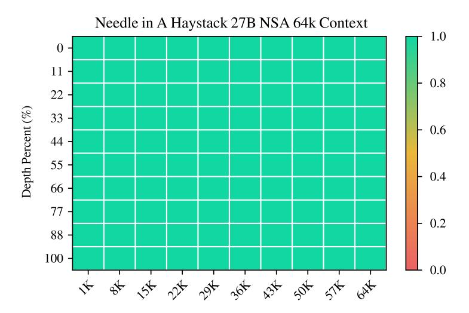
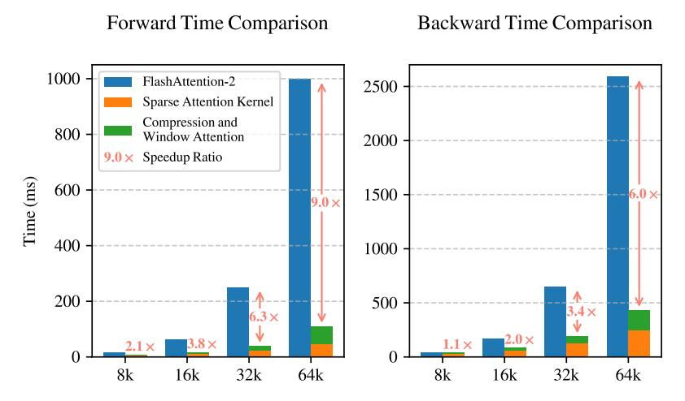

# **4.2. Baselines Methods**

In addition to comparing with Full Attention, we evaluate several state-of-the-art inferencestage sparse attention methods: H2O [\(Zhang et al., 2023b\)](#page-19-2), infLLM [\(Xiao et al., 2024a\)](#page-18-4), Quest [\(Tang et al., 2024\)](#page-18-3), and Exact-Top, which first computes full attention score and select the top scores keys corresponding to each query and then calculates attention on these positions. These

| Model     | SQA     |         |        | MQA   |       |        |       | Synthetic |          | Code  | Avg.  |
|-----------|---------|---------|--------|-------|-------|--------|-------|-----------|----------|-------|-------|
|           | MFQA-en | MFQA-zh | Qasper | HPQ   | 2Wiki | GovRpt | Dur   | PassR-en  | PassR-zh | LCC   |       |
| H2O       | 0.428   | 0.429   | 0.308  | 0.112 | 0.101 | 0.231  | 0.208 | 0.704     | 0.421    | 0.092 | 0.303 |
| InfLLM    | 0.474   | 0.517   | 0.356  | 0.306 | 0.250 | 0.277  | 0.257 | 0.766     | 0.486    | 0.143 | 0.383 |
| Quest     | 0.495   | 0.561   | 0.365  | 0.295 | 0.245 | 0.293  | 0.257 | 0.792     | 0.478    | 0.135 | 0.392 |
| Exact-Top | 0.502   | 0.605   | 0.397  | 0.321 | 0.288 | 0.316  | 0.291 | 0.810     | 0.548    | 0.156 | 0.423 |
| Full Attn | 0.512   | 0.623   | 0.409  | 0.350 | 0.305 | 0.324  | 0.294 | 0.830     | 0.560    | 0.163 | 0.437 |
| NSA       | 0.503   | 0.624   | 0.432  | 0.437 | 0.356 | 0.307  | 0.341 | 0.905     | 0.550    | 0.232 | 0.469 |

Table 2 | Performance comparison between our NSA and baselines on LongBench, including subsets in single document QA, multi-document QA, synthetic and code task categories. NSA outperformed most of the baselines including Full Attention.

methods span diverse sparse attention paradigms, including KV-cache eviction, query-aware selection, and exact top- sparse selection.

For general evaluation, where most samples have lengths within the local context window of sparse attention baselines, these methods are effectively equivalent to Full Attention. Therefore, we present only the comparison results between NSA and Full Attention baseline in this setting. In the long-context evaluation, we conduct comparisons across all baseline methods, with the sparsity of all sparse attention methods set to the same to ensure a fair comparison. For chainof-thought reasoning evaluation, which requires long-text supervised fine-tuning, we limit our comparison to Full Attention, as sparse attention baselines do not support training.

#### **4.3. Performance Comparison**

**General Evaluation.** We evaluated the pretrained NSA and Full Attention baseline, on a comprehensive suite of benchmarks spanning knowledge, reasoning, and coding capabilities, including MMLU [\(Hendrycks et al., 2020\)](#page-17-10), MMLU-PRO [\(Wang et al., 2024\)](#page-18-9), CMMLU [\(Li et al.,](#page-17-11) [2023\)](#page-17-11), BBH [\(Suzgun et al., 2022\)](#page-18-10), GSM8K [\(Cobbe et al., 2021\)](#page-16-4), MATH [\(Hendrycks et al., 2020\)](#page-17-10), DROP [\(Dua et al., 2019\)](#page-17-12), MBPP [\(Austin et al., 2021\)](#page-16-5), and HumanEval [\(Chen et al., 2021\)](#page-16-6). The results are shown in Table [1.](#page-9-1) Despite its sparsity, NSA achieves superior overall performance, outperforming all baselines including Full Attention on 7 out of 9 metrics. This indicates that although NSA may not fully leverage its efficiency advantages on shorter sequences, it shows strong performance. Notably, NSA demonstrates significant gains in reasoning-related benchmarks (DROP: +0.042, GSM8K: +0.034), suggesting that our pretraining helps models to develop specialized attention mechanisms. This sparse attention pretraining mechanism forces model to focus on the most important information, potentially enhancing performance by filtering out noise from irrelevant attention pathways. The consistent performance across diverse evaluations also validates NSA's robustness as a general-purpose architecture.

**Long-Context Evaluation.** As shown in Figure [5,](#page-11-0) NSA achieves perfect retrieval accuracy across all positions in 64k-context needle-in-a-haystack [\(Kamradt, 2023\)](#page-17-13) test. This performance stems from our hierarchical sparse attention design, which combines compression tokens for efficient global context scanning, and selection tokens for precise local information retrieval. The coarse-grained compression identifies relevant context blocks at low computational cost, while the token-level attention on selected tokens ensures the preservation of critical fine-grained information. This design enables NSA to maintain both global awareness and local precision.

We also evaluate NSA on LongBench [\(Bai et al., 2023\)](#page-16-7) against state-of-the-art sparse attention

Figure 5 | Needle-in-a-Haystack retrieval accuracy across context positions with 64k context length. NSA achieves perfect accuracy through its hierarchical sparse attention design.

methods and Full Attention baseline. To ensure consistent sparsity, we set the token activated by each query in all sparse attention baselines to 2560 tokens, which corresponds to the average number of tokens activated in NSA when handling 32k sequence lengths. Following Stream-LLM [\(Xiao et al., 2023\)](#page-18-11), this token budget includes the leading 128 tokens and 512 local tokens. We exclude certain subsets from LongBench due to their low scores across all models, which may not provide meaningful comparisons. As shown in Table [2,](#page-10-0) NSA achieves the highest average score 0.469, outperforming all baselines (+0.032 over Full Attention and +0.046 over Exact-Top). This improvement arises from two key innovations: (1) our native sparse attention design, which enables end-to-end optimization of sparse patterns during pretraining, facilitates synchronized adaptation between the sparse attention module and other model components; and (2) the hierarchical sparse attention mechanism achieves a balance between local and global information processing.

Notably, NSA demonstrates exceptional performance on tasks requiring complex reasoning over long contexts, achieving +0.087 and +0.051 improvements over Full Attention on multi-hop QA tasks (HPQ and 2Wiki), exceeding the performance of baselines on code understanding (LCC: +0.069), and outperforming other methods on passage retrieval (PassR-en: +0.075). These results validate NSA's capability to handle diverse long-context challenges, with its natively pretrained sparse attention providing additional benefits in learning task-optimal patterns.

**Chain-of-Thought Reasoning Evaluation.** To evaluate NSA's compatibility with advanced downstream training paradigms, we investigate its capacity to acquire chain-of-thought mathematical reasoning abilities via post-training. Given the limited effectiveness of reinforcement learning on smaller-scale models, we employ knowledge distillation from DeepSeek-R1, conducting supervised fine-tuning (SFT) with 10B tokens of 32k-length mathematical reasoning traces. This produces two comparable models: Full Attention-R (Full Attention baseline) and NSA-R (our sparse variant). We assess both models on the challenging American Invitational Mathematics Examination (AIME 24) benchmark. We use a sampling temperature of 0.7 and a top- value of 0.95 to generate 16 responses for each question and obtain the average score. To validate the impact of reasoning depth, we conduct experiments with two generation context limits: 8k and 16k tokens, measuring whether extended reasoning chains improve accuracy. Example comparisons of model predictions are provided in Appendix [A.](#page-20-0)

| Generation Token Limit | 8192  | 16384 |
|------------------------|-------|-------|
| Full Attention-R       | 0.046 | 0.092 |
| NSA-R                  | 0.121 | 0.146 |

Table 3 | AIME Instruction-based Evaluating after supervised fine-tuning. Our NSA-R demonstrates better performance than Full Attention-R at both 8k and 16k sequence lengths

Figure 6 | Comparison of Triton-based NSA kernel with Triton-based FlashAttention-2 kernel. Our implementation significantly reduces latency across all context lengths, with the improvement becoming more pronounced as input length increases.

As shown in Table [3,](#page-12-1) NSA-R achieves significantly higher accuracy than Full Attention-R under the 8k context setting (+0.075), with this advantage persisting at 16k contexts (+0.054). These results validate two key benefits of native sparse attention: (1) The pretrained sparse attention patterns enable efficient capture of long-range logical dependencies critical for complex mathematical derivations; (2) Our architecture's hardware-aligned design maintains sufficient context density to support growing reasoning depth without catastrophic forgetting. The consistent outperformance across context lengths confirms sparse attention's viability for advanced reasoning tasks when natively integrated into the training pipeline.

