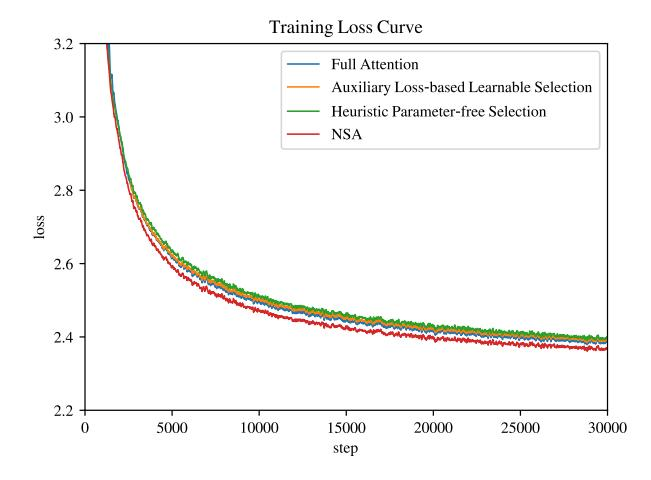
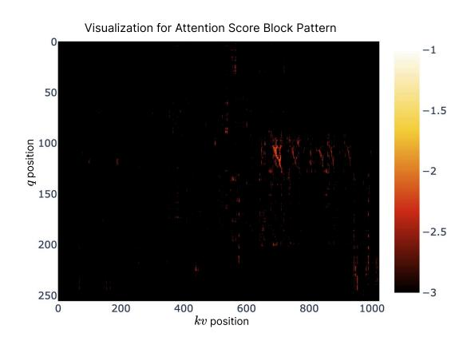

# **5. Efficiency Analysis**

We evaluate the computational efficiency of NSA against Full Attention on an 8-GPU A100 system. In efficiency analysis, we also configure the model with GQA group = 4, heads per group ℎ = 16, query/key dimension = 192, and value dimension = 128. Following the same settings in Section [4,](#page-8-1) we set NSA compression block size = 32, sliding stride = 16, selected block size ′ = 64, selected block count = 16, and sliding window size = 512.

#### **5.1. Training Speed**

We compare the Triton-based implementations of our NSA attention and Full Attention with Triton-based FlashAttention-2 to ensure fair speed comparison across the same backend. As shown in Figure [6,](#page-12-2) our NSA achieves progressively greater speedups as context length increases, up to 9.0× forward and 6.0× backward speedup at 64k context-length. Notably, the speed advantage becomes more pronounced with longer sequences. This speedup stems from our

| Context Length        | 8192         | 16384         | 32768         | 65536         |
|-----------------------|--------------|---------------|---------------|---------------|
| Full Attention NSA | 8192 2048 | 16384 2560 | 32768 3584 | 65536 5632 |
| Expected Speedup      | 4×           | 6.4×          | 9.1×          | 11.6×         |

Table 4 | Memory access volume (in equivalent number of tokens) per attention operation during decoding. Due to the low arithmetic intensity and memory-bound nature of decoding, the expected speedup is approximately linear with the volume of memory access.

hardware-aligned algorithm design to maximize the efficiency of sparse attention architecture: (1) The Blockwise memory access pattern maximizes Tensor Core utilization through coalesced loads, (2) The delicate loop scheduling in the kernel eliminates redundant KV transfers.

#### 5.2. Decoding Speed

The decoding speed of Attention is primarily determined by the memory access bottleneck, which is closely tied to the amount of KV cache loading. In each decoding step, Our NSA just needs to load at most  $\lfloor \frac{s-l}{d} \rfloor$  compression tokens, nl' selected tokens, and w neighbor tokens, where s is the cached sequence length. As shown in Table 4, our method exhibits a significant reduction in latency as the decoding length increases, achieving up to 11.6× speedup at 64k context-length. This advantage in memory access efficiency also amplifies with longer sequences.

#### 6. Discussion

In this section, we reflect on the development process of NSA and discuss key insights gained from our exploration of different sparse attention strategies. While our approach demonstrates promising results, understanding the challenges encountered with alternative strategies and analyzing attention patterns provides valuable context for future research directions. We first examine challenges with alternative token selection strategies that motivated our design choices, followed by visualizations that offer insights into attention distribution patterns.

#### 6.1. Challenges with Alternative Token Selection Strategies

Before designing NSA, we explored adapting existing sparse attention methods to the training stage. However, these attempts encountered various challenges, prompting us to design a different sparse attention architecture:

**Key-Clustering Based Strategies.** We examined clustering-based strategies like ClusterKV (Liu et al., 2024). These methods store Keys and Values from the same cluster in contiguous memory regions. While theoretically feasible for training and inference, they face three significant challenges: (1) Non-trivial computational overhead introduced by dynamic clustering mechanisms; (2) Operator optimization difficulties exacerbated by inter-cluster imbalances, especially in Mixture-of-Experts (MoE) systems, where skewed Expert Parallelism (EP) group execution times lead to persistent load imbalances; (3) Implementation constraints arising from the need for mandatory periodic reclustering and chunk-sequential training protocols. These combined factors create substantial bottlenecks, significantly limiting their effectiveness for real-world deployment.

Figure 7 | Compare training loss on a 3B-parameter model with Full Attention and different token selection strategies and. Our NSA achieves better performance.

Figure 8 | Visualization of Attention Map on a Full Attention transformer. Lightcolored regions indicate higher attention values. As shown in the figure, attention scores exhibit blockwise clustering distribution.

Other Blockwise Selection Strategies. We also considered blockwise key, value selection strategies different from NSA, such as Quest (Tang et al., 2024) and InfLLM (Xiao et al., 2024a). These methods rely on computing an importance score for each KV block and selecting the top-n blocks based on their similarity with  $q_t$ . However, existing methods face two critical issues: (1) Since the selection operation is non-differentiable, importance score computation based on neural networks relies on auxiliary loss, which increases operator overhead and often degrades model performance; (2) Heuristic parameter-free importance score computation strategy suffer from low recall rates, leading to suboptimal performance. We evaluate both approaches on a 3B-parameter model with similar architecture and compare their loss curve with NSA and Full Attention. For the auxiliary loss-based selection method, we introduce additional queries for each token and representative keys for each block to estimate the block importance scores. We compute block-level supervision signals by mean-pooling attention scores within each key block, and use KL divergence to supervise block importance prediction. We maintain individual query granularity instead of block-averaged queries to accommodate efficient decoding. This auxiliary loss-based importance estimation shares conceptual similarity with SeerAttention (Gao et al., 2024). For the heuristic parameter-free selection method, following the strategy of Quest, we implement direct selection using the product between queries and coordinate-wise min-max of the key chunks, without introducing additional parameters. We also explore a cold-start training approach where Full Attention is applied for the initial 1000 steps before transitioning to the heuristic blockwise selection. As shown in Figure 7, both methods exhibited inferior loss.

#### 6.2. Visualization

To explore potential patterns in transformer attention distributions and seek inspiration for our design, we visualize the attention map from our pretrained 27B Full Attention model in Figure 8. The visualization reveals interesting patterns where attention scores tend to exhibit blockwise clustering characteristics, with nearby keys often showing similar attention scores. This observation inspired our design of NSA, suggesting that selecting key blocks based on spatial continuity might be a promising approach. The blockwise clustering phenomenon indicates that tokens adjacent in the sequence may share certain semantic relationships with query tokens, though the exact nature of these relationships requires further investigation. This

observation motivated us to explore a sparse attention mechanism that operates on continuous token blocks rather than individual tokens, aiming to enhance computational efficiency and preserve high-attention patterns.

