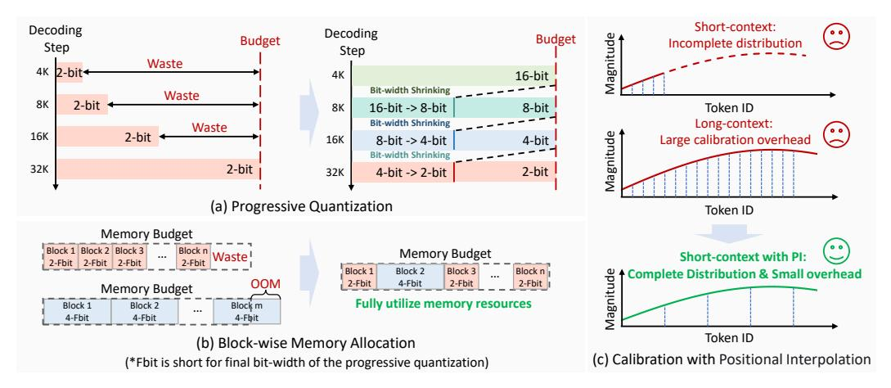

# 2 Related Work

#### 2.1 Long CoT Large Language Models

Long-CoT (Long-Chain-of-Thought) LLMs aim to enhance multi-step reasoning ability for complex tasks like mathematical proofs, scientific reasoning, and multi-hop QA. Models such as OpenAIo1 [\[17\]](#page-10-0), QwQ [\[21\]](#page-10-1), and DeepSeek-R1 [\[8\]](#page-9-0) employ advanced techniques to extend CoT reasoning depth. DeepSeek, specifically, integrates iterative self-refinement and tool-augmented reasoning (e.g., code execution and symbolic solvers) to maintain coherence across extended reasoning chains. Its

architecture emphasizes hierarchical decomposition of problems and error-correction mechanisms, achieving state-of-the-art performance.

Table 1: The memory overhead of the long-CoT LLMs. The batch size is 16, and the context length is 32K.

| Model              | Weights (GB) KV Cache (GB) |     |  |  |  |
|--------------------|-------------------------------|-----|--|--|--|
| DeepSeek-LLaMA-8B  | 16                            | 64  |  |  |  |
| DeepSeek-Qwen-32B  | 64                            | 128 |  |  |  |
| DeepSeek-LLaMA-70B | 140                           | 160 |  |  |  |

While long-CoT can significantly improve model performance, it introduces excessively more decoding tokens (e.g., >32K tokens per request) and large GPU memory overhead. As shown in Table [1,](#page-2-0) despite employing efficient attention designs, such as Multi-Query Attention (MQA) [\[18\]](#page-10-8), Group-Query Attention (GQA) [\[2\]](#page-9-5), and Multi-head Latent Attention (MLA) [\[14\]](#page-9-6), the memory overhead of the KV Cache in long-CoT LLMs remains significantly large, often exceeding the memory footprint of the model weights in real-world scenarios. In this case, reducing the memory overhead of the KV Cache is significantly important for large batch sizes and long context requirements.

#### 2.2 Post-Training KV Cache Quantization

To alleviate the large memory overhead with long reasoning context, many efforts have been made to reduce the KV Cache size. Post-training KV Cache quantization stands as one of the most promising techniques for efficient inference. KV Cache quantization methods try to use low bit-width integer values to represent the cached key and value states, instead of using high bit-width floating-point values. Existing methods typically apply asymmetric uniform quantization for KV Cache, as shown below:

$$\mathbf{X}_{\text{asym}} = \left[ \frac{\mathbf{X}_{\text{FP16}} - Z}{S_{\text{asym}}} \right],\tag{1}$$

$$S_{\text{asym}} = \frac{\max(\mathbf{X}_{\text{FP16}}) - Z}{2^N - 1},\tag{2}$$

where XFP16 denotes the 16-bit floating-point (FP16) Key or Value tensor, Xasym denotes the lowprecision integer Key or Value tensor, Sasym and Z = min(XFP16) denote the scaling factor and the zero point, respectively.

Specifically, MKLV [\[9\]](#page-9-7) discovers that the sensitivity of Key and Value tensors are quite different, and the Key tensors are more sensitive to quantization than the Value tensors. Therefore, MKLV simply assigns a higher bit-width to Key tensors and a lower bit-width to Value tensors, respectively. WKVQuant [\[25\]](#page-10-9) proposes to change the data flow of the previous KV Cache quantization by using the unquantized current Key and Value to calculate the attention operator and then quantize the current Key and Value. SKVQ [\[6\]](#page-9-3) further improves the WKVQuant by using a sliding window to store the most recent 128 Key and Value features in FP16 format to reduce the cumulative quantization error. MiKV [\[24\]](#page-10-3) is inspired by H2O [\[26\]](#page-10-6) to use the heavy-hitter oracle to discover the important tokens in a higher bit-width and quantize the rest of the unimportant tokens into a lower bit-width. KIVI [\[16\]](#page-10-2) discovers that the Value tensors are much flatter than Key tensors, and the outliers in Key tensors typically appear in certain channels. To this end, KIVI proposes to utilize per-channel quantization for Key Cache and per-token quantization for Value Cache in a group-wise manner to reduce the quantization error. RotateKV [\[20\]](#page-10-4) combines the channel-wise equalization and the rotation-based equalization with Hadamard matrices to reduce the quantization error.

In this paper, we adopt effective strategies from prior work, consistently storing the first token in INT16 format and using a sliding window to preserve the most recent few tokens. To further reduce quantization errors, we introduce two novel improvements: (1) Progressive Quantization: We maximize memory utilization by initially storing KV Cache in higher precision. When the memory is full, we progressively reduce the bit-width to store more Keys and Values. (2) Block-wise Memory Allocation: When memory is large enough to store more tokens with higher bit-width, we will allocate more memory to those sensitive transformer blocks to preserve the performance.

## 3 Method

Figure 1: Method Overview. (a) The Progressive quantization technique: we progressively shrink the bit-width of KV Cache to fully utilize the memory budget. (b) The block-wise memory allocation technique: we allocate a higher bit-width to those transformer blocks with higher sensitivity. (c) Calibration with Positional Interpolation to approximate the distribution of long-context data with short-context data.

#### 3.1 Progressive Quantization

As discussed in Section 2.2, existing post-training KV Cache quantization methods typically quantize the KV Cache at each decoding step. During each decoding step, the generated token needs to access the quantized low-precision KV Cache, leading to significantly large cumulative quantization errors. While employing a sliding window to retain the most recent KV Cache in high-precision formats effectively mitigates cumulative quantization errors, extremely low bit-widths (e.g., 2-bit) still induce significant accuracy degradation in long-CoT tasks. We demonstrate that existing KV Cache quantization approaches underutilize the allocated memory budget, missing critical opportunities to reduce cumulative quantization errors. For example, when we use SOTA methods to achieve 2-bit KV Cache quantization, the resulting memory consumption of the KV Cache is illustrated in the left panel of Figure 1(a). As we can see, existing SOTA methods store 2-bit KV Cache at every decoding step, leading to significant memory waste when the memory budget is not fully utilized.

To address the above issue, we propose a progressive quantization strategy to make full use of the memory resources by gradually shrinking the bit-width of the KV Cache, thereby significantly reducing the cumulative quantization error. For each transformer block, we use "Fbit" to represent the final bit-width of the progressive quantization process. In this case, we can easily calculate the memory budget based on the maximum context length of the target long-CoT LLM for each transformer block. As shown in Figure 1(a) right, the Fbit in this example is 2-bit and the maximum context length is 32K. During generation, we initially store the KV Cache in 16-bit to alleviate the large cumulative quantization error. Once the memory budget is fully utilized, we apply a bit-width shrinking strategy to accommodate more tokens by progressively reducing the bit-width of the existing KV Cache. Specifically, we use powers of two for quantization bit-widths, gradually decreasing them in the order of 16, 8, 4, and 2 bits.

In addition, for the bit-width shrinking strategy, we design an "**Equivalent Right Shift**" strategy that is equivalent to directly de-quantizing the 2b-bit KV Cache and then quantizing it to b-bit. Here, b can be 8, 4, or 2, corresponding to shrinking the KV Cache from 16-bit to 8-bit, 8-bit to 4-bit, and 4-bit to 2-bit, respectively. Specifically, we formulize the bit-width shrinking strategy by using integer addition and shifting as follows:

$$\mathbf{X}_b = ((2^{2b} - 2^b + 1)(\mathbf{X}_{2b} + 2^{b-1})) >> 3b, \tag{3}$$

where  $X_b$  and  $X_{2b}$  represent the b-bit and 2b-bit tensor respectively. We keep the zero point unchanged  $(Z_b = Z_{2b})$  and increase the scaling factor to  $S_b = (2^b + 1)S_{2b}$  to preserve the dynamic range of the data distribution. Furthermore, we compare the effect of three different bit-width shrinking strategies

and show that the proposed "Equivalent Right Shift" strategy can achieve better performance, as detailed in Section [4.3.1.](#page-7-0)

#### 3.2 Block-wise Memory Allocation

Existing KV Cache quantization methods typically apply a uniform bit-width across all transformer blocks, which may not fully utilize the memory resources of the target hardwares. As shown in Figure [1\(](#page-3-0)b) left, in this example, the target hardware has sufficient memory to store the KV Cache uniformly in 2-Fbit format, resulting in a proportion of wasted memory. However, switching to a uniform 4-Fbit format may exceed the memory limit and trigger an out-of-memory error. Therefore, using a uniform bit-width for KV Cache may not fully utilize the available memory across different scenarios with varying memory resources.

To fully utilize the memory resource in different scenarios for better performance, we propose a block-wise memory allocation strategy to assign a higher bit-width for more sensitive blocks. Inspired by existing mixed-precision quantization methods [\[11,](#page-9-8) [27\]](#page-10-10), we employ a first-order Taylor approximation to estimate the sensitivity of the model output to perturbations in the Key Cache and Value Cache. Here, we take the Key Cache as an example:

$$\mathcal{L}(Q_b(\mathbf{K}_i)) \approx \mathcal{L}(\mathbf{K}) + \mathbf{G}_{\mathbf{K}_i} \odot (\mathbf{K}_i - Q_b(\mathbf{K}_i)),$$
 (4)

where L is the loss function, i represents the i-th transformer block, Ki is the Key Cache, Qb(·) is the b-bit quantization function, GKi is the gradients of the loss function with respect to the Ki , ⊙ is the element-wise multiplication operator. The Value Cache follows a similar formulation.

To minimize the effect of KV Cache quantization in each transformer block, we aim to minimize the following sensitivity term:

$$s_{i,b} = \|\mathbf{G}_{\mathbf{K}_i} \odot (\mathbf{K}_i - Q_b(\mathbf{K}_i))\|_1 + \|\mathbf{G}_{\mathbf{V}_i} \odot (\mathbf{V}_i - Q_b(\mathbf{V}_i))\|_1, \tag{5}$$

where si,b denotes the sensitivity of the KV Cache in the i-th transformer block to b-bit quantization.

Taking into account the sensitivity of all transformer blocks, our goal is to assign an appropriate bit-width to each block in order to minimize the impact on the loss function, subject to a given memory budget. To this end, we formulate the block-wise bit-width allocation as the following Integer Programming problem:

$$\underset{x_{i,b}}{\operatorname{arg\,min}} \quad \sum_{i}^{N} \sum_{b} x_{i,b} \cdot s_{i,b}, \tag{6}$$

$$\sum_{b} x_{i,b} = 1, \sum_{i}^{N} \sum_{b} x_{i,b} \cdot (Mem(Q_b(\mathbf{K}_i)) + Mem(Q_b(\mathbf{V}_i))) \le \mathcal{M}, \tag{7}$$

$$x_{i,b} \in \{0,1\}, b \in B,$$
 (8)

where N is the number of transformer blocks, Mem(·) is the function to calculate the memory usage of the quantized KV Cache, M is the memory budget for the KV Cache of all the transformer blocks, xi,b is the one-hot vector that indicates the bit-width choice b of the i-th block, and B is the optional bit-width set, detailed in Section [4.1.3.](#page-6-0) The proposed Integer Programming problem can be effectively solved by the open-source solver CVXPY [\[5\]](#page-9-9) within a few seconds.

#### 3.3 Calibration with Positional Interpolation

Previous studies have observed that the Key Cache of LLMs contains outliers in certain channels, which significantly increases the quantization error. Approaches such as QServe [\[13\]](#page-9-2) address this issue by introducing a channel-wise reparameterization method to transfer the outliers in Key tensors into Query tensors:

$$\mathbf{P} = (\mathbf{Q}\mathbf{\Lambda}) \cdot Q\left( (\mathbf{K}\mathbf{\Lambda}^{-1})^T \right), \mathbf{\Lambda} = diag(\lambda_i), \tag{9}$$

where i is the channel index, λi is the reparameterization factor of the i-th channel, and Q(·) is the quantization function. Generally, λi is calibrated using a small dataset of sequences with a typical length of 512 tokens, which is much shorter than the maximum output length of 32K tokens. The calibration process follows Equation [\(10\)](#page-4-0):

$$\lambda_i = \left(\max_m K_{m,i}\right)^{\alpha},\tag{10}$$

where m is the token position index, and  $\alpha$  is the parameter to adjust the strength of outlier transfer, which can be set as a fixed number or obtained by grid search [12].

However, applying the above reparameterization technique to long-CoT LLMs using short calibration data (e.g., 512) may fail to accurately capture the distribution of the Key Cache. This limitation arises because Rotary Positional Embedding (RoPE) [19] is used to inject positional information into the Key Cache, which introduces periodic variations across different channels:

$$\begin{bmatrix} \widetilde{K}_{m,i} \\ \widetilde{K}_{m,i+\frac{d}{2}} \end{bmatrix} = \begin{bmatrix} \cos m\theta_i & -\sin m\theta_i \\ \sin m\theta_i & \cos m\theta_i \end{bmatrix} \begin{bmatrix} K_{m,i} \\ K_{m,i+\frac{d}{2}} \end{bmatrix} = \sqrt{K_{m,i}^2 + K_{m,i+\frac{d}{2}}^2} \begin{bmatrix} \cos(m\theta_i + \varphi) \\ \sin(m\theta_i + \varphi) \end{bmatrix}, \quad (11)$$

where K and  $\widetilde{K}$  denote the Keys before and after RoPE respectively, d is the hidden dimension of each attention head, and  $\theta_i$  denotes the rotary frequency of channel i and i+d/2. Since  $\theta_i=\theta^{-2i/d}$  decreases with increasing i, the frequency of the sine curve is extremely low in channels with indices near d/2 and d. For example, in the DeepSeek-R1-Distill-Qwen-7B, the lowest frequency sine curve has a period of up to 54,410 tokens. Therefore, when using short sequences of 512 tokens for calibration, as shown in Figure 1(c) top, we cannot obtain the reparameterization factor that can completely reflect the sine-like data distribution.

Directly increasing the length of calibration data significantly increases both latency and memory costs due to the  $O(N^2)$  complexity of the self-attention operator. Instead, we embed long-context positional information into short calibration data by leveraging positional interpolation [3]. Specifically, we multiply a position scaling factor s to the position index m in the rotary matrix of RoPE for positional interpolation, as shown below:

$$\begin{bmatrix} \widetilde{K}_{m,i} \\ \widetilde{K}_{m,i+\frac{d}{2}} \end{bmatrix} = \begin{bmatrix} \cos(s \cdot m\theta_i) & -\sin(s \cdot m\theta_i) \\ \sin(s \cdot m\theta_i) & \cos(s \cdot m\theta_i) \end{bmatrix} \begin{bmatrix} K_{m,i} \\ K_{m,i+\frac{d}{2}} \end{bmatrix} = \sqrt{K_{m,i}^2 + K_{m,i+\frac{d}{2}}^2} \begin{bmatrix} \cos(s \cdot m\theta_i + \varphi) \\ \sin(s \cdot m\theta_i + \varphi) \end{bmatrix}. \tag{12}$$

As shown in Figure 1(c) bottom, by applying positional interpolation, we can increase the largest positional index by  $s \times$  without additional computation and memory overhead.

#### 3.4 Method Pipeline

In this paper, the proposed PM-KVQ combines the above three techniques to achieve better long-CoT performance with low bit-width KV Cache quantization. (1) Before the inference process, we first profile the sensitivity of each transformer block based on the calibration dataset, detailed in Section 4.1.1, and solve the Integer Programming problem to set the proper Fbit for each transformer block, as discussed in Section 3.2. Then, we apply the channel-wise reparameterization technique by using the calibration dataset with positional interpolation, as detailed in Section 3.3. (2) During the inference process, we apply progressive quantization to the KV Cache by gradually lowering the bit-width from 16-bit to the allocated Fbit, as shown in Section 3.1.

## 4 Experiments

#### 4.1 Experimental Setups

#### 4.1.1 Datasets

For the calibration dataset, we use the arXiv subset of RedPajama [22] as our calibration dataset. This subset consists of academic papers in LaTeX format, containing mathematical formulas and the reasoning process. Specifically, we randomly select 512 samples, each with a length of 2,048 tokens, for calibration. For positional interpolation, we set s=4 in Equation (12), which means we embed an 8,192 context length to 2,048 tokens. We set  $\alpha$  in Equation (10) by grid searching over the interval [0,1] for the optimal  $\alpha$  that minimizes the reconstruction loss of the self-attention operator with a grid size of 20.

**For performance evaluation**, we focus on evaluating the mathematical reasoning and code generation abilities of the emergent long-CoT LLMs with competition-level problems. To evaluate the mathematical reasoning ability, we use the AIME-2024 [1], AIME-2025 [1], and CMIMC-2025 [4] datasets. To evaluate competition-level code generation ability, we select coding problems released

between January 1, 2025, and April 6, 2025, from LiveCodeBench [\[10\]](#page-9-13). We sample 16 responses for each mathematical problem and 4 responses for each code generation problem, using a temperature of 0.6, top-p of 0.95, and maximum output length of 32,768 tokens.

### 4.1.2 Baselines and Model Choice

For baselines, we compare the proposed PM-KVQ with SOTA KV Cache quantization methods, including the uniform bit-width methods RotateKV [\[20\]](#page-10-4), KIVI [\[16\]](#page-10-2), and mixed-precision quantization method MiKV [\[24\]](#page-10-3). Notably, MiKV retains the KV Cache of heavy hitters in FP16 format and uses low bit-width for other tokens. Similar to KIVI, the proposed PM-KVQ also stores the KV Cache for the first and most recent 128 tokens in INT16 format to mitigate performance degradation.

For model choices, we evaluate the different quantization methods above on the Deepseek-R1- Distill [\[8\]](#page-9-0) series as well as the QwQ-32B model [\[21\]](#page-10-1). Specifically, the Deepseek-R1-Distill series is an LLM family distilled from DeepSeek-R1. We choose Deepseek-R1-Distill-Qwen-7B/14B/32B and Deepseek-R1-Distill-LLaMA-8B/70B, ranging from 7B to 70B.

#### 4.1.3 Bit-width and Batch Size Setups

For the bit-width settings, to demonstrate the effectiveness of the proposed PM-KVQ, we select quantization bit-widths that lead to significant performance degradation when using baseline methods for each long-CoT LLM. Specifically, we use 4-bit for DeepSeek-LLaMA-8B and 2-bit for other LLMs. Notably, the bit-width for the proposed PM-KVQ stands for the Fbit, as discussed in Section [3.1.](#page-3-1) In addition, for the optional bit-width set B in Section [3.2,](#page-4-1) we use B = {4, 8} for DeepSeek-LLaMA-8B, and B = {2, 4} for other long-CoT LLMs. We use asymmetric group-wise quantization for KV Cache with a group size of 128, as shown in Equation [\(1\)](#page-2-2). All of the performance results are conducted with fake quantization on an 8×A100-80G GPU server.

For the batch size setups, we assign a target GPU with different memory resources for different LLMs to show the memory constraints in real-world scenarios, as shown in Table [2.](#page-7-1) On the one hand, to demonstrate the effectiveness of progressive quantization, we set the batch size for each LLM such that all methods can fully utilize the memory resources of the target GPU. Specifically, we use a batch size of 8 for LLaMA-8B with a 4-bit KV Cache, 40 for Qwen-7B with a 2-bit KV Cache, and 16 for the other LLMs, as shown in Table [2.](#page-7-1) On the other hand, to evaluate the effectiveness of block-wise memory allocation, we use smaller batch sizes to allocate more memory per instance, ensuring that higher bit-widths cannot be directly used under the same constraints. In this setting, we use a batch size of 6 for LLaMA-8B with a 4-bit KV Cache, 32 for Qwen-7B with a 2-bit KV Cache, and 12 for the remaining LLMs, as also shown in Table [2.](#page-7-1)

#### 4.2 Main Results

As illustrated in Table [2,](#page-7-1) for long-CoT LLMs with smaller than 10B, we compare PM-KVQ with RotateKV, MiKV, and KIVI. For the 2-bit DeepSeek-R1-Distill-Qwen-7B, applying RotateKV or MiKV results in severe performance degradation, rendering the model unable to generate meaningful responses. The average pass@1 across benchmarks drops to nearly 0%. The SOTA method KIVI also suffers from significant performance loss by up to 9% on the evaluated benchmarks compared to the 16-bit original LLM. The proposed PM-KVQ can significantly outperform KIVI by up to 8% when applying uniform bit-width for each transformer block (batch size = 40). When the batch size is reduced to 32, each sample receives a larger memory budget. However, this budget is still insufficient to apply uniform 4-bit quantization across all blocks. As a result, KIVI is constrained to 2-bit quantization, underutilizing the available memory. In contrast, PM-KVQ leverages block-wise memory allocation to better utilize the larger memory, achieving an additional performance gain of up to 0.84%. For the 4-bit DeepSeek-R1-Distill-LLaMA-8B, the MiKV and RotateKV can effectively preserve the performance under 4-bit quantization. PM-KVQ can surpass the SOTA baselines by up to 6.5% on AIME-2024, and even achieve better performance than the original 16-bit LLM on both AIME and CMIMC benchmarks. Besides, for the LLMs smaller than 10B, the average voting accuracy of PM-KVQ exceeds that of KIVI by up to 15.56%, demonstrating the greater stability of the proposed method.

For larger long-CoT LLMs from 10B to 32B, we only compare the proposed PM-KVQ with KIVI because MiKV and RotateKV fail to generate meaningful information under 2-bit quantization, as Table 2: Main results of long-CoT Language Models on reasoning-related benchmarks with SOTA KV Cache quantization methods.

| Models                                | Quantization                     | Bit-width      | AIME-2024                           |                       | AIME-2025                          |                                 | CMIMC-2024                        |                       | LiveCode                         |
|---------------------------------------|----------------------------------|----------------|-------------------------------------|-----------------------|------------------------------------|---------------------------------|-----------------------------------|-----------------------|----------------------------------|
| (Target GPU)                          | Methods                          | (K-V)          | pass@1                              | Voting                | pass@1                             | Voting                          | pass@1                            | Voting                | pass@1                           |
|                                       |  RotateKV (BS=32,40)          | 16-16 2-2   | 41.04±6.74 0.00±0.00             | 63.33 0.00         | 30.00±3.33 0.00±0.00            | 36.67 0.00                   | 27.29±5.17 0.00±0.00           | 43.33 0.00         | 26.29±1.34 0.00±0.00          |
| DeepSeek-                             | MiKV (BS=32)                     | 2/16-2/16      | $0.00\pm0.00$                       | 0.00                  | $0.63\pm0.02$                      | 3.33                            | $2.29\pm0.02$                     | 3.33                  | $5.86 \pm 0.85$                  |
| Qwen-7B (1×4090-24G)               | MiKV (BS=40)                     | 2-2            | $0.00\pm0.00$                       | 0.00                  | $0.00\pm0.02$                      | 0.00                            | $0.00\pm0.00$                     | 0.00                  | $0.00\pm0.00$                    |
|                                       | KIVI (BS=32,40)                  | 2-2            | 32.08±5.25                          | 43.33                 | 24.58±3.51                         | 33.33                           | 20.83±3.63                        | 23.33                 | 19.00±2.37                       |
|                                       | PM-KVQ (BS=32) PM-KVQ (BS=40) | 2/4-2/4 2-2 | <b>40.21</b> ±5.71 40.00±5.40    | <b>66.67</b> 60.00    | 28.96±4.20 28.12±4.71           | <b>40.00</b> 33.33              | 25.83±5.20 <b>26.46</b> ±4.64  | 40.00 40.00        | 24.71±1.48 24.57±1.42         |
|                                       |                                  | 16-16          | 44.17±4.49                          | 66.67                 | 30.63±6.58                         | 50.00                           | 26.67±4.41                        | 36.67                 | 32.14±1.99                       |
|                                       | RotateKV (BS=6,8)                | 4-4            | 42.92±3.89                          | 66.67                 | 27.29±6.48                         | 40.00                           | 26.46±5.33                        | 30.00                 | 32.00±1.56                       |
| DeepSeek-                             | MiKV (BS=6)                      | 4/16-4/16      | 35.63±7.14                          | 66.67                 | $24.79 \pm 3.72$                   | 36.67                           | 25.21±3.53                        | 33.33                 | 27.00±1.30                       |
| LLaMA-8B                              | MiKV (BS=8)                      | 4-4            | $41.67 \pm 6.56$                    | 60.00                 | $26.46 \pm 7.02$                   | 43.33                           | $22.92 \pm 4.84$                  | 26.67                 | 29.71±1.67                       |
| (1×4090-24G)                          | KIVI (BS=6,8)                    | 4-4            | $41.25{\scriptstyle\pm6.65}$        | 60.00                 | $27.92{\scriptstyle\pm4.70}$       | 46.67                           | $26.25{\scriptstyle\pm4.98}$      | 36.67                 | $30.29 \pm 1.76$                 |
|                                       | PM-KVQ (BS=6) PM-KVQ (BS=8)   | 4/8-4/8 4-4 | <b>47.71</b> ±6.84 43.33±5.57    | <b>73.33</b> 63.33    | 31.25±5.64 31.25±5.64           | 50.00 50.00                  | 28.13±4.08 28.96±5.10          | 36.67 <b>40.00</b> | 31.71±0.86 31.57±1.17         |
| DeepSeek- Qwen-14B (1×A100-40G) |                                  | 16-16          | 68.13±7.26                          | 80.00                 | 50.00±5.77                         | 60.00                           | 49.58±4.84                        | 66.67                 | 45.71±1.34                       |
|                                       | KIVI (BS=12,16)                  | 2-2            | 68.13±7.26 48.13±4.85            | 70.00                 | $30.00\pm 5.77$ $33.96\pm 3.17$ | 43.33                           | 49.58±4.84 27.71±3.67          | 33.33                 | $45.71\pm1.34$ $34.43\pm3.11$ |
|                                       | PM-KVQ (BS=12) PM-KVQ (BS=16) | 2/4-2/4 2-2 | <b>67.71</b> ±6.94 63.33±4.08       | 80.00 <b>83.33</b> | <b>46.67</b> ±7.36 42.08±6.55   | 60.00 60.00                  | <b>47.71</b> ±4.20 46.67 ±5.27 | 60.00 <b>70.00</b> | <b>42.14</b> ±0.95 41.86±1.78 |
| DeepSeek-                             |  KIVI (BS=12,16)              | 16-16 2-2   | 72.08±4.39 63.96±6.89            | 86.67 <b>83.33</b> | 53.12±5.71 45.42±5.38           | 66.67 60.00                  | 52.50±5.71 40.63±5.17          | 70.00 56.67        | 46.86±2.18 40.43±1.10         |
| Qwen-32B                              |                                  |                |                                     |                       |                                    |                                 |                                   |                       |                                  |
| (1×A100-80G)                          | PM-KVQ (BS=12) PM-KVQ (BS=16) | 2/4-2/4 2-2 | <b>69.17</b> ±5.95 67.29±4.89    | 83.33 83.33        | 48.54±5.89 <b>48.96</b> ±7.33   | 60.00 <b>63.33</b>           | <b>51.25</b> ±4.70 50.42±7.16     | 66.67 <b>73.33</b> | 43.57±1.64 43.57±0.62         |
| QwQ-32B (1×A100-80G)               |                                  | 16-16          | 78.54±4.85                          | 86.67                 | 67.71±3.48                         | 76.67                           | 71.25±3.51                        | 80.00                 | 54.71±0.74                       |
|                                       | KIVI (BS=12,16)                  | 2-2            | $61.25{\scriptstyle\pm5.51}$        | 76.67                 | <b>51.67</b> ±5.27                 | 63.33                           | $48.33 \pm 5.77$                  | 63.33                 | 41.86±1.21                       |
|                                       | PM-KVQ (BS=12) PM-KVQ (BS=16) | 2/4-2/4 2-2 | $66.46\pm3.81$ $67.29\pm3.38$       | <b>80.00</b> 76.67    | $49.58\pm 4.39$ $49.79\pm 6.29$ | 63.33 <b>70.00</b>           | 54.58±5.12 <b>56.67</b> ±3.91  | 66.67 <b>73.33</b> | 45.14±0.70 44.57±0.40         |
| 4-bit 0                               | 3 4 7 8 1112                     | 15             | 0 3 4                               | 7 8                   | 1112 15                            | <b>•</b> •                      | 2 3                               | 7 8                   | 1213 15                          |
| iit-width hrinking 2-bit        | $\overline{}$                    |                | $\bigvee \bigvee$                   | $/ \setminus$         |                                    |                                 | /                                 |                       | $/ \setminus$                    |
| 0                                     | (a) Direct Right Shift           | 3              | 0 1 2 3 (b) Modified Right Shift |                       |                                    | (c) Equivalent Right Shift (Our |                                   |                       | 3 hift (Ours                  |

Figure 2: Different bit-width shrinking strategies when the bit-width is reduced from 4-bit to 2-bit.

discovered in the 2-bit DeepSeek-R1-Distill-Qwen-7B. As shown in Table 2, PM-KVQ also demonstrates superior performance compared to KIVI, improving average pass@1 and voting accuracy by up to 15.00% and 17.78% on different LLMs, respectively. Especially, for the DeepSeek-R1-Distill-Qwen-14B model, KIVI causes a performance degradation of 21.87% on CMIMC-2024, whereas PM-KVQ has a significantly lower degradation of only 1.87% and 2.91% under batch sizes of 16 and 12, respectively.

For the 70B-level long-CoT LLM, we evaluate the 2-bit DeepSeek-R1-Distill-LLaMA-70B model on the AIME-2024 benchmark. The original 16-bit model achieves a pass@1 of 69.14%. When the KV Cache is quantized to 2-bit using KIVI, the pass@1 drops significantly to 51.88%. In contrast, the proposed PM-KVQ enables the 2-bit model to achieve a much higher pass@1 of 64.79% under both batch sizes of 12 and 16, outperforming the KIVI baseline by 12.91%.

#### 4.3 Ablation Studies

In this section, we conduct detailed ablation studies to show the effect of bit-wise shrinking strategies introduced in Section 3.1, and the effective of the positional interpolation discussed in Section 3.3. We also analyze the sensitivity of different transformer blocks detailed in Appendix B.1.

## 4.3.1 The Effect of Bit-width Shrinking Strategies

We compare three different bit-width shrinking strategies for reducing the KV Cache from 2*b*-bit to *b*-bit. Specifically, *b* can be 8, 4, or 2, corresponding to shrinking the KV Cache from 16-bit to 8-bit, 8-bit to 4-bit, and 4-bit to 2-bit, respectively.

Table 3: Ablation results of different bit-width shrinking strategies.

| Model             | Bit-width Shrinking Strategy  | Bit-width | AIME   | -2024  |
|-------------------|-------------------------------|-----------|--------|--------|
|                   |                               | (K-V)     | pass@1 | Voting |
|                   |                               | 16-16     | 44.17  | 66.67  |
| DeepSeek-LLaMA-8B | Direct Right Shift            | 4-4       | 12.08  | 23.33  |
|                   | Modified Right Shift          | 4-4       | 28.75  | 46.67  |
|                   | Equivalent Right Shift (Ours) | 4-4       | 38.33  | 66.67  |

Table 4: Ablation results of different calibration sequence lengths and position scaling factors.

| Model     | Calibration Sequence | Position Scaling | Effective Length | AIME-2024-I |        |  |
|-----------|----------------------|------------------|---------------------|-------------|--------|--|
|           | Length               | Factor           |                     | pass@1      | Voting |  |
|           | 2048                 | 1                | 2048                | 46.67       | 60.00  |  |
| DeepSeek- | 2048                 | 4                | 8192                | 48.33       | 60.00  |  |
| LLaMA-8B  | 2048                 | 16               | 32768               | 46.67       | 53.33  |  |
|           | 8192                 | 1                | 8192                | 48.33       | 60.00  |  |

- (1) **Direct Right Shift**: By directly right-shifting by b bits, only the higher b bits of the original 2b-bit value are retained. As shown in Figure 2 (a), to preserve the dynamic range of the quantized values, we keep the zero point unchanged ( $Z_b = Z_{2b}$ ) and increase the scaling factor to  $S_b = (2^b + 1)S_{2b}$  to compensate for the reduction in the magnitudes of the quantized Key and Value caused by the right-shift operation.
- (2) **Modified Right Shift**: This strategy also uses b-bit right shifting strategy to perform the bit-width shrinking. However, instead of keeping the dynamic range unchanged, this strategy aims to ensure that quantization levels sharing the same upper b bits before the shift can have their mean values directly mapped to the lower bit-width representation, as demonstrated in Figure 2 (b). To achieve this, we change the scaling factor by  $S_b = 2^b \cdot S_{2b}$  and zero point by  $S_b = 2^b \cdot S_{2b} = 2^b \cdot S_{2b} = 2^b \cdot S_{2b} = 2^b \cdot S_{2b} = 2^b \cdot S_{2b} = 2^b \cdot S_{2b} = 2^b \cdot S_{2b} = 2^b \cdot S_{2b} = 2^b \cdot S_{2b} = 2^b \cdot S_{2b} = 2^b \cdot S_{2b} = 2^b \cdot S_{2b} = 2^b \cdot S_{2b} = 2^b \cdot S_{2b} = 2^b \cdot S_{2b} = 2^b \cdot S_{2b} = 2^b \cdot S_{2b} = 2^b \cdot S_{2b} = 2^b \cdot S_{2b} = 2^b \cdot S_{2b} = 2^b \cdot S_{2b} = 2^b \cdot S_{2b} = 2^b \cdot S_{2b} = 2^b \cdot S_{2b} = 2^b \cdot S_{2b} = 2^b \cdot S_{2b} = 2^b \cdot S_{2b} = 2^b \cdot S_{2b} = 2^b \cdot S_{2b} = 2^b \cdot S_{2b} = 2^b \cdot S_{2b} = 2^b \cdot S_{2b} = 2^b \cdot S_{2b} = 2^b \cdot S_{2b} = 2^b \cdot S_{2b} = 2^b \cdot S_{2b} = 2^b \cdot S_{2b} = 2^b \cdot S_{2b} = 2^b \cdot S_{2b} = 2^b \cdot S_{2b} = 2^b \cdot S_{2b} = 2^b \cdot S_{2b} = 2^b \cdot S_{2b} = 2^b \cdot S_{2b} = 2^b \cdot S_{2b} = 2^b \cdot S_{2b} = 2^b \cdot S_{2b} = 2^b \cdot S_{2b} = 2^b \cdot S_{2b} = 2^b \cdot S_{2b} = 2^b \cdot S_{2b} = 2^b \cdot S_{2b} = 2^b \cdot S_{2b} = 2^b \cdot S_{2b} = 2^b \cdot S_{2b} = 2^b \cdot S_{2b} = 2^b \cdot S_{2b} = 2^b \cdot S_{2b} = 2^b \cdot S_{2b} = 2^b \cdot S_{2b} = 2^b \cdot S_{2b} = 2^b \cdot S_{2b} = 2^b \cdot S_{2b} = 2^b \cdot S_{2b} = 2^b \cdot S_{2b} = 2^b \cdot S_{2b} = 2^b \cdot S_{2b} = 2^b \cdot S_{2b} = 2^b \cdot S_{2b} = 2^b \cdot S_{2b} = 2^b \cdot S_{2b} = 2^b \cdot S_{2b} = 2^b \cdot S_{2b} = 2^b \cdot S_{2b} = 2^b \cdot S_{2b} = 2^b \cdot S_{2b} = 2^b \cdot S_{2b} = 2^b \cdot S_{2b} = 2^b \cdot S_{2b} = 2^b \cdot S_{2b} = 2^b \cdot S_{2b} = 2^b \cdot S_{2b} = 2^b \cdot S_{2b} = 2^b \cdot S_{2b} = 2^b \cdot S_{2b} = 2^b \cdot S_{2b} = 2^b \cdot S_{2b} = 2^b \cdot S_{2b} = 2^b \cdot S_{2b} = 2^b \cdot S_{2b} = 2^b \cdot S_{2b} = 2^b \cdot S_{2b} = 2^b \cdot S_{2b} = 2^b \cdot S_{2b} = 2^b \cdot S_{2b} = 2^b \cdot S_{2b} = 2^b \cdot S_{2b} = 2^b \cdot S_{2b} = 2^b \cdot S_{2b} = 2^b \cdot S_{2b} = 2^b \cdot S_{2b} = 2^b \cdot S_{2b} = 2^b \cdot S_{2b} = 2^b \cdot S_{2$
- (3) **Equivalent Right Shift (in Section 3.1)**: As shown in Figure 2 (c), this strategy is equivalent to directly de-quantizing the 2*b*-bit KV Cache and then quantizing it to *b*-bit.

We evaluate the above three bit-width shrinking strategies on the AIME-2024 benchmark with DeepSeek-R1-Distill-LLaMA-8B. As shown in Table 3, both the Direct Right Shift and Modified Right Shift strategies result in significant performance degradation, reducing the pass@1 by 32.09% and 15.42%, respectively. In contrast, the Equivalent Right Shift demonstrates a notable improvement over the other two strategies, increasing the pass@1 by 26.25% and 9.58%, and maintaining a lossless voting accuracy. Therefore, we adopt the Equivalent Right Shift strategy in PM-KVQ.

## **4.3.2** The Effect of Positional Interpolation

We evaluate the long-CoT performance across varying lengths of calibration data and position scaling factor s. In particular, we utilize the DeepSeek-R1-Distill-LLaMA-8B to generate four responses for each problem in the AIME-2024-I dataset. As shown in Table 4, when the calibration sequence length is set to 2,048, applying positional interpolation with s=4 improves pass@1 by 1.66% compared to not using positional interpolation, achieving accuracy comparable to that obtained using calibration sequences of 8,192 tokens. We also observe that when s increases to 16, the use of positional interpolation may lead to performance degradation relative to not using positional interpolation.

## 5 Conclusion

In this paper, we introduce Progressive Mixed-precision KV Cache Quantization (PM-KVQ), a post-training KV Cache quantization technique designed for long-CoT LLMs. To reduce the large cumulative error caused by uniform bit-width quantization, we design progressive quantization and block-wise memory allocation techniques. To increase the calibration length without additional overhead, we propose a new calibration strategy with positional interpolation. Extensive experiments and ablation studies demonstrate the effectiveness of the proposed PM-KVQ and each proposed technique. Overall, the proposed PM-KVQ can significantly outperform SOTA baselines by up to 8% on reasoning-related mathematics and coding benchmarks.

