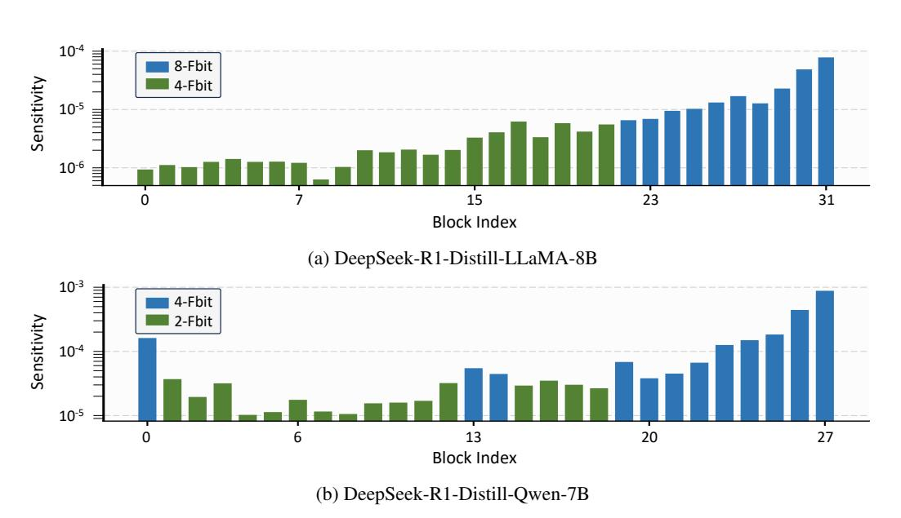
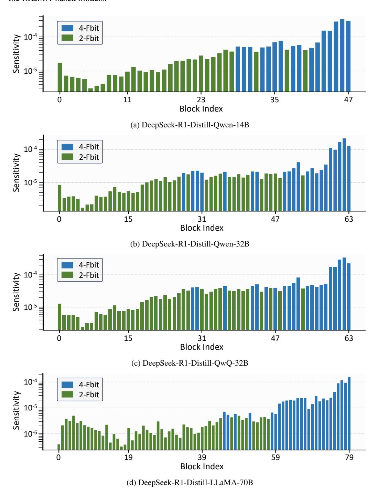

# B Additional Experiments

#### B.1 The Sensitivity of different Transformer Blocks

Figure 3: Sensitivity to quantization of KV Cache in different transformer blocks. Different colors represents different memory budgets.

We analyze the sensitivity and the memory allocation results across different models. For models with parameter size less than 10B, as shown in Figure [3,](#page-11-1) we observe that the deeper blocks tend to be more sensitive to quantization and receive a larger memory budget for the KV Cache. In addition, in the DeepSeek-R1-Distill-Qwen-7B model, the first block is much more sensitive than the other shallow blocks. Our memory allocation strategy accurately captures this feature, assigning a higher memory budget to the first block accordingly.

For larger models with parameter size over 10B, as shown in Figure [4,](#page-12-0) KV Cache in deeper blocks tend to be more sensitive than shallower blocks. We also observe that for the Qwen-based models, the first block exhibits a large sensitivity. In particular, the sensitivity of the first block is the largest

among the first fifteen blocks in different Qwen-based models. This phenomenon is not observed in the LLaMA-based models.

Figure 4: Sensitivity to quantization of KV Cache in different transformer blocks. Different colors represents different memory budgets.

## **C** Limitations

In this paper, we do not consider all of the attention mechanisms, such as the multi-head latent attention (MLA), which is quite different from the widely used Group-Query Attention (GQA).

Besides, we do not combine the proposed PM-KVQ with other system-level optimization techniques and inference engines, which yields for future work.

