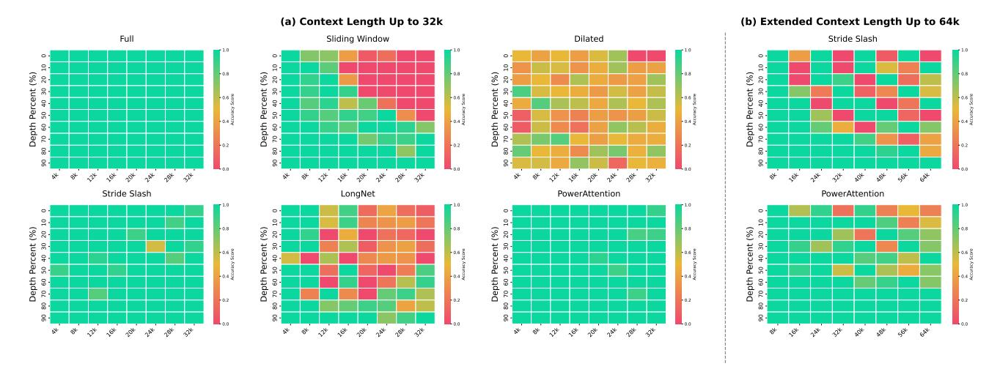

# 4. Experiments

We evaluate the performance of existing sparse attention designs and POWERATTENTION on LLMs in terms of both accuracy and efficiency. For accuracy, we assess model performance on language modeling, synthetic retrieval tasks, and long context benchmarks. For efficiency, we measure model performance during both the prefill and decoding phases.

#### 4.1. Setting

Implementation We use Qwen2-7B [\(Yang et al.,](#page-11-5) [2024a\)](#page-11-5), a pretrained model with 32K context length, as our base model. To better adapt the model to sparse attention patterns, we conduct continued pre-training on processed SlimPajama corpus [\(Soboleva et al.,](#page-10-11) [2023\)](#page-10-11) for 1B tokens. To effectively train the model with sparse attention patterns, we fine-tune the model on ChatQA 2 [\(Xu et al.,](#page-10-12) [2024\)](#page-10-12) data before evaluating on long context benchmarks. This ensures the training data contains dependencies beyond the local window, providing natural supervision signals for the model to learn and utilize its full receptive field. For hardware efficiency, we implement sparse attention using 256-token blocks to align with GPU compute cores' memory access pattern. To ensure a fair comparison across designs, we maintain consistent sparsity levels by fixing the maximum number of tokens each position can attend to, and employ the consistent patterns during both prefilling and decoding phases.

Baseline We evaluate the static sparse attention designs analyzed in Section [3,](#page-2-0) including sliding window attention, stride slash attention, dilated attention, LongNet, and POW-ERATTENTION. The specific configurations are as follows: For sliding window attention, we use a 9-block local window and 1 block of sink tokens. For stride slash attention, we configure a 6-block local window, 1 block of sink tokens, and 3 blocks of slash tokens. For dilated attention, we set the local window size to 20 blocks with a dilation rate of 1 block. For LongNet, we use segment lengths w = 8, 16, 32, 64, 128 blocks with corresponding dilation ratios r = 1, 2, 4, 8, 16. For POWERATTENTION, we employ a 5-block local window, 1 block of initial tokens, and 4 additional blocks of slash tokens distributed at power-of-2 intervals. See Appendix [D](#page-13-0) for more implementation details.

#### 4.2. Long Context Language Modeling

We first evaluate the language modeling perplexity of different static sparse attention methods on the PG19 test set [\(Rae](#page-10-13) [et al.,](#page-10-13) [2019\)](#page-10-13). The evaluation is conducted across four different sequence lengths, as shown in [1.](#page-4-1) All sparse attention methods maintain low perplexity scores up to 32K context length, demonstrating their ability to preserve strong language modeling capabilities while reducing computational costs. Notably, despite using the same number of attended tokens, different sparse attention designs vary in performance. StreamingLLM, POWERATTENTION, and stride slash attention achieve lower perplexity, while dilated attention and LongNet perform slightly worse. We attribute this gap to the discontinuous receptive fields in the latter two, which may hinder effective language modeling.

## 4.3. Retrieval-Based Evaluation

While local information suffices for low perplexity in language modeling, it inadequately assesses a model's ability to capture key information across the entire context. To evaluate how different static sparse attention designs affect the model's ability to capture context-wide information through their receptive fields, we evaluate them on the passkey retrieval [\(Mohtashami & Jaggi,](#page-9-14) [2023\)](#page-9-14) task. This requires the model's receptive field to seamlessly cover all positions and efficiently span the entire sequence within limited layers. To isolate training data effects, we fine-tune LLMs on the same synthetic passkey retrieval dataset. We also employ

Figure 3. Results on passkey retrieval with different attention patterns: (a) evaluation on context lengths up to 32k, and (b) comparison between stride slash attention and POWERATTENTION on extended context lengths up to 64k.

Table 2. Performance comparison of different static sparse attention patterns on RULER benchmark across different context lengths (4k-32k). The RULER benchmark consists of 13 tasks categorized into Needle-in-a-Haystack (NIAH), Variable Tracing (VT), Aggregation, and Question Answering (QA). Results show average scores for each category and overall performance across all 13 tasks.

| Method           |       | 4k    |       |       |       | 8k    |       |       |       | 16k   |       |       |       |       | 32k   |       |       |       |       |       |
|------------------|-------|-------|-------|-------|-------|-------|-------|-------|-------|-------|-------|-------|-------|-------|-------|-------|-------|-------|-------|-------|
|                  | NIAH  | VT    | Agg.  | QA    | Avg.  | NIAH  | VT    | Agg.  | QA    | Avg.  | NIAH  | VT    | Agg.  | QA    | Avg.  | NIAH  | VT    | Agg.  | QA    | Avg.  |
| Full Attention   |       |       |       |       |       |       |       |       |       |       |       |       |       |       |       |       |       |       |       |       |
| Vanilla          | 95.69 | 97.60 | 93.48 | 71.50 | 91.77 | 95.72 | 91.80 | 68.45 | 64.00 | 86.34 | 95.34 | 89.00 | 59.85 | 62.00 | 84.27 | 91.38 | 84.60 | 53.75 | 53.50 | 79.24 |
| Sparse Attention |       |       |       |       |       |       |       |       |       |       |       |       |       |       |       |       |       |       |       |       |
| Sliding Window   | 91.75 | 40.40 | 24.61 | 57.50 | 72.20 | 74.47 | 38.40 | 17.02 | 44.00 | 58.17 | 59.53 | 22.00 | 29.50 | 42.50 | 49.40 | 44.88 | 10.60 | 19.14 | 23.00 | 34.91 |
| Stride Slash     | 87.22 | 36.40 | 37.46 | 61.50 | 71.70 | 74.25 | 40.20 | 37.34 | 45.50 | 61.53 | 65.06 | 22.20 | 40.21 | 43.00 | 54.55 | 54.12 | 14.60 | 35.66 | 33.50 | 45.07 |
| Dilated          | 87.91 | 38.20 | 31.66 | 54.50 | 70.29 | 85.56 | 4.40  | 20.15 | 48.50 | 63.55 | 71.28 | 0.20  | 20.48 | 49.00 | 54.57 | 61.03 | 1.20  | 13.70 | 36.50 | 45.37 |
| LongNet          | 84.44 | 43.00 | 35.20 | 65.50 | 70.76 | 75.69 | 24.00 | 27.73 | 48.50 | 60.15 | 65.00 | 15.60 | 23.02 | 45.00 | 51.66 | 51.41 | 9.80  | 14.15 | 31.50 | 39.41 |
| POWERATTENTION   | 90.00 | 26.80 | 36.70 | 60.50 | 72.40 | 81.47 | 30.20 | 34.56 | 46.50 | 64.93 | 73.75 | 25.00 | 41.84 | 44.50 | 60.59 | 62.94 | 18.40 | 36.84 | 32.00 | 50.74 |

curriculum learning, gradually increasing sequence lengths from 4K to 32K with 200 steps per stage.

Figure 3 demonstrates that sparse attention performance aligns with our theoretical analysis of receptive field: sliding window performs well up to 12K tokens but degrades significantly at 16K and 32K lengths, failing to retrieve passkeys from initial 16K tokens at 32K length. With a window size of approximately 2K tokens, we estimate that information strength decays to near zero after propagating through 6 layers. Dilated attention captures only  $\sim 50\%$ input across all lengths, as its 5K window covers the 30K sequence within 6 layers but lacks adjacent-block aggregation in the last block. LongNet similarly suffers from gaps in its receptive field, failing to capture information at specific positions. Both stride slash attention and POWER-ATTENTION achieve full-sequence coverage within 6 layers, enabling successful 32K passkey retrieval. Notably, further evaluation at 64K sequence length shows that POWERAT- TENTION's exponential receptive field expansion achieves better performance than stride slash's quadratic approach, demonstrating the benefits of faster receptive field growth for ultra-long sequence processing.

#### 4.4. Long Context Benchmark Evaluation

To further validate that POWER ATTENTION is more effective for long sequence processing, we evaluate all baseline methods on the widely-used RULER benchmark (Hsieh et al., 2024). RULER is a challenging dataset consisting of 14 sub-tasks that assess models' effective context utilization across different difficulty levels. We adopt a practical hybrid architecture (Poli et al., 2023b; Lieber et al., 2024; Yang et al., 2025) that retains some full attention layers while varying sparse attention patterns in the remaining layers. To maximize the continuity of sparse attention layers, we keep 2 full attention layers for every 7 layers.

- (a) End-to-end inference latency of different attention methods with 16K∼128K input context and 1024 decoding steps.
- (b) Time consumption for each forward pass of the attention kernel under different methods with 16K∼128K input context.

Figure 4. Efficiency evaluation results on Qwen2-7B with a NVIDIA A800 GPU.

Table [2](#page-5-1) presents the performance comparison on RULER benchmark. Among all baseline methods, POWERATTEN-TION demonstrates superior performance by consistently achieving the highest scores across four different sequence lengths. Meanwhile, stride slash attention and LongNet show comparable performance, ranking below POWERAT-TENTION but above other baselines. These results align with our findings from the passkey retrieval task, demonstrating that well-designed sparse attention patterns can achieve larger receptive fields and better handle long sequences. All sparse attention methods show a noticeable performance gap compared to full attention, which can be attributed to the high sparsity ratio (up to 94% in sparse attention layers) we employ to simulate ultra-long sequence performance at 32K context length. Notably, the widely adopted sliding window pattern achieves the lowest accuracy. Given its prevalence in attention optimization methods [\(Arora et al.,](#page-8-11) [2024\)](#page-8-11), replacing sliding window with alternative designs may potentially yield further performance improvement.

#### 4.5. Efficiency Evaluation

To verify the inference efficiency of POWERATTENTION, we compare its latency against other methods. We exclude stride slash attention from this evaluation as it obviously has the same computational cost as POWERATTENTION.

End-to-end Latency POWERATTENTION achieves the highest speedup compared with three baseline methods: full attention, sliding window, and MInference. Notably, MInference is claimed be more efficient with FlashAttention-based

full attention during the decoding phase in the original paper, and we adopted this suggestion, applying MInference solely during the prefilling stage. Figure [4\(a\)](#page-6-1) shows the latency of different methods.

At a context length of 128K, POWERATTENTION delivers speedups of 3.0× and 1.3× over full attention and MInference in the prefilling phase, respectively. In the decoding phase, POWERATTENTION also demonstrates improvements, taking only 58% and 80% of the time required by these two methods. Consequently, POWERATTENTION offers a user experience that is nearly equivalent to that of sliding window attention.

Kernel Speedup To better illustrate the differences in time complexity among various attention methods, Figure [4\(b\)](#page-6-2) outlines the time taken for each attention forward pass. Due to POWERATTENTION's inherent O(N log2 N) time complexity, its growth rate is nearly as gradual as that of sliding window attention, which has linear time complexity. At a context length of 128K, POWERATTENTION is 5.3× faster than MInference and 21.6× faster than full attention in terms of kernel overhead. In longer input contexts, POW-ERATTENTION's attention inference overhead is expected to be superior to these baseline methods.

## 4.6. Probing of Information Flow

We also investigate LLMs to address the following questions of interest: (1) whether the inter-layer information flow, which is the foundation of the receptive field expansion discussed in Section [3.1,](#page-2-1) actually exists in the LLMs, and

Figure 5. Information flow probing result for various attention mechanisms on the 28-layer Qwen2-7B with 16K context length. The sequence is divided into 64 blocks (0 is at the beginning and 63 is at the end), each of which contains 256 tokens, as detailed in Appendix [C.](#page-12-2) Each pixel represents the strength of passkey information at a specific layer and block position; a brighter pixel indicates a higher possibility of extracting passkey information from that position. The classification accuracy of the final token block in the last layer is highlighted, as it directly determines the output token.

(2) whether our proposed training method enable LLMs to leverage this mechanism more effectively.

To interpret the hidden states propagated within the model, we employ a simple yet effective probing method: linear classifiers. For convenience, we design a straightforward passkey retrieval task, in which the model is given a long sequence input which includes a specific passkey (*e.g.*, "*Passkey is apple.*") at a fixed position. The passkey is sampled from 6 words (*i.e.*, *apple*, *grape*, etc.), and the remainder of the context is filled with grammatically correct, randomly generated sentences to a length of N = 16K. The model is asked to identify and extract the passkey from the context in the task. For each layer of the model, a logistic classifier is trained at each token position to map the hidden state to the corresponding target passkey. Finally, we collect the prediction accuracies of all classifiers as an indicator of whether passkey information is present at that location; if the state at a position is easily mapped to the corresponding label, it obviously includes the information, and vice versa. Appendix [C](#page-12-2) discusses our probing process in details and presents additional probing results for alternative methods post-training.

The probing results are shown in Figure [5,](#page-7-0) from which we could conclude that:

Inter-layer information flow inherently exists within LLMs. In the early layers of the unmodified model with full attention, passkey information is predominantly localized to token positions near the passkey. As inference progresses through the layers, the information range gradually expands forward throughout the hidden state. This suggests that even though full attention theoretically allows it to attend to any position in a single step, the attention heads still exhibit a degree of spatial locality. Specifically, they not only retrieve the original information at the passkey's location but also attend to and aggregate information from neighboring positions where earlier layers have accumulated relevant information. In sparse attentions, this phenomenon is even more evident: the receptive field of sliding window attention

expands progressively across layers at a linear rate, and the receptive field of POWERATTENTION, in contrast, exhibits phase transition-like jumps across layers, enabling information to be flowed in discrete leaps to power-differentiated positions at specific layers. This demonstrates that interlayer information flow is an inherent mechanism of LLMs.

POWERATTENTION effectively enhances the information flow mechanism. Neither the sliding window attention nor the untrained POWERATTENTION effectively retrieves the correct passkey, although the latter shows a slight advantage. However, after continued pretraining and finetuning, the model's information flow mechanism improves significantly, with the classification accuracy of the last token in the final layer increasing by 44% to achieve 100%. Visually, the post-training information flow image also exhibits clearer and more focused boundary. Combining our primary experimental results, we can attribute the post-training performance improvement to the enhancement of this mechanism.

