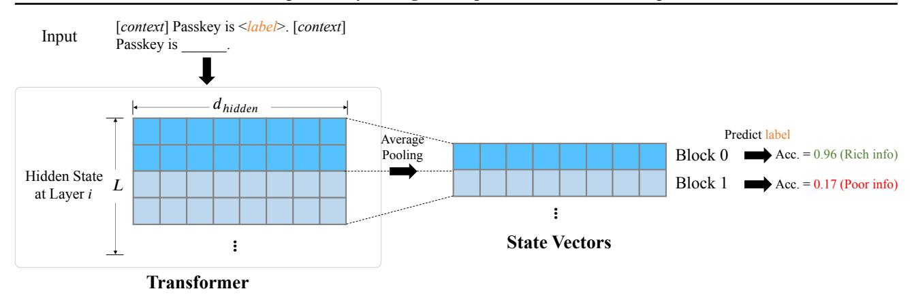

# C.1. Implementation

Figure 6 illustrates our approach for probing information flow. We feed long sequence retrieval tasks into LLMs, incorporating 6 different passkeys with equal frequencies: *apple*, *banana*, *cherry*, *grape*, *kiwi* and *lemon*; then we collect the

Figure 6. Implementation of our probing analysis on a sequence length of L. We employ a linear regression model to evaluate whether a specific block position within a given layer encodes sufficient information of the passkey (*i.e.*, "Rich info" or "Poor info").

hidden states from each layer, which are subsequently average-pooled at evenly spaced intervals, yielding state vectors with a dimensionality of dhidden. For each block within each layer, the state vectors from all samples are gathered and used to train a logistic regression model. In other words, with a 28-layer model and 64 sampling positions, we will perform 28 × 64 = 1792 training runs.

For the classification results, accuracy is directly calculated as the proportion of correctly identified input passkeys across all samples. With 6 distinct passkeys, if a state vector does not contain any passkey-related information, one would expect a trivial accuracy of 1 6 .

For retrieval tasks, we utilize the following prompt:

There is an important info hidden inside a lot of irrelevant text. Find it and memorize it. I will quiz you about the important information there.

The abhorrent round combs elevation. The dark roar tabulates event. [*irrelevant context up to* ∼*1K*] The pass key is apple. Remember it. apple is the pass key. [*irrelevant context up to* ∼*15K*]

What is the pass key? The pass key is

To ensure consistency and generalizability in decoding and analysis at the same relative position across different samples, we fix the passkey position at the 10% of the entire context. We implement all attention patterns using PyTorch's Flex Attention module, and conduct comparative testing on the same task dataset (N = 1200).

## C.2. Additional Results on Sliding Window Attention

To maintain consistency in controlled variables, we also conducted probing on the post-trained sliding window attention mechanism, as illustrated in Figure [7.](#page-14-0)

Interestingly, the model's performance in information flow degrades post-training, with accuracy declining from 0.48 to 0.37. We hypothesize this stems from overfitting during the training stage as described in Section [4.3.](#page-4-2) Notably, the model underperforms even on the task to which it overfits (Figure [3\)](#page-5-0). This observation may highlight fundamental limitations imposed by the inherently restricted receptive field of sliding window attention.

