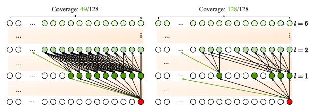

# **PowerAttention: Exponentially Scaling of Receptive Fields for Effective Sparse Attention**

 $\begin{array}{cccccccccccccccccccccccccccccccccccc$ 

### **Abstract**

Large Language Models (LLMs) face efficiency bottlenecks due to the quadratic complexity of the attention mechanism when processing long contexts. Sparse attention methods offer a promising solution, but existing approaches often suffer from incomplete effective context and/or require complex implementation of pipeline. We present a comprehensive analysis of sparse attention for autoregressive LLMs from the respective of receptive field, recognize the suboptimal nature of existing methods for expanding the receptive field, and introduce POWER ATTENTION, a novel sparse attention design that facilitates effective and complete context extension through the theoretical analysis. POWERATTENTION achieves exponential receptive field growth in d-layer LLMs, allowing each output token to attend to  $2^d$  tokens, ensuring completeness and continuity of the receptive field. Experiments demonstrate that Pow-ERATTENTION outperforms existing static sparse attention methods by  $5 \sim 40\%$ , especially on tasks demanding long-range dependencies like Passkey Retrieval and RULER, while maintaining a comparable time complexity to sliding window attention. Efficiency evaluations further highlight POWERATTENTION's superior speedup in both prefilling and decoding phases compared with dynamic sparse attentions and full attention  $(3.0 \times$ faster on 128K context), making it a highly effective and user-friendly solution for processing long sequences in LLMs.

Preprint.

(a) 6-Layer Receptive Field Expansion in Sliding Window (L) and PowerAttention (R)

(b) Theoretical Receptive Field Size and Experimental Retrieval Performance

Figure 1. Layer-wise receptive field analysis of sparse attention patterns. (a) illustrates the information flow across six layers with a simplified 128-block example, while (b) presents the quantitative evaluation on Qwen2-7B with 32K context length. The actual token retrieval capability closely matches the theoretical receptive field growth for both patterns. Within the maximum information propagation depth, POWERATTENTION's exponential growth in receptive field leads to significantly higher accuracy compared to sliding window's linear expansion. Detailed implementation is provided in Appendix A.

