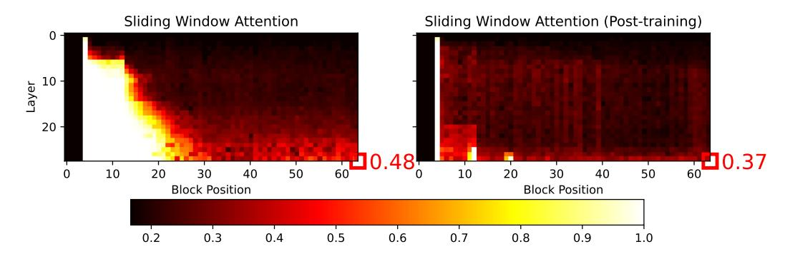

# <span id="page-13-0"></span>D. Implementation Details of Baseline Sparse Attention Patterns

We present the pseudo-code implementations of four baseline sparse attention patterns below. In our experiments, these patterns are implemented using the FlexAttention [\(Dong et al.,](#page-8-12) [2024\)](#page-8-12) library. Additionally, we provide Triton [\(Tillet et al.,](#page-10-15) [2019\)](#page-10-15) implementations combined with RingAttention [\(Liu et al.,](#page-9-17) [2024\)](#page-9-17) for sequence-parallel training, enabling scaling to longer sequences.



Figure 7. Additional results of information flow probing on sliding window attention.

## Algorithm 2 Sliding window attention in Python-like pseudo-code

```
# q_idx [M, 1]: The indices of the query
# kv_idx [1, N]: The indices of the key-value
# block_size (int): The size of the CUDA block
# window_size (int): The block size of the sliding window
# build sink token mask
mask_sink = kv_idx < block_size # [1, N]
# build sliding window mask
blk_qk = q_idx // block_size - kv_idx // block_size # [M, N]
mask_window = blk_qk < window_size # [M, N]
# ensure causality
causal = q_idx >= kv_idx # [M, N]
# combine all masks
mask = causal & (mask_window | mask_sink) # [M, N]
```

## <span id="page-14-0"></span>Algorithm 3 Stride slash attention in Python-like pseudocode

```
# q_idx [M, 1]: The indices of the query
# kv_idx [1, N]: The indices of the key-value
# block_size (int): The size of the CUDA block
# window_size (int): The block size of the sliding window
# stride_size (int): The stride interval between blocks for stride slash
# build sink token mask
mask_sink = kv_idx < block_size # [1, N]
# build sliding window mask
blk_qk = q_idx // block_size - kv_idx // block_size # [M, N]
mask_window = blk_qk < window_size # [M, N]
# build stride slash mask
mask_slash = blk_qk%stride_size==0
# ensure causality
causal = q_idx >= kv_idx # [M, N]
# combine all masks
mask = causal & (mask_window | mask_slash | mask_sink) # [M, N]
```

#### Algorithm 4 Dilated attention in Python-like pseudo-code

```
# q_idx [M, 1]: The indices of the query
# kv_idx [1, N]: The indices of the key-value
# block_size (int): The size of the CUDA block
# window_size (int): The block size of the sliding window
# build dilated mask
blk_qk = q_idx // block_size - kv_idx // block_size # [M, N]
mask_dilated = (blk_qk&1==0) & (blk_qk<window_size) # [M, N]
# ensure causality
causal = q_idx >= kv_idx # [M, N]
# combine all masks
mask = causal & (mask_window | mask_dilated) # [M, N]
```

#### Algorithm 5 LongNet in Python-like pseudo-code

```
# q_idx [M, 1]: The indices of the query
# kv_idx [1, N]: The indices of the key-value
# block_size (int): The size of the CUDA block
# initialize
q_idx_b=q_idx//block_size
kv_idx_b=kv_idx//block_size
temp1_qk=q_idx_b|kv_idx_b
temp2_qk=q_idx_b^kv_idx_b
# s=8 block, r=1
mask_1 = temp2_qk<8
# s=16 block, r=2
mask_2=(temp2_qk<16) & (temp1_qk&1==0)
# s=32 block, r=4
mask_3=(temp2_qk<32) & (temp1_qk&3==0)
# s=64 block, r=8
mask_4=(temp2_qk<64) & (temp1_qk&7==0)
# s=128 block, r=16
mask_5=(temp2_qk<128) & (temp1_qk&15==0)
# ensure causality
causal = q_idx >= kv_idx # [M, N]
# combine all masks
mask = causal & (mask_1|mask_2|mask_3|mask_4|mask_5) # [M, N]
```