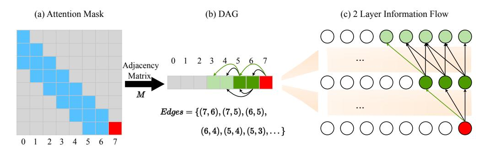
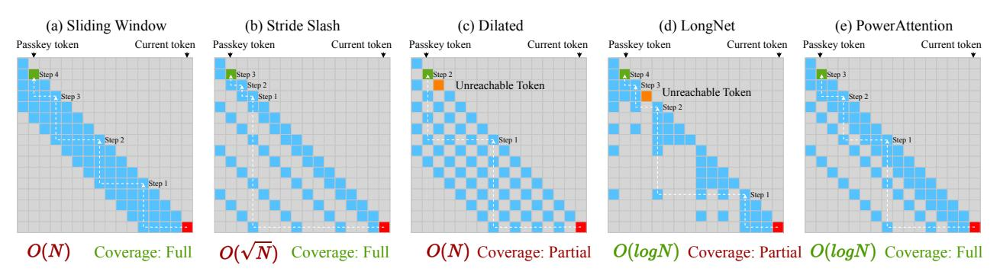

# 3. Methodology

## 3.1. Problem Formulation

LLM's decoder layer leverages the attention mechanism to incorporate contextual information into the token generation process, as formally expressed by the following equation:

$$\mathbf{o}_{i} = \sum_{j \in \mathcal{A}_{i}} \operatorname{softmax}\left(\frac{q_{i} k_{j}^{T}}{\sqrt{d_{k}}}\right) v_{j} \tag{1}$$

where oi is computed as a weighted sum of value vectors (vj ) from the attended tokens (j ∈ Ai), with weights determined by similarity scores between qi and kj . We define the *receptive field* as the set of all tokens that can influence a given token's representation. Specifically, the single-layer receptive field of token i is Ai , which directly influences the oi within the current layer. While full attention allows every token to attend to all previous tokens (Ai = {j ∈ Z ∗ |j ≤ i}), sparse attention strategically limits attention to a subset of tokens to reduce computational costs. However, this restriction poses the risk of omitting crucial

information which lies outside the receptive field.

We formulate token selection in sparse attention as the problem of finding an optimal edge set in a graph, where nodes represent tokens at specific positions. Sparse attention masks can be naturally interpreted as adjacency matrices, as illustrated in Figure [2.](#page-3-0) Since modern LLMs adopt autoregressive mechanism, the graph is a directed acyclic graph (DAG) where each token can attend only to earlier ones. Within a single layer, a given token's receptive field consists of all its successor nodes in the graph.

Although different sparse patterns at comparable sparsity result in similar out-degree of nodes (*i.e.*, the size of singlelayer receptive field), well-designed patterns can achieve larger effective receptive fields across multiple layers. Consider the internal information flow within an LLM during a single forward pass: at layer l, the token representation at position i receives information from tokens within its single-layer receptive field via self-attention, which is then propagated through the feed-forward layer to the next layer. Through this process, oi at layer l effectively relays information from previous tokens, serving as an intermediate node that propagates aggregated information to tokens that attend to i in subsequent layers. For instance, in a twolayer scenario, when token x attends to y in the second layer, y's representation already encodes first-layer information, thereby expanding x's receptive field effectively. Thus, in multi-layer LLMs, the receptive field of token x extends beyond immediate successors to encompass all DAG-accessible nodes originating from x. We conduct an empirical study on information flow in Section [4.6.](#page-6-0)

Therefore, under the constraint of preserving the computational efficiency, we can reformulate the problem of finding the optimal sparse attention design as finding an edge set in the DAG that maximizes node reachability in l steps under fixed maximum out-degree constraints (l represents the number of model layers). For nodes beyond a distance of l, the model theoretically cannot access their information when predicting the next token. Consequently, if these tokens contain key information, the model performance will degrade significantly.

#### 3.2. Limitations of Existing Sparse Attention

We analyze several static sparse attention designs: (1) Sliding window [\(Xiao et al.,](#page-10-6) [2024;](#page-10-6) [Han et al.,](#page-9-9) [2024\)](#page-9-9), which incorporates attention sink tokens from the sequence start in addition to the local window; (2) Stride slash attention [\(Child](#page-8-7) [et al.,](#page-8-7) [2019\)](#page-8-7), which places slash tokens at equal intervals across the context length, beyond the local window and sink tokens; (3) Dilated attention [\(Beltagy et al.,](#page-8-5) [2020\)](#page-8-5), which employs dilated local windows; (4) LongNet [\(Ding et al.,](#page-8-8) [2023\)](#page-8-8), which constructs the attention mask by overlaying multiple masks with geometrically increasing block sizes

(I) Modeling Attention Patterns as DAG

(II) Receptive Field Analysis for Sparse Attention Patterns

Figure 2. (I) Modeling Attention Patterns as DAG: the attention mask serves as the adjacency matrix of a DAG, where edges represent token connections across layers, and the shortest path length indicates the minimum number of layers required for information flow between tokens. (II) Receptive Field Analysis for Sparse Attention Patterns: white lines show the shortest path to reach passkey tokens, with path length complexity O(f(N)) for distance N and coverage indicating token accessibility.

#### and dilated intervals;

We analyze the shortest path from the last token to reach a passkey token in different attention designs. As shown in Figure 2, in sliding window attention, each token can reach the farthest token within its window until the passkey token appears in the window. To reach a token at distance N, it requires O(N) layers. Under stride slash attention, a token first reaches the nearest slash token to its target, then iteratively reaches the farthest token within each window until the passkey token appears. With strategically placed slash tokens, reaching a token at distance N only requires  $O(\sqrt{N})$  layers. Both dilated attention and LongNet have unreachable tokens, making them impossible to retrieve passkeys at certain positions. In dilated attention, all tokens at distances 2k + 1 from the current token are unreachable. Despite having a window twice as large as sliding window at the same sparsity, it can only access 50% of the tokens. LongNet requires O(loqN) layers to reach a token at distance N, but cannot access certain tokens, such as the last token in each segment. Therefore, existing methods often fail to achieve both fast expansion of the receptive field and

complete token coverage

#### 3.3. PowerAttention

Based on our modeling of sparse attention, we propose POW-ERATTENTION, a sparse attention design that exponentially expands the receptive field. Our edge set construction ensures that in a DAG, any node can reach all nodes within a distance of n in at most  $\log n$  steps, while maintaining a maximum out-degree of  $\log n$ . This is achieved by connecting each node only to nodes whose index differences are powers of 2, which is transformed to a sparse pattern where each token attends only to positions at power-of-2 distances.

Under our pattern, we guarantee that the receptive field grows exponentially with the maximum distance d, while capturing information from all tokens within a distance of  $2^d$ . The theoretical proof of this property is provided in Appendix B. As for implementation, POWERATTENTION introduces no additional computational overhead. We present its pseudo-code implementation in Algorithm 1.

