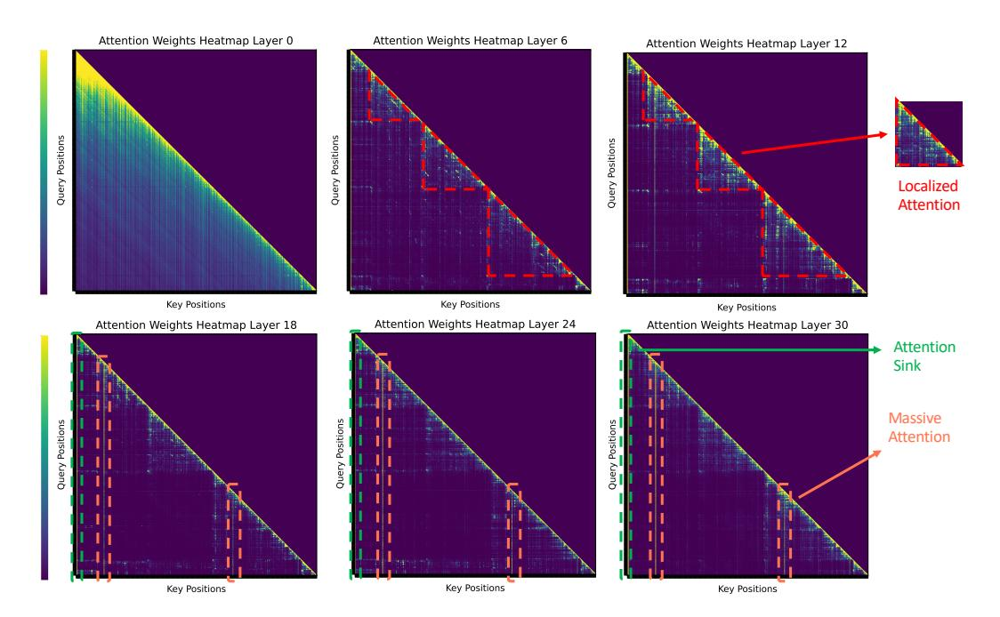

# **1 Introduction**

Large language models (LLMs) [\(Achiam et al., 2023;](#page-9-0) [Touvron et al., 2023a](#page-11-0)[;b;](#page-11-1) [Jiang et al.,](#page-10-0) [2023\)](#page-10-0) are integral to various natural language processing applications, including dialogue systems [\(Chiang et al., 2023\)](#page-9-1), document summarization [\(Fabbri et al., 2019a\)](#page-9-2), and code completion [\(Roziere et al., 2023\)](#page-10-1). These models have recently been scaled up to handle long contexts [\(Fu et al., 2024;](#page-9-3) [Ding et al., 2024;](#page-9-4) [Zhu et al., 2023;](#page-11-2) [Chen et al., 2023\)](#page-9-5), with GPT-4 processing up to 128K tokens and Gemini-pro-1.5 handling 1M tokens. However, scaling LLMs to extremely long contexts naturally leads to a significant delay due to the quadratic computation of attention over long contexts. A common solution to mitigate such inference delays involves caching the key and value states (KV) of previous tokens [\(Waddington](#page-11-3) [et al., 2013\)](#page-11-3), with the trade-off of requiring extensive GPU memory storage. For instance, maintaining a KV cache for 100K tokens in LLaMA-2 7B requires over 50GB of memory, while a 2K context requires less than 1GB of memory [\(Wu et al., 2024\)](#page-11-4).

To tackle these memory constraints, recent studies have explored the optimization of KV caching, including approaches such as low-rank decomposition of the KV cache [\(Dong et al.,](#page-9-6) [2024\)](#page-9-6) or pruning non-essential KV cache [\(Zhang et al., 2024;](#page-11-5) [Li et al., 2024;](#page-10-2) [Ge et al., 2023\)](#page-10-3). Notably, it has been shown that maintaining merely 20% of the KV cache can preserve a substantial level of performance [\(Zhang et al., 2024\)](#page-11-5). Moreover, extreme compression of the

Figure 1: Illustration of PyramidKV compared with existing KV cache compression methods. (a) Full KV has all tokens stored in the KV cache in each layer; cache size increases as the input length increases. (b) StreamingLLM [\(Xiao et al., 2023\)](#page-11-6) only keeps few initial tokens with a fixed cache size in each layer. (c) SnapKV [\(Li et al., 2024\)](#page-10-2) and H2O [\(Zhang et al.,](#page-11-5) [2024\)](#page-11-5) keep a fixed cache size across Transformer layers, and their selection is based on the attention score. (d) PyramidKV maintains pyramid-like cache sizes, allocating more cache budget to lower layers and less to higher layers. This approach to KV cache selection better aligns with the increasing attention sparsity observed in multi-layer Transformers ([§3\)](#page-2-0).

KV cache for tasks of longer contexts (e.g., retrieval augmented generation or RAG for short) can drastically improve efficiency and further reduce resource use. However, questions about the universal applicability of these strategies across all layers of an LLM remain open. (1) *Are these KV cache strategies applicable to all layers?* (2) *Is it computationally efficient to use the same KV cache size across layers as previous studies have done?* These considerations suggest a need for an in-depth, more nuanced understanding of KV cache optimization in LLMs.

To examine these questions, we aim to systematically investigate the design principles of the KV cache compression across different layers, specifically tailored to the behaviors of the attention mechanism. We first investigate how information flow is aggregated via attention mechanisms across different layers in multi-document question answering (QA), a classic task involving long contexts. Our analysis identifies a notable transition of attention distribution from a broad coverage of global contexts to a narrow focus of local tokens over layers in LLMs. This pattern suggests an aggregated information flow where information is initially gathered broadly and subsequently narrowed down to key tokens, epitomizing the massive attention phenomenon. Our findings provide unique insights beyond the previously documented "massive activation" [\(Sun et al., 2024\)](#page-11-7) that very few activations exhibit significantly larger values than others when calculating multi-head attention in LLMs and "attention sink" [\(Xiao et al., 2023\)](#page-11-6) that keeping the KV of initial tokens will largely recover the performance of window attention.

Building on these insights on how information flows are aggregated through a pyramid pattern, we design a novel and effective KV cache pruning approach that mirrors the geometric shape, named PyramidKV. As shown in [Figure 1,](#page-1-0) unlike the fixed-and-same length KV cache pruning common in prior works [\(Zhang et al., 2024;](#page-11-5) [Ge et al., 2023;](#page-10-3) [Li et al.,](#page-10-2) [2024\)](#page-10-2), PyramidKV allocates more KV cache to the lower layers where information is more dispersed and each KV holds less information while reducing the KV cache in higher layers where information becomes concentrated in fewer key tokens. To the best of our knowledge, PyramidKV is the first KV cache compression method with varied cache retention across layers, tailoring cache amounts to the informational needs of each layer.

We conducted comprehensive experiments on LongBench [\(Bai et al., 2023\)](#page-9-7) using 17 datasets across various tasks and domains with three backbone models (LLaMa-3-8B-Instruct, LLaMa-3-70B-Instruct and Mistral-7B [\(Jiang et al., 2023\)](#page-10-0)). The results show that PyramidKV preserves performance using just 12.0% of the KV cache (KV Cache size = 2048) on the LongBench benchmark and significantly outperforms other methods in extreme conditions, retaining only 0.7% of the KV cache. Moreover, PyramidKV outperforms baseline models (H2O [\(Zhang et al., 2024\)](#page-11-5), SnapKV [\(Li et al., 2024\)](#page-10-2), StreamingLLM [\(Xiao et al., 2023\)](#page-11-6)) across all tested cache sizes (64, 96, 128, 256), with its advantages most pronounced at smaller

Figure 2: Attention patterns of retrieval-augmented generation across layers in LlaMa [\(Tou](#page-11-0)[vron et al., 2023a](#page-11-0)[;b\)](#page-11-1) reveal that in the lower layers, the model exhibits a broad-spectrum mode of attention, distributing attention scores uniformly across all content. In the middle layers, attention becomes more localized within each document, indicating refined information aggregation (dotted red triangular shapes in layers 6 and 10). This culminates in the upper layers, where "massive attention" focuses on a few key tokens (concentrated attention bars after layer 18), efficiently extracting essential information for answers.

cache sizes. In the Needle In A Haystack experiment, PyramidKV effectively maintains the long-context comprehension in LLMs, outperforming than competing methods. Remarkably, with PyramidKV, retaining only 128 KV cache entries allows the LLaMa-3-70B-Instruct model to achieve 100.0 Acc. performance, matching the performance of a full KV cache.

