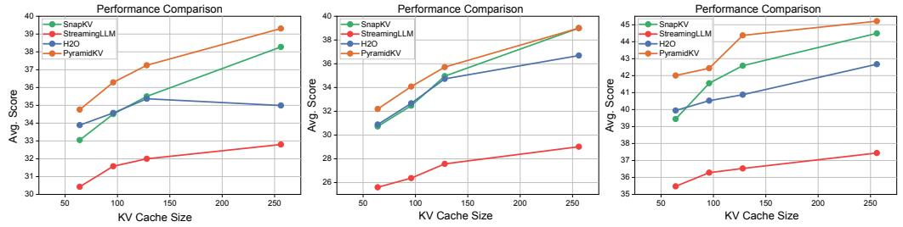
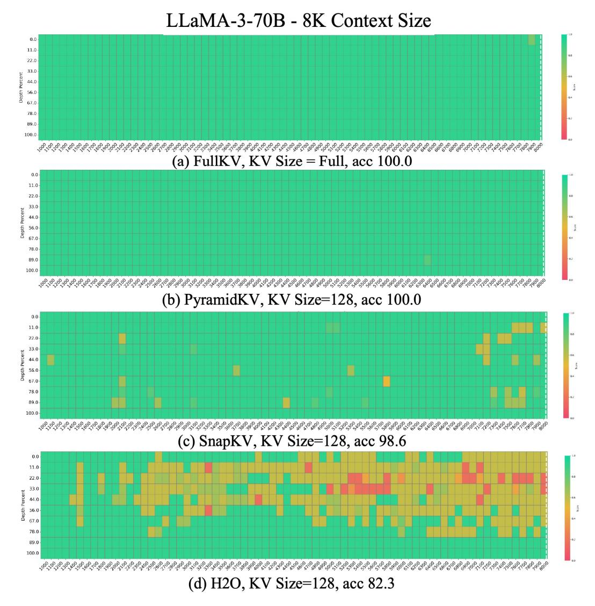

# **5.2 Main Results**

The evaluation results from LongBench [\(Bai et al., 2023\)](#page-9-7) are shown in [Table 1](#page-6-0) and [Figure 3.](#page-6-1) In [Figure 3,](#page-6-1) we report the average score across datasets for 64, 96, 128, and 256 case sizes. In [Table 1,](#page-6-0) we report the results for two different KV cache sizes with 64 and 2048. These two sizes represent two distinct operational scenarios—the memory-efficient scenario and the

Figure 3: The evaluation results from LongBench (Bai et al., 2023) across 64, 96, 128 and 256 cache sizes at LLaMa-3-8B-Instruct (Left), Mistral-7B-Instruct (Middle) and LLaMa-3-70B-Instruct (Right). The evaluation metrics are the average score of LongBench across datasets. PyramidKV outperforms H2O (Zhang et al., 2024), SnapKV (Li et al., 2024) and StreamingLLM (Xiao et al., 2023), especially in small KV cache sizes.

|             | Single                | -Docum                |                       |                      | i-Documer      |                       |                | nmariza        |                |                | -shot Le              | 0                     | Synt  | hetic          | Co    | ode    |       |
|-------------|-----------------------|-----------------------|-----------------------|----------------------|----------------|-----------------------|----------------|----------------|----------------|----------------|-----------------------|-----------------------|-------|----------------|-------|--------|-------|
| Method      | NrtvQA                | Qasper                | MEen                  | HorpotQ A | 2WikiMQ!       | Musique               | GovReport      | QMSum          | MultiNew       | TREC           | TriviaQA              | SAMSum                | PCoun | PRE            | rec   | RB-P   | Avg.  |
|             | 18409                 | 3619                  | 4559                  | 9151                 | 4887           | 11214                 | 8734           | 10614          | 2113           | 5177           | 8209                  | 6258                  | 11141 | 9289           | 1235  | 4206   |       |
|             |                       |                       |                       |                      |                | LlaMa                 | -3-8B-Instr    | uct, KV S      | ize = Full     |                |                       |                       |       |                |       |        |       |
| FKV         | 25.70                 | 29.75                 | 41.12                 | 45.55                | 35.87          | 22.35                 | 25.63          | 23.03          | 26.21          | 73.00          | 90.56                 | 41.88                 | 4.67  | 69.25          | 58.05 | 50.77  | 41.46 |
|             |                       |                       |                       |                      |                | LlaM                  | a-3-8B-Inst    | ruct, KV       | Size = 64      |                |                       |                       |       |                |       |        |       |
| SKV         | 19.86                 | 9.09                  | 27.89                 | 37.34                | 28.35          | 18.17                 | 15.86          | 20.80          | 16.41          | 38.50          | 85.92                 | 36.32                 | 5.22  | 69.00          | 51.78 | 48.38  | 33.05 |
| H2O         | 20.80                 | 11.34                 | 27.03                 | 37.25                | 30.01          | 17.94                 | 18.29          | 21.49          | 19.13          | 38.00          | 84.70                 | 37.76                 |       | 69.33          |       |        |       |
| SLM         | 17.44                 | 8.68                  | 22.25                 | 35.37                | 31.51          | 15.97                 | 15.46          | 20.06          | 14.64          | 38.00          | 72.33                 | 29.10                 |       | 69.50          |       |        |       |
| Ours        | 21.13                 | 14.18                 | 30.26                 | 35.12                | 23.76          | 16.17                 | 18.33          | 21.65          | 19.23          | 58.00          | 88.31                 | 37.07                 | 5.23  | 69.50          | 52.61 | 45.74  | 34.76 |
|             |                       |                       |                       |                      |                | LlaMa                 | -3-8B-Instri   |                |                | 1              |                       |                       |       |                |       |        |       |
| SKV         | 25.86                 | 29.55                 | 41.10                 | 44.99                | 35.80          | 21.81                 | 25.98          | 23.40          | 26.46          | 73.50          | 90.56                 | 41.66                 |       | 69.25          |       |        |       |
| SLM         | 21.71                 | 25.78                 | 38.13                 | 40.12                | 32.01          | 16.86                 | 23.14          | 22.64          | 26.48          | 70.00          | 83.22                 | 31.75                 |       | 68.50          |       |        |       |
| H2O Ours | 25.56 25.40        | 26.85 <b>29.71</b> | 39.54 40.25        | 44.30 44.76       | 32.92 35.32 | 21.09 <b>21.98</b> | 24.68 26.83 | 23.01 23.30 | 26.16 26.19 | 53.00 73.00 | 90.56 90.56        | 41.84 <b>42.14</b> |       | 69.25 69.25 |       |        |       |
|             |                       |                       |                       |                      |                |                       | al-7B-Instru   | ict. KV S      | ize = Full     |                |                       |                       |       |                |       |        |       |
| FKV         | 26.90                 | 33.07                 | 49.20                 | 43.02                | 27.33          | 18.78                 | 32.91          | 24.21          | 26.99          | 71.00          | 86.23                 | 42.65                 | 2.75  | 86.98          | 56 96 | 54 52  | 42 71 |
| 1111        | 20.70                 | 00.07                 | 17.20                 | 10.02                | 27.00          |                       | ral-7B-Instr   |                |                | 71.00          | 00.20                 | 12.00                 | 2 0   | 00.70          | 00.70 | 01.02  | 12.71 |
| SKV         | 16.94                 | 17.17                 | 39.51                 | 36.87                | 22.26          | 15.18                 | 14.75          | 20.35          | 21.45          | 37.50          | 84.16                 | 37.28                 | 4.50  | 61.13          | 12.40 | 28 11  | 20.72 |
| SLM         | 15.01                 | 13.84                 | 28.74                 | 30.97                | 24.50          | 13.42                 | 13.25          | 19.46          | 19.17          | 35.50          | 76.91                 | 29.61                 |       | 27.33          |       |        |       |
| H2O         | 18.19                 | 19.04                 | 37.40                 | 30.18                | 22.22          | 13.77                 | 16.60          | 21.52          | 21.98          | 37.00          | 81.02                 | 38.62                 |       | 66.03          |       |        |       |
| Ours        | 20.91                 | 20.21                 | 39.94                 | 33.57                | 22.87          | 15.70                 | 17.31          | 21.23          | 21.41          | 54.00          | 81.98                 | 36.96                 |       | 60.83          |       |        |       |
|             |                       |                       |                       |                      |                | Mistra                | ıl-7B-Instru   | ct, KV Si      | ze = 2048      |                |                       |                       |       |                |       |        |       |
| SKV         | 25.89                 | 32.93                 | 48.56                 | 42.96                | 27.42          | 19.02                 | 26.56          | 24.47          | 26.69          | 70.00          | 86.27                 | 42.57                 | 5.50  |                |       |        | 41.56 |
| SLM         | 20.31                 | 26.64                 | 45.72                 | 35.25                | 24.31          | 12.20                 | 27.47          | 21.57          | 24.51          | 68.50          | 71.95                 | 31.19                 |       | 22.56          |       |        |       |
| H2O         | 25.76                 | 31.10                 | 49.03                 | 40.76                | 26.52          | 17.07                 | 24.81          | 23.64          | 26.60          | 55.00          | 86.35                 | 42.48                 |       | 88.15          |       |        |       |
| Ours        | 25.53                 | 32.21                 | 48.97                 | 42.26                | 27.50          | 19.36                 | 26.60          | 23.97          | 26.73          | 71.00          | 86.25                 | 42.94                 | 4.50  | 87.90          | 55.12 | 47.21  | 41.63 |
|             |                       |                       |                       |                      |                |                       | 3-70B-Inst     |                |                |                |                       |                       |       |                |       |        |       |
| FKV         | 27.75                 | 46.48                 | 49.45                 | 52.04                | 54.90          | 30.42                 | 32.37          | 22.27          | 27.58          | 73.50          | 92.46                 | 45.73                 | 12.50 | 72.50          | 40.96 | 63.91  | 46.55 |
|             |                       |                       |                       |                      |                |                       | -3-70B-Inst    |                |                |                |                       |                       |       |                |       |        |       |
| SKV         | 23.92                 | 31.09                 | 36.54                 | 46.66                | 50.40          | 25.30                 | 18.05          | 21.11          | 19.79          | 41.50          | 91.06                 | 40.26                 |       | 72.50          |       |        |       |
| SLM         | 22.07                 | 23.53                 | 27.31                 | 43.21                | 51.66          | 23.85                 | 16.62          | 19.74          | 15.20          | 39.50          | 76.89                 | 33.06                 |       | 72.50          |       |        |       |
| H2O         | 25.45                 | 34.64                 | 33.23                 | 48.25                | 50.30          | 24.88                 | 20.03          | 21.50          | 21.39          | 42.00          | 90.36                 | 41.58                 |       | 71.50          |       |        |       |
| Ours        | 25.47                 | 36.71                 | 42.29                 | 47.08                | 46.21          | 28.30                 | 20.60          | 21.62          | 21.62          | 64.50          | 89.61                 | 41.28                 | 12.50 | 72.50          | 45.54 | 36.30  | 42.01 |
| CICI        | 07.50                 | 45.10                 | 47.01                 | <b>=2</b> 00         |                |                       | 3-70B-Instr    |                |                |                | 02.20                 | 45.50                 | 10.00 | <b>50.5</b> 0  | 44 85 | co. a= | 16.00 |
| SKV         | 26.73                 | 45.18                 | 47.91                 | 52.00                | 55.24          | 30.48                 | 28.76          | 22.35          | 27.31          | 72.50          | 92.38                 | 45.58                 |       | 72.50          |       |        |       |
| SLM H2O  | 26.69 <b>27.67</b> | 41.01 <b>46.51</b> | 35.97 <b>49.54</b> | 46.55 51.49       | 52.98 53.85 | 25.71 29.97        | 27.81 28.57 | 20.81 22.79 | 27.16 27.53 | 69.00 59.00 | 91.55 <b>92.63</b> | 44.02 45.94        |       | 72.00 72.50 |       |        |       |
| Ours        | 27.22                 | 46.19                 | 48.72                 | 51.49                | 54.56          | 31.11                 | 29.76          | 22.79          | 27.33          | 73.50          | 91.88                 | 45.47                 |       | 72.50          |       |        |       |
|             |                       | 10.17                 | 10.72                 | 31.02                | 01.00          | 51.11                 |                | 00             |                |                | ,1.00                 | 10.17                 | 12.00 |                | 11.00 | 07.12  |       |

Table 1: Performance comparison of PyramidKV (Ours) with SnapKV (SKV), H2O, StreamingLLM (SLM) and FullKV (FKV) on LongBench for LlaMa-3-8B-Instruct, Mistral-7B-Instruct and LlaMa-3-70B-Instruct. PyramidKV generally outperforms other KV Cache compression methods across various KV Cache sizes and LLMs. The performance strengths of PyramidKV are more evident in small KV Cache sizes (i.e. KV Size = 64).

performance-preserving scenario, respectively for a trade-off between memory and model performance. In Appendix N, we report results of KV cache sizes with 64, 96, 128 and 2048.

Overall, PyramidKV preserves the performance with only 12% of the KV cache and it consistently surpasses other method across a range of KV cache sizes and different backbone models, with its performance advantages becoming particularly pronounced in memory-

Figure 4: Results of the Fact Retrieval Across Context Lengths ("Needle In A HayStack") test in **LlaMa-3-70B-Instruct** with **8k** context size in **128** KV cache size. The vertical axis of the table represents the depth percentage, and the horizontal axis represents the length.

constrained environments where only about 0.8% of the KV cache from the prompt is retained. Upon examining specific tasks, PyramidKV demonstrates a notably superior performance on the TREC task, a few-shot question answering challenge. This suggests that the model effectively aggregates information from the few-shot examples, highlighting the potential for further investigation into in-context learning tasks.

Notably, we initially observe the pyramidal attention patterns from the visualization analysis on the multi-document QA task [\(Figure 2\)](#page-2-1), but the pyramid heuristic has demonstrated its effectiveness on a range of other LongBench tasks (e.g., single-document QA, In-Context Learning), suggesting its promising generalizability beyond multi-document QA.

The performance advantage of PyramidKV increases as the KV cache memory decreases. By focusing on optimizing budget allocation across layers, PyramidKV accurately allocates resources in memory-constrained scenarios, ensuring that retained information is effectively preserved to maintain model performance. Moreover, as in long bench results shown in

[Table 1,](#page-6-0) even in the performance-preserving scenario (i.e., KV cache size = 2048), PyramidKV improves the performance over baseline methods and even outperforms FullKV.

Among the 16 datasets, the tasks where our proposed method performs slightly worse than the baseline are mostly saturated (e.g., HotpotQA, Musique, etc under the LlaMa-3- 8B-Instruct setting with KV Size = 64, as shown in Table 1). In these cases, our method is only marginally inferior to the baseline and remains competitive. Conversely, on tasks with greater potential for improvement (e.g., Qasper, MF-en, TREC, TriviaQA, etc under the same setting), our method significantly outperforms the baseline. Consequently, the overall average performance of our method surpasses that of the baselines. Notably, these tasks include several In-Context Learning tasks (i.e., TREC), our method enjoys best performance gain at In-Context Learning tasks.

### **5.3 Discussion and Insights**

### *5.3.1 PyramidKV Preserves the Long-Context Understanding Ability*

We conduct the "Fact Retrieval Across Context Lengths" (Needle In A Haystack) experiment [\(Liu et al., 2023a;](#page-10-12) [Fu et al., 2024\)](#page-9-3), which is a dataset designed to test whether a model can find key information in long input sequences, to evaluate the in-context retrieval capabilities of LLMs when utilizing various KV cache compression methods. For this purpose, we employ **LlaMa-3-70B-Instruct** as our base, with context lengths extending up to 8k. We compared several KV cache compression techniques (PyramidKV, SnapKV [\(Li et al., 2024\)](#page-10-2), and H2O [\(Zhang et al., 2024\)](#page-11-5)) at cache sizes of **128** and full cache. The results, presented in [Figure 4](#page-7-0) [1](#page-8-0) . The results demonstrate that with only 128 KV cache retained, PyramidKV effectively maintains the model's ability to understand short contexts, and shows only modest degradation for longer contexts. In contrast, other KV cache compression methods significantly hinder the performance of LLMs. Notably, for the larger model (**LlaMa-3-70B-Instruct**), PyramidKV achieves 100.0 Acc. performance, matching the results of FullKV, thereby demonstrating its ability to preserve long-context comprehension with a substantially reduced KV cache. We adopt the haystack setting of haystack formed from a long corpus for the Needle In A Haystack task as [Wu et al.](#page-11-4) [\(2024\)](#page-11-4).

#### *5.3.2 PyramidKV Significantly Reduces Memory with Limited Performance Drop*

In this section, we study how sensitive the methods are with different sizes of KV cache. We report the KV cache memory reduction in Table [2.](#page-8-1) We evaluate the memory consumption of LLaMa-3-8B-Instruct. Specifically, we evaluate the memory consumption of all methods with a fixed batch size of 1, a sequence length of 8192, and model weights in fp16 format. We observe that PyramidKV substantially reduces the KV cache memory across different numbers of cache sizes. We also present that the allocation strategy and score-based selection add minimal complexity in the inference phase as [Appendix L.](#page-20-1)

| cache size | Memory | Compression Ratio | QMSum | TREC  | TriviaQA | PCount | PRe   | Lcc   |
|------------|--------|-------------------|-------|-------|----------|--------|-------|-------|
| 512        | 428M   | 6.3%              | 22.80 | 71.50 | 90.61    | 5.91   | 69.50 | 58.16 |
| 1024       | 856M   | 12.5%             | 22.55 | 71.50 | 90.61    | 5.91   | 69.50 | 58.16 |
| 2048       | 1712M  | 25.0%             | 22.55 | 72.00 | 90.56    | 5.58   | 69.25 | 56.79 |
| Full       | 6848M  | 100.0%            | 23.30 | 73.00 | 90.56    | 5.22   | 69.25 | 58.76 |

Table 2: Memory reduction effect and benchmark result by using PyramidKV. We conducted a comparison of memory consumption between the Llama-3-8B-Instruct model utilizing the Full KV cache and the Llama-3-8B-Instruct model compressed with the PyramidKV.

1Additional results with 64, 96 and 128 KV cache sizes with **LlaMa-3-8B-Instruct** at 8k context length, **LlaMa-3-70B-Instruct** at 8k context length, and **Mistral-7B-Instruct** [\(Jiang et al., 2023\)](#page-10-0) at 32k context length are available in [Appendix P](#page-24-0)

