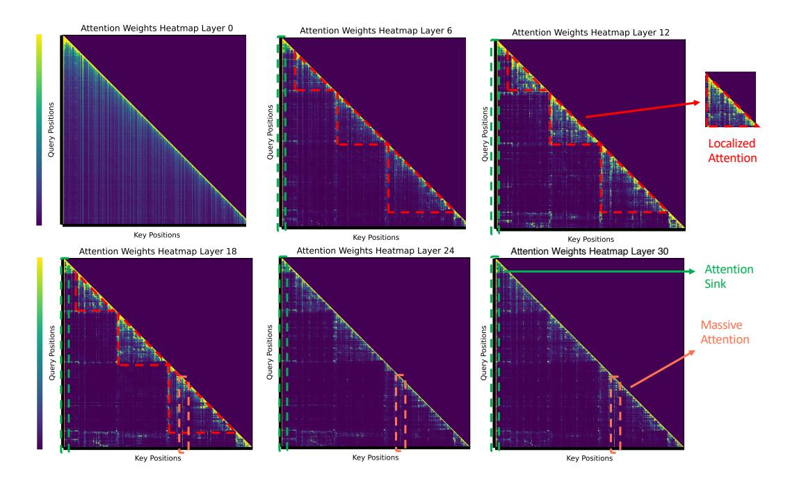

# **B Future Work**

Our investigation on PyramidKV highlights considerable opportunities for optimizing KV cache compression by adjusting the number of KV caches retained according to the distinct attention patterns of each layer (or even for each head). For instance, the retention of KV cache for each layer could be dynamically modified based on real-time analysis of the attention matrices, ensuring that the compression strategy is consistently aligned with the changing attention dynamics within LLMs. Furthermore, our experiments indicate that PyramidKV significantly surpasses other methods in few-shot learning tasks, suggesting promising applications of KV cache in in-context learning. This approach could potentially enable the use of more shots within constrained memory limits.

Figure 5: Attention patterns of retrieval-augmented generation across layers in Mistral-7B-Instruct model [\(Jiang et al., 2023\)](#page-10-0)

Figure 6: Attention patterns of retrieval-augmented generation across layers in Mixtral-8x7B-Instruct Mixture-of-Experts model.

