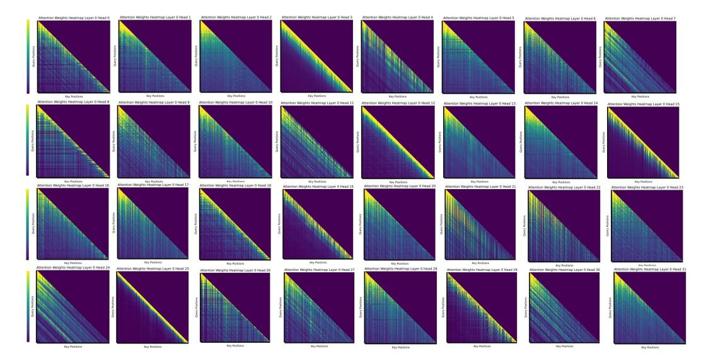

# **Q Attention Patterns across heads in the Bottom Layer**

Retrieval heads are predominantly located in the higher layers. Notably, no retrieval heads are observed in bottom layers. To further investigate, we conducted additional experiments on the bottom layer to analyze the attention patterns of the heads as [Figure 18.](#page-35-0) Our findings indicate the absence of "massive attention" in any individual head.

Figure 18: Attention patterns of retrieval-augmented generation across heads in the bottom layer in LlaMa.

