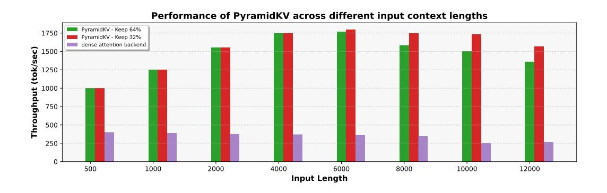

# **R PyramidKV Implementation at vLLM**

To help compare the vLLM implementation with the vanilla dense attention backend in terms of throughput, we perform the experiment. We present the throughput comparison between the PyramidKV vLLM implementation and the vanilla dense attention backend in a setting where the inputs have varying context lengths without shared prefixes.

In Figure [Figure 19,](#page-36-0) we plot the throughput of the LlaMa 8b model by varying length. We observe that relative throughput under compression decreases as the new input context length approaches the limit, causing new sequences to wait longer before being added to the decoding batch.

We find that allocating/releasing/moving/accessing very small chunks of memory may cause inefficiency and fragmentation in a naive implementation of PyramidKV at vLLM. As PyramidKV applies different allocation budgets for different layers. The top layers have less budget, while the bottom layers have more budget. The application of KV cache eviction with different budgets across layers at the standard paged attention frameworks (i.e., vLLM) is ineffective as it only reduces the cache size proportionally to the layer with the lowest compression rate, and all evictions beyond this rate merely increase cache fragmentation.

However, the problem could be solved by adapting paged attention to page out cache on a per-layer basis. We expand the block tables of each sequence to include block tables for each layer of the cache so that they can be retrieved for each layer's KV cache during attention without the use of fixed memory offsets.

Figure 19: Throughout performance of PyramidKV across different input context lengths using LlaMa-3-8b model.