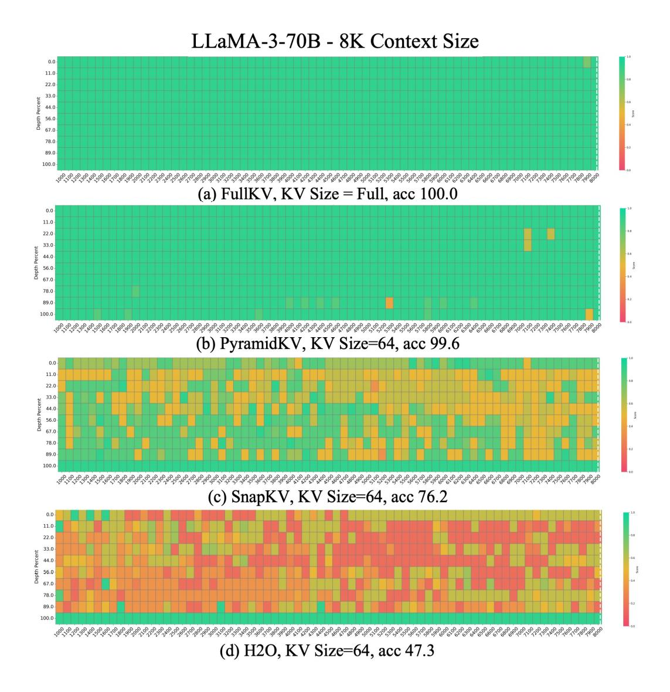

# P PyramidKV Preserves the Long-Context Understanding Ability

We perform Fact Retrieval Across Context Lengths ("Needle In A HayStack") (Liu et al., 2023a; Fu et al., 2024) to test the in-context retrieval ability of LLMs after leveraging different KV cache methods. We conducted the Needle-in-a-Haystack experiment using various LLMs

(i.e., Mistral-7B-Instruct-32k, LLaMA-3-8B-Instruct-8k, and LLaMA-3-70B-Instruct-8k), various KV cache sizes (i.e., 64, 96, and 128) and various methods (i.e., FullKV, PyramidKV, H2O and StreamingLLM). PyramidKV achieves Acc. performance closest to FullKV, while other methods show significant decreases. It is worth noting that PyramidKV with 128 KV cache size achieves the same 100.0 Acc. performance compared with FullKV with 8k context size for LLaMA-3-70B-Instruct.

[Figure 9,](#page-26-0) [Figure 10,](#page-27-0) [Figure 11](#page-28-0) show the results of **Mistral-7B-Instruct** [\(Jiang et al., 2023\)](#page-10-0) with different cache size (64, 96 and 128, respectively).

[Figure 12,](#page-29-0) [Figure 13,](#page-30-0) [Figure 14](#page-31-0) show the results of **LlaMa-3-8B-Instruct** with different cache size (64, 96 and 128, respectively).

[Figure 15,](#page-32-0) [Figure 16,](#page-33-0) [Figure 17](#page-34-0) show the results of **LlaMa-3-70B-Instruct** with different cache size (64, 96 and 128, respectively).

| Model       | Length | KV Cache | Full KV Acc. | PyramidKV Acc. | SnapKV Acc. | H2O Acc. |
|-------------|--------|----------|--------------|----------------|-------------|----------|
| Mistral-7B  | 32k    | 64       | 100.00       | 80.50          | 43.90       | 48.40    |
| Mistral-7B  | 32k    | 96       | 100.00       | 90.50          | 72.20       | 59.10    |
| Mistral-7B  | 32k    | 128      | 100.00       | 91.60          | 80.10       | 64.90    |
| LLaMa-3-8B  | 8k     | 64       | 100.00       | 92.90          | 62.00       | 31.90    |
| LLaMa-3-8B  | 8k     | 96       | 100.00       | 95.80          | 80.70       | 44.20    |
| LLaMa-3-8B  | 8k     | 128      | 100.00       | 97.40          | 87.40       | 49.10    |
| LLaMa-3-70B | 8k     | 64       | 100.00       | 99.60          | 76.20       | 47.30    |
| LLaMa-3-70B | 8k     | 96       | 100.00       | 98.60          | 94.40       | 69.90    |
| LLaMa-3-70B | 8k     | 128      | 100.00       | 100.00         | 98.60       | 82.30    |

Table 15: Recall Accuracy performance from Fact Retrieval Across Context Lengths ("Needle In A HayStack")

Figure 9: Results of the Fact Retrieval Across Context Lengths ("Needle In A HayStack") test in **Mistral-7B-Instruct** with **32k** context size in **64** KV cache size. The vertical axis of the table represents the depth percentage, and the horizontal axis represents the token length. PyramidKV mitigates the negative impact of KV cache compression on the long-context understanding capability of LLMs.

Figure 10: Results of the Fact Retrieval Across Context Lengths ("Needle In A HayStack") test in **Mistral-7B-Instruct** with **32k** context size in **96** KV cache size. The vertical axis of the table represents the depth percentage, and the horizontal axis represents the token length. PyramidKV mitigates the negative impact of KV cache compression on the long-context understanding capability of LLMs.

Figure 11: Results of the Fact Retrieval Across Context Lengths ("Needle In A HayStack") test in **Mistral-7B-Instruct** with **32k** context size in **128** KV cache size. The vertical axis of the table represents the depth percentage, and the horizontal axis represents the token length. PyramidKV mitigates the negative impact of KV cache compression on the long-context understanding capability of LLMs.

Figure 12: Results of the Fact Retrieval Across Context Lengths ("Needle In A HayStack") test in **LlaMa-3-8B-Instruct** with **8k** context size in **64** KV cache size. The vertical axis of the table represents the depth percentage, and the horizontal axis represents the token length. PyramidKV mitigates the negative impact of KV cache compression on the long-context understanding capability of LLMs.

Figure 13: Results of the Fact Retrieval Across Context Lengths ("Needle In A HayStack") test in **LlaMa-3-8B-Instruct** with **8k** context size in **96** KV cache size. The vertical axis of the table represents the depth percentage, and the horizontal axis represents the token length. PyramidKV mitigates the negative impact of KV cache compression on the long-context understanding capability of LLMs.

Figure 14: Results of the Fact Retrieval Across Context Lengths ("Needle In A HayStack") test in **LlaMa-3-8B-Instruct** with **8k** context size in **128** KV cache size. The vertical axis of the table represents the depth percentage, and the horizontal axis represents the token length. PyramidKV mitigates the negative impact of KV cache compression on the long-context understanding capability of LLMs.

Figure 15: Results of the Fact Retrieval Across Context Lengths ("Needle In A HayStack") test in **LlaMa-3-70B** with **8k** context size in **64** KV cache size. The vertical axis of the table represents the depth percentage, and the horizontal axis represents the token length. PyramidKV mitigates the negative impact of KV cache compression on the long-context understanding capability of LLMs.

Figure 16: Results of the Fact Retrieval Across Context Lengths ("Needle In A HayStack") test in **LlaMa-3-70B** with **8k** context size in **96** KV cache size. The vertical axis of the table represents the depth percentage, and the horizontal axis represents the token length. PyramidKV mitigates the negative impact of KV cache compression on the long-context understanding capability of LLMs.

Figure 17: Results of the Fact Retrieval Across Context Lengths ("Needle In A HayStack") test in **LlaMa-3-70B** with **8k** context size in **128** KV cache size. The vertical axis of the table represents the depth percentage, and the horizontal axis represents the token length. PyramidKV mitigates the negative impact of KV cache compression on the long-context understanding capability of LLMs.

