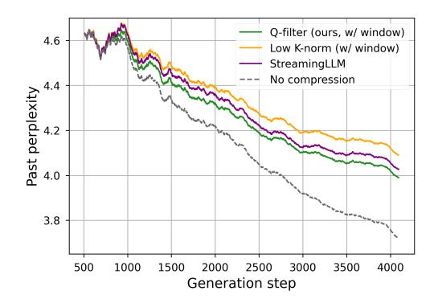

# D. Generation examples

Using Llama-3.1-8B, we identify interesting cases where Q-Filters provide the correct next token in a given long

Figure 12: Perplexity of the Qwen-2.5-7B-Instruct model along generation.

Figure 13: Perplexity of the Llama-3.2-1B model along generation.

context, while K-norm and Streaming-LLM fail to capture the relevant information.

