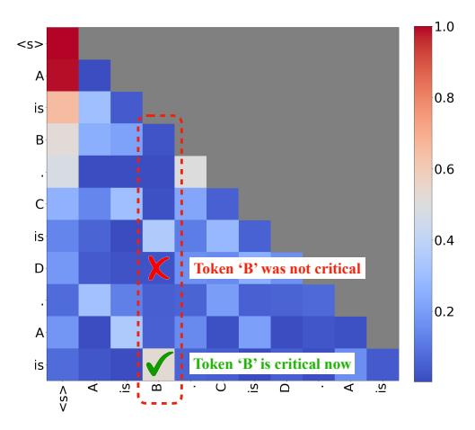

# 2. Related Work

### 2.1. Long-context Model

As the demand for long-context models increases, many works have focused on extending the context window of LLMs. Currently, many models utilize Rotary Position Embeddings (RoPE) [\(Su et al.,](#page-10-5) [2023\)](#page-10-5), and by different scaling methods of RoPE with fine-tuning, the window size of the original 4k Llama-2 has been expanded to 32k for LongChat [\(Li et al.,](#page-9-6) [2023\)](#page-9-6) and 128k for Yarn-Llama-2 [\(Peng](#page-9-1) [et al.,](#page-9-1) [2023\)](#page-9-1). Through length extrapolation, the context windows of models reached beyond 1M [\(Liu et al.,](#page-9-7) [2024b\)](#page-9-7). Beyond open-source models, GPT-4 Turbo supports lengths of up to 128k, while Claude-2 supports up to 200k [\(OpenAI,](#page-9-8) [2024;](#page-9-8) [Anthropic,](#page-9-9) [2024\)](#page-9-9). With models increasingly capable of handling long input, this poses challenges for inference efficiency. Quest aims to boost long-context inference by exploiting query-aware KV cache sparsity.

Figure 2. The attention map of prompt "A is B. C is D. A is". Each row represents the attention scores of previous tokens queried by the tokens on the left. When queried with "D", token "B" has a low attention score, showing "B" is not critical for generation. However, the "is" strongly attends to "B". Therefore, the criticality of tokens strongly correlates with the current query token.

### 2.2. KV Cache Eviction Algorithm

For long-context LLM inference and serving scenarios, the huge size of the KV cache results in significant time and space overheads. Many previous efforts have been dedicated to compressing the size of the KV cache to accelerate attention and reduce memory usage. H2O [\(Zhang et al.,](#page-10-2) [2023b\)](#page-10-2) retains a limited budget of the important KV cache based on the sum of historical attention scores. FastGen [\(Ge et al.,](#page-9-3) [2024\)](#page-9-3) further refines the types of tokens, applying a more sophisticated strategy for selecting the KV cache to keep. TOVA [\(Oren et al.,](#page-9-10) [2024\)](#page-9-10) simplifies the policy by deciding which tokens to permanently discard based solely on the current query. StreamingLLM [\(Xiao et al.,](#page-10-6) [2023\)](#page-10-6) handles infinitely long texts with attention sinks and a finite KV cache. These methods decide which parts of the KV cache to discard based on historical information or current states, but discarded tokens might be important for future tokens, which may cause the loss of important information. To mitigate this issue, SparQ [\(Ribar et al.,](#page-10-7) [2023\)](#page-10-7) computes approQximate attention scores by channel pruning and selects important tokens through them. However, this approach has not been widely validated for tasks with long dependencies, and the channel-level sparsity might pose challenges to practical acceleration. Therefore, we propose Quest, which retains all of the KV cache and selects part of the KV cache based on the current query to accelerate long-context selfattention without accuracy degradation.

