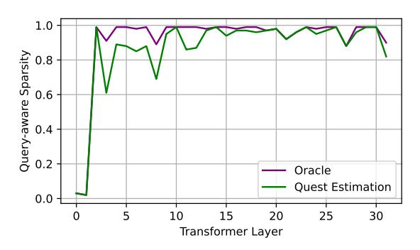
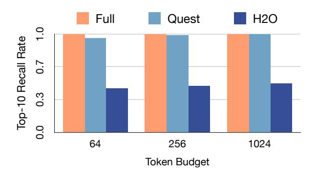
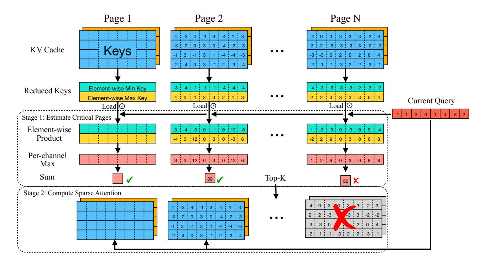

# 3. Methodlogy

In this section, we first motivate Quest by analyzing the breakdown of inference cost and self-attention properties.

Figure 3. The query aware sparsity for each layer in LongChat-7B model. We measure the sparsity by eliminating KV cache tokens while making sure the perplexity on PG19 increases less than 0.01. For the first two layers, the sparsity is below 10%, while for the rest of the layers, the sparsity is larger than 90%, showing great potential for optimization. Quest closely aligns with the oracle.

We then present the design of Quest and discuss its benefits.

## 3.1. Long-context Inference Is Costly

LLM inference contains two stages, namely, the prefill stage and the decode stage. In the prefill stage, all the input tokens are transformed into embeddings and generate the Key (K), Query(Q), and Value(V) vectors. Both the Key and the Value vectors are saved in the KV cache for future use. The rest of the prefill stage includes self-attention and feed-forward network (FFN) layers, which produce the first response token.

In the decode stage, the model will take the last generated token to calculate its K, Q, V. The model uses Q to multiply with every K of previous tokens to generate the *attention weights*. The attention weights will then get normalized using softmax, where each value  $a_i$  represents the attention score between ith token and the current token. The self-attention layer will output  $\sum a_i \cdot V_i$  and send to the FFN.

For one request, the prefill stage only happens once, while a decoding process is needed for every token in the response. Therefore, the decode stage dominates the inference time. For example, for 16k token prompts and 512 token responses, over 86% of the time is spent on decode stages. Therefore, the decode stage performance is crucial for overall latency.

Moreover, a long-context scenario significantly slows down the decode stage. In every decode stage, the K and V of existing tokens must be loaded to perform self-attention, which can easily reach  $16\mathrm{GB}$  for the  $32\mathrm{k}$  context of Llama- $7\mathrm{b}^{\dagger}$ . This memory load operation can take 53% of the

Figure 4. Recall rate of tokens with Top-10 attention scores. Results are profiled with LongChat-7b-v1.5-32k model in passkey retrieval test of 10K context length. Recall rate is the ratio of tokens selected by different attention methods to tokens selected by the full attention in each round of decoding. The average rate is shown in the figure, with various token budgets assigned.

time in a decode stage. Therefore, optimizing self-attention becomes a must for efficient long-context inference.

#### 3.2. Self-Attention Operation Features High Sparsity

Luckily, previous research has highlighted the inherent sparsity in self-attention (Zhang et al., 2023b; Ge et al., 2024). Due to this property of self-attention, a small portion of tokens in the KV cache, called critical tokens, can accumulate sufficient attention scores, capturing the most important inter-token relationships. For example, as shown in Fig. 3, apart from the first two layers, less than 10% of the tokens are needed to achieve similar accuracy, which makes the attention on the rest of the tokens unnecessary. Therefore, if we can estimate the criticality of the tokens, we can only compute self-attention on critical KV cache tokens to greatly reduce the memory movement and thus improve efficiency.

#### 3.3. Critical Tokens Depend on the Ouerv

However, the criticality of the tokens is dynamic and highly dependent on the query vector Q. Assuming the prompt is "A is B. C is D. A is", we demonstrate the attention map of a certain head in the 16th layer of Llama-2-7b in Fig. 2. Since the output answer here should be "B", the token "B" is critical to the current query "is". Thus, it has a high attention score. However, before the final token "is", "B" is not critical for any previous query and has very low attention scores. In other words, the criticality of tokens is tightly related to the query token.

We quantify this effect by profiling the average recall rate of tokens with Top-10 attention scores along the text generations. The original attention with full KV cache can maintain 100% recall rate. However, KV cache eviction algorithm like H2O (Zhang et al., 2023b) which prunes tokens based on history information, suffers from low recall

 $^{\dagger}$ KV cache size = 2 (both K and V) \* Num of Layer \* Sequence length \* Num of Heads \* Head Dimensions \* Size of FP16 = 2 \* 32 \* 32 \* 32 \* 128 \* 2 = 16GB

Figure 5. Quest performs self-attention in two stages. In stage 1, Quest estimates the criticality of pages by performing element-wise product between the current Query vector and both Min Key and Max Key vectors in each KV cache page. Quest gets the sum of the per-channel maximal value for each page as the page criticality estimation. In stage 2, only Top-K KV cache pages are loaded to perform sparse self-attention with the current Query.

rates since critical tokens are pruned in previous iterations. As shown in Fig. 4, Quest maintains recall rate close to full attention, as it estimated critical tokens based on current query. Therefore, pre-determining the criticality is challenging, which motivates query-aware sparsity by considering Q vectors for criticality estimation.

## 3.4. Dynamically Estimating Token Criticality

To efficiently and accurately estimate the criticality of KV cache tokens, we propose Quest, an efficient and accurate algorithm that exploits query-aware context sparsity, which approximately selects the most potentially critical KV cache pages for the current query. We show the workflow of Quest in Fig. 5. To manage the overhead, Quest adopts PageAttention (Kwon et al., 2023) and selects the KV cache pages at the granularity of pages.

To estimate the criticality of the pages, Quest performs an approximate calculation of attention weights before the original attention operation, as shown in Algorithm 1.

Our insight is that in order not to miss critical tokens, we should select pages containing the token with the highest attention weights. However, for an efficient selection of pages, we should calculate an approximate attention score following this insight. We found that the upper bound atten-

tion weights within a page can be used to approximate the highest attention in the page. The upper bound of the attention weights can be calculated by the channel-wise minimal values  $(m_i)$  and maximal values  $(M_i)$  of Key vectors. Given a Q vector, Quest calculates the maximum possible value of the channel i by taking  $U_i = \max(Q_i m_i, Q_i M_i)$ . Note that  $U_i$  is always greater than any product of  $Q_i$  with the Key value  $K_i$  for all tokens in this page regardless of the sign of  $Q_i$ . Therefore, when we add up  $U_i$ , we get the upper bound of attention weights across all Key vectors on this page.

After deriving the upper bound attention weights, we choose the top K pages as critical, where K is an arbitrarily defined hyper-parameter. To demonstrate the feasibility of Quest, we perform actual self-attention and gather Top-K per-page attention scores. As shown in Fig. 3, our query-aware sparsity mostly aligns with the oracle sparsity. Quest performs normal self-attention only on selected pages, which greatly reduces memory movement. We define the number of tokens in selected pages as the "Token Budget".

Due to the low sparsity ratio for the first two layers (as shown in Fig. 3), we only apply Quest and all baselines on later layers to better preserve model accuracy. Note that whether to skip the first two layers or not is orthogonal to the KV cache selection algorithm.

### Algorithm 1 Token Criticality Estimation

### When inserting new token to KV cache:

Input: Key vector K, Dimension of hidden states dim, Current maximal vector Mi , Current minimal vector mi

for 
$$i=1$$
 to  $dim$  do  $M_i = \max(M_i, k_i)$   $m_i = \min(m_i, k_i)$  end for

### When perform self-attention:

Input: Query vector Q, Dimension of hidden states dim, Current maximal vector Mi , Current minimal vector mi

$$\begin{aligned} & \text{Initialize } score = 0. \\ & \text{for } i = 1 \text{ to } dim \text{ do} \\ & score += MAX(q_i*max, q_i*min) \\ & \text{end for} \end{aligned}$$

## 3.5. Quest Reduces the Memory Movement of Self-Attention

Instead of loading the whole KV cache, Quest only needs to load a fraction of the data, which leverages query-aware sparsity. Assume that every K or V vector is M bytes, the KV cache contains L tokens, and each page contains S KV pairs (Page size). During criticality estimation, Quest will load maximal and minimal vectors of each page, which is approximately 2M ∗ L/S bytes. Additionally, Quest performs normal self-attention for top K pages, which is 2M ∗ K ∗ S bytes. The whole KV cache is 2M ∗ L bytes, which indicates Quest loads 1/S + K ∗ S/L of the total KV cache[‡](#page-4-1) , which is equivalent to

$$\frac{1}{\text{Page Size}} + \frac{K}{\text{Page Num}}$$

Assuming that we use 16 KV pairs per page, context length is 64K, and we choose the top 4K pages, Quest will reduce the memory load by 8×. Note that this memory load reduction is universal across all models and is compatible with existing quantization mechanisms [\(Zhao et al.,](#page-10-8) [2024\)](#page-10-8).

