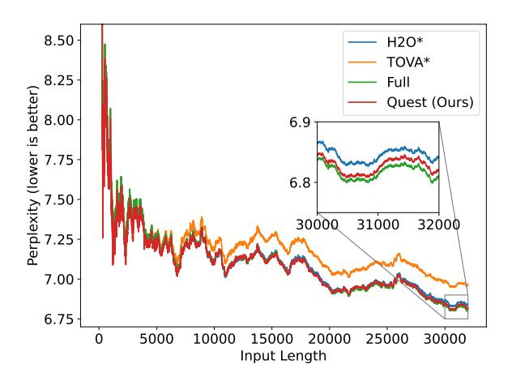
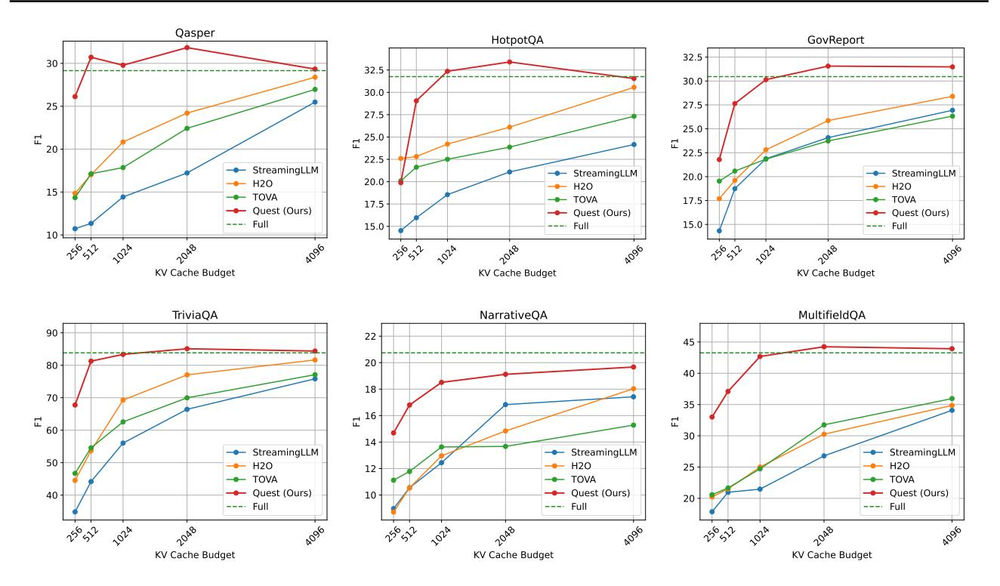
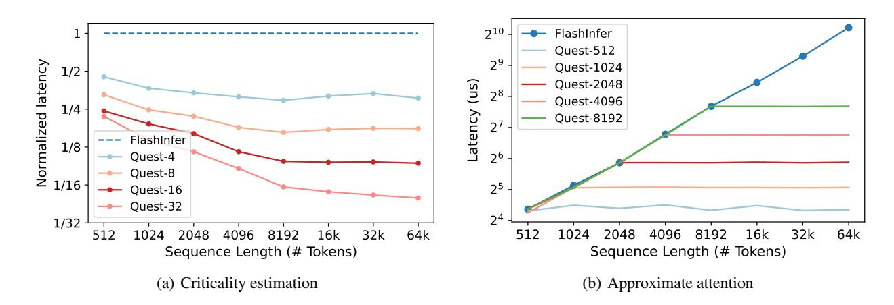
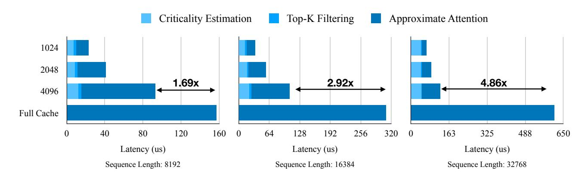
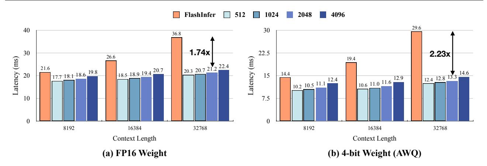
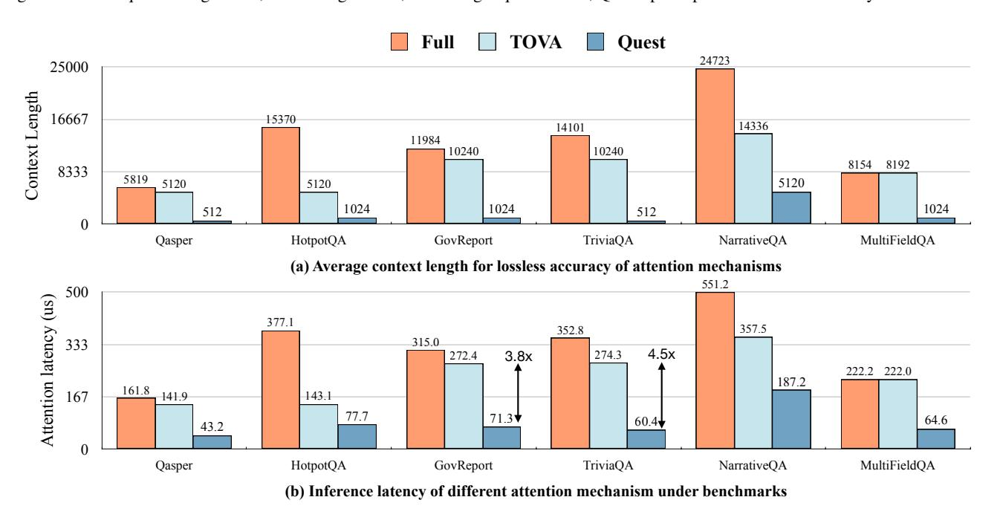

# 4. Experiments

### 4.1. Setting

We evaluate Quest on the language modeling dataset PG19 [\(Rae et al.,](#page-10-3) [2019\)](#page-10-3), passkey retrieval task [\(Peng et al.,](#page-9-1) [2023\)](#page-9-1), and six datasets in LongBench [\(Bai et al.,](#page-9-5) [2023\)](#page-9-5): NarrativeQA [\(Kocisk](#page-9-11) ˇ y et al. ´ , [2018\)](#page-9-11), HotpotQA [\(Yang et al.,](#page-10-9)

| Method / Budget 32 |    | 64 | 128 | 256 | 512                  |
|--------------------|----|----|-----|-----|----------------------|
| H2O                | 0% | 1% | 1%  | 1%  | 3%                   |
| TOVA               | 0% | 1% | 1%  | 3%  | 8%                   |
| StreamingLLM       | 1% | 1% | 1%  | 3%  | 5%                   |
| Quest (ours)       |    |    |     |     | 65% 99% 99% 99% 100% |

| Method / Budget 256 |    | 512 | 1024 | 2048                  | 4096 |
|---------------------|----|-----|------|-----------------------|------|
| H2O                 | 2% | 2%  | 2%   | 2%                    | 4%   |
| TOVA                | 2% | 2%  | 2%   | 2%                    | 10%  |
| StreamingLLM        | 1% | 1%  | 1%   | 2%                    | 4%   |
| Quest (ours)        |    |     |      | 88% 92% 96% 100% 100% |      |

Table 1. (i) Results of 10k length passkey retrieval test on LongChat-7b-v1.5-32k. (ii) Results of 100k length passkey retrieval test on Yarn-Llama-2-7b-128k. Quest can achieve nearly perfect accuracy with 64 and 1024 tokens KV cache budget, which is about 1% of the total sequence length, demonstrating that Quest can effectively preserve the model's ability to handle long-dependency tasks. However, KV cache eviction algorithms such as H2O, TOVA, and StreamingLLM incorrectly discard the KV cache of the answer before receiving the question, thus failing to achieve ideal accuracy.

[2018\)](#page-10-9), Qasper [\(Dasigi et al.,](#page-9-12) [2021\)](#page-9-12), TrivialQA [\(Joshi et al.,](#page-9-13) [2017\)](#page-9-13), GovReport [\(Huang et al.,](#page-9-14) [2021\)](#page-9-14), MultifieldQA [\(Bai](#page-9-5) [et al.,](#page-9-5) [2023\)](#page-9-5). We choose two widely used long-context models for our evaluation: LongChat-v1.5-7b-32k [\(Li et al.,](#page-9-6) [2023\)](#page-9-6) and Yarn-Llama-2-7b-128k [\(Peng et al.,](#page-9-1) [2023\)](#page-9-1). We compare our method against the KV cache eviction algorithm H2O [\(Zhang et al.,](#page-10-2) [2023b\)](#page-10-2), TOVA [\(Oren et al.,](#page-9-10) [2024\)](#page-9-10), and StreamingLLM [\(Xiao et al.,](#page-10-6) [2023\)](#page-10-6). Note that we do not apply any Quest and other baseline algorithms to the first two layers of the model, as our analysis in Sec [3.4](#page-3-1) indicates a low sparsity ratio for these layers.

### 4.2. Accuracy Evaluation

### 4.2.1. LANGUAGE MODELING ON PG19

We first evaluate the language modeling perplexity on the PG19 test set, which is a dataset comprising 100 books with an average length of 70k tokens. We use the LongChat-7bv1.5-32k model to test 32k tokens on PG19. We feed the model with various numbers of tokens and evaluate the perplexity of generated tokens. We evaluate H2O, TOVA, and Quest with a token budget of 4096, which is approximately 1/8 of the total token length. As indicated by the perplexity results in Fig. [6,](#page-5-0) Quest's accuracy closely matches the oracle baseline with a full KV cache.

## 4.2.2. RESULTS ON LONG TEXT PASSKEY RETRIEVAL TASK

Since language modeling evaluation only involves local dependencies, models can achieve great performance by fo-

‡The top-K operator incurs negligible memory loading and execution time (5-10 us). Therefore, we do not include it in efficiency analysis.

Figure 6. Language modeling evaluation of Quest on PG19 dataset. We prompt the model with 0 to 32000 tokens from the PG19 test set and measure the perplexity of output tokens. H2O\* and TOVA\* indicate that for the first two layers of models, we do not apply these two algorithms to prune the KV Cache, as analyzed in Sec 3.4, which better preserves the model performance. Quest also uses a full cache in the first two layers of the model. Quest can closely match the performance of the full cache model.

cusing on recent tokens. However, the ability to handle longdistance dependencies is crucial for long text reasoning. For KV cache eviction algorithms like H2O and TOVA, parts of KV caches that are important for distant future tokens may be discarded, thereby preventing the model from obtaining the correct answer. To show that Quest helps maintain the ability of models to handle longer dependency tasks, we evaluate it on the passkey retrieval task from Yarn (Peng et al., 2023). This task measures a model's ability to retrieve a simple passkey from a large amount of meaningless text. We put the answer in different depth ratios of the text and evaluate if the model can retrieve the correct answer with different KV cache token budgets. We evaluate LongChat-7b-v1.5-32k on 10k tokens test and Yarn-Llama-2-7b-128k on 100k tokens test.

Since H2O (Zhang et al., 2023b) needs to calculate historical attention scores for KV cache pruning, it needs to compute the complete  $O(n^2)$  attention map and thus is unable to use Flash-Attention (Dao et al., 2022) for long-context inference. Therefore, to enable H2O on long-context evaluation, we use Flash-Attention in the context stage for the 100k sequence length passkey retrieval test and start collecting historical attention scores for H2O in the decoding stage. For TOVA (Oren et al., 2024) and StreamingLLM (Xiao et al., 2023), we evaluated them on the 10k and 100k sequence lengths.

For the passkey retrieval test, we directly prefill the input text containing the passkey and texts to the model. However, to evaluate the impact of different methods on the model's ability to handle long-dependency tasks in practical scenarios, we simulate decoding by feeding the task's question and instruction to the model token by token. In this case, H2O and TOVA might mistakenly discard tokens critical for future tokens, such as the passkey that will be queried later. Similarly, StreamingLLM can only focus on the most recent text window, and if the passkey appears outside this window, it cannot provide the correct answer. Therefore, H2O, TOVA, and StreamingLLM cannot achieve ideal accuracy on the 10k and 100k length passkey retrieve test. However, Quest does not discard KV cache but instead uses a query-aware approach to identify critical tokens. As shown in Tab. 1, Quest can achieve perfect accuracy with a minimal budget both on 10k and 100k sequence length tests.

#### 4.2.3. RESULTS ON LONGBENCH

To validate that Ouest can outperform baselines on general long-context datasets, we evaluate our method and baselines on six datasets in LongBench. We evaluate on LongChat-7b-v1.5-32k across a wide range of long-context datasets, including single-document QA: NarrativeQA, Qasper, MultiFieldQA; multi-document QA: HotpotQA; summarization: GovReport; few-shot learning: TriviaQA. We evaluate H2O, TOVA, StreamingLLM, and Quest with different KV cache budgets. For all datasets, we split the input into material and question/instruction. For the material part, we use Flash-Attention (Dao et al., 2022) with the full KV cache to perform inference. For the question part, we simulate decoding by feeding them to the model token by token. Similar to the passkey retrieval test, to enable H2O to use Flash-Attention, we could not collect H2O's historical attention scores during the context stage, thus starting from the decoding stage.

As shown in the Fig. 7, Quest consistently outperforms all baselines across six long-context datasets with various KV cache budgets. Quest with a budget of 1K tokens can achieve comparable performance as the model with full KV cache, while other baselines still exhibit a notable gap from full cache performance even with a larger budget. After considering the full cache used in the first two layers, Quest can achieve lossless performance on Qasper, HotpotQA, Gov-Report, TriviaQA, NarrativeQA, and MultifieldQA with KV cache sparsity of 1/6, 1/6, 1/5, 1/10, 1/5, and 1/6, respectively. This demonstrates that Quest is capable of maintaining the model's capabilities across different types of long-context tasks, as it does not lead to the generation of incorrect answers due to improper discarding of KV cache.

### 4.3. Efficiency evaluation

To demonstrate the feasibility of Quest, we implement the entire framework with dedicated CUDA kernels based on FlashInfer (Ye et al., 2024), a kernel library for LLM inference. We first evaluate Quest's kernel-level efficiency

Figure 7. We evaluate Quest and baselines across six long context datasets with various token budgets. Quest constantly surpassing all baselines at all datasets and all token budgets. For most of the dataset, Quest reaches comparable accuracy with a 1K token budget. To evaluate the impact of different methods on the model's ability to retrieve long-dependency information, we simulate decoding by feeding the task's question to the model token by token.

under the configuration of Llama2-7B on an RTX4090 with CUDA 12.2 in Sec [4.3.1.](#page-6-1) Besides, we show the end-to-end speedup of Quest in text generation as shown in Sec [4.3.2.](#page-7-0) We compare Quest with a normal attention implementation from the original FlashInfer. To demonstrate the improvement, we qualitatively compare efficiency under the same accuracy between Quest and baselines in Sec [4.3.3.](#page-7-1) Note that we use an Ada 6000 GPU [\(NVIDIA,](#page-9-16) [2023\)](#page-9-16) in end-toend evaluations for longer context length.

### 4.3.1. KERNEL EVALUATION

Due to the memory-bound nature of LLM inference, the speedup of Quest is proportional to the sparsity ratio (which is equivalent to memory movement reduction). We quantify this effect in Fig. [8,](#page-7-2) which evaluates per-kernel performance with NVIDIA's benchmark tool NVBench [\(NVIDIA,](#page-9-17) [2024\)](#page-9-17).

Criticality estimation We evaluate the latency of criticality estimation in Quest under different sequence lengths and page sizes. At short sequence length, the memory bandwidth utilization of estimation is smaller than that of FlashInfer, as the total memory load size is not enough to fully utilize GPU memory bandwidth. As sequence length grows, the relative performance improves and approaches 1/Page Size since estimation only consumes one token per page. Note

that techniques like quantization or larger page size can further reduce the additional memory usage.

Top-K filtering We enable the Top-K filtering in Quest with a batched Top-K CUDA operator from a vector search kernel library RAFT [\(Zhang et al.,](#page-10-10) [2023a\)](#page-10-10). We test the latency of Top-K filtering under different sequence lengths and token budgets. Since Criticality estimation reduces one entire token into one criticality score, Top-K filtering has limited memory movement compared to other operators, thus having a low latency overhead of 5-10 us for sequence length less than 128k.

Approximate attention Since Quest is compatible with PageAttention, approximate attention can be easily implemented by feeding Top-K page indices as sparse loading indices. We compare Quest's approximate attention with the original attention of FlashInfer under different sequence lengths and token budgets with a 16 page size. At a given token budget B, the latency of Approximate attention is a constant regardless of the sequence length. Since Approximate attention introduces minimal overhead, it has a similar latency as FlashInfer at sequence length B.

We further evaluate Quest's attention mechanism, which combines Criticality estimation,Top-K filtering, and Ap-

Figure 8. We measure the latency of individual kernels in Quest. (a) As sequence length increases, the relative criticality estimation latency decreases to 1/Page Size of FlashInfer. (b) Approximate attention with token budget K consumes constant time irrelevant to total sequence length and reaches similar performance of FlashInfer at sequence length K.

Figure 9. Quest self-attention time breakdown compared to FlashInfer. At all sequence lengths, Quest significantly outperforms FlashInfer, as the memory movement is reduced. At sequence length 32K with token budget 2048, Quest speeds up self-attention by  $7.03 \times$ .

proximate attention, on the Llama2-7B model using the PyTorch profiler. We show the time breakdown of Quest in Fig. 9 on various sequence lengths. Quest reduce the self-attention time by  $7.03\times$  compared with FlashInfer at 32K sequence length with 2048 token budget.

### 4.3.2. END-TO-END EVALUATION

To show the practical speedup of Quest, we deploy the framework into real-world single-batch scenarios. We measure the average latency of generating one token in the decode stage under different sequence lengths and token budgets. Note that we do not measure the sampling process since its execution time is smaller and depends on the setting. We compare Quest with a full KV cache baseline which is implemented by FlashInfer. As shown in Fig. 10, Quest outperforms FlashInfer at all sequence lengths. The latency of Quest grows significantly slower than FlashInfer when the sequence length increases, as Quest maintains

similar token budgets. At sequence length 32K and token budget 2048, Quest boosts inference speed by  $1.74\times$  with FP16 weights and  $2.23\times$  with 4-bit quantized weight.

#### 4.3.3. Comparison with Baselines

To demonstrate the performance improvements of Quest, we compare the inference efficiency of different attention mechanisms under the same accuracy constraint, i.e. lossless accuracy of six tasks from LongBench. We show token budgets needed for the lossless accuracy target by different attention mechanisms in Fig 11(a). For example, NarrativeQA exhibits an average context length of 24K tokens. To achieve lossless accuracy, TOVA requires a token budget of 14K, whereas Quest necessitates only 5K tokens leading to much higher sparsity.

However, none of the baselines included a kernel implementation of their proposed method. Consequently, we conduct a qualitative analysis of the baselines' self-attention

Figure 10. End-to-end latency of Quest. For all sequence lengths, Quest significantly outperforms FlashInfer. Increasing the sequence lengths only slightly changes the latency of Quest. At a given sequence length, Quest's latency slightly increases as the token budget grows. With sequence length 32K, token budget 2048, 4-bit weight quantization, Quest speedup end-to-end inference by  $2.23 \times$ .

Figure 11. Efficiency comparison of Quest with baselines under the same accuracy constraint. (a) Tokens budgets needed for comparable accuracy by different attention methods. Full denotes the original attention, which means the average context length of benchmarks. (b) Inference latency of different attention methods for comparable accuracy. Quest boosts 3.82× speed on GovReport compared to TOVA.

efficiency by utilizing the inference latency of FlashInfer, disregarding other runtime overheads (e.g., TOVA's requirement to calculate history scores (Oren et al., 2024)). In contrast, Quest is evaluated in a practical setting with consideration of all operators. As shown in Fig. 11(b), Quest significantly surpasses all baselines in terms of self-attention latency due to the high query-aware sparsity. For GovReport and TriviaQA, Quest boosts the inference by  $3.82\times$  and  $4.54\times$ , respectively. Therefore, Quest can achieve higher efficiency while maintaining superior accuracy.

### 5. Conclusion

We present Quest, an efficient and accurate KV cache selection algorithm that exploits query-aware sparsity. Quest dynamically estimates the criticality of tokens in KV cache based on the per-page metadata and the current query. It then performs self-attention only on the critical tokens with greatly reduced memory movement, providing high sparsity with negligible accuracy loss. Comprehensive evaluations demonstrate that Quest provides up to  $7.03 \times$  self-attention speedup, which contributes to  $2.23 \times$  end-to-end latency re-

duction in the decode phase. Compared to prior baselines, Quest reduces up to 4.5× self-attention latency with the same accuracy target under long-context benchmarks.

