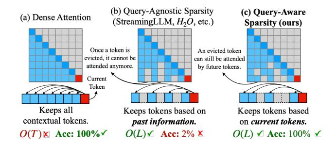

# **Quest: Query-Aware Sparsity for Efficient Long-Context LLM Inference**

Jiaming Tang \*12 Yilong Zhao \*13 Kan Zhu Guangxuan Xiao Baris Kasikci Song Han 24

## **Abstract**

As the demand for long-context large language models (LLMs) increases, models with context windows of up to 128K or 1M tokens are becoming increasingly prevalent. However, longcontext LLM inference is challenging since the inference speed decreases significantly as the sequence length grows. This slowdown is primarily caused by loading a large KV cache during self-attention. Previous works have shown that a small portion of critical tokens will dominate the attention outcomes. However, we observe the criticality of a token highly depends on the query. To this end, we propose Quest, a query-aware KV cache selection algorithm. Quest keeps track of the minimal and maximal Key values in KV cache pages and estimates the criticality of a given page using Query vectors. By only loading the Top-K critical KV cache pages for attention, Quest significantly speeds up self-attention without sacrificing accuracy. We show that Quest can achieve up to 7.03× self-attention speedup, which reduces inference latency by  $2.23\times$  while performing well on tasks with long dependencies with negligible accuracy loss. Code is available at https: //github.com/mit-han-lab/Quest.

### 1. Introduction

The rapid evolution of Large Language Models (LLMs) has shaped our daily lives. With the increasing demand for multi-round conversations and long document queries, the maximum context length of LLMs has dramatically grown from 2K to 1M (Liu et al., 2024a; Peng et al., 2023; Tworkowski et al., 2023). The 128k context length GPT-4 model has already been deployed in large-scale serving, which is equivalent to 300 pages of text (OpenAI, 2023).

Proceedings of the 41st International Conference on Machine Learning, Vienna, Austria. PMLR 235, 2024. Copyright 2024 by the author(s).

Figure 1. Comparison between Dense Attention(a), Query-Agnostic Sparsity (b) and Quest's Query-aware Sparsity (c). Quest significantly speeds up self-attention while maintaining high accuracy by dynamically determining the critical tokens based on the current query. T represents the total sequence length and L represents the number of critical tokens for attention.

However, processing long-context requests is challenging. Due to the auto-regressive nature of LLMs, generating one token would require reading the entire KV cache. For Llama 7B model (Touvron et al., 2023) with 32k context length, the KV cache can occupy 16GB of space, which requires at least 11 ms to read, which contributes to more than 50% of the inference latency\*, limiting the overall throughput.

Despite the increasingly large size of the KV cache, previous works have shown that a small portion of the tokens can dominate the accuracy of token generation (Zhang et al., 2023b; Ge et al., 2024). Therefore, we can dramatically reduce the inference latency by only loading the critical tokens, while still maintaining accuracy. Thus, it is essential to identify critical portions of the KV cache.

In this work, we further observe that the criticality of the tokens can change with different query tokens. As shown in Fig. 2, the critical tokens vary a lot with different queries. Therefore, we need a dynamic and efficient approach to determine which portion of the KV cache needs to be attended to. To this end, we propose Quest, a query-aware criticality estimation algorithm for long-context LLM inference that efficiently and effectively identifies critical KV cache tokens and performs self-attention selectively on chosen tokens, as shown in Fig. 1.

To reduce the overhead of KV cache criticality estimation,

\*Equal contribution 1Shanghai Jiao Tong University 2MIT 3University of Washington 4NVIDIA. Correspondence to: Song Han <songhan@mit.edu>, Baris Kasikci  
 
 
baris@cs.washington.edu>.

\*Tested with FP16 FlashInfer implementation on an RTX4090

Quest manages KV cache at page granularity [\(Kwon et al.,](#page-9-4) [2023\)](#page-9-4). For each page, Quest utilizes maximum and minimum values of each feature dimension of the Key vector as the metadata to represent token information. During inference, Quest considers both the Query vector and the metadata to estimate each page's criticality. Given all criticality scores of the pages, Quest chooses Top-K pages to perform approximate self-attention, where K is a preset constant (e.g. 128, 256). By reducing the memory movement from the entire KV cache to metadata and constant K pages, Quest significantly accelerates inference.

We evaluate both the accuracy and efficiency of Quest. Since Quest dynamically decides the criticality of the tokens, Quest achieves better accuracy for a given degree of KV cache sparsity than baselines on PG19 dataset [\(Rae et al.,](#page-10-3) [2019\)](#page-10-3), passkey retrieval task [\(Peng et al.,](#page-9-1) [2023\)](#page-9-1), and Long-Bench [\(Bai et al.,](#page-9-5) [2023\)](#page-9-5) with 256 to 4K token budgets. For 32K context, Quest achieves 7.03× self-attention latency reduction compared to FlashInfer [\(Ye et al.,](#page-10-4) [2024\)](#page-10-4). Our end-to-end framework demonstrates that Quest can have 2.23× inference speedup compared to FlashInfer [\(Ye et al.,](#page-10-4) [2024\)](#page-10-4) with 4-bit weight quantization. In summary, we make the following contribution:

- An analysis of the self-attention mechanism that pinpoints the importance of query-aware sparsity.
- Quest, an efficient and accurate KV cache acceleration algorithm, which exploits query-aware sparsity by dedicated operator designs and implementations.
- A comprehensive evaluation of Quest, demonstrating up to 7.03× self-attention latency reduction and 2.23× end-to-end latency improvement.

