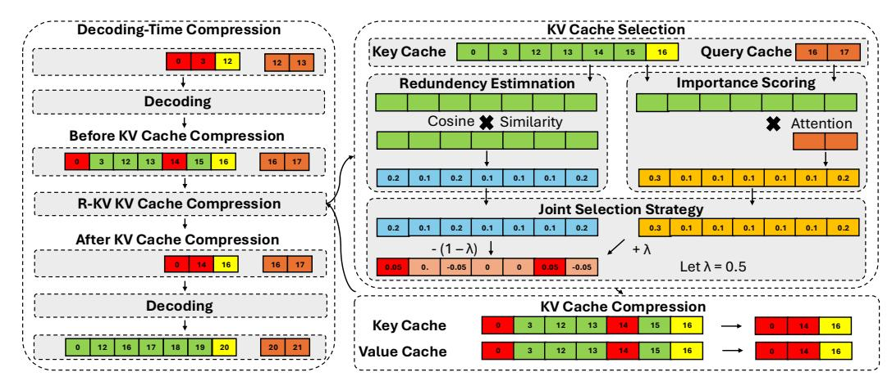

# 1 Introduction

Recent advancements in large language models (LLMs) have demonstrated remarkable capabilities in complex reasoning and self-reflection. However, reasoning models (e.g., DeepSeek-R1 [1]) exhibit a critical deployment challenge: their tendency to produce excessively lengthy and redundant reasoning traces results in unsustainable memory demands [2], primarily due to the rapid growth of the key-value (KV) cache during autoregressive generation. For instance, a DeepSeek-R1-Distill-Llama-8B model may generate 32K tokens to solve a complex math problem, consuming 15.5GB of memory to load the model weight and 4.1GB of memory to store the KV cache. This paradigm of long chain-of-thought (CoT) reasoning generation necessitates the development of KV cache compression.

Outputs from current reasoning models, especially during complex chain-of-thought generation, are fundamentally marked by pervasive redundancy. This inherent characteristic means they are often filled with superfluous content, including unnecessary reflections, iterative re-evaluations, and verbose self-dialogue, all of which add little new semantic value while significantly inflating the

 $\boxtimes Corresponding \ to \ Zefan \ Cai \ {\tt zefncai@gmail.com}, \ Wen \ Xiao \ {\tt wxiao@microsoft.com} \ and \ Junjie \ Hujunjie.hu@wisc.edu$ 

Figure 1: R-KV: (1) Decoding-Time Compression ([§3.1\)](#page-3-0); (2) KV Cache Selection with Importance and Redundancy Estimation ([§3.2,](#page-3-1) [§3.3\)](#page-4-0) ; (3) KV Cache Compression by joint selection ([§3.4\)](#page-4-1).

length of the generation beyond what is needed for concise, effective reasoning. Our analysis ([§2.1\)](#page-1-0) shows that over half of the tokens in R1's reasoning chains contribute minimally to task performance, indicating that repetitive self-verification steps or intermediate calculations could be substantially condensed by KV cache compression methods without compromising reasoning accuracy.

However, existing KV cache compression works [\[3,](#page-10-2) [4,](#page-10-3) [5,](#page-10-4) [6,](#page-10-5) [7\]](#page-10-6) primarily handle long input prompts but do not explore extensively for long generation outputs. Furthermore, based on our observation ([§2.2\)](#page-2-0), standard KV-cache compression methods that rely on simple attention-based importance filtering often fail because the repetitive sections generate high attention signals for themselves. Naively pruning tokens with "low attention weight" may remove crucial but scattered bits of reasoning, or over-retain duplicative self-reflections that appear to have high attention. This observation motivates our exploration of redundancy-aware compression strategies, which selectively retain "important and non-repetitive context" during decoding to preserve the model's critical reasoning ability.

In this work, we propose Redundancy-aware KV cache compression for reasoning models (i.e., R-KV). Our approach consists of three key components: (1) an attention-based importance scoring mechanism that selects critical tokens for retention, (2) a dynamic redundancy scoring mechanism that identifies repetitive tokens through real-time analysis of key vectors, and (3) a joint eviction mechanism that balances both redundancy and importance to optimize cache efficiency.

In our experiments on popular math reasoning benchmarks ([§4\)](#page-5-0), by selectively retaining only 10-34% of the original KV cache, R-KV achieves comparable performance parity with the uncompressed reasoning model, outperforming state-of-the-art compression baselines with only 60% of the performance. Remarkably, R-KV even achieves 105% accuracy of the full KV baseline with around 16% of the KV cache using DeepSeek-R1-Distill-Llama-8B on the AIME-24 dataset.

This advancement addresses a fundamental tension in deploying state-of-the-art LLMs—balancing reasoning capabilities with practical memory constraints. Our contributions extend beyond technical optimization: we provide systematic evidence that redundancy in CoT generation can be strategically compressed without compromising reasoning abilities. As a training-free and model-agnostic method, R-KV can be used in the rollout process in reinforcement learning (RL) and LLM serving.

