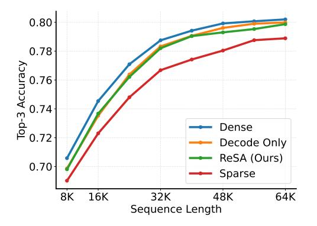
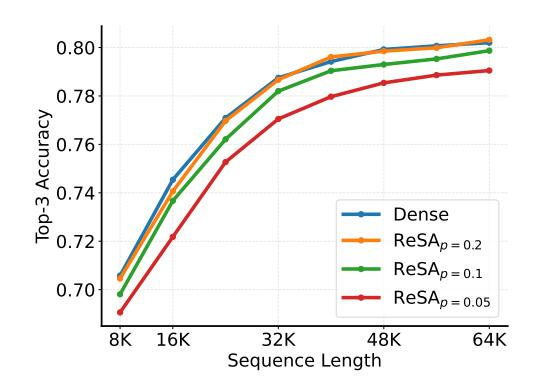

# 3.1 Setup

We evaluate ReSA from different perspectives. First, we make test-time scaling inference on math reasoning tasks (Section 3.2). Second, we simulate inference-time attention pattern on language modeling (Section 3.3). Third, we verify the effectiveness on retrieval (Section 3.4) tasks. Fourth, we analyze the inference advantages (Section 3.5, including kernel-level and end-to-end accelerations.

We choose Qwen2.5 [25], a widely-used standard Transformer pre-trained model as evalutaion architectures. We apply ReSA on all of the layers, rather than skipping the first two layers in Quest [23]. The block size is 16 and the minimal selected block number is  $n_{\min} = 16$ ,  $n_{\text{local}} = 1$  to avoid performance degradation in short context. For longer sequences, the default sparsity ratio is p = 0.9. The default rectification frequency is f = 32.

### 3.2 Long Reasoning

We evaluate test-time scaling performance on math reasoning tasks. The validation dataets inclue Minerva Math [15], Gaokao 2023 En [17], OlympiadBench [10], AIME24, and AMC23. We exclude some well-known math datasets such as GSM8K [5], and MATH [11] since these datasets' average inference length is below 512. We choose DeepSeek-R1-Qwen-Distill 7B [9] as the evaluation model. The number of attention head is 28 and kv head is 4. The hidden size is 3584 and the number of layers is 28.

The results in Table 1 show that while ReSA achieves performance comparable to the dense baseline, Sparse Decoding alone consistently underperforms. ReSA maintains near-lossless performance in

|                          | Minerva          | Gaokao2023En        | OlympiadBench       | AIME24       | AMC23               | Avg            |
|--------------------------|------------------|---------------------|---------------------|--------------|---------------------|----------------|
| R1-Qwen-Distill 1.5B     |                  |                     |                     |              |                     |                |
| Dense                    | 28.7             | 71.6                | 40.8                | 27.4         | 65.6                | 46.82          |
| Sparse ReSA           | <b>29.0</b> 28.1 | 67.9 <b>71.8</b> | 38.7 <b>39.5</b> | 21.3 23.0 | 60.6 <b>65.4</b> | 43.50 45.56 |
| Avg Length               | 6390.8           | 4915.8              | 8991.6              | 12126.4      | 7866.4              | 8058.2         |
| R1-Owen-Distill 7B       |                  |                     |                     |              |                     |                |
| Dense                    | 40.4             | 73.8                | 52.3                | 48.1         | 89.0                | 60.72          |
| Sparse                   | 38.1             | 72.9                | 48.4                | 46.1         | 83.1                | 57.72          |
| Sparse dense2 | 37.9             | 72.5                | 48.8                | 44.6         | 83.1                | 57.38          |
| ReSA                     | 39.7             | 73.5                | 52.3                | 51.1         | 86.0                | 60.52          |
| Avg Length               | 4018.7           | 2889.9              | 7520.0              | 10474.5      | 5732.2              | 6127.1         |

Table 1: Performance comparison on math reasoning tasks. While simple sparse decoding methods show a gap with dense decoding, ReSA achieves near lossless long-sequence generation.

Figure 4: Top-3 next-token prediction accuracy with different rectification frequency.

Figure 5: Top-3 next-token prediction accuracy with different sparsity ratio.

long-context reasoning tasks, whereas Sparse Decoding leads to performance degradation as decoding progresses. Additionally, manually enforcing dense layers for the first two layers does not result in a significant improvement in math-reasoning tasks.

#### 3.3 Language Modeling

Se evaluate language modeling performance under simulated sparse decoding patterns. Specifically, we divide each input sequence into two parts. Given a total sequence length L, we split it into a prefix of length L-x and a suffix of length x. The prefix is processed using dense attention, while the suffix uses sparse attention. Here, x effectively controls the rectification frequency. When x=L, it corresponds to the sparse decoding baseline, where no rectifying is performed and the entire sequence is encoded using sparse attention.

We conduct our experiments using long-sequence book data. For each target sequence length, we use the same data and truncate from the left to ensure that the prediction tokens are perfectly aligned across all settings. We report the top-3 accuracy computed over the final 32 tokens of each sequence to focus on the model's performance in the later decoding stages.

As shown in Figure 4, we compare the impact of different rectification frequencies on model perplexity. The setting labeled  $Decode\ Only$  corresponds to the case where all KV cache entries are generated using dense attention, and sparse attention is only used for decoding. This serves as the upper bound for ReSA. We observe that ReSA significantly reduces the performance gap between dense and sparse decoding. Notably, when x=32, the model's performance almost approaches the upper bound,

| Setting                                                                                                  | QA                      | MultiQuery              | FWE                     | VT                      | MultiKey                | MultiValue              | CWE                     | Single                  | Avg                     |
|----------------------------------------------------------------------------------------------------------|-------------------------|-------------------------|-------------------------|-------------------------|-------------------------|-------------------------|-------------------------|-------------------------|-------------------------|
| Dense                                                                                                    | 0.563                   | 0.211                   | 0.833                   | 0.719                   | 0.688                   | 0.246                   | 0.134                   | 1.000                   | 0.549                   |
| $\begin{array}{c} \hline \text{ReSA}_{p=0.95} \\ \text{ReSA}_{p=0.9} \\ \text{ReSA}_{p=0.8} \end{array}$ | 0.500 0.625 0.594 | 0.180 0.203 0.195 | 0.740 0.760 0.771 | 0.719 0.719 0.719 | 0.750 0.750 0.719 | 0.238 0.234 0.246 | 0.125 0.178 0.175 | 1.000 1.000 1.000 | 0.531 0.559 0.552 |

Table 2: RULER benchmarks under different sparsity ratios. Dense represents the fully-attended baseline, while  $ReSA_{p=x}$  denotes our method with sparsity level x.

demonstrating the effectiveness of rectification in mitigating the error accumulation issue inherent in sparse decoding.

In Figure 5, we further examine the effect of different sparsity ratios under a fixed rectification frequency of x=32. We find that there is a noticeable performance gap between the p=0.98 and p=0.95. Although p=0.8 sparsity achieves perplexity comparable to the dense setting, we adopt p=0.9 as the default due to its better trade-off between performance and efficiency. Additionally, since effective block selection strategies can lead to higher achievable sparsity, our method can be further combined with advanced attention selection mechanisms such as SeerAttention [8] to enhance runtime efficiency.

#### 3.4 Long-Sequence Retrieval

We conduct experiments on the RULER benchmark to further evaluate the impact of different sparsity levels. Unlike the long-sequence generation tasks, where rectification plays a critical role in mitigating cumulative error, the RULER benchmark focuses on relatively short output sequences. As a result, the final accuracy is primarily determined by the quality of the sparse attention estimation.

Results are presented in Table 2. We observe that as the sparsity ratio increases from p=0.95 to p=0.9, there is a consistent improvement in average accuracy, with  ${\rm ReSA}_{p=0.9}$  achieving comparable performance to the dense baseline (0.559 vs. 0.549). The performance under p=0.8 remains similar to that under p=0.9, indicating that moderate increases in sparsity do not substantially degrade accuracy in short-generation settings. Considering that a lower sparsity ratio generally leads to faster inference,  ${\rm ReSA}_{p=0.9}$  represents a better trade-off between performance and efficiency on the RULER benchmark.

