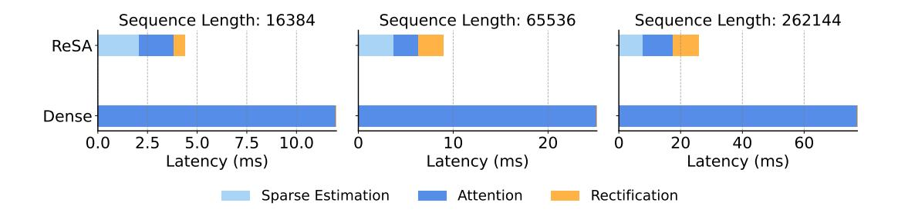
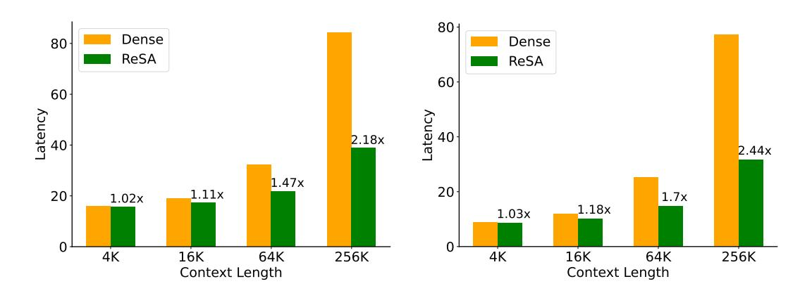
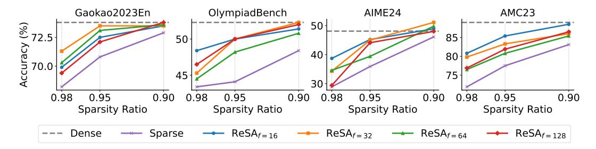

# 3.5 Inference Efficiency

We evaluate the efficiency of ReSA on standard GPU hardware. Specifically, we use Qwen-2.5 7B as the evaluation model and conduct all experiments on NVIDIA A100-80G GPUs. The primary baseline is FlashAttention, a highly optimized dense attention implementation. To ensure a fair comparison and prevent memory overflow issues caused by excessively large KV caches during long-sequence evaluation, we adopt a shared KV cache strategy across all layers during efficiency measurements. The batch size is fixed at 8 by default throughout all experiments.

For latency measurement, we report the CUDA kernel execution time, excluding CPU-side scheduling overhead. This setup more accurately reflects the real-world inference scenario, as the CPU overhead can be effectively optimized away through techniques such as CUDA graph capture.

## 3.5.1 Attention Efficiency

Figure 6 shows the detailed latency breakdown across different sequence lengths (16k, 64k, and 256k tokens). We compare ReSA, and dense attention under the same settings. The latency is decomposed into three parts: sparse estimation, attention computation, and rectification overhead.

Compared to dense attention, ReSA significantly reduces the total latency, especially at longer sequence lengths. As the sequence grows, dense attention exhibits longer latency with increasing context length, leading to substantial latency increase, while ReSA maintains much flatter scaling due to its sparsified attention computation.

Figure 6: Kernel-level latency breakdown across different sequence lengths. While Sparse Decoding achieves effective acceleration, rectification only requires a small additional overhead.

Moreover, sparse estimation and attention computation consume comparable amounts of time, because the memory access pattern for sparse estimation scales with mem(KV cache)/block, while for attention it scales with mem(KV cache) × p. Given our experimental settings (block = 16, p = 0.9), both operations operate on similar memory volumes. Notably, under fixed block size, further increasing the sparsity ratio can not bring significant speed-up.

The overhead of rectification is relatively small compared with sparse decoding part. Specifically, the rectification module accounts for up to 32.7% of the total attention-related latency at 256k lengths, while at 64k, this proportion drops to 28.9%. When the sequence length is scaling, the latency ratio will converge to the memory access ratio 1/f. These results indicate that while sparse estimation and attention computation remain efficient, the rectification does not bring big overhead.

#### 3.5.2 End-to-End Efficiency

We further evaluate the end-to-end throughput of ReSA in both FP16 and INT4 precision settings. For the INT4 experiments, we leverage the Marlin kernel [\[7\]](#page-9-9) for low-bit matmul. The matmul weight is quantized with group-wise scaling. The group size is 128.

Figure [7](#page-7-1) and Figure [8](#page-7-2) report the throughput across different context lengths (4K, 16K, 64K, and 256K tokens) under FP16 and INT4 settings, respectively. Consistent with the kernel-level results, ReSA significantly improves the overall throughput as the sequence length grows, achieving up to 2.28× speedup over dense attention in FP16 and 2.44× in INT4 at 256K context length.

Notably, the benefits of ReSA become more prominent at longer sequences due to the quadratic scaling bottleneck of dense attention, while the overhead of sparse estimation and rectification remains modest even under quantized inference. These results demonstrate that ReSA is highly effective in improving real-world end-to-end generation speed across different precision levels.

Figure 7: End-to-end latency with FP16.

Figure 8: End-to-end latency with INT4.

Figure 9: Ablation studies on different rectification frequencies f and sparsity ratios p across five math reasoning benchmarks. ReSA consistently improves over the sparse baseline. Frequencies f=32 or f=64 achieve the best trade-off between performance and overhead.

#### 3.6 Ablation Studies

We conduct ablation studies to examine the effect of rectification frequency and sparsity ratio on performance. As shown in Figure 9, we evaluate ReSA across five math reasoning benchmarks under varying sparsity levels ( $p \in \{0.9, 0.95, 0.98\}$ ) and rectification frequencies ( $f \in \{16, 32, 64, 128\}$ ).

Compared to the sparse decoding baseline, ReSA consistently outperforms the baseline across all sparsity levels. Notably, when the attention computation ratio is reduced to 0.1, ReSA achieves accuracy that is remarkably close to the dense decoding upper bound. This demonstrates that ReSA effectively mitigates the quality drop typically associated with sparse decoding while maintaining high computational efficiency.

Among the frequencies, f=32 achieves accuracy close to the dense baseline on most datasets, striking a favorable balance between quality and efficiency. While f=16 offers marginal gains, it incurs higher rectification overhead and is therefore less practical. Notably, even with f=128, a large portion of the performance gain is retained, highlighting the robustness of the rectification mechanism under infrequent updates.

### 4 Related Work

**Sparse Attention** Recent efforts in sparse decoding for large language models can be broadly categorized into training-free and training-aware approaches. Training-free methods enhance inference efficiency without substantial retraining. Quest [23] and InfLLM [24] both adopt query-aware blocksparse attention, selectively retrieving critical memory blocks based on query relevance. MagicPig [4] and ClusterKV (Tactic) [18] employ similarity-based techniques, using hashing or clustering to approximate attention relevance. In contrast, training-aware architectures such as NSA [28] and MoBA [19] integrate sparsity into model design, aligning structures with hardware during pretraining. Our method complements training-free sparse attention by improving memory quality through lightweight rectification, avoiding the high retraining cost required by training-aware approaches.

**Speculative Decoding** Speculative decoding [14] accelerates generation by drafting multiple tokens and verifying them with the target model. Methods like Medusa [3] and EAGLE [16] reuse the target model's hidden states for drafting. TriForce [22] and MagicDec [21] propose self-speculation, using the model's own sparse KV cache for drafting and a dense cache for verification. While sharing similar compute characteristics with sparse KV-based self-speculation, ReSA avoids per-token accept/reject decisions and resampling overhead. In Appendix B, we compare ReSA and self-speculation in detail.

### 5 Conclusion

In this paper, we introduced Rectified Sparse Attention, a simple yet effective method for efficient long-sequence generation. ReSA combines group block sparse attention for decoding latency, and dense rectification to bound error accumulation. Extensive experiments on math reasoning and language modeling tasks demonstrate that ReSA achieves near-lossless performance compared to dense decoding, delivering up to  $2.42\times$  inference speedup at 256K context length. These results highlight ReSA's practical effectiveness in long-context language model deployment.

