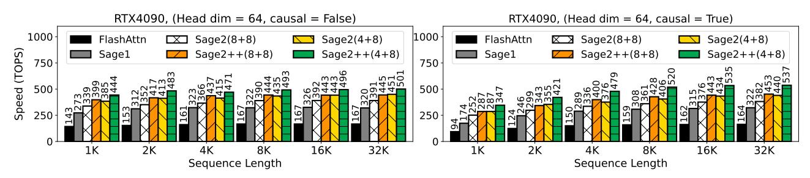

# 2. Preliminary

Table 1. Speedup compared to matrix multiplication in FP16 with an FP32 accumulator.

| GPU      | MM Input | MM Accumulator | Speedup |
|----------|----------|----------------|---------|
|          | FP16     | FP32           | 1x      |
| RTX4090, | FP8      | FP32           | 2x      |
| RTX5090  | FP8      | FP16           | 4x      |

### 2.1. SageAttention2

SageAttention2 [\(Zhang et al., 2025a\)](#page-7-7) is a quantization [\(Zhang et al., 2025g;](#page-7-8) [Hu et al., 2025\)](#page-5-11) method based on FlashAttention [\(Dao et al., 2022\)](#page-5-8). FlashAttention tiles

1Department of Computer Science, Tsinghua University. *Preprint*.

Table 2. Average attention accuracy across all attention layers of CogvideoX.

| Method      | $P_r$ | $V_r$ | <b>Cossim</b> ↑ | L1↓     |
|-------------|-------|-------|-----------------|---------|
| SageAttn2   | 448   | 448   | 99.97%          | 0.01862 |
| SageAttn2++ | 448   | 2.25  | 99.97%          | 0.01863 |
| SageAttn2++ | 224   | 4.5   | 99.97%          | 0.01862 |
| SageAttn2++ | 112   | 9     | 99.97%          | 0.01863 |

Q,K,P,V into blocks  $(\{Q_i\},\{K_i\},\{\tilde{P}_i\},\{V_i\})$  and uses online softmax (Milakov & Gimelshein, 2018) to compute attention progressively. For simplicity, we omit the subscripts  $(\{Q_i\},\{K_i\},\{\tilde{P}_i\},\{V_i\})$  in the following content and use  $Q,K,\tilde{P},V$  to represent the tiled blocks. SageAttention2 quantizes Q,K to INT4/INT8 with per-block granularity,  $\tilde{P}$  to FP8 in E4M3 with per-block granularity, and quantizes V to FP8 in E4M3 with per-channel granularity. This means each  $Q,K,\tilde{P}$  has a separate scale factor:  $\delta_Q = \max(|Q|)/127, \delta_K = \max(|K|)/127, \delta_P = \max(|\tilde{P}|)/448$ , and each channel of V has a separate scalar scale:  $\delta_V = \operatorname{colmax}(|V|)/448$ . By doing so, SageAttention2 accelerates matrix multiplications in attention through low-bit Tensor Core operations. For example,  $\hat{P} = \lceil \tilde{P}/\delta_P \rfloor$ ,  $\hat{V} = \lceil V/\delta_v \rceil$ . Then,  $PV = \hat{P}\hat{V} * \delta_P * \delta_V$ .

### 2.2. Data Type of Accumulator for Matmul

In some GPUs, the speed of Matmul instructions depends on the accumulator data type. For instance, mma.f32.f8.f8.f32 uses FP32 accumulator for FP8 Matmul and is only  $2\times$  faster than FP16. The instruction using FP16 accumulator for FP8 Matmul (mma.f16.f8.f8.f16) is  $4\times$  faster than FP16. Table 1 summarizes the speedup of Matmul instructions with different accumulators.

### 3. SageAttention2++

In this section, we introduce SageAttention2++. The workflow of SageAttention2++ is based on SageAttention2, also using the smoothing of Q and K, INT4/INT8 quantization for  $QK^{\top}$  Matmul and FP8 quantization for PV Matmul. The main difference is that for PV, SageAttention2++ uses the faster instruction (mma.f16.f8.f8.f16), which employs an FP16 accumulator for the FP8 Matmul. To ensure the results of FP8 Matmul remain within FP16's representable range, we adjust the scale factor of the FP8 quantization.

### 3.1. Narrowing the FP8 Quantization Range

The specific MMA (NVIDIA, 2025) instruction used for the MatMul between P and V is mma.m16n8k32. If we quantize P and V to FP8 in E4M3 (-448 $\sim$ 448) as in SageAt-

tention2, the results may exceed FP16's representable range (-65504 $\sim$ 65504). This occurs because 32 product values pv are accumulated in FP16, where p and v come from quantized  $\hat{P}$  and  $\hat{V}$  (derived from  $\widetilde{P}$  and V). To ensure the accumulated results stay within FP16's range:

$$|32 \times pv| \le 65504\tag{1}$$

For instance, choosing  $|p| \le 224$  and  $|v| \le 9$  satisfies this condition. We therefore narrow the quantization ranges of P and V by adjusting their scale factors:

$$\delta_P = |\max(\widetilde{P})|/P_r, \quad \delta_V = |\max(V)|/V_r$$
 (2)

where we constrain  $P_r \times V_r \le 2047$  (since 65504/32 = 2047).

### 3.2. Delayed FP32 Buffering

The transformation of accumulated values from mma.m16n8k32 (in FP16) to FP32 incurs overhead because it needs additional data type conversion PTX instructions (NVIDIA, 2025) to execute. To reduce this overhead, we accumulate two consecutive mma.m16n8k32 results in FP16 before performing FP32 conversion, effectively halving the transformation overhead. Maintaining the FP16 representable range requires:

$$P_r \times V_r \le 2047/2 \tag{3}$$

**Choice of**  $P_r$  **and**  $V_r$ . Table 2 shows attention accuracy for feasible  $(P_r, V_r)$  pairs. The results demonstrate that narrowing quantization ranges introduces negligible error. We select  $P_r = 224$  and  $V_r = 4.5$  for optimal performance.

### 4. Experiment

Main result. SageAttention2++ achieves up to 3.9× speedup over FlashAttention2 while consistently outperforming both SageAttention and SageAttention2 in computational efficiency. Importantly, these performance gains are achieved with negligible impact on end-to-end metrics across diverse model architectures.

### **4.1. Setup**

Models and attentions. We evaluate SageAttention2++ across diverse representative models spanning language, image, and video generation: Llama3.1 (8B) (Dubey et al., 2024) for text2text, CogvideoX (2B), HunyuanVideo (Kong et al., 2024), and Wan (Wan et al., 2025) for text2video, and Flux (schnell) (Black Forest Labs, 2023) and Stable-Diffusion3.5 (turbo) (Stability AI, 2023) for text2image. We compare our method with FlashAttention2 (Dao, 2024), SageAttention (Zhang et al., 2025c),

Figure 1. Speed comparison between SageAttention2++ and baselines (RTX4090, headdim=128).

Figure 2. Speed comparison between SageAttention2++ and baselines (RTX4090, headdim=64).

Figure 3. Speed comparison between SageAttention2++ and baselines (RTX5090, headdim=128).

Figure 4. Speed comparison between SageAttention2++ and baselines (RTX5090, headdim=64).

and SageAttention2 (Zhang et al., 2025a). Please **note** that FlashAttention3 can only run on Hopper GPUs, so FlashAttention2 is already the fastest version for RTX5090 and RTX4090. Following SageAttention2's approach, we implement two SageAttention2++ variants: SageAttn2++(8+8) (INT8 for Q,K) and SageAttn2++(4+8) (INT4 for Q,K), both using FP8 in E4M3 for  $\widetilde{P},V$ .

Datasets and metrics. Detailed dataset and metric informa-

tion appears in Appendix A.2.

Implementation. We implement SageAttention2++ using CUDA.

### 4.2. Speed of Kernels

**Kernel Speed.** We benchmark the speed of SageAttention2++ against baselines using configurations with headdim=64 and headdim=128, both with

Table 3. End-to-end metrics across text, image, and video generation models.

| Model    | Attention        | WikiText (Ppl.) ↓ | Lambda (Acc.) ↑ | NIAH (Acc.) ↑ |
|----------|------------------|-------------------|-----------------|---------------|
|          | Full-Precision   | 6.013             | 0.815           | 0.906         |
| Llama3.1 | SageAttn2(8+8)   | 6.019             | 0.811           | 0.903         |
|          | SageAttn2++(8+8) | 6.020             | 0.813           | 0.901         |

| Model     | Attention        | CLIPSIM ↑ | CLIP-T ↑ | VQA-a ↑ | VQA-t ↑ | FScore ↑ |
|-----------|------------------|-----------|----------|---------|---------|----------|
|           | Full-Precision   | 0.179     | 0.997    | 74.499  | 74.642  | 4.974    |
|           | SageAttn2(4+8)   | 0.179     | 0.997    | 76.309  | 66.396  | 4.386    |
| CogvideoX | SageAttn2(8+8)   | 0.178     | 0.997    | 74.322  | 74.447  | 4.899    |
| (2B)      | SageAttn2++(4+8) | 0.179     | 0.997    | 74.387  | 66.568  | 4.333    |
|           | SageAttn2++(8+8) | 0.179     | 0.997    | 76.309  | 73.165  | 4.386    |
|           | Full-Precision   | 0.175     | 0.999    | 77.437  | 52.731  | 1.169    |
|           | SageAttn2(4+8)   | 0.176     | 0.999    | 73.282  | 55.141  | 0.968    |
| Hunyuan   | SageAttn2(8+8)   | 0.175     | 0.999    | 78.145  | 54.878  | 1.176    |
| Video     | SageAttn2++(4+8) | 0.176     | 0.999    | 73.282  | 52.258  | 0.968    |
|           | SageAttn2++(8+8) | 0.175     | 0.999    | 78.569  | 51.080  | 1.192    |
|           | Full-Precision   | 0.172     | 0.999    | 53.255  | 59.989  | 1.843    |
|           | SageAttn2(4+8)   | 0.176     | 0.998    | 29.728  | 38.533  | 0.994    |
|           | SageAttn2(8+8)   | 0.172     | 0.999    | 49.794  | 55.712  | 1.870    |
| Wan       | SageAttn2++(4+8) | 0.176     | 0.998    | 29.728  | 38.023  | 0.994    |
|           | SageAttn2++(8+8) | 0.172     | 0.999    | 50.876  | 57.140  | 1.902    |

| Model                   | Attention        | FID ↓   | sFID ↓  | CLIP ↑ | IR ↑  |
|-------------------------|------------------|---------|---------|--------|-------|
| Flux                    | Full-Precision   | 165.117 | 147.831 | 31.401 | 0.912 |
|                         | SageAttn2(4+8)   | 164.170 | 147.185 | 31.358 | 0.910 |
|                         | SageAttn2(8+8)   | 163.185 | 146.101 | 31.453 | 0.905 |
|                         | SageAttn2++(4+8) | 164.170 | 147.185 | 31.358 | 0.910 |
|                         | SageAttn2++(8+8) | 163.555 | 146.036 | 31.445 | 0.902 |
| Stable-Dif fusion3.5 | Full-Precision   | 166.369 | 146.514 | 31.876 | 0.929 |
|                         | SageAttn2(4+8)   | 164.610 | 147.350 | 31.912 | 0.914 |
|                         | SageAttn2(8+8)   | 164.971 | 148.498 | 31.964 | 0.931 |
|                         | SageAttn2++(4+8) | 164.610 | 147.350 | 31.912 | 0.914 |
|                         | SageAttn2++(8+8) | 165.842 | 146.465 | 31.968 | 0.929 |

