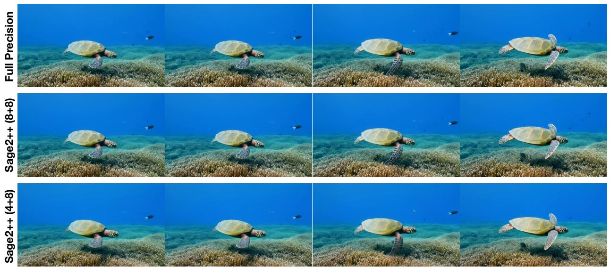

# **SageAttn2++ Full Precision SageAttention2++ on Wan SageAttention2++ on Flux**

Figure 5. A visible example of using SageAttention2++.

and without a Causal Mask [\(Vaswani, 2017\)](#page-6-13). Specifically, Fig. [1](#page-2-0) shows the speed across varying sequence lengths on RTX4090, indicating that SageAttn2++(4+8) and SageAttn2++(8+8) are approximately 3.9x and 3.0x faster than FlashAttention2, respectively. Fig. [2,](#page-2-1) [3](#page-2-2) and [4](#page-2-3)

show more kernel speed comparison on RTX4090 and RTX5090 GPUs.

### **SageAttention2++ on CogvideoX**

### **SageAttention2++ on HunyuanVideo**

Figure 6. Visible examples of using SageAttention2++ on video generation.

### 4.3. End-to-end Performance

Metrics loss. We evaluate end-to-end model performance using SageAttention2++ against baseline methods. Detailed evaluation results are presented in Table [3.](#page-3-0) The results indicate that SageAttn2++(8+8) and SageAttn2++(4+8) match the end-to-end metrics of SageAttention2. Specifically, SageAttn2++(8+8) incurs almost no metrics loss across various models and SageAttn2++(4+8) brings a little metrics loss.

Visible image and video examples. Fig[.5,](#page-3-1) [7,](#page-8-1) and [6](#page-4-0) show some visible comparison examples.

