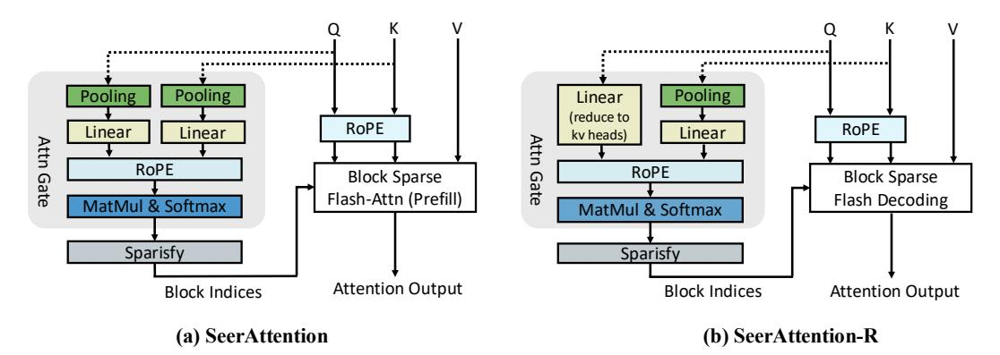

# 2 SeerAttention-R

#### 2.1 A Recap of SeerAttention

Figure 1: SeerAttention (Sparse Prefill) and SeerAttention-R (Sparse Decode). In SeerAttention-R, no sequence dimension compression/pooling operation is applied in Query (Q). Given that modern architectures predominantly use GQA, a linear layer projects the Q from its original number of heads down to the number of KV heads, enabling shared sparsity selection in a GQA group.

SeerAttention [\[19\]](#page-13-2) introduces self-distilled *Attention Gate* (AttnGate) that dynamically activates sparse blocks in attention computation for efficient long-context prefilling. Figure [1a](#page-1-0) shows the AttnGate architecture of SeerAttention, where Q, K tensors are both compressed (pooled) in the sequence dimension per block number of tokens. The compressed Q, K tensors are then passed through two newly added linear layers, which serve as learnable parameters in the AttnGate. With the following positional embedding, matrix-multiplication and softmax operation similar to standard attention, the AttnGate then generates the 2D block-level attention score estimation. Based on the output, we can selectively activate blocks with higher scores while skipping the rest.

In the distillation process, the AttnGate are trained to mimic the 2D block sparse distribution using the ground truth generated by the original pretrained model. This self-distillation training is efficient as the original model weights are frozen. In this way, it brings accurate sparse attention to pretrained full-attention models without costly fine-tuning or pre-training. Powered by customized block-sparse flash attention kernels, SeerAttention achieves supreme accuracy-efficiency tradeoff in downstream long-context benchmarks.

