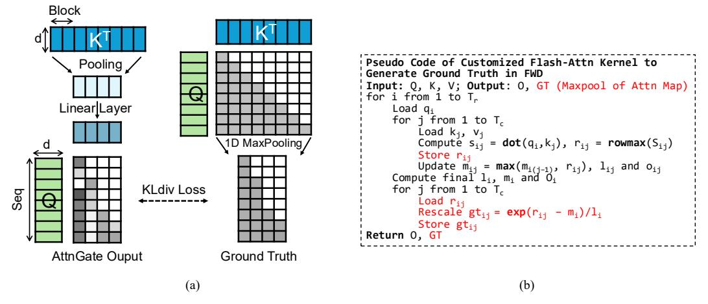

# 2.2 SeerAttention-R: AttnGate for Sparse Decoding

This work introduces SeerAttention-R, an extension of SeerAttention tailored for the long-decoding phase of reasoning models. The foremost difference of AttnGate design in SeerAttention-R is that it does not apply compression/pooling in the sequence dimension of Q to accommodate the token-by-token auto-regressive decoding process (shown in Figure [1b](#page-1-0)).

$$\mathbf{Q_{gate}} = \text{RoPE}\left(\mathbf{W_{gate}^{q}} \text{ reshape}(\mathbf{Q_{nope}}, [..., g \cdot d])\right), \tag{1a}$$

$$\mathbf{K_{gate}} = \text{RoPE}\Big(\mathbf{W_{gate}^{k}} \ \text{concat}[P_{\text{max}}(\mathbf{K_{nope}}), P_{\text{min}}(\mathbf{K_{nope}}), P_{\text{avg}}(\mathbf{K_{nope}})]\Big), \tag{1b}$$

$$\mathbf{S} = \operatorname{softmax}(\mathbf{Q_{gate}} \mathbf{K_{gate}}^{\top} / \sqrt{d_{gate}}). \tag{1c}$$

where, Pmax, Pmin, and Pavg stand for Max, Min and Average Pooling in sequence dimension, and g is the group size of GQA setting. d and dgate are the hidden dimension of the original model and AttnGate for each head, respectively. S is the output score of each block from AttnGate. The detailed design are discussed as follows.

Aggregation of Query Heads for Shared Sparsity in GQA Group Query Attention (GQA) [\[3\]](#page-12-1) is widely used in LLMs to reduce KV cache size. In GQA, the query heads are organized into groups, and each group shares a key-value head. Recent sparse attention works SAAP [\[47\]](#page-15-5) and NSA [\[71\]](#page-16-1) show that using identical attention sparsity choices for all queries in a group can improve the efficiency while achieving similar or better performance. In SeerAttention-R, we follow this practice and use an linear layer in the Q branch of AttnGate to reduce each subgroup of queries to one single head. For example, with 32 query heads and 8 key-value heads (group size g = 4), there will be 8 sets of linear weights in shape [dgate, 4 × d] applying on each group of queries heads, resulting only 8 heads of Qgate. Since we keep the number of heads untouched in K branch of AttnGate, the final output of AttnGate will be key-value heads, achieving a shared decision of sparsity in a group.

Pooling-based Compression of K We follow the practice of SeerAttention that uses pooling operations to compress the sequence dimension of K. The kernel and stride size of pooling are both equal to block size, which can also be understood as non-overlapping chunk-level pooling. To mitigate the potential information loss associated with pooling operations, we employ a composition of Max, Min, and Average pooling operations. The outputs from these pooling operations are concatenated prior to being fed into the subsequent linear layer, similar to SeerAttention. The intuition behind this approach is that Max and Min Pooling can effectively capture outlier values, while Average Pooling helps to keep the overall distribution intact.

Positional Embedding in AttnGate In line with SeerAttention, the decode AttnGate utilizes the pre-rope Q and K tensors as inputs and reapplies RoPE [\[53\]](#page-15-6) within AttnGate. Given that the branch is compressed along the sequence dimension, the position index is assigned to the initial token of each block. In our experiment, we found that the use of positional embedding in AttnGate can consistently achieve better accuracy compared to the design without positional embedding.

## 2.3 Distillation/Training

Previous SeerAttention introduces AttnGate distillation method using the ground truth generate by LLM itself in the prefilling phase. The training process is efficient as only the AttnGate are trained. In SeerAttention-R, we extend this method to the decoding scenario by slightly changing the form of the ground truth. Figure [2](#page-3-0) shows the overall diagram of the training process.

Figure 2: Training Diagram and Training Kernel of SeerAttention-R. (a) Self-distillation training of AttnGate in SeerAttention-R. It uses 1D maxpooled attention scores from original model as ground truth to train AttnGate. Query head reduction is not plotted in the diagram for simplicity. (2) Pseudo code of attention forward kernel for training that directly generates ground truth and attention output.

**Ground Truth** To train AttnGate for the auto-regressive decoding process, we need to adapt the ground truth generation method. Instead of performing 2D maxpooling of attention map in the prefill case, we only do column-wise 1D maxpooling shown in Figure 2a. This corresponds to the decoding AttnGate that does not compress in sequence dimension. Moreover, to accommodate the shared sparsity in GQA, the column-pooled attention map is further maxpooled within each query heads subgroup, resulting in a ground truth with key-value heads. Finally, the ground truth is normalized to summation 1. We then use the Kullback-Leibler divergence loss [30] to train AttnGate in the distillation process.

Efficiently Obtaining Ground Truth during Training Explicitly calculating the full attention map softmax( $\mathbf{Q}\mathbf{K}^{\mathbf{T}}/\sqrt{\mathbf{d}}$ ) and then perform the block-level pooling can cost huge GPU memory due to the quadratic complexity. In SeerAttention-R, we also provide an efficient modification of FlashAttention-2 [14] kernel that directly generates the ground truth along with the attention output. This kernel largely reuses the intermediate results (e.g. block-level rowmax) in Flash-Attention and thus increases the efficiency of the distillation process. The pseudo code is shown in Figure 2b.

