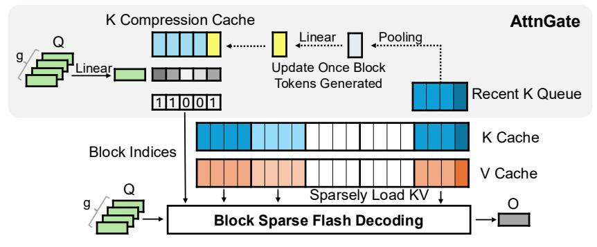

# 3 Inference of SeerAttention-R

Figure 3: Inference Diagram of SeerAttention-R. During inference, a K Compression Cache is used to cache the compressed key representation in AttnGate to speedup sparse block prediction. This K Compression Cache only updates once per block number of tokens is generated (block=4 in the plots for illustration). As a result, the last block of sequence is always selected to compensate when the compression cache has not been updated yet. g is the group size of GQA.

