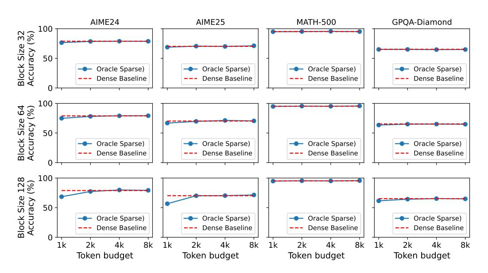
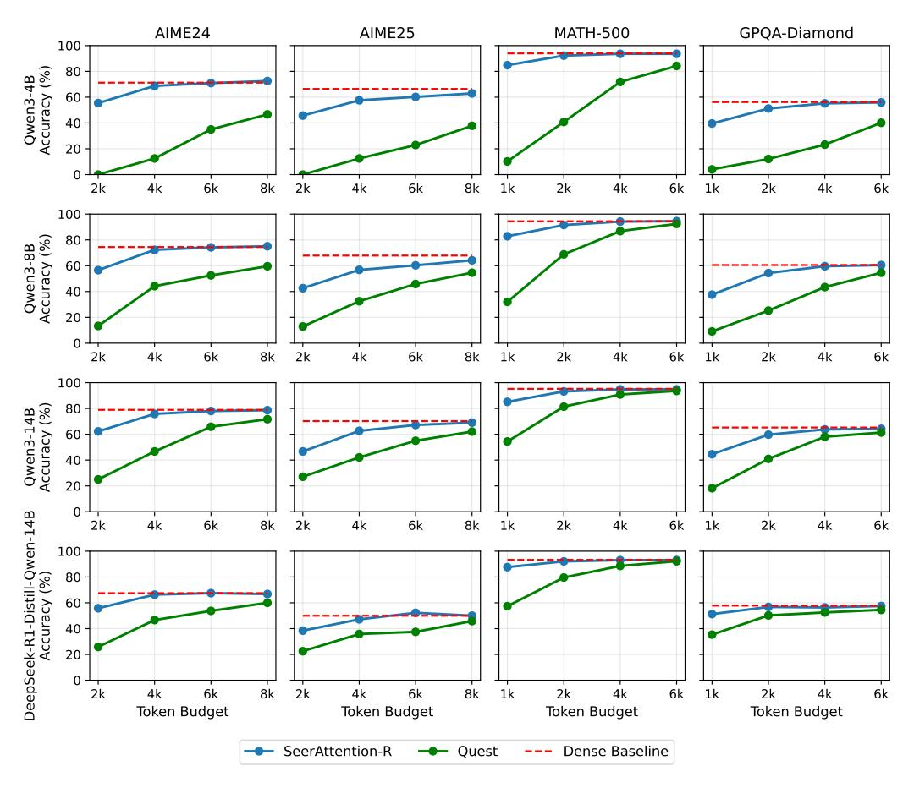
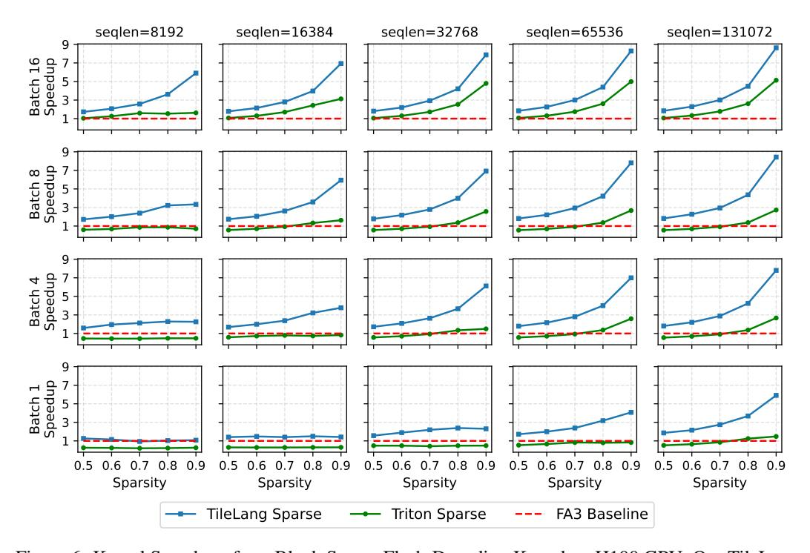

# 3.1 Sparsify Methods: Token Budget vs Threshold

During training, the AttnGate output S are distilled to mimic the distribution of the block-wise attention maps from the original model in real-valued (floating-point) form. During inference, important key-value blocks can be selectively activated based on the predictions of AttnGate. In SeerAttention-R, we apply two sparsity methods to convert the soft AttnGate outputs into binary block masks (or block indices). The first method is the *token budget* approach, which is widely adopted in sparse attention methods. Given a fixed token budget, it is first translated into a block budget by dividing the token budget by the block size. The AttnGate outputs are then sorted using a Top-k kernel, where k corresponds to the block budget. While this method introduces an additional Top-k operation, it eliminates the need for a softmax operation in AttnGate. The second method is the *threshold* approach, which simply selects blocks whose scores exceed a given threshold. The threshold method is more self-adaptive as different heads may automatically infer different sparsity ratios. While these two methods involve different trade-offs between efficiency and accuracy, the token budget approach is better suited for direct comparisons with other methods.

#### 3.2 K Compression Cache

Similar to KV cache, in SeerAttention-R, we use a *K Compression Cache* to store the compressed representation of K (after pooling plus linear) to speedup AttnGate prediction. Thus, AttnGate does not need to recompute K branch for past seen tokens. The update of K Compression Cache is consist of two phases. First, when the sequence length is not the multiplies of block size b, the new entry of K Compression Cache may not be accurate. During this time, the last block is always activated to eliminate unnecessary accuracy loss. Second, as long as b number of new tokens are generated, the most recent b tokens will pass through the pooling and linear layer and update the K Compression Cache. In this way, the overhead of AttnGate can be minimized.

In practice, SeerAttention-R utilizes a relatively large block size b, such as 64, which significantly reduces the overhead of the K Compression Cache. Specifically when b = 64, the additional memory required for the K Compression Cache amounts to only 1/128 (<1%) of the original KV cache size. This minimal overhead makes it highly efficient. Moreover, it introduces the possibility of offloading the larger KV cache to CPU or other storage. During inference, only the activated blocks need to be retrieved and transferred back to GPU memory on demand. Alternatively, sparse attention computations can even be performed on heterogeneous resources, such as the CPU, further optimizing memory usage and enabling efficient handling of long-context decoding tasks.

## 3.3 Block Sparse Flash Decoding Kernel

To accelerate decoding under block-sparse attention, we design a specialized kernel that extends the FlashAttention decoding pattern to support dynamic block sparsity in the key/value memory. Our kernel adopts the grid scheduling strategy of flash decoding for GQA, using a three-dimensional launch space over (*batch, heads\_kv, num\_split*). This design supports concurrent computation across multiple query groups and key/value shards, maximizing block-level parallelism.

Our block sparse version of the decoding kernel takes the activated block indices from AttnGate (shape [*batch, heads\_kv, max\_selected\_blocks*]), which encodes the selected key/value blocks for each group of query heads. During execution, the kernel only traverses the selected indices and thus skips invalid entries, avoiding unnecessary computation and memory access. To improve load/compute balancing across Streaming Multiprocessors (SMs), we partition the key/value blocks along the *num\_split* dimension using *max\_selected\_blocks* rather than the total number of blocks. This strategy ensures a more uniform work distribution in the presence of sparsity-induced irregularity.

On H100 GPUs, our kernel leverages the *wgmma* instructions for better Tensor Core usage by padding the number of query head groups to 64. We implement the kernel using TileLang [\[1\]](#page-12-0), which automatically applies computation optimizations like tiling [\[79\]](#page-17-0), warp specialization and pipelining [\[12\]](#page-13-5), and memory layout optimizations such as tensorization, rasterization and swizzling [\[61\]](#page-16-2) based on the target architecture. Additionally, we provide a Triton-based implementation with the same scheduling strategy, allowing for comparative evaluation.

## 4 Experiments

## 4.1 Experiments Setup

Benchmarks, Models, and Baselines We evaluate SeerAttention-R on three math reasoning benchmarks: the American Invitational Mathematics Examination: AIME24, AIME25 [48], and MATH-500 [25], as well as GPQA-Diamond [50]. For model evaluation, we select four open-source pre-trained language models with strong reasoning capabilities: Qwen3-4B, 8B, 14B [66], and DeepSeek-R1-Distill-Qwen-14B [23]. All models are based on the standard Transformer architecture with Grouped Query Attention (GQA). We compare SeerAttention-R against standard full attention and Quest [57]. Quest is a training-free sparse attention algorithm applied during decoding, employing a query-aware key-value (KV) cache selection strategy. Specifically, Quest estimates the upper bound of attention scores within each KV block (or "page") to select the most relevant blocks. By default, Quest uses a block size of 16, and keeps the first two layers fully dense to minimize error. In Section 4.3, we set the block size to 64 for both Quest and SeerAttention-R, and apply sparse attention to all layers to enable a direct comparison. We also conduct ablation studies to analyze the impact of varying block sizes (Section 5.1) and incorporating hybrid dense layers (Section 5.2). Note that SeerAttention-R enables shared sparsity selection within each GQA group, whereas Quest does not. Across all experiments, we set the max output length to 32,768 tokens. While Owen3 series of models extends this length to 38,912 for AIME24 and AIME25 in their official report, we fix this output length to ensure consistency and fair comparison across all settings. For SeerAttention-R and the full attention baseline, we report average pass@1 accuracy over 64 samples for AIME24 and AIME25, 8 samples for MATH-500, and 16 samples for GPQA-Diamond.

**Training Setup for SeerAttention-R** To distill AttnGate, we use the OpenR1-MATH-220k [17] dataset for training. Importantly, only the AttnGate is trained, and the original model weights remain unchanged. Inputs are packed into sequences of up to 32k tokens with our variable-length Flash-Attention training kernel that also generates ground truth (Section 2.3). Training is performed with a global batch size of 16 for 800 steps on AMD MI300x GPUs, utilizing DeepSpeed ZeRO-2 optimization. We use AdamW optimizer and a learning rate of 1e-3 with cosine decay schedule.

#### 4.2 Oracle Sparse Accuracy: How Sparse is Attention in Reasoning Models?

Figure 4: Oracle Sparse Results of Qwen3-14B with block size 32, 64, 128.

In the first experiment, we aim to answer the question: *How sparse is attention in reasoning models?* To investigate this, we employ *oracle block sparse selection*, which utilizes the ground truth in SeerAttention-R training to select sparse key-value (KV) blocks. While this approach basically means

compute attention twice and does not provide any speedup, it allows us to evaluate the accuracy upper bound achievable by SeerAttention-R under ideal sparse selection.

We evaluate Qwen3-14B with three different sparse block sizes: 32, 64, and 128. The token budgets range from 1k to 8k. As shown in Figure [4,](#page-5-1) using oracle sparsity achieves lossless performance on all tasks when the token budgets reach 2k. For the more challenging AIME24 and AIME25 tasks, some accuracy degradation is observed with 1k token budget, particularly with the largest block size (128). However, this degradation is negligible when using block sizes of 32 or 64. These results indicate that attention sparsity exists in the reasoning process. Based on this, we select a block size of 64 as the default for SeerAttention-R.

## 4.3 Results of SeerAttention-R and Quest

Figure 5: Accuracy Results of Full Attention, SeerAttention-R, and Quest. The Quest sparse configuration is set to be the same as SeerAttention-R for fair comparison, which uses a block size of 64 and sparse attention in all layers.

Figure [5](#page-6-1) shows the results of all the models and benchmarks of Full Attention baseline, SeerAttention-R and Quest. As mentioned above, we modify the configuration of Quest to be the same as SeerAttention-R (block size 64 and using sparse attention in all layers). We use token budgets from 2k, 4k, 6k, and 8k for AIME24 and AIME25, and 1k, 2k, 4k, and 6k for MATH-500 and GPQA-Diamond. This is mainly because the typical averaged reasoning length from different benchmark is not the same. For the more challenging AIME24 and AIME25, the averaged generated lengths of these models are around 11k-18k. While for the easier MATH-500 and GPQA, the averaged lengths are reduced to 4k-9k. However, it is critical to note that across all combinations, the maximum generation lengths all reached the 32k token cap, underscoring the consistent demand for efficient long-context processing.

The results show that SeerAttention-R achieves consistently better performance compared to Quest. This trend holds true across every benchmark and computational budget, underscoring the robustness and effectiveness of SeerAttention-R. For the AIME24 benchmark, SeerAttention-R typically achieves lossless performance with 4k token budget on while the previous oracle sparse only requires 2k. This is within expectation as SeerAttention-R is only an approximation of ground truth with much less computation required. However, Quest fails achieve lossless accuracy even using 8k token budgets under identical setting. For MATH-500 and GPQA-Diamond, the lossless token budgets reduce to 2k for SeerAttention-R while Quest requires around 8k to approach the full attention baseline.

A key trend observed across the results is the relationship between model scale and tolerance for sparse attention. Larger models, such as the 14B variants, exhibit greater robustness to the information loss inherent in sparsity compared to their 4B and 8B counterparts. This phenomenon is particularly pronounced for Quest, where the accuracy gap at lower budgets shrinks significantly as the model size increases. For SeerAttention-R, the effect is also present. The 14B models close the final gap to the dense baseline more easily than smaller models on challenging benchmarks like AIME25. This indicates that as reasoning models continue to scale, the viability of sparse attention methods increases.

In conclusion, the results demonstrate the superiority of SeerAttention-R's self-distilled approach over the training-free heuristics of Quest, especially in the challenging large block size configuration. Previous work Lserve [67] also mentions the accuracy degradation of Quest over larger block sizes. They resolve this challenge by introducing Hierarchical Paging, a system approach that uses an additional level of block(page) abstraction called virtual logical page, which decouples the sparsity selection page size and physical page size. With SeerAttention-R, we can possibly simplify the sparse attention system design by using a larger block size.

#### 4.4 Kernel Speedup

Figure 6: Kernel Speedup of our Block Sparse Flash-Decoding Kernel on H100 GPU. Our TileLang implementation of the kernel achieves higher speedup ratio compared to Triton implementation. For longer sequence length or larger batch size cases, the speedups approach the theoretical upper bound compared to FA3 basline.

This section evaluates our customized block sparse flash decoding kernel described in Section 3.3. We implement the kernel with both TileLang [1] and Triton and we use FlashAttention-3 (FA3) [51]

as baseline. The experiments are run on Nvidia H100 GPU with different input sequence lengths (8k to 128k), batch sizes(1 to 16) and sparsity ratios (0.5 to 0.9). In terms of GQA setting, we use a setting of 64 attention heads with 8 key-value heads, and head dimension 128.

Figure [6](#page-7-0) presents the detailed results. Each subplot corresponds to a specific combination of input sequence length (seqlen) and batch size (bs), with the x-axis showing different sparsity ratios and the y-axis indicating speedup. The TileLang implementation consistently outperforms the FA3 baseline and achieves greater speedup than the Triton implementation. In general, the sparse kernel delivers higher speedup when the input sequence length is longer or the batch size is larger. This is expected, as the decoding kernel is primarily I/O-bound. When the KV cache size is sufficient to saturate the bandwidth, such as when bs=16 and seqlen ≥ 32k, our sparse kernel achieves near-theoretical speedup (up to 9× at 0.9 sparsity). Even for moderate KV cache sizes, e.g. bs=4 and seqlen=32k, the kernel demonstrates significant speedup (up to 6× at 0.9 sparsity).

