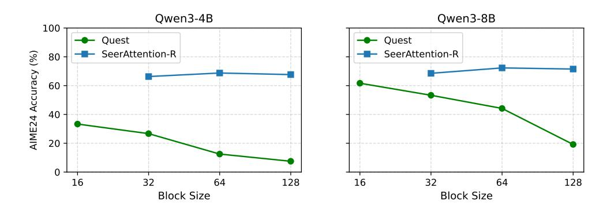
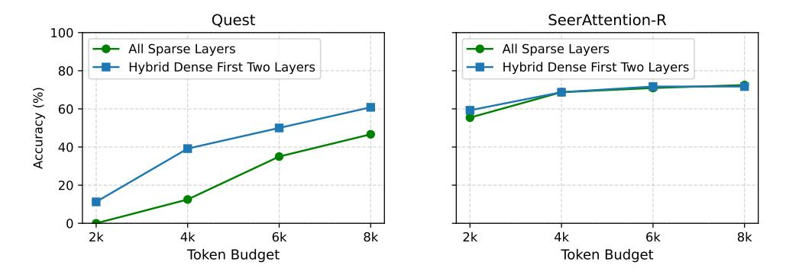
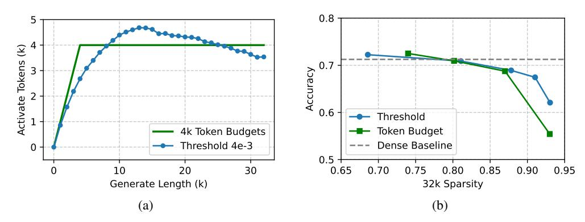

# 5 Ablation Studies

## 5.1 Block Size for Sparse Attention

Figure 7: AIME24 results using different block sizes with 4k token budget. SeerAttention-R achieves almost consistent performances on different block sizes. However, Quest gets lower accuracy when block size gets larger. Note that in this experiment, SeerAttention-R enables shared sparsity selection within each GQA group, whereas Quest does not.

The token block size for sparse attention is a critical factor that affects overall system performance. If the block size is too small, it incurs significant overhead in sparse block prediction, including increased computational cost and larger metadata requirements such as compression caches and block indices. While a larger block size can also potentially improve the utilization of GPUs.

Figure [7](#page-8-2) presents AIME24 results on the Qwen3-4B and Qwen3-8B models across block sizes ranging from 16 to 128. By default, Quest uses a block size of 16. The results indicate that Quest's performance decreases as the block size increases. However, SeerAttention-R achieves consistent accurate sparse block selection at different block sizes. Remarkably, this robustness lies under the assumption of the additional mask sharing in the GQA group dimension. We excluded a block size of 16 from our experiments due to its inefficiency during both training and inference. It often leads to out-of-memory errors because of the large intermediate attention maps generated during training.

#### 5.2 Hybrid Dense Attention in the First Two Layers

Some post-training sparse attention algorithms employ hybrid dense attention in certain layers to mitigate accuracy loss. By default, Quest applies dense attention in its first two layers. However, for a fair comparison, we evaluate both Quest and SeerAttention-R using purely sparse attention across all layers in previous evaluation. This approach allows us to isolate and analyze the effects of sparse attention without the confounding influence of hybrid attention.

To further investigate the impact of hybrid dense attention, we conduct an ablation study using the Qwen3-4B model on the AIME24 benchmark with a block size of 64. As shown in Figure [8,](#page-9-0)

Figure 8: AIME24 results of whether using dense attention in first two layers (Qwen3-4B).

incorporating hybrid dense attention in Quest yields a significant improvement in accuracy, whereas SeerAttention-R only sees marginal benefits. This difference may be due to the already accurate sparse prediction by SeerAttention-R in the first two layers, reducing the potential gains from hybridization.

#### 5.3 Threshold VS Token Budgets

Figure 9: Threshold vs. Token Budget. Results are obtained using Qwen3-4B models on AIME24 benchmark. (a) Difference of activated tokens distribution of two methods. (b) Sparsity vs Accuracy tradeoff of two methods. Thresholds: 2e-3, 3e-3, 4e-3, 5e-3, 6e-3. Token Budget: 8k, 6k, 4k, 2k.

In SeerAttention-R, we employ two AttnGate sparsification strategies, threshold and token budget, to convert real-valued gate scores into discrete block selections. The token budget method offers an straightforward way to align sparsity and compare with different methods. However, the threshold method is extremely simple to implement and avoids the need of sorting. Figure 9a illustrates the distribution of activated tokens across varying sequence lengths using a threshold of 4e-3 and a token budget of 4K on the AIME24 benchmark with Qwen3-4B model. The token budget approach results in a strict piecewise linear activation pattern, whereas the threshold method yields a smoother, curved distribution. Figure 9b compares the sparsity–accuracy trade-offs of the two methods. The threshold method shows slightly better accuracy in high sparsity region.

## 5.4 Impact of Sparse Attention on Generate Length

We observed that using inaccurate sparse attention (too small budget or low recall) can increase output token lengths in reasoning tasks. Table 1 shows the AIME accuracy and reasoning length using Qwen3-8B model. The baseline accuracy of full attention and the generated length are 74.5 and 15.1 k, respectively. We can see that Quest, and SeerAttention-R with 2k budget cases, all incur much longer reasoning paths compared to full attention. A similar phenomenon has been reported in quantization [43], where inaccurate quantization algorithms lead to longer reasoning paths. We believe this effect is universal across different post-training efficiency optimizations of reasoning model, as such methods can introduce errors that accumulate over the long reasoning chains.

Table 1: Qwen3-8B AIME24 Accuracy vs. Reasoning Length.

|                 |                | Token Budgets |      |      |      |  |
|-----------------|----------------|---------------|------|------|------|--|
|                 |                | 2k            | 4k   | 6k   | 8k   |  |
| Quest           | Accuracy       | 13.3          | 44.2 | 52.5 | 59.6 |  |
|                 | Gen. Length(k) | 30.0          | 22.9 | 19.6 | 17.2 |  |
| SeerAttention-R | Accuracy       | 56.6          | 72.3 | 74.2 | 75.1 |  |
|                 | Gen. Length(k) | 19.8          | 16.3 | 15.3 | 15.1 |  |

These additional reasoning steps potentially undermine the original goal of improving efficiency. Therefore, an accurate sparse attention selection algorithm is crucial to mitigate this effect. Another promising approach to eliminate the accumulated errors is to use Rectified Sparse Attention [\[56\]](#page-15-7), which periodically performs dense rectification of the KV cache.

## 5.5 Training Budget

Table 2: Training Budgets

| Training Tokens | GPU Hours |          |           |  |  |
|-----------------|-----------|----------|-----------|--|--|
| 0.4B            | Qwen3-4B  | Qwen3-8B | Qwen3-14B |  |  |
|                 | 10.9      | 12.2     | 18.6      |  |  |

As a lightweight distillation process where only the AttnGate parameters are trained, SeerAttention-R is also highly efficient in terms of training. In our experiments, we set the global batch size to 16 and trained for just 800 steps, utilizing DeepSpeed Stage 2 optimization on MI300x GPUs. Each data batch is packed to a sequence length of 32k with our custom variable-length FlashAttention forward kernel, as described in Section [2.3.](#page-2-0) Table [2](#page-10-1) summarizes the GPU hours required for training models of various sizes. Notably, distilling an 8B model requires only 12 GPU hours, demonstrating the efficiency of our approach. Increasing the quantity, quality, and diversity of training data may lead to further improvements.

