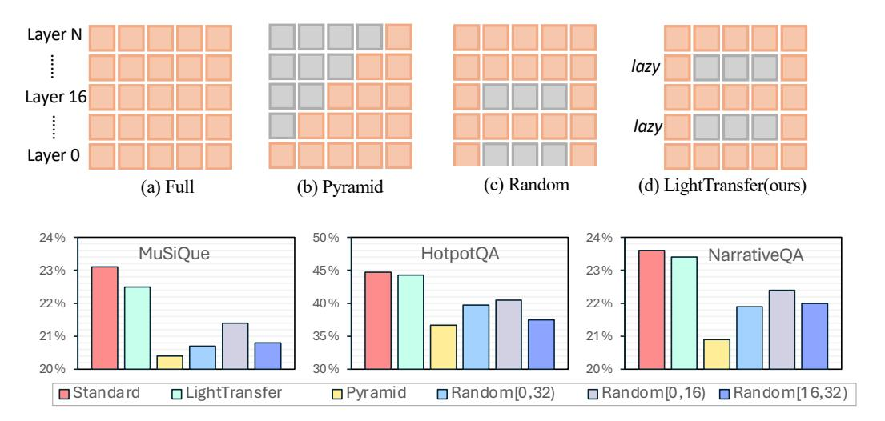

# **6.1.2 Experiments on NIAH**

**Settings.** We also evaluate whether LightTransfer-Test can preserve in-context retrieval capabilities while replacing some standard attention layers into memory-efficient streaming attention. The evaluation is conducted on single-key and multiple-key NIAH tasks collected in the Ruler [\(Hsieh et al., 2024\)](#page-12-12) benchmark. We report the performance with input context lengths of 4K, 8K, 16K, and 32K. Detailed experimental configurations can be found in Appendix [A.](#page-15-2)

**Results.** Figure [4](#page-8-0) summarizes the performance on NIAH tasks, with the context length ranging from 4K to 32K. While our LightTransfer-Test replacing select transformer layers with streaming attention reduces memory overhead, strategically retaining original attention mechanisms in deeper layers ensures robust long-range dependency modeling. This explains the maintained performance on single-key tasks (32K: 96.7% vs standard 96.6%) and competitive multi-key results at 32K (78.2% vs 78.9%). The retained standard layers serve as an anchor for cross-token reasoning, which is crucial for in-context retrieval.

### **6.2 Experiments on o1-like Long Reasoning Tasks**

In these experiments, we investigate the effectiveness of LightTransfer-Train on o1-like long reasoning generation tasks. While these tasks feature relatively short inputs, they demand intricate reasoning. Consequently, we SFT the model with approximately 5K training examples to facilitate swift adaptation within the transferred hybrid architecture.

**Settings.** Experiments are conducted on three widely used mathematical benchmarks AIME24, MATH-OAI, and GSM8K. We use greedy decoding to evaluate the performance of our model with maximum tokens set to 32K. We aim to experiment with models capable of generating CoT, such as QwQ. However, as the original training data for QwQ is not publicly available, we adopt the public training set provided by QwQ-STILL [\(Min](#page-13-4) [et al., 2024\)](#page-13-4), a model demonstrated to achieve comparable performance to QwQ. Specifically, following QwQ-STILL, we apply a simple distillation approach using Qwen2.5-32B-Instruct as our base model. We generally follow the original training set of QwQ-STILL, and replace 50% of layers with streaming attention. To mitigate the training complexity of attention, we optimize LightTransfer-Train training using Flex Attention [\(Dong et al., 2024\)](#page-12-13).

Table 4: Performance comparison of LIGHTTRANSFER and baseline methods that operate without tuning LLM parameters on mathematical benchmarks using QwQ-32B. **Bold** denotes the best method.

| Method                     | MathOAI             | AIME24 |
|----------------------------|---------------------|--------|
| QwQ-STILL                  | 90.2                | 46.7   |
| MiniCache-Test             | 20.0                | 0.0    |
| SqueezeAttention-Test      | 82.6                | 15.0   |
| DuoAttnTrain               | 79.2                | 33.3   |
| LightTransfer-Test (ours)  | 85.0                | 40.0   |
| LIGHTTRANSFER-TRAIN (OURS) | $\boldsymbol{90.7}$ | 53.3   |

Figure 5: Lazy ratio scores across layers in QwQ-32B-STILL.

Baselines. We compare our LIGHTTRANSFER-TRAIN against the following baselines: 1) QwQ-STILL (Min et al., 2024): a distilled model on Qwen2.5-32B-Instruct that achieves performance comparable to QwQ-32B-Preview, whose training data is publicly available. 2) LongGen (Ge et al., 2024): an approach that assumes the layers at both ends of the model do not handle global information and predefines the replacement of those layers with sparse attention.

We further benchmark LIGHTTRANSFER-TEST against (i) existing *training-free* sparsification baselines, and (ii) DuoAttention (Xiao et al., 2024). Unlike our approach, DuoAttention must first run on a *separate* calibration set to pinpoint those attention heads whose KV cache should be evicted, whereas LIGHTTRANSFER operates entirely calibration-free.

Results. Table 3 shows that LIGHTTRANSFER-TRAIN retains its performance on Math-OAI (+0.5%), AIME24 (+6.6%) and GSM8K (-0.1%). In contrast, LongGen, which assumes its middle layers require standard attention, exhibits no drop on GSM8K but suffers a 30.0% and 12.4% decrease on AIME24 and Math-OAI, respectively. While the unchanged GSM8K results for LongGen may indicate that GSM8K poses lower complexity for these models, the broader comparisons nevertheless highlight the strength of our data-driven layer selection. Specifically, our LIGHTTRANSFER-TRAIN calculates each layer's lazy ratio (Figure 5) and replaces those exhibiting the highest, which is proven to be more robust than hand-crafted assumptions. Moreover, our findings underscore the existence of layer-level KV cache redundancy even in o1-like long reasoning models, emphasizing the promise of hybrid transformer architectures. Meanwhile, as shown in Table 4, LIGHTTRANSFER-TEST surpasses all other training-free baselines on both MathOAI and AIME24, highlighting its suitability for long reasoning generation tasks.

#### 6.3 Ablation Studies & Analysis

Standard layer retention ratio vs. model performance. As shown in Figure 6, we systematically vary the fraction of layers that use original attention from 0.25 to 0.5, up to 0.75, for both LLaMA3-8B-Instruct and LLaMA3-70B-Instruct on LongBench benchmark. As expected, higher retention ratios consistently

Figure 6: Effect of retaining standard attention in more layers on LongBench.

Table 5: Relative token-generation throughput at different sequence lengths (4K, 8K, 16K, and 32K) compared to the Full baseline. **Bold** denotes the best method.

| Method        | 4K            | 8K            | 16K                        | 32K                        |
|---------------|---------------|---------------|----------------------------|----------------------------|
| SqueezeAtten. | $1.03 \times$ | $1.09 \times$ | $1.12 \times$              | $1.04 \times$              |
| MiniCache     | $1.26 \times$ | $1.29 \times$ | $1.52 \times$              | $1.41 \times$              |
| LIGHTTRANSFER | $1.44 \times$ | $1.78 \times$ | $\boldsymbol{2.17} \times$ | $\boldsymbol{1.75} \times$ |

yield improved model performance. However, this comes at the cost of increased memory consumption, highlighting the trade-off between efficiency and accuracy. Notably, across all compression settings examined, LIGHTTRANSFER-TEST surpasses the strongest baseline on that benchmark (i.e., SqueezeAttention), thereby underscoring the benefit of transitioning standard transformers to hybrid models via strategical designs for more efficient generation.

Throughput of token generation. To evaluate how these memory optimizations impact token-generation throughput, we conduct experiments with Mistral-7B on the Ruler benchmark under maximum batch-size configurations. Input sequence lengths of 4K, 8K, 16K, and 32K were tested while retaining 50% of the standard attention layers. As shown in Table 5, LIGHTTRANSFER-TEST consistently achieves the highest throughput compared with other training-free test time inter-layer KV cache reduction methods. In contrast, SqueezeAttention, despite having the same compression ratio, fails to reduce peak memory usage during the prefilling phase, since it must complete prefilling for all layers before applying compression. This constraint limits the feasible batch size, restricting potential throughput. Meanwhile, MiniCache exhibits lower throughput due to its smaller compression ratio (i.e., removing KV caches in at most 25% of layers). These findings underscore the effectiveness of LIGHTTRANSFER in balancing memory usage and computational efficiency.

Effect of different layer replacement strategies. As shown in Figure 7 (a-d), we experiment with four different layer replacement strategies for integrating memory-efficient streaming attention into transformers, with consistent replacement counts (except Standard). The results shown in Figure 7 indicate noticeable reductions for Pyramid and Random strategies, suggesting that the predefined expectations about each layer's function may not fully align with their actual roles. Moreover, the performance of our LIGHTTRANSFER surpasses other strategies, suggesting that LIGHTTRANSFER is effective in reducing memory usage while maintaining performance. Additional results with two extra baselines are provided in Appendix C.5.

Figure 7: Different layer replacement strategies and their performance on LLaMA3-8B-Instruct: 1) Standard: Use standard attention in all layers. 2) Our LightTransfer: Dynamically identify lazy layers on the fly, and replace their attention mechanism accordingly. 3) Pyramid: Replace each layer with memory-efficient attention; the budget decreases with depth, forming a pyramid-like structure. 4) Random: Randomly replace layers with memory-efficient attention within the ranges [0*,* 16), [16*,* 32), or [0*,* 32). We keep a **same** number of replaced layers, except Standard.

