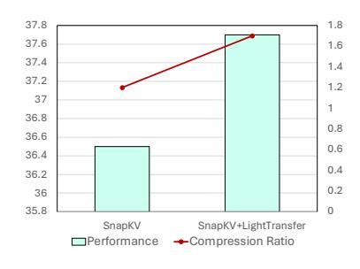

# **C Additional Experiment Results.**

#### **C.1 Impact of Hyperparameters**

We adopt these hyperparameters either directly from StreamingLLM [Xiao et al.](#page-14-6) [\(2023\)](#page-14-6) (i.e., *w*sink and *w*recent), ensuring consistency with established practices in the field, or through preliminary experiments (i.e., *w*last). We also conducted additional experiments to analyze the impact of hyperparameters (*w*sink, *w*recent, and *w*last) on model performance. As shown in Table [7,](#page-17-1) the variation in performance remains within one percentage point across different configurations, demonstrating the robustness of our approach to hyperparameter choices.

#### **C.2 Combination with Intra-layer KV Cache Reduction Methods**

To illustrate the orthogonality between our LightTransfer-Test and intra-layer KV cache compression methods, we conduct additional experiments that combine LightTransfer-Test with SnapKV (a cuttingedge method for intra-layer KV cache reduction). In these experiments, SnapKV is applied to compress the KV cache in non-lazy layers, while LightTransfer-Test remains active for lazy layers. We use Qwen2.5-3B-chat-32K for this analysis. As shown in Figure [8,](#page-18-2) leveraging LightTransfer-Test alongside an intra-layer KV cache compression method can further reduce KV cache size while preserving model performance, underscoring LightTransfer-Test's orthogonality to existing methods focused on intra-layer redundancies.

Figure 8: Comparison of SnapKV and SnapKV+LightTransfer.

### **C.3 Comparison with Head-wise KV Cache Reduction Methods**

We use 50% sparsity across all methods and evaluate on LLaMA3-8B-Instruct-Gradient-1048K to align with DuoAttention's released checkpoint.

Under the same sparsity level, our method is on par with DuoAttention [\(Xiao et al., 2024\)](#page-14-13), which requires training and is head-wise. FastGen [\(Ge et al., 2023\)](#page-12-14) will be OOM on most datasets because it is incompatible with flash attn [\(Xiao et al., 2024\)](#page-14-13). RazorAttn [\(Tang et al., 2024\)](#page-14-16) and HeadKV [\(Fu et al., 2024\)](#page-12-15) are highly sensitive to the calibration set. Although we follow their reported calibration setup, the results are hard to reproduce. Therefore, we use the full LongBench dataset (input only) for their calibration. Unlike [\(Xiao](#page-14-13) [et al., 2024;](#page-14-13) [Ge et al., 2023;](#page-12-14) [Tang et al., 2024;](#page-14-16) [Fu et al., 2024\)](#page-12-15), our search strategy only needs one additional matmul operation, which is fast. Thus, LightTransfer does not need any calibration set and can perform on-the-fly search, thereby avoiding sensitivity issues.

