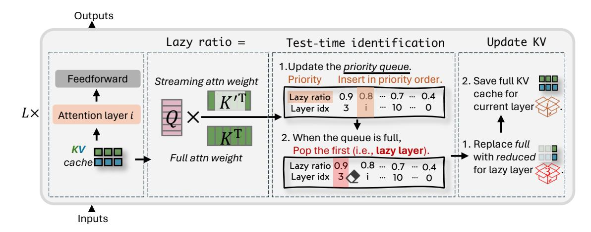
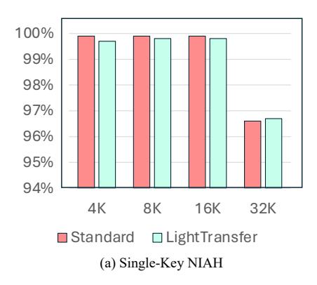
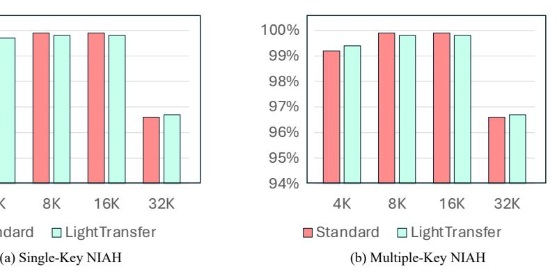

# <span id="page-3-0"></span>**4 Observations**

In this section, we analyze the attention patterns during inference in long-context LLMs, providing insights that motivate our approach to transform the standard transformer into its corresponding hybrid variant. The study is conducted on the LLaMA3-8B-Instruct model [\(Dubey et al., 2024\)](#page-12-0) using a sample from the LongBench [\(Bai et al., 2023\)](#page-11-2) benchmark. Our key findings are as follows:

**Layer behavior in long-context LLMs during inference.** Previous research [\(Xiao et al., 2023\)](#page-14-6) has shown that a large portion of attention in LLMs tends to focus on semantically unimportant tokens *X*initial (e.g., the first few tokens) and the most recent tokens *X*recent (i.e., tokens in the sliding window). We refer to this pattern as *lazy* behavior, likening it to skimming a paper by reading only the first lines and the conclusion. While it is also called attention sink [\(Xiao et al., 2023;](#page-14-6) [Gu et al., 2024\)](#page-12-10), we emphasize the shortcut nature by referring to it as lazy. Through our analysis, we find that even with long contexts, some layers exhibit more pronounced lazy behavior, which we define as *lazy layers*. The left panel of Figure [2](#page-3-1) presents the attention patterns across different layers. We observe that some layers (e.g., layer 0) do not follow a clear pattern in

<span id="page-4-0"></span>

Figure 3: The framework of our LIGHTTRANSFER-TEST. A priority queue is maintained during the prefilling stage to store the lazy ratio and corresponding layer index after processing each layer. Once the queue reaches its capacity, the layer with the highest lazy ratio is identified as a lazy layer, and its KV cache is reduced, freeing memory for storing the KV cache of the current layer.

attention weight distribution, while others (e.g., layer 20) show a clear lazy behavior pattern. Consequently, a more memory-efficient attention mechanism can be employed in these lazy layers by retaining only a subset KV cache of constant size.

Layer behavior remains consistent for a given input. To further explore whether a layer consistently functions as a lazy layer during generation for a fixed prompt, we visualize the attention weights for  $\{X_{\text{initial}}, X_{\text{recent}}\}$  across all layers for all generated tokens in the right panel of Figure 2, using a randomly selected sample (additional examples are provided in Figure 9). Notably, for a given input prompt, layers that exhibit lazy behavior maintain this pattern relatively consistently across tokens. This suggests a certain degree of stability in attention dynamics throughout the generation process. In addition, the indexes of these consistent lazy layers vary according to different prompts. This necessitates the test-time algorithm in the following section.

### 5 Methodology: LightTransfer

In this section, we introduce LIGHTTRANSFER, a method for converting pretrained transformers into hybrid architectures for a more efficient generation. LIGHTTRANSFER leverages our observation of lazy layers by replacing full attention with streaming attention. The method has two settings: (1) For tasks like long-context understanding, LIGHTTRANSFER-TEST allows for on-the-fly transformation at test time without requiring additional training. (2) For tasks demanding higher model capacity, such as o1-like long reasoning generation, LIGHTTRANSFER-TRAIN involves fine-tuning to adapt the model to the hybrid architecture.

#### 5.1 LightTransfer-Test

As shown in Figure 3, the first step in applying LIGHTTRANSFER-TEST is identifying lazy layers, defined as those whose final  $w_{\text{last}}$  number of tokens in queries (i.e.,  $X_{\text{last}}$ ) allocate the most attention to  $X_{\text{initial}} \cup X_{\text{recent}}$ . To measure how the model allocates attention at layer i, we define a lazy ratio  $r_i$ :

<span id="page-4-1"></span>
$$r_i = \frac{1}{w_{\text{last}}} \sum_{\hat{x} \in X_{\text{last}}} \sum_{x \in \{X_{\text{initial}}, X_{\text{recent}}\}} A_i(\hat{x}, x), \tag{1}$$

where  $A_i(\hat{x}, x)$  is the averaged attention weight over all heads from a query token  $\hat{x}$  to a key token x at layer i. Intuitively, a higher  $r_i$  indicates that  $X_{\text{last}}$  focuses more heavily on these particular key sets, thus exhibiting more lazy attention. To ensure that only P layers with the lowest lazy ratios maintain full attention during the prefilling stage and thus reduce peak memory usage, we adopt a priority queue. We treat the lazy ratio

<span id="page-5-1"></span>Table 1: Torch style code for our lazy ratio calculation with flash attention.

```
def Lazy_ratio_calculation(
    q, # bs * num_heads * seq_len * head_dim
    k, # bs * num_heads * seq_len * head_dim
    v, # bs * num_heads * seq_len * head_dim
    v, # bs * num_heads * seq_len * head_dim
    w_last, w_sink, w_recent):
    attn_out, lse = flash_attn(q, k, v,
    causal=True, return_lse=True)
    q_last = q[:, -w_last:].permute(0, 2, 1, 3)
    k_comb = torch.cat([k[:, 0:w_sink],
    k[:, -w_recent:]], dim=1).permute(0, 2, 3, 1)
    log_lazy_ratio = torch.matmul(q_last, k_comb)
.logsumexp(dim=-1)- lse
    return log_lazy_ratio
```

 $r_i$  as the priority in a max-based priority queue of size P. Whenever the queue exceeds capacity, the layer with the highest lazy ratio is popped, labeled lazy, and its standard attention is replaced with streaming attention. Here we do not replace the standard attention with streaming attention in a head-wise manner due to the inefficiency, discussed in Appendix B.2. Specifically, for each lazy layer i, we retain only the KV caches corresponding to  $\{X_{\text{initial}}, X_{\text{recent}}\}$  and discard others. During decoding, memory usage is naturally reduced because the decoding process relies on the already updated (and thus reduced) KV caches from the prefilling stage.

Identification burden. FlashAttention (Dao, 2023) is widely used to accelerate computations during the prefilling phase, but it does not explicitly expose attention weights. A direct application of our lazy layer identification strategy would thus require recomputing the attention matrix, incurring non-negligible overhead. To circumvent this issue, as shown in Table 1, we leverage the log-sum-exp values (i.e., the denominator) of all attention weights produced by FlashAttention. Consequently, we only need to recompute the streaming attention score (a constant-size matrix multiplication), thus eliminating the need for a full recomputation. Our identification algorithm mitigates additional latency introduced by full recomputation, resulting in only a slight throughput reduction of 0.0058 to 0.0014 relative to a baseline of 1 across sequence lengths from 4K to 32K. Notably, longer sequences result in smaller relative throughput reduction. This occurs because the prefill operation grows with sequence length, whereas our identification process remains O(1). As a result, when n is large, the identification overhead is overshadowed by the overall prefill cost.

### 5.2 LightTransfer-Train

For o1-like long reasoning tasks, where the input question typically consists of only a few dozen words, the lazy ratio  $r_i$  is not a reliable indicator of lazy. Because the sliding window is relatively large compared to the input,  $r_i$  remains at 1 across all layers. To address this, we adopt a pre-selection strategy. Specifically, for each sample in the training set, we feed both the question and the answer as input to the LLM, thereby providing sufficient context for each sample to reveal which layers are lazy. We then compute the frequency for each layer and select those with the highest lazy layer counts. However, frequency-based selection may not be fully optimal for each sample, while o1-like long reasoning tasks are inherently difficult, so additional fine-tuning allows the model to adapt to the new hybrid architecture and re-balance capacity across layers. Therefore, once these layers are identified, we perform supervised fine-tuning (SFT) under a hybrid architecture in which lazy layers employ streaming attention, while non-lazy layers retain standard attention. During inference, we simply rely on the preselected lazy layers, without requiring on-the-fly identification.

#### 5.3 Theoretical Analysis

<span id="page-5-0"></span>We first provide a theoretical analysis of the approximation error of LightTransfer-Test and then discuss how this analysis implies the performance of LightTransfer-Train. We would like to highlight that our lazy layer identification procedures in LightTransfer-Test are implicitly optimizing an upper bound of the error of the whole network output induced by reducing the KV cache. We denote the set of layer indexes whose KV cache is reduced as  $\mathcal{I}$ . For any layer  $i \in \mathcal{I}$ , we denote the attention score of the discarded KV pairs as  $s_i = 1 - \sum_{x \in \{X_{\text{initial}}, X_{\text{recent}}\}} A_i(\hat{x}, x)$ . Then we have the following upper bound of the error of the network output.

**Theorem 5.1** (Informal). If the Frobenius norms of all the parameters in a L-layer with H-attention heads transformer are upper bounded by B and the activation function is  $L_{lip}$ -Lipschitz, then we have that

Err. of LightTransfer in logit

$$\leq 2LB^2(H + L_{\mathsf{lip}}B + 4HB^2) + 2HB^2(1 + L_{\mathsf{lip}}B^2) \sum_{i \in \mathcal{I}} s_i.$$

If we denote the error of hidden states at layer i as  $e_i$ , then it evolves as

$$e_i \le e_{i-1} + C_1 \min\{2, C_2 \cdot e_{i-1}\} + 2H(B + L_{lip}B^3)\mathbb{I}\{i \in \mathcal{I}\}s_i,$$

where  $C_1$  and  $C_2$  are quantities related to B, H and  $L_{lip}$ .

The formal statement and the proof of Theorem 5.1 are provided in Appendix F. We note that the error recursive expression consists of three terms. The first term represents the error from the previous layer. The second term represents the error from the previous layer amplified by the current layer. Thanks to the layer normalization, this term will be truncated by 2. The last term represents the newly introduced error if we shorten the KV cache at the current layer. By relaxing this recursive formula, we derive the upper bound of the error between the logits of our method and the original transformer. This shows that the error is upper bounded by the sum of the attention scores of the removed KV pairs up to an additive constant. We highlight that our algorithm optimizes Eqn. equation 1, which is exactly the upper bound of the error induced by LIGHTTRANSFER in logit up to a constant. We note that this theorem also provides the error analysis of the initial point of this fine-tuning process. The fine-tuning will further decrease the error induced by LIGHTTRANSFER shown in Theorem 5.1. This theoretical bound is further confirmed in Appendix B.3.

#### 6 Experiments

In this section, we empirically validate that LIGHTTRANSFER can accelerate LLM generation while maintaining long-text capabilities including two scenarios 1) long context understanding, and 2) o1-like long reasoning generation, and uncover several insightful findings.

#### 6.1 Experiments on Long-Context Understanding Tasks

In these experiments, we only apply LIGHTTRANSFER-TEST. As previously discussed, the input length for these understanding tasks is sufficient to enable on-the-fly lazy-layer detection during the prefilling stage, making additional training unnecessary.

#### 6.1.1 Experiments on LongBench

Settings. We evaluate LIGHTTRANSFER-TEST using four widely used LLMs, specifically LLaMA2-7B-chat (Touvron et al., 2023), Mistral-7B-Instruct (Jiang et al., 2023), LLaMA3-8B-Instruct and LLaMA3-70B-Instruct (Dubey et al., 2024) on LongBench (Bai et al., 2023), which is a multi-task benchmark designed to assess the long-context capabilities of LLMs. Detailed experimental configurations can be found in Appendix A. An ablation study on these hyperparameters is provided in the Appendix C.1.

Baselines. Since no existing approach can convert a transformer into a hybrid model at test time only, layer-level KV cache reduction methods serve as our closest baselines (Detailed discussions on how LIGHTTRANSFER-TEST relates to layer-level KV cache reduction methods are available in Appendix B.1). Specifically, we compare LIGHTTRANSFER-TEST against the following baselines: 1) Standard: a standard transformer-based model in which each layer employs the original self-attention mechanism. 2) Streaming LLM (Xiao et al., 2023): A memory-efficient approach that modifies each attention layer in a standard transformer to use only the KV cache for the first few tokens and the most recent tokens. 3) MiniCache (Liu et al., 2024a): An inter-layer KV cache reduction method that merges KV cache of every two adjacent layers after the model's midpoint using spherical interpolation while retaining important tokens to reduce cache storage. 4) SqueezeAttention (Wang et al., 2024c): An inter-layer KV cache reduction method that precisely distributes the KV-cache budget across layers.

**Results.** Table 2 summarizes the performance across various tasks in the LongBench (Bai et al., 2023) benchmark. We have the following findings:

<span id="page-7-0"></span>Table 2: Performance comparison of LightTransfer-Test and baseline methods on LLaMA-2-7B-chat, Mistral-7B-Intruct, LLaMA-3-8B-Instruct, and LLaMA-3-70B-Instruct using LongBench. **Bold** denotes the best method, and underlined denotes the second best.

|                      |        | Single-Doc. QA |       |           | MutiDoc. QA |          |           | Summary   |           |           | Few-shot            |           |        | Syn.     |                | Code      |           |
|----------------------|--------|----------------|-------|-----------|-------------|----------|-----------|-----------|-----------|-----------|---------------------|-----------|--------|----------|----------------|-----------|-----------|
|                      | NrtvQA | Qasper         | MF-en | HotpotQA  | Musique     | DuReader | GovReport | QMSum     | MultiNews | TREC      | TriviaQA            | SAMSum    | PCount | PRe      | LCC            | RB-P      | Average   |
| LLaMA2-7B-chat       |        |                |       |           |             |          |           |           |           |           |                     |           |        |          |                |           |           |
| Standard             | 19.1   | 21.6           | 36.9  | 27.7      | 8.6         |          | 6.5 27.1  |           | 20.8 26.0 | 64.0      | 83.6                | 41.3      | 2.9    | 7.5      | 60.6           | 54.9      | 31.8      |
| Streaming            | 13.1   | 15.2           | 26.9  | 23.1      | 5.5         | 4.4      | 21.1      | 19.9      | 24.2      | 61.0      | 82.8                | 38.9      | 2.1    | 4.0      | 59.0           | 52.2      | 28.3      |
| MiniCache            | 13.1   | 13.7           | 30.3  | 15.6      | 4.7         | 9.8      |           | 21.5 20.9 | 24.3      | 63.0      | 83.1                | 35.1      | 2.2    | 6.1      | 53.4           | 46.5      | 27.7      |
| SqueezeAtt.          | 15.9   | 15.7           | 27.0  | 25.5      | 6.5         | 4.3      | 21.9      | 19.6      | 23.3      | 62.0      | 83.2                | 39.9      | 1.9    | 0.5      | 60.0           | 53.5      | 28.7      |
| LitTrans             | 15.8   | 18.3           | 30.1  | 27.3      | 7.0         | 4.7      | 22.7      | 20.2      | 25.1      | 62.0      | 82.8                | 39.6      | 2.1    | 1.2      | 59.4           | 53.6      | 29.5      |
| Mistral-7B-Instruct  |        |                |       |           |             |          |           |           |           |           |                     |           |        |          |                |           |           |
| Standard             | 29.7   | 40.5           | 53.4  |           | 50.0 29.1   | 32.9     | 34.9      | 25.4      | 27.7      | 76.0      |                     | 89.1 47.3 |        | 5.0 98.5 |                | 60.4 62.1 | 47.6      |
| Streaming            | 22.2   | 32.1           | 44.8  | 41.7      | 23.0        | 20.3     | 24.8      | 21.3      | 26.0      | 65.0      | 86.7                | 40.4      | 3.5    | 46.0     | 52.8           | 47.9      | 37.4      |
| MiniCache            | 19.7   | 30.3           | 35.6  | 29.5      | 15.5        | 20.3     | 24.8      | 21.3      | 26.0      | 65.0      | 86.7                | 40.4      | 3.8    | 45.1     | 52.8           | 47.9      | 35.3      |
| SqueezeAtt.          | 26.8   | 30.4           | 38.4  | 44.3      | 21.0        | 18.6     | 24.9      | 21.0      | 26.2      | 75.5      | 89.2                | 46.3      | 6.5    |          | 89.0 60.6      | 60.6      | 42.5      |
| LitTrans             |        | 29.0 41.0      |       | 53.6 50.5 | 27.5        | 32.3     |           | 34.8 25.4 |           |           | 27.3 76.0 89.3 47.3 |           | 6.0    | 97.5     | 59.9           | 61.3      | 47.4      |
| LLaMA-3-8B-Instruct  |        |                |       |           |             |          |           |           |           |           |                     |           |        |          |                |           |           |
| Standard             | 23.4   | 32.8           | 39.6  | 44.7      | 22.2        | 20.1     | 28.8      | 23.3      | 27.0      | 73.5      |                     | 90.6 41.9 |        | 3.6 72.0 | 58.1           |           | 51.3 40.8 |
| Streaming            | 19.5   | 17.5           | 26.1  | 36.4      | 16.1        | 12.1     | 22.8      | 21.4      | 25.4      | 66.0      | 86.4                | 40.1      | 3.5    | 70.7     |                | 59.7 54.2 | 36.1      |
| MiniCache            | 17.4   | 10.9           | 18.4  | 11.5      | 6.7         | 15.9     | 23.8      | 20.1      |           | 25.5 74.5 | 84.5                | 37.4      | 3.2    | 64.1     | 48.5           | 45.3      | 31.7      |
| SqueezeAtt.          | 20.0   | 19.6           | 26.2  | 37.5      | 18.7        | 13.3     | 23.8      | 22.0      | 23.8      | 72.5      | 90.0                | 41.5      | 6.7    | 66.0     | 55.2           | 47.6      | 36.5      |
| LitTrans             | 23.2   | 18.3           | 35.7  | 43.7      | 20.9        | 14.5     | 24.1      | 22.3      | 26.0      |           | 71.0 91.1           | 41.4      | 6.9    |          | 67.0 60.2      | 53.4      | 38.7      |
| LLaMA-3-70B-Instruct |        |                |       |           |             |          |           |           |           |           |                     |           |        |          |                |           |           |
| Standard             |        | 25.6 46.4      | 51.4  | 49.8      | 28.8        | 28.7     | 32.2      | 22.4      | 27.6      |           | 73.5 92.9           | 45.7      | 12.0   | 68.5     | 41.6           |           | 69.7 44.8 |
| Streaming            | 25.4   | 36.2           | 34.4  | 44.3      | 22.7        | 15.0     | 25.8      | 20.2      | 26.2      | 66.5      | 91.1                | 43.6      | 11.5   | 68.0     | 41.9           | 67.1      | 40.0      |
| MiniCache            | 25.1   | 45.2           | 38.4  | 46.2      | 24.9        | 17.8     | 29.1      | 22.3      | 27.1      | 71.0      | 86.7                | 41.3      | 10.1   | 67.0     | 35.6           | 54.4      | 40.1      |
| SqueezeAtt.          | 26.3   | 36.8           | 34.0  | 48.1      | 25.0        | 17.5     | 28.0      | 21.5      | 25.5      | 71.5      | 92.8                | 44.8      | 11.5   | 67.0     | 41.5           | 68.5      | 41.3      |
| LitTrans             | 25.8   | 44.3           | 46.9  |           | 49.3 29.4   | 20.8     | 28.4      | 22.1      |           | 26.9 74.0 | 92.3                | 43.9      | 11.5   |          | 68.0 43.6 69.8 |           | 43.6      |

*LLMs exhibit redundancy across layers.* As shown in the table, although MiniCache has some limitations, both SqueezeAttention and LightTransfer-Test enable the model to handle long-text tasks effectively, incurring only a slight performance decrease (an average drop of 4.0% and 1.5%, respectively) when removing the KV cache in 50% of the layers. This finding suggests that LLMs exhibit redundancy in their layer-level KV caches.

*The transferred hybrid architectures can preserve strong long-context understanding capability.* LightTransfer-Test applies streaming attention in some layers of a transformer-based model while retaining standard self-attention in others, striking an effective balance between computational efficiency and representational capacity. In contrast, MiniCache adopts cross layer attention (CLA) [\(Brandon](#page-11-0) [et al., 2024\)](#page-11-0) (sharing one KV cache across adjacent layers), and SqueezeAttention allocates distinct KV-cache quotas per layer. Under a higher compression ratio than MiniCache and the same ratio as SqueezeAttention, LightTransfer-Test surpasses them by 6.1% and 2.6%, respectively, demonstrating the effectiveness of transitioning transformers into hybrid models for memory-efficient inference. This superiority partially originates from the fact that our algorithm explicitly optimizing the error upper bound in Theorem [5.1.](#page-5-0) In contrast, the optimization methods of MiniCache and SqueezeAttention do not control the error induced by KV reduction in a theoretically plausible manner.

<span id="page-8-0"></span>



Figure 4: Performance comparison of LightTransfer and standard model on NIAH tasks using Mistral-7B-Instruct.

<span id="page-8-1"></span>Table 3: Performance comparison of LightTransfer-Train and baseline methods on three mathematical benchmarks using QwQ-32B. **Bold** denotes the best method, and underlined denotes the second best.

| Method    | MATH-OAI | AIME24 | GSM8K |
|-----------|----------|--------|-------|
| QwQ-STILL | 90.2     | 46.7   | 95.6  |
| LongGen   | 78.2     | 16.7   | 95.4  |
| LitTrans  | 90.7     | 53.3   | 95.5  |

