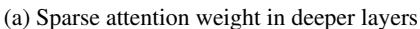
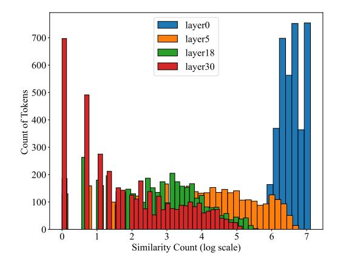
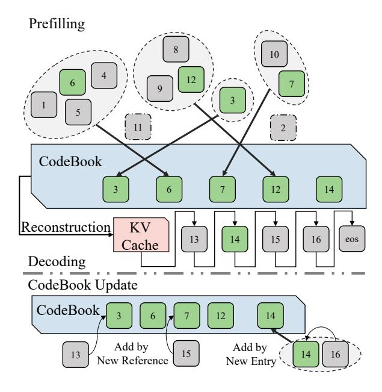
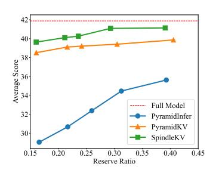
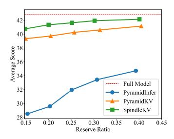

# 2.2 Token Eviction

Earlier works discovered that tokens at the beginning and end of the sequence tend to be the most important in KV cache. These findings inspired several KV cache eviction methods like *StreamingLLM* [\(Xiao et al.,](#page-10-8) [2024\)](#page-10-8). Recent work has introduced eviction methods based on the contribution of attention scores, such as *H2O* [\(Zhang](#page-11-0) [et al.,](#page-11-0) [2023\)](#page-11-0) and *SnapKV* [\(Li et al.,](#page-9-6) [2024\)](#page-9-6). Building on this, some approaches no longer simply remove unimportant tokens, but instead merge them into the tokens that are retained, represented by *CaM* [\(Zhang et al.,](#page-10-10) [2024\)](#page-10-10), *D2O* [\(Wan et al.,](#page-10-11) [2024\)](#page-10-11), and *KVMerger* [\(Wang et al.,](#page-10-12) [2024\)](#page-10-12). Latest re-


Figure 2: Comparison of major eviction methods.

searches, *PyramidInfer* (Yang et al., 2024b) and *PyramidKV* (Cai et al., 2024), show that the cost of evicting tokens from deeper layers is often lower, and the evicted KV cache exhibits a triangular pattern. However, these methods are difficult to integrate with GQA, as they require evaluating token acceptance or eviction for an entire group of Q heads, rather than for each individual Q head.

Quantization is also an important method to reduce KV cache though less relative with our method, detailed in Appendix A.

In summary, existing KV cache reduction methods face challenges in compressing shallower layers. Moreover, attention score-based eviction methods exhibit poor compatibility with GQA.

#### 3 Method

### 3.1 Notations

SpindleKV does not involve information interaction between layers; therefore, we focus solely on the attention component within a single decoder layer. Let d represent the hidden dimension of the model,  $d_h$  the size of each attention head, and h the total number of attention heads,  $h_g$  as the number of KV heads for GQA models, and the amount of Q heads per KV head  $h_n = h/h_g$  correspondingly. We denote l as the length of the input sequence  $X \in \mathbb{R}^{l \times d}$ . We firstly acquire the attention score  $A_i$  of the i-th head through the equation:

$$A_{i} = \operatorname{softmax} \left( \operatorname{mask} \left( \frac{Q_{i} \cdot K_{i}^{\top}}{\sqrt{d_{h}}} \right) \right) , \quad (1)$$

$$Q_{i} = X \cdot W_{Q,i} \cdot \mathcal{R}, \ K_{i} = X \cdot W_{K,i} \cdot \mathcal{R}$$

in which  $W_{\{Q,K\},i}$  denotes the parameters of the LLM and  $\mathcal{R}$  as rotary position embedding matrix. Then, the output of the masked multi-head self-attention is given out as follows.

$$O = \sum_{i=0}^{h-1} A_i \cdot V_i \cdot W_{O,i}$$
$$V_i = X \cdot W_{V,i}$$

Additionally,  $W_{\{V,O\},i}$  denotes the other two parameter matrices. We define  $\Gamma \in \{K,V\}$  as a unified representation for K and V. Lastly we use  $\{x,k_i,v_i,\gamma\}_a$  to represent the a-th entry of  $\{X,K_i,V_i,\Gamma\}$ .

 $A_i \in \mathbb{R}^{l \times l}$  is the critical standard for evaluating the contribution of each token to the attention. We typically use the accumulated attention scores, which represent the average attention score in a window  $l_w$  for each query from a given token's key, as an indicator of the importance of a token. The accumulated attention score  $ac_{i,a}$  for the a-th token in the sequence is calculated as shown in equation:

$$ac_{i,a} = \frac{\sum_{b=l-l_w}^{l-1} A_{i,a,b}}{l-a}.$$
 (2)

Additionally, for models that utilize GQA, the same K would serves multiple Q. We've also have to take the average across all  $h_n$  heads (Yang et al., 2024b), as equation:

$$ac'_{i,a} = \frac{1}{h_n} \sum_{g=0}^{h_n} \frac{\sum_{b=l-l_w}^{l-1} A_{h_n \cdot i+g,a,b}}{n-a}.$$
 (3)

For SpindleKV, we also focused on the similarity  $S_{\{K,V\}}$  within the KV cache, measured in *cosine similarity* as equation:

$$\cos_{-}\sin(\gamma_{a}, \gamma_{b}) = \frac{a \cdot b^{\top}}{|a| \cdot |b|}$$

$$S_{\Gamma, i, a, b} = \cos_{-}\sin(\gamma_{i, a}, \gamma_{i, b}).$$
(4)

### 3.2 Preliminary Experiment

We investigated the distributional characteristics of the KV cache components. To this end, we examined the attention distributions and the similarity of KV caches in the LLaMA2-7B-chat model on the 2WikiMQA dataset.

Attention Sparsity We calculated the accumulated attention scores ac for each token and each

<span id="page-3-0"></span>





(b) High cosine similarity in shallower layers

Figure 3: The distribution of attention weight and cosine similarity in token level cross different layers of LLaMA2-7b-chat with a prompt sampling from 2WikiMQA.

attention head across all layers, and then aggregated these scores in ascending order. As shown in Figure 3a, we observed that as the layer depth increases, the number of tokens with lower attention scores also increases, reflecting the concentration of attention scores on a few specific tokens. This phenomenon reveals the attention sparsity in deeper layers and provides evidence for the feasibility of token eviction in these layers.

KV Constitutional Similarity We measured the number of token pairs in different layers whose similarity S exceeds a threshold  $\theta$ . The composition of the KV cache exhibits a high degree of similarity in the shallower layers, as depicted in Figure 3b. This suggests that, in the shallower layers, although many tokens receive high attention scores, their constituent components are highly similar. More details are avaiable in Appendix B. This observation leads us to consider the potential of managing large numbers of similar KV caches using a codebook-based approach.

### <span id="page-3-1"></span>3.3 Attention Weight Based Token Eviction

We apply token eviction majorly for reducing the redundancy in deeper layers. Following PyramidKV (Cai et al., 2024), a simple linear interpolation works on the layer-wise KV cache allocation. We define r as the total reserve ratio the KV cache. Following SnapKV (Li et al., 2024), we apply an observation window with length  $l_w$  to calculate ac, in which all the tokens are reserved. The reserve ratio of the context, whose length  $l_c = l - l_w$ , is consistent across all decoding request. We first cal-

culate the reserve ratio of context  $r_c$  by equation:

$$r_c = \frac{r \cdot l - l_w}{l_c}.$$

Moreover, we define the minimal preserve ratio for any layer as  $\beta$ . And we define  $\alpha = \frac{1}{2}(1+\beta)$ . Then we can define the maximal and minimal retain ratio for context for a model with m layers, used by layer 0 and m-1, in the equation:

$$r_{c}(0) = \begin{cases} 2 \times r_{c} - 0.05, \ \beta < r_{c} \le \alpha \\ 1, & \alpha < r_{c} \le 1 \end{cases}$$

$$r_{c}(m-1) = \begin{cases} 0.05, & \beta < r_{c} \le \alpha \\ 1 - 2 \times rc, & \alpha < r_{c} \le 1 \end{cases}$$
(5)

Finally, the retain ratio of  $\lambda$ -th layer  $r_c(\lambda)$  can be determined by equation:

$$r_c(\lambda) = r_c(0) + \frac{r_c(m-1) - r_c(0)}{m-1} \cdot \lambda.$$
 (6)

At inference time, we dynamically select the preserved KV cache of i-th head by  $ac_i$ :

$$\eta_i = \operatorname{argTop} K\left(ac_i, \ k = \lfloor r_c(\lambda) \times l_c \rfloor\right)$$

$$\Gamma_{r,i} = \Gamma_i[\eta_i] \tag{7}$$

For models utilizing GQA, we can employ the ac' designed for GQA in the previous section to complete this step. However, an alternative approach is to directly repeat these KV vectors  $h_n$  times, effectively fully unfolding the GQA, then decision can then be made regarding whether to retain them. This step will increase the size of the KV vectors by several times, but we will address this overhead in the next subsection, ensuring that it does not require any additional storage space.



Figure 4: An overview of SpindleKV

### 3.4 Similarity Based Token Replacement

The redundancy that the Eviction method cannot address arises from the high similarity between the constituent of the KV cache in shallower layers. Meanwhile, the operation of unfolding GQA in the previous section also increases this redundancy, as the cosine similarity of the unfolded components is clearly 1. Therefore, we can approximate the KV cache by constructing a CodeBook from the similarity of the KV cache and retaining only the indices pointing to the CodeBook entries, thereby reducing its size.

In the prefilling stage, our goal is to create two CodeBooks  $C_{\{K,V\}}$  that satisfies the following conditions:

- $\min(|C_K \cup C_V|)$
- $\forall \gamma \in \Gamma_{r,i}, \exists j \in [0, |C_{\Gamma}| 1],$ s.t.  $\cos_{\sin(k, C_{\Gamma,i})} > \theta_{\Gamma},$

where  $\theta_{\{K,V\}}$  are the similarity threshold for K and V.

However, we noted that cosine similarity only measures the direction of a vector and does not effectively capture its magnitude. This implies that we must also record the magnitude to minimize information loss as much as possible. Formally, this involves recording the magnitude  $m_{\{K,V\}}$  of each KV cache, as shown in the equation:

<span id="page-4-0"></span>
$$m_{\Gamma} = \sqrt{\Gamma \cdot \Gamma^{\top}}, \ \Gamma_r \longleftarrow \frac{\Gamma_r}{m_{\Gamma}}.$$
 (8)

Then we construct a binary matrix  $G_{\{K,V\}}$ , where  $G_{\Gamma,a,b}$  indicates whether the a-th and b-th tokens can be merged, determined by:

<span id="page-4-1"></span>
$$G_{\Gamma} = \text{where}(S_{\Gamma} > \theta_{\Gamma}, 1, 0).$$
 (9)

This matrix also represents the adjacency matrix of an undirected graph. What we need to identify is the node with the highest degree in this graph, as the vector corresponding to this node can represent the greatest number of other vectors. The degree of each node is computed as shown in the equation:

<span id="page-4-2"></span>
$$s_{\Gamma,a} = \sum_{b=0}^{N-1} G_{\Gamma,a,b}.$$
 (10)

We greedily choose the token with the highest degree and add it to the C. Then we delete this vertex and the vertices that are directly adjacent to this vertex from the graph through a simple mask operation. Formally, each round of the CodeBook building process is given by:

<span id="page-4-3"></span>
$$\iota = \operatorname{argmax}(s_{\Gamma})$$

$$C_{\Gamma} \longleftarrow C_{\Gamma} + [\Gamma_{r,\iota}]'$$
(11)

then, we build the reference  $r_{\{K,V\}}$  of each token to the corresponding vector in the CodeBook:

<span id="page-4-4"></span>
$$\eta_{\iota} = \operatorname{argwhere}(G_{\Gamma, \iota} == 1)$$

$$r_{\Gamma}[\eta_{\iota}] = |C_{\Gamma}| - 1$$
(12)

The  $\max_{\{K,V\}}$  and the clean up to the graph is given by:

<span id="page-4-5"></span>
$$\max_{\Gamma} = \neg G_{\Gamma,\iota}^{\top} \cdot \neg G_{\Gamma,\iota}$$

$$G_{\Gamma} \longleftarrow G_{\Gamma} \& \max_{\Gamma}$$
(13)

We firstly execute equation 8, 9, then execute equation 10, 11, 12, 13 repetitively until  $G_{\Gamma} == 0$ . Then we finished the construction of CodeBook  $C_{\Gamma}$ , magnitudes  $m_{\Gamma}$  and the reference to CodeBook for every token  $r_{\Gamma}$ . The process is illustrated in Algorithm 1.

At inference time, we can reconstruct KV cache efficiently through the equation:

$$\Gamma_r = C_{\Gamma}[r_{\Gamma}] \otimes m_{\Gamma} \tag{14}$$

During inference, we generate a large number of new KV cache entries. We first search for suitable CodeBook entries for merging, using  $\theta$  as the threshold. If such entries are found, we merge

<span id="page-5-2"></span>





(a) LongBench result of LLaMA2-7b

(b) LongBench results of LLaMA3-8b

(c) LongBench results of Mistral-7b

Figure 5: LongBench result on three models cross different reserve ratios.

```
Algorithm 1 CodeBook Generate of \Gamma \in \{K, V\}
 Input: Cached \Gamma_r, Threshold \theta_{\Gamma}.
  Output: CodeBook C_{\Gamma}, References r_{\Gamma},
Magnitudes m_{\Gamma}
     C_{\Gamma} \leftarrow \emptyset
     r_{\Gamma} \leftarrow [-1, -1, \dots, -1]
                                                                        ▷ Initialization
     m_{\Gamma} \leftarrow L_2 Norm(\Gamma, \dim = -1)
     \Gamma_r \leftarrow \Gamma_r/m_\Gamma
                                                                \triangleright Normalize \Gamma to 1
     S_{\Gamma} \leftarrow \cos_{-}\sin(\Gamma, \Gamma)
     G_{\Gamma} \leftarrow \text{where}(S_{\Gamma} > \theta_{\Gamma}, 1, 0)
     while G_{\Gamma}! = 0 do
             s_{\Gamma} \leftarrow \text{sum}(S_{\Gamma}, \text{dim} = 1)
            \iota \leftarrow \operatorname{argmax}(s_{\Gamma})
             C_{\Gamma} \leftarrow C_{\Gamma} + [\Gamma_{r,\iota}]
                                                                             New entry
             \eta_{\iota} \leftarrow \operatorname{argwhere}(G_{\Gamma,\iota} == 1)
             r_{\Gamma}[\eta_{\iota}] \leftarrow |C_{\Gamma}| - 1
                                                          ⊳ Inserted to the end
             \operatorname{mask}_{\Gamma} \leftarrow \operatorname{matmul}(\neg G_{\Gamma,\iota}^{\top}, \neg G_{\Gamma,\iota})
     G_{\Gamma} \leftarrow G_{\Gamma} \ \& \ \mathrm{mask}_{\Gamma} return C_{\Gamma}, r_{\Gamma}, m_{\Gamma}
```

them; otherwise, we repeat the process of building the CodeBook for the remaining tokens.

It is important to note that although this search process has a slightly higher time complexity, it does not result in a significant additional time overhead. Furthermore, our method operates on the pre-RoPE K, meaning that after reconstruction, the RoPE operation must be re-applied. However, due to limitations imposed by memory bandwidth and the inherent sparsity of RoPE as a sparse matrix multiplication, this step does not introduce substantial time overhead (Liu et al., 2024b). This is because, while the computational workload is increased, the corresponding increase in arithmetic intensity enhances the peak FLOPS achievable by the chip (Williams et al., 2009).

## 4 Experiments

### 4.1 Experimental Setup

We conducted our experiments on three models, including LLaMA2-7b-chat (Touvron et al., 2023), LLaMA3-8b-instruct (Dubey et al., 2024) and Mistral-7b-instruct-v0.2 (Jiang et al., 2023). Their maximum context length ranges from 4k to 32k. LLaMA2-7b employs MHA, while LLaMA3-8b and Mistral-7b utilize GQA with  $h_n=8,\,h_g=4$ . All models' h=32.

We evaluate the model's knowledge and reasoning capabilities on *LongBench* (Bai et al., 2024), which contains 16 long-context knowledge intensive subsets covering 6 tasks including multi-document question answering (QA), single-document QA, summarization, few-show learning, synthetic tasks and code, with the length of most tasks ranging from 5k to 15k. We also evaluate our method on *Needle-in-a-Haystack* task (Briakou et al., 2023) to test the long-context retrieval ability.

We select *Pyramidinfer* (Yang et al., 2024b) and *PyramidKV* (Cai et al., 2024) as baselines, both of which compress the KV cache based on token eviction method and allocate pyramid shaped KV cache cross layers.

<span id="page-5-1"></span>
$$\begin{cases} r_1^{\lambda} = \frac{\sum_{j=0}^{h_g-1} (|K_{\lambda}^{j,r}| + |V_{\lambda}^{j,r}|)}{\sum_{j=0}^{h_g-1} (|K_j^{i}| + |V_j^{i}|)} \\ r_2^{\lambda} = \frac{|C_K^{\lambda} \cup C_V^{\lambda}|}{\sum_{j=0}^{h_g} (|K_{j,r}^{\lambda}| + |V_{j,r}^{\lambda}|)} \\ r_3^{\lambda} = \frac{1}{d_h} \left( d_h + \frac{\text{int\_bit}}{\text{key\_bit} + 1} \right) \end{cases}$$

$$r^{\lambda} = r_1^{\lambda} \times r_2^{\lambda} \times r_3^{\lambda}$$

$$r = \frac{1}{m} \sum_{\lambda=0}^{m-1} r^{\lambda}$$

$$(15)$$

We use the reserve ratio r to measure the com-

<span id="page-6-1"></span>

| Methods      | Ratio |             | Single-Document QA |       |       | Multi-Document QA |       |             | Summarization |       |       | Few-shot Learning |       |      | Synthetic        |       | Code  | AVG.        |
|--------------|-------|-------------|--------------------|-------|-------|-------------------|-------|-------------|---------------|-------|-------|-------------------|-------|------|------------------|-------|-------|-------------|
|              |       | Na.QA       | Qasp               | Mu.QA | Ho.QA | Wi.QA             | Musq  | Gv.Rp       | QMSm          | M.New | TREC  | Tr.QA             | SASm  | PCnt | Pa.Rt            | Lcc   | RB.P  |             |
| FullKV       | 100%  | 25.70       | 29.75              | 41.12 | 45.55 | 35.87             | 22.35 | 25.63       | 23.03         | 26.21 | 73.00 | 90.56             | 41.88 | 4.67 | 69.25            | 58.05 | 50.77 | 41.46       |
| PyramidInfer | 39.3% | 23.75       | 17.46              | 29.97 | 35.08 | 23.92             | 16.90 | 28.08       | 21.26         | 24.42 | 62.00 | 85.06             | 41.45 | 1.04 | 41.23            | 50.95 | 52.86 | 34.71       |
| PyramidKV    | 40.5% | 26.31       | 28.64              | 49.12 | 41.66 | 25.98             |       | 19.02 26.38 | 23.91         | 22.66 | 70.00 | 85.88             | 42.53 |      | 2.69 86.32 54.04 |       | 53.36 | 41.16       |
| SpindleKV    |       | 40.1% 26.95 | 31.23              | 49.01 | 41.89 | 26.90             |       | 18.60 29.92 | 24.56         | 24.89 | 71.50 | 85.98             | 43.39 |      | 2.74 86.18 56.39 |       | 54.13 | 42.14       |
| PyramidInfer | 30.7% | 22.65       | 14.57              | 30.14 | 33.87 | 23.52             | 15.59 | 26.82       | 21.10         | 23.10 | 61.00 | 84.18             | 40.57 | 1.85 | 32.25            | 50.64 | 53.02 | 33.43       |
| PyramidKV    | 31.4% | 26.12       | 27.31              | 48.31 | 41.44 | 25.14             |       | 18.72 25.28 | 23.61         | 21.99 | 69.00 | 86.27             | 42.65 | 2.53 | 84.81            | 53.71 | 52.77 | 40.60       |
| SpindleKV    |       | 30.2% 26.69 | 30.19              | 49.32 | 42.09 | 27.23             |       | 18.69 28.52 | 24.19         | 24.02 | 71.00 | 86.38             | 43.54 | 3.03 | 87.18            | 55.19 | 53.62 | 41.93       |
| PyramidInfer | 25.1% | 21.43       | 13.49              | 25.88 | 31.92 | 20.44             | 14.83 | 25.27       | 20.57         | 22.06 | 58.00 | 82.16             | 40.77 | 1.45 | 27.93            | 52.53 | 52.55 | 32.00       |
| PyramidKV    | 25.7% | 25.14       | 26.11              | 46.97 | 40.56 | 25.46             |       | 19.06 25.00 | 23.32         | 21.55 | 70.50 | 86.41             | 41.92 |      | 3.26 84.56       | 51.95 | 52.23 | 40.25       |
| SpindleKV    |       | 25.2% 25.97 | 30.34              | 49.17 | 42.06 | 27.35             |       | 18.22 27.99 | 24.25         | 23.19 | 70.00 | 86.22             | 42.96 |      | 2.74 87.26       | 54.69 | 53.77 | 41.64       |
| PyramidInfer | 20.3% | 18.73       | 11.96              | 24.34 | 27.10 | 15.87             | 11.98 | 24.89       | 20.07         | 21.19 | 54.00 | 76.19             | 39.92 | 2.06 | 20.83            | 51.83 | 52.50 | 29.59       |
| PyramidKV    | 20.5% | 24.96       | 25.19              | 47.12 | 39.94 | 25.45             |       | 18.63 24.05 | 23.35         | 20.71 | 69.50 | 85.48             | 41.87 |      | 2.48 83.56       | 52.02 | 51.35 | 39.73       |
| SpindleKV    |       | 20.0% 26.03 | 29.49              | 49.61 | 41.87 | 26.50             |       | 17.98 27.01 | 23.73         | 22.73 | 70.00 | 86.28             | 43.59 |      | 2.29 86.99       | 53.81 | 53.57 | 41.34       |
| PyramidInfer | 15.4% | 17.28       | 11.52              | 23.41 | 26.38 | 16.72             | 11.98 | 24.49       | 19.41         | 20.77 | 53.00 | 68.87             | 39.78 |      | 3.53 11.88 54.48 |       |       | 52.72 28.51 |
| PyramidKV    | 15.0% | 24.36       | 24.66              | 45.85 | 40.67 | 24.81             | 17.83 | 23.29       | 23.41         | 20.53 | 70.00 | 86.09             | 40.74 | 3.27 | 81.84            | 51.54 | 50.60 | 39.34       |
| SpindleKV    |       | 14.8% 26.02 | 28.05              | 48.84 | 40.74 | 25.45             | 19.05 | 25.51       | 23.72         | 21.95 | 69.50 | 86.13             | 42.47 |      | 2.70 85.65 53.89 |       |       | 52.48 40.76 |

<span id="page-6-3"></span>Table 1: LongBench results for Mistral-7b-instruct-v0.2. The correspondence between abbreviations and datasets is provided in Appendix [C.](#page-12-2) We ensure that the reserve ratio r of SpindleKV is slightly lower than the baselines, with the deviation kept within 2%, as our method cannot precisely control the KV cache size.

| Methods     | Ratio | Na.QA | Wi.QA | QMSm  | Tr.QA | PCnt | Lcc   | AVG.  |
|-------------|-------|-------|-------|-------|-------|------|-------|-------|
| FullKV      | 100%  | 24.50 | 36.23 | 23.40 | 90.48 | 4.77 | 59.21 | 39.77 |
| w/o. repeat | 39.1% | 24.00 | 28.02 | 22.64 | 89.05 | 4.95 | 58.24 | 37.82 |
| w/. repeat  | 39.1% | 23.87 | 36.02 | 23.28 | 90.43 | 5.23 | 59.37 | 39.70 |
| w/o. repeat | 30.4% | 21.47 | 24.00 | 22.21 | 89.47 | 4.70 | 57.63 | 36.58 |
| w/. repeat  | 29.3% | 24.18 | 34.95 | 23.52 | 90.43 | 5.24 | 59.24 | 39.59 |
| w/o. repeat | 21.3% | 21.21 | 24.91 | 22.30 | 89.95 | 4.75 | 55.86 | 36.50 |
| w/. repeat  | 21.2% | 23.92 | 33.90 | 22.66 | 90.56 | 5.58 | 58.26 | 39.15 |

Table 2: Comparison between SpindleKV with and without repeating on LLaMA3-8b-instruct when handling GQA.

pression intensity. We define r λ as the reserve ratio for λ-th layer, which is co-determined by r λ 1 , the reserve ratio of eviction method, r λ 2 , the reserve ratio of replacement method, and ri,3, serves as the dtype convert ratio since we store int type index and float type magnitude for each key and value. The calculation is given by Formura [15.](#page-5-1) r <sup>λ</sup> = r λ 1 for pyramidinfer and PyramidKV, and h<sup>g</sup> = h if a repeat operation is conducted before eviction. We record r<sup>1</sup> and r<sup>2</sup> for every input when evaluating on *LongBench* to ensure their precision.

Hyper-parameters including α, β and θ, are given in Table [3.](#page-6-0)

## 4.2 Accuracy on Long Context Tasks

LongBench Result We evaluate SpindleKV on three models mentioned above and the result are

<span id="page-6-0"></span>

| Hyper-parameter          | Value |
|--------------------------|-------|
| Key Threshold (θK)       | 0.98  |
| Value Threshold (θV<br>) | 0.95  |
| β                        | 0.05  |
| α                        | 0.525 |

Table 3: Hyper-parameters Used in Experiments

<span id="page-6-2"></span>

| Methods      | LLaMA3-8b | Mistral-7b |
|--------------|-----------|------------|
| PyramidInfer | 0.615     | 0.621      |
| PyramidKV    | 0.938     | 0.962      |
| SpindleKV    | 0.979     | 0.975      |

Table 4: Accuracy of *Needle-in-a-Haystack* on LLaMA3-8b-instruct and Mistral-7b-instruct-v0.2 with 15% KV cache reserved.

<span id="page-7-0"></span>

<span id="page-7-1"></span>Figure 6: Visualization of Needle-in-a-Haystack. The vertical axis of the table represents the depth percentage, and the horizontal axis represents the token length.

|       |       |       | QMSm                    |       |      |       |       |
|-------|-------|-------|-------------------------|-------|------|-------|-------|
| 100%  | 18.40 | 25.73 | 20.97<br>21.05<br>19.68 | 83.38 | 5.50 | 60.70 | 35.78 |
| 47.8% | 18.57 | 25.51 | 21.05                   | 84.40 | 6.00 | 60.54 | 36.01 |
| 29.4% | 15.99 | 24.26 | 19.68                   | 80.62 | 6.00 | 53.20 | 33.29 |

Table 5: Accuracy of 6 datasets on SpindleKV without eviction on LLaMA2-7b-chat.

illustrated in Figure 5 and Table 1. Figure 5 shows that our method can further compress KV cache while retaining model's capability. Our method outperforms the two baselines on both models with and without GQA, showing that our method effectively reduced the constituent redundancy in shallower layers. In models with GQA structure, we surpass baselines with only half of the KV cache compared with them, which indicates that SpindleKV has a better compatibility with GOA. Table 1 shows results of Mistral-7b on different datasets in LongBench, more results are avaiable in Appendix D.1. We report that our method further surpasses Pyramidinfer on average score and outperforms PyramidKV on 13 datasets between different reserve ratios on Mistral-7b. The results on LongBench show that our method can further reserve model's knowledge retention and reasoning capabilities with the same KV cache budget.

Needle-in-a-Haystack Result Following PyramidKV, we use LLaMA3-8b-isntruct and Mistral-7b-instruct-v0.2 for this task. The results are displayed in Table 4 and more details are available in Figure 6. In our experiment, models reserve

only 15% KV cache then retrieve a special "needle" from the context. The results in Table 4 indicate that, compared with PyramidInfer and PyramidKV, SpindleKV significantly maintains the model's long-sequence retrieval efficacy with the same KV cache budget. As illustrated in Figure 6, PyramidInfer, which apply a mean operation on attention weight before eviction raise significantly context loss. And for PyramidKV, also raise noticeable context loss when reserve only 15% KV cache. But SpindleKV saves more context with the same KV cache budget, significantly improved the quality of after-compress retrieval.

