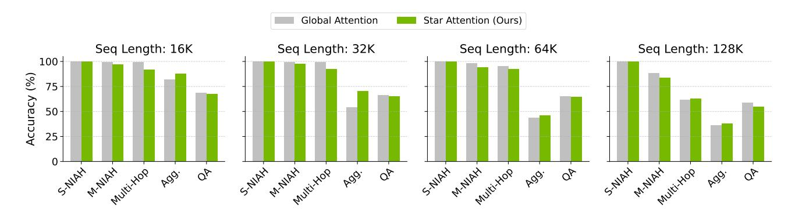

# **D. RULER Analysis**

Figure 8. Accuracy of Star Attention using Llama-3.1-8B-Instruct on the 5 categories of tasks in RULER on sequence lengths of 16K, 32K, 64K, and 128K. In all experiments, the block size and anchor block size are set to one-quarter of the total sequence length. For the NIAH and QA tasks, Star Attention retains upto 97-100% accuracy of the baseline. The Multi-Hop Tracing task is notably challenging because it requires inter-block communication, which leads to expected performance degradation. Interestingly, Star Attention performs better with sequence lengths of 128k on this task, but this may be due to noise given the suboptimal baseline. In aggregation tasks, Star Attention show significant improvement as distributed local attention helps the model in such summarization tasks.