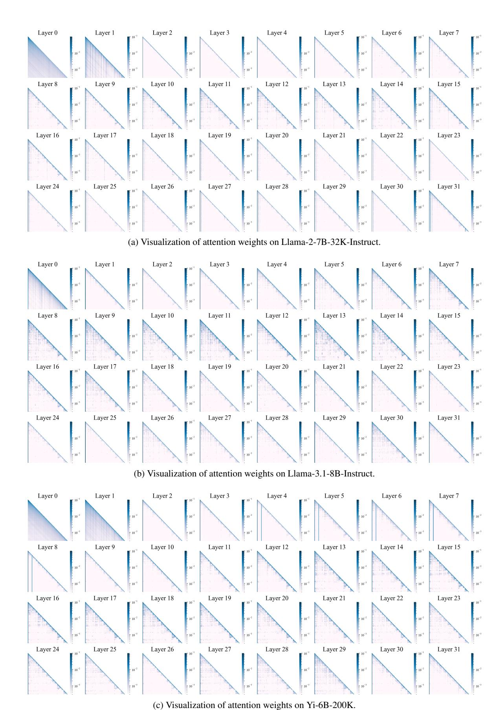
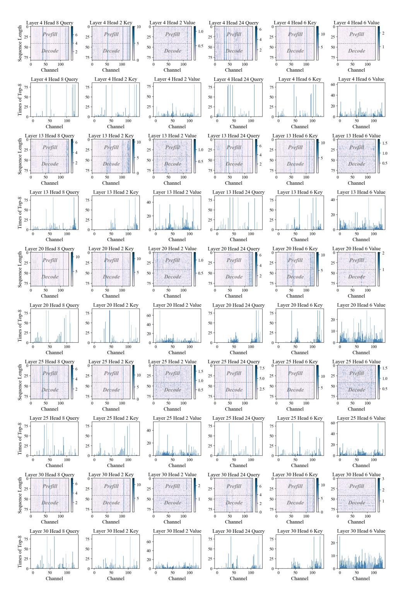

# G More Information on Models and Benchmarks

#### **G.1** Baselines

In all of our experiments, we use pre-trained model weights obtained from Huggingface. These models are based on two representative attention structures:

- (1) MHA: including Llama-2-7B-32K-Instruct4.
- (2) GOA: including Llama-3.1-8B-Instruct5, Yi-

4https://huggingface.co/togethercomputer/ Llama-2-7B-32K-Instruct

5https://huggingface.co/meta-llama/Llama-3. 1-8B-Instruct

| Methos                                            |                          |      |                      |                      | Ratio Qspr MulFi HQA WMQA GRpt MulN TREC SMSM TriQA Repo LCC PsgC PsgR Avg. |                      |                      |                      |                      |                      |                      |                      |                   |                      |                      |
|---------------------------------------------------|--------------------------|------|----------------------|----------------------|-----------------------------------------------------------------------------|----------------------|----------------------|----------------------|----------------------|----------------------|----------------------|----------------------|-------------------|----------------------|----------------------|
| Llama-3.1-8B                                      | 1×                       | 45.5 | 53.8                 | 54.7                 | 47.1                                                                        | 34.9                 | 27.5                 | 73.0                 | 43.8                 | 91.6                 | 56.7                 | 63.4                 | 7.5               | 99.5                 | 53.8                 |
| SimLayerKV 1.53× 45.6 TailorKV-1 TailorKV-2 | 34.2× 43.4 32.7× 44.8 |      | 52.3 53.0 53.9 | 54.5 55.3 54.8 | 44.5 46.5 46.2                                                        | 32.2 31.3 31.9 | 26.9 27.2 26.8 | 71.5 70.0 70.5 | 43.8 42.5 43.2 | 91.3 91.6 92.3 | 54.9 54.8 54.2 | 62.8 61.8 62.1 | 7.9 7.9 7.7 | 95.5 99.0 99.0 | 52.6 52.6 52.9 |

Table 7: Performance comparison between TailorKV and SimLayerKV. TailorKV computes only 64 (+128) tokens for sparsity-friendly layers. SimLayerKV retains the most recent 1024 tokens for the "lazy" layers, while the "non-lazy" layers preserve full precision. Additionally, the threshold for SimLayerKV on Llama-3.1-8B is 0.9, with more than half of the layers being "non-lazy."

| Methods      | Tokens        |      |      |      | Qspr MulFi HQA WMQA GRpt MulN TREC SMSM TriQA Repo LCC PsgC PsgR Avg. |      |      |      |      |      |      |      |     |      |      |
|--------------|---------------|------|------|------|-----------------------------------------------------------------------|------|------|------|------|------|------|------|-----|------|------|
| Llama-3.1-8B | 128k          | 45.5 | 53.8 | 54.7 | 47.1                                                                  | 34.9 | 27.5 | 73.0 | 43.8 | 91.6 | 56.7 | 63.4 | 7.5 | 99.5 | 53.8 |
| StreamLLM‡   | 192           | 21.4 | 31.3 | 46.5 | 38.9                                                                  | 17.9 | 18.0 | 40.0 | 34.4 | 75.7 | 45.7 | 50.7 | 8.0 | 99.0 | 40.6 |
| StreamLLM†   | 192           | 21.6 | 30.8 | 45.5 | 39.0                                                                  | 18.4 | 17.9 | 40.5 | 34.1 | 75.6 | 45.5 | 52.8 | 8.0 | 99.0 | 40.7 |
| SnapKV‡      | 192           | 25.7 | 44.7 | 52.6 | 43.7                                                                  | 20.0 | 20.5 | 41.0 | 39.6 | 89.0 | 48.7 | 57.0 | 8.0 | 97.0 | 45.2 |
| SnapKV†      | 192           | 32.4 | 47.0 | 54.6 | 44.0                                                                  | 21.9 | 22.8 | 48.0 | 40.0 | 90.3 | 51.9 | 59.9 | 8.0 | 98.0 | 47.6 |
| Quest‡       | 192           | 35.9 | 44.2 | 52.8 | 41.0                                                                  | 17.7 | 23.8 | 63.0 | 36.0 | 86.0 | 43.6 | 52.3 | 8.4 | 96.5 | 46.2 |
| Quest†       | 192           | 39.1 | 45.1 | 52.4 | 43.4                                                                  | 21.1 | 25.6 | 65.5 | 38.7 | 88.1 | 44.8 | 52.0 | 8.1 | 97.0 | 47.8 |
| TailorKV-1   | 64(+128) 43.4 |      | 53.0 | 55.3 | 46.5                                                                  | 31.3 | 27.2 | 70.0 | 42.5 | 91.6 | 54.8 | 61.8 | 7.9 | 99.0 | 52.6 |
| TailorKV-2   | 64(+128) 44.8 |      | 53.9 | 54.8 | 46.2                                                                  | 31.9 | 26.8 | 70.5 | 43.2 | 92.3 | 54.2 | 62.1 | 7.7 | 99.0 | 52.9 |

Table 8: Effectiveness of dynamic retrieval. Methods marked with † indicate that the 0th layer of the model retains the full-precision (16-bit) KV cache, while methods marked with ‡ indicate that all layers use the same compression strategy. TailorKV-1 and TailorKV-2 store the KV cache as 1-bit and 2-bit, respectively, in the 0th layer.

6B-200K[6](#page-13-2) , and Yi-9B-200K[7](#page-13-3) . Detailed information about the four models can be found in [Table 9.](#page-14-2)

To showcase the state-of-the-art performance of our method, we compare TailorKV with the following baselines: (1) StreamingLLM [\(Xiao et al.,](#page-10-1) [2024b\)](#page-10-1): An eviction strategy that retains only the initial and most recent tokens. (2) SnapKV [\(Li](#page-9-1) [et al.,](#page-9-1) [2024\)](#page-9-1): An eviction strategy that chooses clustered important KV positions. (3) Quest [\(Tang](#page-9-2) [et al.,](#page-9-2) [2024\)](#page-9-2): A selection strategy that determines page criticality through paged key. (4) PQ-Cache [\(Zhang et al.,](#page-10-3) [2024a\)](#page-10-3): A selection strategy that retrieves Top-K tokens through vector quantization.

#### G.2 Benchmarks

LongBench. A benchmark is conducted across six categories: summarization, code completion, synthetic tasks, few-shot learning, and single/multidocument question answering. [Table 10](#page-14-0) presents detailed information on the 13 datasets in Long-Bench.

InfiniteBench. A benchmark designed to assess the ability of language models to process, understand, and reason with extremely long contexts

(200k+ tokens). We test the Llama3 and Yi models with context lengths of 128K and 200K, truncating inputs beyond these limits. [Table 11](#page-14-1) provides details of the 9 datasets in InfiniteBench.

RULER. A benchmark intended to assess the long-context modeling capabilities of language models, covering question answering, retrieval, aggregation, and multi-hop tracing. This benchmark consists of 13 representative tasks, with sequence lengths ranging from 4K to 128K. For each task, we employed 25 samples. Detailed information is provided in [Table 12.](#page-14-3)

## H Detailed Results

## H.1 Accuracy on Long Context Tasks

[Table 14](#page-16-0) and [Table 15](#page-16-1) present experimental results for LongBench and InfiniteBench. [Table 16](#page-17-0) shows accuracy results for sequence lengths of 64k and 128k on RULER.

#### H.2 Efficiency Results

In [Table 13,](#page-15-1) we present the end-to-end latency for Llama-3.1-8B-Instruct, Llama-2-7B-32K-Instruct, Yi-6B-200K, and Yi-9B-200K. The results indicate that our method achieves efficiency closest to that of the original model.

6 <https://huggingface.co/01-ai/Yi-6B-200K>

7 <https://huggingface.co/01-ai/Yi-9B-200K>

| Name                    | Claimed Length | Query Heads | KV Heads | Num Layers | Q      |
|-------------------------|----------------|-------------|----------|------------|--------|
| Llama-3.1-8B-Instruct   | 128k           | 32          | 8        | 32         | {0}    |
| Llama-2-7B-32K-Instruct | 32k            | 32          | 32       | 32         | {0, 1} |
| Yi-6B-200K              | 200k           | 32          | 4        | 32         | {0, 1} |
| Yi-9B-200K              | 200k           | 32          | 4        | 48         | {0, 1} |

Table 9: Details of models. Q denotes the quantization-friendly layer.

| Label | Task                | Capability               | Metric         | Avg len | #data |
|-------|---------------------|--------------------------|----------------|---------|-------|
| Qspr  | Qasper              | Single-Doc. QA (SD.QA)   | F1             | 3,619   | 200   |
| MulFi | MultiFieldQA-en     | Single-Doc. QA (SD.QA)   | F1             | 4,559   | 150   |
| HQA   | HotpotQA            | Multi-Doc. QA (MD.QA)    | F1             | 9,151   | 200   |
| WMQA  | 2WikiMultihopQA     | Multi-Doc. QA (MD.QA)    | F1             | 4,887   | 200   |
| GRpt  | GovReport           | Summarization (Summ)     | Rouge-L        | 8,734   | 200   |
| MulN  | MultiNews           | Summarization (Summ)     | Rouge-L        | 2,113   | 200   |
| TREC  | TREC                | Few-shot Learning (FS.L) | Accuracy (CLS) | 5,177   | 200   |
| SMSM  | SAMSum              | Few-shot Learning (FS.L) | Rouge-L        | 6,258   | 200   |
| TriQA | TriviaQA            | Few-shot Learning (FS.L) | F1             | 8,209   | 200   |
| Lcc   | LCC                 | Code Completion (Code)   | Edit Sim       | 1,235   | 500   |
| Repo  | RepoBench-P         | Code Completion (Code)   | Edit Sim       | 4,206   | 500   |
| PsgC  | PassageCount        | Synthetic (Synth)        | Accuracy (EM)  | 11,141  | 200   |
| PsgR  | PassageRetrieval-en | Synthetic (Synth)        | Accuracy (EM)  | 9,289   | 200   |

Table 10: Details of LongBench.

| Label  | Task             | Context       | Capability      | Metric      | Avg len | #Examples |
|--------|------------------|---------------|-----------------|-------------|---------|-----------|
| R.PK   | Retrieve.PassKey | Fake Book     | Retrieve (Retr) | Accuracy    | 122.4k  | 590       |
| R.Num  | Retrieve.Number  | Synthetic     | Retrieve (Retr) | Accuracy    | 122.4k  | 590       |
| En.Dia | En.Dia           | Script        | Dialogue (Dia)  | Accuracy    | 103.6k  | 200       |
| Sum    | En.Sum           | Fake Book     | Novel           | Rouge-L-Sum | 171.5k  | 103       |
| En.MC  | En.MC            | Fake Book     | Novel           | Accuracy    | 184.4k  | 229       |
| En.QA  | En.QA            | Fake Book     | Novel           | QA F1 Score | 192.6k  | 351       |
| Zh.QA  | Zh.QA            | New Book      | Novel           | QA F1 Score | 2068.6k | 175       |
| Math.F | Math.Find        | Synthetic     | Math            | Accuracy    | 87.9k   | 350       |
| Code.D | Code.Debug       | Code Document | Code            | Accuracy    | 114.7k  | 394       |

Table 11: Details of InfiniteBench.

| Label | Task                      | Category           |
|-------|---------------------------|--------------------|
| N-S1  | Single NIAH               | Retrieval          |
| N-S2  | Single NIAH               | Retrieval          |
| N-S3  | Single NIAH               | Retrieval          |
| N-MK1 | Multi-keys NIAH           | Retrieval          |
| N-MK2 | Multi-keys NIAH           | Retrieval          |
| N-MK3 | Multi-keys NIAH           | Retrieval          |
| N-MV  | Multi-values NIAH         | Retrieval          |
| N-MQ  | Multi-queries NIAH        | Retrieval          |
| VT    | Variable Tracking         | Multi-hop Tracing  |
| CWE   | Common Words              | Aggregation        |
| FWE   | Frequent Words Extraction | Aggregation        |
| QA-1  | Question Answering        | Question Answering |
| QA-2  | Question Answering        | Question Answering |

Table 12: Details of RULER.

| Method                  | 16k   | 32k        | 64k   | 96k   | 128k  |  |  |  |  |  |  |  |
|-------------------------|-------|------------|-------|-------|-------|--|--|--|--|--|--|--|
| Llama-3.1-8B-Instruct   |       |            |       |       |       |  |  |  |  |  |  |  |
| Full Cache              | 0.024 | 0.033      | 0.050 | 0.062 | 0.082 |  |  |  |  |  |  |  |
| OffloadCach             | 0.124 | 0.227      | 0.435 | 0.743 | 0.992 |  |  |  |  |  |  |  |
| PQCache                 | 0.104 | 0.105      | 0.108 | 0.108 | 0.110 |  |  |  |  |  |  |  |
| TailorKV                | 0.045 | 0.047      | 0.054 | 0.054 | 0.056 |  |  |  |  |  |  |  |
| Llama-2-7B-32K-Instruct |       |            |       |       |       |  |  |  |  |  |  |  |
| Full Cache              | 0.045 | 0.077      | 0.140 | OOM   | OOM   |  |  |  |  |  |  |  |
| OffloadCach             | 0.433 | 0.838      | 1.767 | 3.253 | 4.468 |  |  |  |  |  |  |  |
| PQCache                 | 0.108 | 0.111      | 0.112 | 0.115 | 0.120 |  |  |  |  |  |  |  |
| TailorKV                | 0.041 | 0.062      | 0.098 | 0.132 | 0.170 |  |  |  |  |  |  |  |
|                         |       | Yi-6B-200K |       |       |       |  |  |  |  |  |  |  |
| Full Cache              | 0.019 | 0.021      | 0.029 | 0.036 | 0.044 |  |  |  |  |  |  |  |
| OffloadCach             | 0.066 | 0.118      | 0.221 | 0.325 | 0.430 |  |  |  |  |  |  |  |
| PQCache                 | 0.085 | 0.087      | 0.090 | 0.092 | 0.094 |  |  |  |  |  |  |  |
| TailorKV                | 0.041 | 0.042      | 0.046 | 0.049 | 0.056 |  |  |  |  |  |  |  |
|                         |       | Yi-9B-200K |       |       |       |  |  |  |  |  |  |  |
| Full Cache              | 0.029 | 0.032      | 0.043 | 0.055 | 0.070 |  |  |  |  |  |  |  |
| OffloadCach             | 0.102 | 0.205      | 0.417 | 0.626 | 0.843 |  |  |  |  |  |  |  |
| PQCache                 | 0.130 | 0.138      | 0.139 | 0.144 | 0.150 |  |  |  |  |  |  |  |
| TailorKV                | 0.066 | 0.067      | 0.072 | 0.076 | 0.079 |  |  |  |  |  |  |  |

Table 13: Decoding latency(s) on A100 (80G).

## I Attention Visualization Across Models

As shown in [Figure 13,](#page-18-0) the attention patterns of different models closely match the results predicted by our usage metric P. Specifically, the quantizationfriendly layers of Llama-2-7B-32K-Instruct and Yi-6B-200K are identified as the 0th and 1st layers. In these layers, attention patterns are dense, while the other layers are sparse. Similarly, the quantizationfriendly layer of Llama-3.1-8B-Instruct is the 0th layer, where attention pattern is dense, with sparse features in the remaining layers.

## J Observations on QKV

[Figure 14](#page-19-0) illustrates the distribution patterns of queries, keys, and values across different attention heads in Llama-3.1-8B-Instruct. Although outliers appear in both the keys and queries, the locations of the outlier channels are not consistently fixed.

|              |               |      | SD.QA |      | MD.QA                                                            | Summ |      | FS.L |      |      | Code      |  | Synth |           |      |
|--------------|---------------|------|-------|------|------------------------------------------------------------------|------|------|------|------|------|-----------|--|-------|-----------|------|
| Method       | Tokens        |      |       |      | Qspr MulFi HQA WMQA GRpt MulN TREC SMSM TriQA Repo LCC PsgC PsgR |      |      |      |      |      |           |  |       |           | Avg. |
| Llama-3.1-8B | 128k          | 45.5 | 53.8  | 54.7 | 47.1                                                             | 34.9 | 27.5 | 73.0 | 43.8 | 91.6 | 56.7 63.4 |  | 7.5   | 99.5 53.8 |      |
| StreamLLM    | 192           | 21.4 | 31.3  | 46.5 | 38.9                                                             | 17.9 | 18.0 | 40.0 | 34.4 | 75.7 | 45.7 50.7 |  | 8.0   | 99.0 40.6 |      |
| SnapKV       | 192           | 25.7 | 44.7  | 52.6 | 43.7                                                             | 20.0 | 20.5 | 41.0 | 39.6 | 89.0 | 48.7 57.0 |  | 8.0   | 97.0 45.2 |      |
| Quest        | 192           | 35.9 | 44.2  | 52.8 | 41.0                                                             | 17.7 | 23.8 | 63.0 | 36.0 | 86.0 | 43.6 52.3 |  | 8.4   | 96.5 46.2 |      |
| PQCache      | 192           | 45.6 | 51.2  | 53.8 | 45.3                                                             | 29.0 | 25.9 | 69.5 | 41.2 | 91.3 | 54.1 58.5 |  | 8.2   | 99.0 51.7 |      |
| TailorKV-1   | 64(+128) 43.4 |      | 53.0  | 55.3 | 46.5                                                             | 31.3 | 27.2 | 70.0 | 42.5 | 91.6 | 54.8 61.8 |  | 7.9   | 99.0 52.6 |      |
| TailorKV-2   | 64(+128) 44.8 |      | 53.9  | 54.8 | 46.2                                                             | 31.9 | 26.8 | 70.5 | 43.2 | 92.3 | 54.2 62.1 |  | 7.7   | 99.0 52.9 |      |
| Yi-9B        | 200k          | 38.4 | 34.9  | 52.7 | 36.7                                                             | 31.0 | 26.7 | 77.0 | 14.9 | 90.0 | 67.4 71.9 |  | 2.5   | 67.5 47.0 |      |
| StreamLLM    | 192           | 22.3 | 20.4  | 36.7 | 30.6                                                             | 11.8 | 10.3 | 45.5 | 9.2  | 77.7 | 49.6 54.1 |  | 3.5   | 26.0 30.6 |      |
| SnapKV       | 192           | 26.7 | 23.3  | 44.2 | 33.4                                                             | 11.5 | 12.3 | 44.5 | 13.4 | 89.1 | 56.6 62.8 |  | 1.6   | 36.0 35.0 |      |
| Quest        | 192           | 32.4 | 26.0  | 44.2 | 31.5                                                             | 14.3 | 16.5 | 73.0 | 13.4 | 86.2 | 55.6 63.7 |  | 3.9   | 47.5 39.1 |      |
| PQCache      | 192           | 36.9 | 27.9  | 47.6 | 35.5                                                             | 19.3 | 19.2 | 74.0 | 12.2 | 89.6 | 62.0 66.8 |  | 4.6   | 51.0 42.0 |      |
| TailorKV-1   | 64(+128) 37.7 |      | 38.2  | 52.8 | 35.8                                                             | 29.8 | 24.9 | 76.0 | 15.2 | 89.5 | 64.3 68.4 |  | 3.5   | 45.0 44.7 |      |
| TailorKV-2   | 64(+128) 37.6 |      | 33.6  | 52.6 | 34.4                                                             | 29.4 | 25.3 | 76.0 | 15.0 | 89.3 | 63.5 68.5 |  | 3.0   | 44.0 44.0 |      |
| Yi-6B        | 200k          | 25.4 | 39.5  | 14.8 | 15.8                                                             | 2.8  | 0.01 | 72.5 | 7.7  | 69.7 | 58.5 61.2 |  | 3.5   | 15.5 29.7 |      |
| StreamLLM    | 192           | 11.0 | 29.0  | 11.1 | 12.1                                                             | 3.1  | 0.1  | 41.5 | 5.1  | 55.5 | 43.1 46.2 |  | 3.0   | 5.0       | 20.4 |
| SnapKV       | 192           | 14.9 | 33.5  | 13.1 | 13.0                                                             | 3.3  | 0.01 | 45.0 | 6.6  | 63.8 | 48.8 53.7 |  | 3.0   | 4.5       | 23.3 |
| Quest        | 192           | 19.9 | 33.2  | 11.8 | 13.2                                                             | 0.5  | 0.1  | 67.0 | 9.4  | 64.5 | 50.2 53.7 |  | 3.5   | 13.5 26.2 |      |
| PQCache      | 192           | 24.1 | 36.8  | 13.6 | 15.3                                                             | 1.3  | 0.01 | 68.5 | 7.6  | 68.1 | 54.1 57.4 |  | 2.5   | 5.5       | 27.3 |
| TailorKV-1   | 64(+128) 24.5 |      | 40.5  | 15.6 | 15.3                                                             | 2.7  | 0.1  | 72.0 | 8.5  | 68.3 | 55.2 56.5 |  | 2.5   | 5.5       | 28.3 |
| TailorKV-2   | 64(+128) 24.1 |      | 40.8  | 15.2 | 15.5                                                             | 3.0  | 0.01 | 72.0 | 8.6  | 66.7 | 54.8 57.9 |  | 2.5   | 5.5       | 28.2 |

Table 14: Results on LongBench [\(Bai et al.,](#page-8-1) [2024\)](#page-8-1) of different methods.

| Methods      | Tokens          |       |       |      |      |      |      |      |      | R.PK R.Num En.Dia Sum En.MC En.QA Zh.QA Math.F Code.D Avg. |      |
|--------------|-----------------|-------|-------|------|------|------|------|------|------|------------------------------------------------------------|------|
| Llama-3.1-8B | 128K            | 100.0 | 99.3  | 19.0 | 26.8 | 65.9 | 14.8 | 13.3 | 34.0 | 22.8                                                       | 44.0 |
| StreamLLM    | 1024            | 3.3   | 3.0   | 7.0  | 12.7 | 66.3 | 5.9  | 9.7  | 34.0 | 22.8                                                       | 18.3 |
| SnapKV       | 1024            | 100.0 | 93.2  | 9.5  | 22.4 | 65.5 | 10.4 | 11.3 | 34.0 | 22.8                                                       | 41.0 |
| Quest        | 1024            | 100.0 | 28.9  | 14.0 | 12.2 | 69.8 | 9.2  | 11.4 | 34.0 | 25.1                                                       | 33.8 |
| PQCache      | 1024            | 8.6   | 2.5   | 15.0 | 18.9 | 65.9 | 12.6 | 12.6 | 34.0 | 23.3                                                       | 21.5 |
| TailorKV-1   | 128+(896)       | 99.8  | 73.2  | 18.0 | 22.8 | 66.4 | 13.6 | 13.0 | 34.0 | 22.8                                                       | 40.4 |
| TailorKV-2   | 128+(896) 100.0 |       | 89.4  | 18.5 | 24.1 | 66.8 | 14.4 | 12.9 | 34.0 | 22.8                                                       | 42.6 |
| Yi-9B        | 200K            | 100.0 | 100.0 | 2.5  | 8.2  | 65.0 | 10.8 | 16.7 | 23.4 | 26.3                                                       | 39.2 |
| StreamLLM    | 1024            | 2.5   | 0.5   | 2.5  | 6.4  | 66.8 | 8.8  | 15.0 | 23.7 | 21.3                                                       | 16.4 |
| SnapKV       | 1024            | 99.8  | 18.3  | 3.0  | 8.6  | 67.6 | 8.4  | 14.9 | 22.5 | 26.6                                                       | 30.0 |
| Quest        | 1024            | 100.0 | 96.9  | 4.0  | 3.4  | 58.5 | 12.5 | 12.7 | 18.2 | 18.7                                                       | 36.1 |
| PQCache      | 1024            | 9.6   | 5.9   | 2.0  | 8.7  | 66.3 | 11.2 | 14.9 | 22.2 | 25.6                                                       | 18.5 |
| TailorKV-1   | 128+(896) 100.0 |       | 98.3  | 2.5  | 7.3  | 64.2 | 15.1 | 19.7 | 24.0 | 21.3                                                       | 39.2 |
| TailorKV-2   | 128+(896) 100.0 |       | 99.7  | 4.5  | 8.2  | 65.1 | 11.2 | 16.6 | 24.0 | 24.9                                                       | 39.4 |
| Yi-6B        | 200K            | 100.0 | 98.4  | 1.0  | 3.4  | 53.3 | 18.2 | 26.0 | 6.8  | 26.9                                                       | 37.1 |
| StreamLLM    | 1024            | 3.3   | 0.6   | 0.0  | 3.9  | 52.8 | 10.2 | 20.2 | 4.8  | 25.8                                                       | 13.5 |
| SnapKV       | 1024            | 100.0 | 11.5  | 2.5  | 3.1  | 53.2 | 14.1 | 22.2 | 4.5  | 26.9                                                       | 26.4 |
| Quest        | 1024            | 100.0 | 99.1  | 3.0  | 3.6  | 52.4 | 13.4 | 18.8 | 5.1  | 26.6                                                       | 35.8 |
| PQCache      | 1024            | 10.1  | 3.7   | 1.5  | 4.4  | 51.5 | 16.4 | 26.2 | 5.7  | 26.9                                                       | 16.3 |
| TailorKV-1   | 128+(896) 100.0 |       | 97.5  | 2.5  | 4.4  | 53.3 | 17.4 | 26.0 | 7.7  | 26.4                                                       | 37.2 |
| TailorKV-2   | 128+(896) 100.0 |       | 97.0  | 3.0  | 4.0  | 53.3 | 18.0 | 25.8 | 8.0  | 26.7                                                       | 37.3 |

Table 15: Results on InfiniteBench [\(Zhang et al.,](#page-10-8) [2024c\)](#page-10-8) of different methods.

| Methods               | N-S1  | N-S2  | N-S3  | N-MK1 | N-MK2                  | N-MK3 | N-MV | N-MQ  | VT    | CWE  | FWE   | QA-1 | QA-2 | Avg. |
|-----------------------|-------|-------|-------|-------|------------------------|-------|------|-------|-------|------|-------|------|------|------|
| Sequence Length = 64k |       |       |       |       |                        |       |      |       |       |      |       |      |      |      |
| Llama-3.1-8B          | 100.0 | 100.0 | 100.0 | 100.0 | 100.0                  | 96.0  | 99.0 | 100.0 | 100.0 | 14.8 | 92.0  | 60.0 | 52.0 | 85.6 |
| StreamLLM             | 8.0   | 4.0   | 0.0   | 8.0   | 0.0                    | 0.0   | 5.0  | 3.0   | 2.4   | 0.8  | 72.0  | 28.0 | 28.0 | 12.2 |
| SnapKV                | 96.0  | 84.0  | 0.0   | 88.0  | 32.0                   | 0.0   | 40.0 | 69.0  | 74.4  | 0.8  | 41.3  | 56.0 | 48.0 | 48.4 |
| Quest                 | 88.0  | 100.0 | 60.0  | 92.0  | 72.0                   | 0.0   | 93.0 | 90.0  | 80.0  | 8.4  | 70.6  | 52.0 | 52.0 | 66.0 |
| PQCache               | 36.0  | 60.0  | 12.0  | 68.0  | 48.0                   | 4.0   | 16.0 | 37.0  | 52.8  | 0.0  | 73.3  | 56.0 | 48.0 | 39.2 |
| TailorKV-1            | 100.0 | 100.0 | 96.0  | 100.0 | 96.0                   | 28.0  | 99.0 | 100.0 | 85.6  | 18.4 | 57.3  | 56.0 | 48.0 | 75.7 |
| TailorKV-2            | 100.0 | 100.0 | 100.0 | 100.0 | 96.0                   | 68.0  | 97.0 | 98.0  | 88.0  | 19.6 | 62.7  | 60.0 | 56.0 | 80.4 |
| Yi-9B                 | 100.0 | 100.0 | 100.0 | 100.0 | 92.0                   | 48.0  | 61.0 | 88.0  | 12.8  | 15.6 | 88.0  | 32.0 | 48.0 | 68.1 |
| StreamLLM             | 0.0   | 4.0   | 0.0   | 4.0   | 0.0                    | 0.0   | 1.0  | 0.0   | 0.0   | 1.2  | 74.6  | 16.0 | 28.0 | 9.9  |
| SnapKV                | 80.0  | 28.0  | 0.0   | 20.0  | 4.0                    | 0.0   | 11.0 | 11.0  | 22.4  | 5.6  | 48.0  | 24.0 | 44.0 | 22.9 |
| Quest                 | 68.0  | 92.0  | 20.0  | 68.0  | 40.0                   | 0.0   | 24.0 | 42.0  | 16.0  | 10.8 | 62.6  | 28.0 | 36.0 | 39.0 |
| PQCache               | 32.0  | 56.0  | 4.0   | 36.0  | 16.0                   | 0.0   | 7.0  | 39.0  | 31.2  | 6.0  | 66.6  | 20.0 | 36.0 | 26.9 |
| TailorKV-1            | 100.0 | 100.0 | 92.0  | 100.0 | 84.0                   | 28.0  | 53.0 | 89.0  | 6.4   | 32.0 | 49.3  | 32.0 | 48.0 | 62.6 |
| TailorKV-2            | 100.0 | 100.0 | 92.0  | 100.0 | 84.0                   | 28.0  | 62.0 | 90.0  | 42.4  | 33.6 | 48.0  | 28.0 | 48.0 | 65.8 |
| Yi-6B                 | 100.0 | 100.0 | 100.0 | 96.0  | 56.0                   | 24.0  | 39.0 | 76.0  | 24.8  | 0.8  | 73.3  | 32.0 | 24.0 | 57.3 |
| StreamLLM             | 0.0   | 0.0   | 0.0   | 8.0   | 0.0                    | 0.0   | 3.0  | 0.0   | 0.0   | 0.4  | 62.6  | 20.0 | 16.0 | 8.5  |
| SnapKV                | 88.0  | 4.0   | 0.0   | 16.0  | 0.0                    | 0.0   | 5.0  | 7.0   | 15.2  | 0.0  | 65.3  | 28.0 | 20.0 | 19.1 |
| Quest                 | 72.0  | 84.0  | 0.0   | 52.0  | 20.0                   | 0.0   | 28.0 | 30.0  | 20.0  | 1.6  | 56.0  | 24.0 | 20.0 | 31.3 |
| PQCache               | 16.0  | 20.0  | 0.0   | 28.0  | 8.0                    | 0.0   | 5.0  | 3.0   | 10.4  | 0.0  | 50.6  | 24.0 | 24.0 | 14.5 |
| TailorKV-1            | 100.0 | 100.0 | 100.0 | 96.0  | 12.0                   | 24.0  | 41.0 | 65.0  | 28.8  | 1.2  | 58.7  | 28.0 | 24.0 | 52.2 |
| TailorKV-2            | 100.0 | 100.0 | 100.0 | 100.0 | 24.0                   | 28.0  | 40.0 | 67.0  | 42.4  | 0.8  | 57.3  | 32.0 | 24.0 | 55.1 |
|                       |       |       |       |       | Sequence Length = 128k |       |      |       |       |      |       |      |      |      |
| Llama-3.1-8B          | 100.0 | 100.0 | 100.0 | 100.0 | 88.0                   | 64.0  | 96.0 | 98.0  | 95.2  | 1.6  | 66.6  | 64.0 | 36.0 | 77.6 |
| StreamLLM             | 0.0   | 4.0   | 0.0   | 0.0   | 4.0                    | 0.0   | 5.0  | 4.0   | 0.0   | 0.4  | 9.3   | 24.0 | 20.0 | 5.4  |
| SnapKV                | 100.0 | 84.0  | 0.0   | 84.0  | 24.0                   | 0.0   | 19.0 | 38.0  | 65.6  | 0.0  | 28.0  | 48.0 | 32.0 | 40.2 |
| Quest                 | 80.0  | 68.0  | 0.0   | 88.0  | 48.0                   | 0.0   | 66.0 | 71.0  | 59.2  | 0.4  | 52.0  | 48.0 | 28.0 | 46.8 |
| PQCache               | 0.0   | 8.0   | 0.0   | 4.0   | 8.0                    | 0.0   | 2.0  | 3.0   | 0.8   | 0.0  | 66.6  | 40.0 | 32.0 | 12.6 |
| TailorKV-1            | 92.0  | 92.0  | 100.0 | 100.0 | 64.0                   | 0.0   | 93.0 | 98.0  | 67.2  | 0.4  | 16.0  | 60.0 | 40.0 | 63.3 |
| TailorKV-2            | 100.0 | 92.0  | 100.0 | 100.0 | 64.0                   | 16.0  | 96.0 | 97.0  | 85.6  | 0.4  | 40.0  | 64.0 | 36.0 | 68.5 |
| Yi-9B                 | 100.0 | 100.0 | 100.0 | 96.0  | 80.0                   | 28.0  | 69.0 | 84.0  | 10.4  | 3.6  | 89.3  | 36.0 | 36.0 | 64.0 |
| StreamLLM             | 0.0   | 4.0   | 4.0   | 0.0   | 0.0                    | 0.0   | 2.0  | 1.14  | 0.0   | 0.0  | 86.6  | 16.0 | 24.0 | 10.6 |
| SnapKV                | 92.0  | 12.0  | 0.0   | 20.0  | 4.0                    | 0.0   | 12.0 | 4.0   | 7.2   | 2.0  | 53.3  | 20.0 | 32.0 | 19.9 |
| Quest                 | 100.0 | 84.0  | 4.0   | 72.0  | 24.0                   | 0.0   | 28.0 | 28.0  | 16.8  | 0.8  | 69.3  | 24.0 | 32.0 | 37.1 |
| PQCache               | 8.0   | 16.0  | 0.0   | 24.0  | 4.0                    | 0.0   | 2.0  | 5.0   | 4.0   | 0.4  | 77.3  | 16.0 | 28.0 | 14.2 |
| TailorKV-1            | 100.0 | 100.0 | 96.0  | 96.0  | 72.0                   | 20.0  | 44.0 | 79.6  | 19.2  | 23.2 | 44.0  | 40.0 | 32.0 | 58.9 |
| TailorKV-2            | 100.0 | 100.0 | 96.0  | 96.0  | 76.0                   | 20.0  | 55.0 | 80.0  | 48.8  | 24.0 | 41.3  | 36.0 | 32.0 | 61.9 |
| Yi-6B                 | 100.0 | 100.0 | 100.0 | 84.0  | 72.0                   | 4.0   | 30.0 | 67.0  | 4.8   | 1.2  | 100.0 | 32.0 | 24.0 | 55.3 |
| StreamLLM             | 0.0   | 4.0   | 4.0   | 0.0   | 0.0                    | 0.0   | 2.0  | 1.0   | 0.0   | 0.8  | 68.0  | 20.0 | 16.0 | 8.9  |
| SnapKV                | 76.0  | 0.0   | 0.0   | 16.0  | 0.0                    | 0.0   | 1.0  | 4.0   | 8.0   | 0.8  | 69.3  | 20.0 | 16.0 | 16.2 |
| Quest                 | 96.0  | 72.0  | 0.0   | 72.0  | 20.0                   | 0.0   | 17.0 | 23.0  | 6.4   | 0.8  | 49.3  | 16.0 | 8.0  | 29.2 |
| PQCache               | 0.0   | 8.0   | 0.0   | 12.0  | 4.0                    | 0.0   | 1.0  | 2.0   | 0.0   | 0.0  | 54.6  | 24.0 | 28.0 | 10.2 |
| TailorKV-1            | 100.0 | 100.0 | 100.0 | 84.0  | 16.0                   | 0.0   | 25.0 | 47.0  | 3.2   | 0.8  | 61.3  | 32.0 | 22.7 | 45.5 |
| TailorKV-2            | 100.0 | 100.0 | 100.0 | 84.0  | 28.0                   | 4.0   | 21.0 | 48.0  | 14.4  | 1.2  | 60.0  | 32.0 | 20.0 | 47.1 |

Table 16: Accuracy (%) of different methods and models on RULER [\(Hsieh et al.,](#page-9-12) [2024\)](#page-9-12) evaluated at length of 64k and 128k. The sparsity-friendly layer in TailorKV uses 128+(896) tokens, while other methods use 1024 tokens.

Figure 13: Visualization of attention weights across the 2WikiMQA dataset.

Figure 14: Magnitude of query, key and value for Llama-3.1-8B-Instruct.