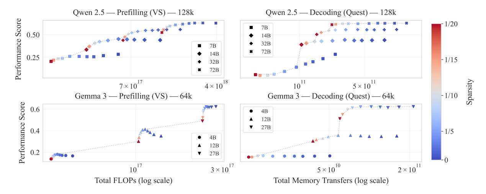

# Abstract

Sparse attention offers a promising strategy to extend long-context capabilities in Transformer LLMs, yet its efficiency–accuracy trade-offs remain unclear due to the lack of comprehensive evaluation. We address this gap with the largestscale empirical analysis to date of training-free sparse attention, evaluating six methods across multiple model families and sizes, sequences up to 128K tokens, and sparsity levels up to 0.95 (i.e., 1/20 attention budget) on nine diverse tasks. We first organise the rapidly evolving landscape of sparse attention methods into a taxonomy along four design axes. Our analysis then yields actionable insights: 1) sparse attention is effective—larger sparse models outperform smaller dense ones at equivalent cost, improving the Pareto frontier; 2) due to computational constraints, token-to-page importance estimation is unfeasible during prefilling, where the choice of an alternative solution (global-totoken or block-to-block) depends on the task, but is possible during decoding, enabling better generalisation and tolerance to higher sparsity; 3) longer sequences tolerate higher sparsity, suggesting that fixed-budget methods in production are suboptimal. Together, these findings provide practical guidance for deploying sparse attention and methodological recommendations for future evaluations. Our code is available at [https://github.com/](https://github.com/PiotrNawrot/sparse-frontier) [PiotrNawrot/sparse-frontier](https://github.com/PiotrNawrot/sparse-frontier).

## 1 Introduction

The ability to model long sequences in large language models (LLMs) lies at the heart of longcontext processing [\(Liu et al.,](#page-9-0) [2025a\)](#page-9-0) and inferencetime scaling [\(Snell et al.,](#page-9-1) [2024;](#page-9-1) [Muennighoff et al.,](#page-9-2) [2025\)](#page-9-2). The fundamental bottleneck for this ability is the self-attention mechanism [\(Bahdanau et al.,](#page-8-0) [2015;](#page-8-0) [Vaswani et al.,](#page-10-0) [2017\)](#page-10-0): during the prefilling stage, its computational complexity scales

quadratically with sequence length—hence, ballooning time-to-first-token and deployment cost [\(Jiang et al.,](#page-9-3) [2024\)](#page-9-3). In the decoding phase, the key– value (KV) cache grows linearly with sequence length, and the need to load from memory this expanding cache for each generation step dominates the runtime [\(Nawrot et al.,](#page-9-4) [2024\)](#page-9-4).

Sparse attention mechanisms aim to address these challenges by approximating dense attention outputs with only a subset of query–key interactions [\(Fu,](#page-8-1) [2024\)](#page-8-1). These span both training-based variants—such as DMS [\(Łancucki et al.](#page-9-5) ´ , [2025\)](#page-9-5), DeepSeek's NSA [\(Yuan et al.,](#page-10-1) [2025\)](#page-10-1), and SWA used in OpenAI's gpt-oss and Google's Gemma 3—and training-free methods that operate directly on pretrained models, such as Vertical-Slash [\(Jiang](#page-9-3) [et al.,](#page-9-3) [2024\)](#page-9-3) deployed in Qwen 2.5-1M [\(Yang et al.,](#page-10-2) [2025\)](#page-10-2) and integrated into vLLM. Sparse attention has not only seen widespread adoption in industry, but also in the research community: over 150 papers with "sparse attention" in the title were submitted to arXiv between January 2025 and January 2026. Despite this popularity, the viability and robustness of sparse attention remain unclear due to a lack of comprehensive large-scale evaluation.

In this work, we carry out the largest-scale empirical analysis to date of training-free sparse attention methods, covering three model families (Qwen 2.5, Llama 3.1, Gemma 3) with sizes between 4B and 72B parameters, sequences between 16K to 128K tokens, and sparsity levels up to 0.95 (i.e., 1/20 attention budget). To enable a controlled analysis, we first survey existing approaches, addressing the challenge of comparing rapidly evolving methods whose implementation details often obscure their core design principles. We distil these approaches into four key axes: units of sparsification (blocks/pages or verticals and slashes), importance estimation (fixed or context-aware), budget allocation across layers (uniform or adaptive), and KV cache management (eviction or full cache).

\*Research conducted during an internship at Cohere. Correspondence email: piotr.nawrot@ed.ac.uk

†Work done prior to joining Meta.

Based on this taxonomy, we select six representative methods spanning these design dimensions and harmonise their implementations, allowing us to rigorously evaluate their distinct effects.

We focus specifically on training-free sparse attention because training-based alternatives require prohibitive computational resources and possibly access to proprietary training data (Nawrot et al., 2024). While this is a limitation, we expect insights from our training-free analysis to transfer to training-based methods given their similarity.\* While previously Li et al. (2025), Liu et al. (2025b), and Yuan et al. (2024) provided a preliminary exploration of training-free methods, they covered limited configurations, specific use cases, or did not control for sequence lengths, hindering a systematic analysis (see Section C for a detailed comparison).

For our evaluation, we curate a benchmark suite of 9 long-context tasks designed to systematically probe the influence of key factors on sparse attention performance. These factors include diverse task types (ranging from retrieval to multi-hop variable tracking and information aggregation), varying naturalness of sequences (synthetic or natural language), and precisely controlled sequence lengths. The importance of these dimensions is underscored by prior work indicating their significant impact on sparse attention effectiveness (Chen et al., 2024; Liu et al., 2024). Alongside established benchmarks (Rajpurkar et al., 2018; Pang et al., 2022; Tseng et al., 2016), we introduce novel, more challenging tasks based on natural language story templates. These complement synthetic benchmarks like RULER (Hsieh et al., 2024), whose results may fail to extrapolate to realistic data, by evaluating core skills in a controllable yet realistic natural language setting. All this provides us with a toolbox to address fundamental questions that currently remain unresolved:

RQ1: Is sparse attention effective? (Section 4.1) An isoCost analysis reveals that sparsification enables larger sparse models to outperform smaller dense ones at equivalent cost (i.e., FLOPs during prefilling and memory reads during decoding). For long sequences, only high-sparsity configurations lie on the Pareto frontier.

RQ2: Which sparse attention method should practitioners use? (Section 4.2) Prefill and decod-

ing phases display different trends. During prefilling, computational constraints force a choice between fine-grained token selection (Vertical-Slash) and block-based selection (Block-Sparse)—neither of which generalises across all tasks. During decoding, token-to-page selection (e.g., Quest) is computationally feasible, enabling greater flexibility and higher compression tolerance than prefilling.

RQ3: How does the sequence length affect tolerance to sparse attention? (Section 4.3) Longer sequences permit higher sparsity while maintaining accuracy, consistently across model families. This suggests that fixed-budget methods deployed in production are suboptimal, and future designs should adapt sparsity to sequence length.

Overall, our findings provide practical guidance for deploying sparse attention and methodological recommendations for future evaluations in this rapidly evolving field.

## 2 Training-Free Sparse Attention

The self-attention mechanism computes query Q, key K, and value V representations from an input sequence  $X \in \mathbb{R}^{n \times d}$ . The output  $O_i$  for the i-th token is a weighted sum of values,  $O_i = \sum_{j=1}^n A_{ij}V_j$ , where the attention weights  $A_{ij}$  are derived from scaled dot-products between queries and keys:  $A_i = \operatorname{softmax}(Q_iK^\top/\sqrt{d})$ . We omit multi-head details for brevity.

Transformer-based text generation involves two phases. **Prefilling** processes the entire input sequence, computing the lower-triangular part of the  $n \times n$  attention matrix A, leading to  $O(n^2)$  complexity. **Decoding** generates tokens autoregressively. While attention is O(n) per step (single query), loading the expanding Key-Value (KV) cache from memory becomes the main bottleneck.

Sparse attention methods reduce these costs by computing only a subset of QK interactions, making A sparse. This lowers computational load during prefilling and memory transfers during decoding. We quantify the effectiveness of these methods using **sparsity**—the fraction of non-computed QK interactions. Equivalently, sparsity of 1-1/k corresponds to retaining only a 1/k fraction of the attention interactions. For instance, sparsity 0.9 (or equivalently, 1/10 attention budget) means computing only 10% of the original QK interactions.

The speedup from sparse attention depends on how much of total cost is attention. Since attention scales quadratically while other components

\*For instance, Quest (Tang et al., 2024) and NSA (Yuan et al., 2025) both use page-based selection for sparse decoding.

(MLP, embeddings) scale linearly with sequence length, attention dominates at longer contexts yielding greater benefits from sparsification. Models with built-in architectural sparsity, such as sliding-window or linear attention layers, have lower baseline attention ratios and require longer sequences for additional sparsification to provide comparable gains (Section [B\)](#page-18-0).

We categorise training-free sparse attention methods along four axes: unit of sparsification, importance estimation, budget allocation, and KV cache management. We exclude token merging methods [\(Wang et al.,](#page-10-4) [2024;](#page-10-4) [Nawrot et al.,](#page-9-4) [2024\)](#page-9-4), which do not rely on sparsity.

### 2.1 Unit of Sparsification

Sparse attention methods differ primarily in the structural units of the attention matrix they prune or retain. Common units include *local windows* (contiguous regions around each query), *vertical columns* (tokens globally available to all queries), *slashes* (tokens at fixed offsets from each query), and *blocks* (fixed-size tiles of the attention matrix, such as 64×64 tokens). Larger structured units such as blocks or windows offer improved computational efficiency via better memory locality, whereas smaller units allow finer-grained, more precise selection of important information.

Block-based methods select blocks of units to approximate full attention. For prefilling, Star Attention approximates attention using local blocks and the first prefix block. MInference's Block-Sparse pattern [\(Jiang et al.,](#page-9-3) [2024\)](#page-9-3) additionally incorporates a set of dynamically selected blocks for each chunk of query tokens. For decoding, Quest [\(Tang](#page-9-12) [et al.,](#page-9-12) [2024\)](#page-9-12) and InfLLM [\(Xiao et al.,](#page-10-5) [2024a\)](#page-10-5) divide the KV cache into contiguous pages and select a subset of them for each decoded token.

Vertical–slash patterns represent another essential class of units. Early sparse attention methods like LM-Infinite [\(Han et al.,](#page-8-4) [2024\)](#page-8-4) and StreamingLLM [\(Xiao et al.,](#page-10-6) [2024b\)](#page-10-6) utilised local sliding windows supplemented by prefix tokens shared globally, also known as attention sinks. Extending this approach, Tri-shape [\(Li et al.,](#page-9-6) [2025\)](#page-9-6) added full attention for suffix tokens, whereas SnapKV [\(Li et al.,](#page-9-13) [2024b\)](#page-9-13) introduced dynamically chosen vertical columns. MInference [\(Jiang et al.,](#page-9-3) [2024\)](#page-9-3) built on this by adding diagonal slashes at arbitrary offsets beyond the local window.[†](#page-2-0) For a

visual illustration of these attention patterns, see Figure [4](#page-11-0) in the Appendix.

### 2.2 Importance Estimation

To identify which specific units to retain, one can use fixed patterns—applied identically across all inputs—or dynamic patterns that adapt to the content being processed. Fixed patterns introduce no computational overhead but cannot adapt to varying input requirements, while dynamic patterns better preserve model quality but require additional computation to identify important connections.

Fixed patterns are identified with offline calibration to work well across all inputs. StreamingLLM [\(Xiao et al.,](#page-10-6) [2024b\)](#page-10-6), LM-Infinite [\(Han et al.,](#page-8-4) [2024\)](#page-8-4) and MoA [\(Fu et al.,](#page-8-5) [2024\)](#page-8-5) determine the number of initial tokens (attention sinks) and the width of a local sliding window.

Content-aware methods typically estimate the importance of QK units (tokens, blocks, or diagonals) to retain only the top-k most relevant ones, maximising attention score recall. They use lightweight heuristics such as approximated attention scores from highest-magnitude dimensions (SparQ; [Ribar et al.,](#page-9-14) [2024\)](#page-9-14) or block-wise pooled token representations [\(Jiang et al.,](#page-9-3) [2024\)](#page-9-3). Some approaches subsample queries (SampleAttention; [Zhu et al.,](#page-10-7) [2024\)](#page-10-7), recognising that recent query tokens often provide better indicators of KV unit importance, as in MInference's Vertical-Slash [\(Jiang](#page-9-3) [et al.,](#page-9-3) [2024\)](#page-9-3) and SnapKV [\(Li et al.,](#page-9-13) [2024b\)](#page-9-13). During decoding, aggregated attention scores (H2O; [Zhang et al.,](#page-10-8) [2023\)](#page-10-8) or the latest query (TOVA; [Oren](#page-9-15) [et al.,](#page-9-15) [2024\)](#page-9-15) guide the selection of KV units, again prioritising units likely to receive high attention weights. Some methods incorporate complementary heuristics alongside attention scores, such as norms of keys [\(Devoto et al.,](#page-8-6) [2024\)](#page-8-6) or values [\(Guo](#page-8-7) [et al.,](#page-8-7) [2024\)](#page-8-7).

Critically, the cost of sparse attention includes both the sparse operation and importance estimation overhead. During prefilling, per-cell importance estimation would require quadratic cost, so methods must either select fine-grained units globally (e.g., vertical columns shared across all queries) or use coarser block-to-block selection. More flexible unit selection improves accuracy but increases estimation cost. During decoding, perquery selection is feasible since only one query is

† Interestingly, to efficiently compute attention along these

diagonals, MInference uses 64×64 blocks aligned with these diagonals rather than computing attention for individual query– key pairs.

processed per step, enabling methods like Quest to perform finer token-to-block selection and tolerate higher compression (Section [4.2\)](#page-5-0).

### 2.3 Budget Allocation

The third dimension in sparse attention design is budget allocation: distributing computational resources across model components (layers and heads) for a target sparsity. This involves a tradeoff between uniform simplicity and adaptive expressivity.

Uniform allocation assigns an equal budget (tokens or blocks) to each head as in Block-Sparse [\(Jiang et al.,](#page-9-3) [2024\)](#page-9-3) and SnapKV [\(Li et al.,](#page-9-13) [2024b\)](#page-9-13). This is computationally simple but overlooks that layers and heads contribute differently to accuracy and have diverse attention sparsity [\(Zhang et al.,](#page-10-9) [2024\)](#page-10-9).

Adaptive methods vary budget allocation. PyramidKV [\(Cai et al.,](#page-8-8) [2024\)](#page-8-8) and PyramidInfer [\(Yang](#page-10-10) [et al.,](#page-10-10) [2024b\)](#page-10-10) observe that attention score entropy decreases with layer depth, allocating larger budgets to early layers. Mixture of Sparse Attention (MoA; [Fu et al.,](#page-8-5) [2024\)](#page-8-5) uses Taylor approximations to optimally distribute the global budget across layers. Within layers, Ada-KV [\(Feng et al.,](#page-8-9) [2024\)](#page-8-9) flexibly allocates by selecting top-(k × h) tokens (where h is head count), allowing critical heads to retain more keys while pruning others. *Thresholdbased* allocation offers maximum flexibility by removing a fixed global budget. Methods like Twilight [\(Lin et al.,](#page-9-16) [2025\)](#page-9-16), FlexPrefill [\(Lai et al.,](#page-9-17) [2025\)](#page-9-17), Tactic [\(Zhu et al.,](#page-10-11) [2025\)](#page-10-11), and SampleAttention [\(Zhu](#page-10-7) [et al.,](#page-10-7) [2024\)](#page-10-7) set coverage thresholds (e.g., 95% of attention mass). Each head dynamically selects units to meet these thresholds, allowing high-entropy attention heads to consume more budget and the overall budget to vary per sample.

### 2.4 KV Cache Management

The final dimension distinguishes methods based on KV cache management during decoding.

KV cache eviction methods (e.g., H2O [\(Zhang](#page-10-8) [et al.,](#page-10-8) [2023\)](#page-10-8), SnapKV [\(Li et al.,](#page-9-13) [2024b\)](#page-9-13)) permanently discard selected tokens based on estimated importance, directly reducing memory footprint but sacrificing information fidelity as discarded tokens cannot be recovered.

Full KV cache retention methods (e.g., Quest [\(Tang et al.,](#page-9-12) [2024\)](#page-9-12), SparQ [\(Ribar et al.,](#page-9-14) [2024\)](#page-9-14)) maintain the entire cache but optimize computation by selectively loading only necessary KV

pairs during attention calculation. While incurring small memory overhead for auxiliary data structures needed for importance estimation, they avoid information loss and can operate effectively at higher sparsity levels compared to eviction-based methods, though they do not reduce peak memory requirements.

## 3 Experimental Setup

## 3.1 Models

We perform experiments primarily on Qwen 2.5 [\(Yang et al.,](#page-10-12) [2024a\)](#page-10-12) (7B, 14B, 32B, 72B parameters), complemented by Llama 3.1 [\(Dubey](#page-8-10) [et al.,](#page-8-10) [2024\)](#page-8-10) (8B, 70B) and Gemma 3 [\(Gemma](#page-8-11) [Team,](#page-8-11) [2025\)](#page-8-11) (4B, 12B, 27B). All three families use instruction-tuned variants to support chain-ofthought evaluation. Qwen 2.5 was selected as our primary family as it uniquely satisfies strict methodological requirements for controlled scaling experiments—see Section [A.3](#page-17-0) for rationale. For Qwen and Llama, we modify the attention mechanism across all layers. Gemma 3 employs hybrid attention where 5 out of 6 layers use sliding window attention (1024 tokens) by design; we apply sparse attention methods only to the remaining dense (global attention) layers. We preserve the original architectures and utilise the vLLM inference engine [\(Kwon et al.,](#page-9-18) [2023\)](#page-9-18) with full bf16 precision. Implementation details are in Section [A.1.](#page-11-1)

## 3.2 Sparse Attention Methods

We evaluate six state-of-the-art sparse attention methods (Table [1\)](#page-4-1), which we choose as a representative set spanning across the key dimensions described in Section [2.](#page-1-1) We focus exclusively on content-aware methods, as prior work has demonstrated that fixed patterns consistently underperform their dynamic counterparts [\(Li et al.,](#page-9-6) [2025\)](#page-9-6).

### 3.3 Tasks

We evaluate 9 diverse tasks selected to reflect different characteristics along 3 key dimensions known to influence sparse attention performance: task difficulty—defined by *Dispersion* (how hard it is to locate necessary information) and *Scope* (how much information must be processed) [\(Goldman](#page-8-12) [et al.,](#page-8-12) [2024\)](#page-8-12)—and data *Naturalness* (natural language vs. synthetic data). This multi-dimensional approach is motivated by recent findings that attention patterns vary significantly across task types: retrieval tasks often exhibit localised attention, while

|         | Method                              | Unit                  | Budget          | KV Cache Management |
|---------|-------------------------------------|-----------------------|-----------------|---------------------|
| Prefill | Vertical-Slash (Jiang et al., 2024) | verticals and slashes | uniform         | N/A                 |
|         | FlexPrefill (Lai et al., 2025)      | verticals and slashes | threshold-based | N/A                 |
|         | Block-Sparse (Jiang et al., 2024)   | blocks                | uniform         | N/A                 |
| Decode  | SnapKV (Li et al., 2024b)           | tokens                | uniform         | eviction            |
|         | Ada-SnapKV (Feng et al., 2024)      | tokens                | adaptive        | eviction            |
|         | Quest (Tang et al., 2024)           | pages                 | uniform         | full cache          |

Table 1: Full list of content-aware sparse attention methods benchmarked in our experiments. These represent diverse strategies in terms of units, budget allocation, and KV cache management.

reasoning tasks show more uniform distributions that are challenging for sparse methods [\(Liu et al.,](#page-9-19) [2025c;](#page-9-19) [Chen et al.,](#page-8-2) [2024;](#page-8-2) [Li et al.,](#page-9-6) [2025\)](#page-9-6). The naturalness dimension is also crucial, as synthetic tasks yield different token representation distributions compared to natural language [\(Liu et al.,](#page-9-8) [2024\)](#page-9-8). Our task suite therefore incorporates four core tasks from the RULER benchmark [\(Hsieh et al.,](#page-8-3) [2024\)](#page-8-3)—Retrieval (NIAH), Multi-hop reasoning (VT), Aggregation (CWE), and QA (SQuAD)—to provide controlled environments (mostly synthetic) for specific capabilities. We complement these with natural texts from benchmarks with minimal contamination risk [\(Li et al.,](#page-9-20) [2024a\)](#page-9-20), such as QuALITY and TOEFL, though these represent low-dispersion, low-scope tasks. Thus, we additionally introduce three novel tasks (Story Retrieval, Multi-hop, Filtering) that translate RULER's challenging tasks (with high dispersion or scope) into naturalistic narratives, more representative of real-world use. We deliberately avoid open-ended tasks like summarisation due to unreliable evaluation metrics [\(Yen](#page-10-13) [et al.,](#page-10-13) [2024;](#page-10-13) [Ye et al.,](#page-10-14) [2024\)](#page-10-14), focusing instead on structured-output tasks requiring factual answers, enabling precise evaluation via Exact Match Accuracy, Intersection-over-Union (IoU), and F1 score (all ranging from 0 to 1). These tasks are summarised in Table [4,](#page-16-0) with detailed descriptions in Section [A.2](#page-15-0) and examples in Section [G.](#page-30-0)

### 3.4 Evaluation Settings

Our evaluation covers input lengths of 16k, 32k, and 64k tokens for all model families, with 128k evaluations limited to Qwen and Llama using Vertical-Slash and Quest only; Gemma exhibited near-zero performance at 128k. We use 100 samples per configuration for Qwen and 50 for Llama and Gemma. We evaluate all combinations of task, model size, sequence length, and sparse attention pattern at sparsity levels from 0 (dense) to 0.95 (i.e., 1/20 attention budget), interpolating performance

at intermediate points. We ensure input samples are within 95–100% of the target maximum token length, providing a consistent basis for evaluating the impact of sequence length on performance. Following [Karpinska et al.](#page-9-21) [\(2024\)](#page-9-21), we adopt a structured prompt format that encourages models to explicitly reason through chain-of-thought before providing answers in a consistent, parsable structure (see Section [E\)](#page-28-0). As metrics of computational cost, we report FLOPS for prefilling and memory access for decoding, as these reflect the respective computational bottlenecks of each phase (see Section [2\)](#page-1-1). Section [B](#page-18-0) provides more details, including indexing costs for sparse attention methods.

## 4 Results

## 4.1 isoCost Analysis

*RQ1: Is sparse attention effective?* Results in Figure [1](#page-5-1) illustrate the average performance across tasks against computational cost for different model sizes and levels of sparsity.[‡](#page-4-2) As implementationagnostic proxies for computational cost, we use FLOPs for prefilling and memory transfers for decoding, which correlate with wall-clock time under optimised implementations (see Section [B](#page-18-0) for cost formulas and breakdowns). We visualise Pareto frontiers to identify configurations that offer the best performance-cost trade-offs, i.e., those not dominated by any other configuration in terms of both cost and performance.

## Sparse attention improves the Pareto frontier.

In Figure [1,](#page-5-1) the Pareto frontier reveals an efficiency crossover where sparsification enables larger sparse models to outperform smaller dense ones at equivalent computational cost. For Qwen at 128k tokens, only high-sparsity configurations lie on the Pareto

‡We approach this question using Vertical-Slash for prefilling and Quest for decoding, as these are, on average, the best-performing patterns for their respective inference phases (see Section [4.2\)](#page-5-0).

Figure 1: isoCost analysis for Qwen 2.5 (128k tokens) and Gemma 3 (64k tokens). Each point corresponds to a (model size, sparsity) configuration, with performance aggregated across 9 tasks. **Left column**: prefilling with Vertical-Slash (Jiang et al., 2024) (FLOPs). **Right column**: decoding with Quest (Tang et al., 2024) (memory transfers). Standard error is negligible (Section D.1) and omitted for visual clarity. Dotted lines show Pareto frontiers connecting configurations that are not dominated by any other configuration. Key findings: (1) sparsification enables larger sparse models to outperform smaller dense models at equivalent cost; (2) the impact of sparsity is less pronounced for Gemma due to its sliding-window architecture (Figure 14).

frontier. During prefilling, models with sparsity 0.8–0.93 (i.e., 1/5 to 1/15 attention budget) remain optimal, while sparsity 0.95 (1/20 budget) falls below the optimal boundary. Decoding shows better resilience to high sparsity, with even 0.95 sparsity configurations being preferable to smaller dense models. For Gemma, we observe similar trends during decoding, but configuration overlap is absent for prefilling—this reflects Gemma's lower baseline attention ratio because of its sliding-window architecture (see Sections 2 and B).

#### 4.2 Per-Task Analysis

RQ2: Which sparse attention method should practitioners use? Figure 2 presents per-task performance across sparse attention methods, aggregated over three model families and sequence lengths up to 64k. The 9 tasks introduced in Section 3.3 are grouped by their information retrieval characteristics: Single QA (one query, localised answer), Multiple QA (multiple queries targeting distinct facts), High Scope/Low Dispersion (broad context, concentrated answers), and Low Scope/High Dispersion (narrow focus, scattered information). Three findings emerge from this analysis.

**Prefill and decoding phases display different flexibility.** As discussed in Section 2, the computational constraints of each inference phase fundamentally determine what patterns can be selected, which in turn affects generalisation across tasks.

During prefilling, per-cell importance estimation would require quadratic cost, leaving only two strategies: global selection of fine-grained units (Vertical-Slash) or block-to-block selection (Block-Sparse). Neither strategy dominates—the optimal choice is task-dependent.

During prefilling, Vertical-Slash shows strong performance on retrieval tasks (Low Scope, Low Dispersion) by enabling fine-grained token selection for locating specific facts. Tasks demanding broader context access or multi-step reasoning (High Scope or Dispersion, e.g., Ruler VT, Story Filtering) benefit from Block-Sparse, which selects distinct key-token blocks for each query block, accommodating the processing of multiple independent segments.

During decoding, token-to-page selection becomes computationally feasible since only one query is processed per step. This greater flexibility enables Quest to generalise better across tasks and tolerate higher compression than either prefilling approach, while retaining the full KV cache. Eviction-based decoding methods (SnapKV, Ada-SnapKV) that permanently discard tokens illustrate the cost of sacrificing the full cache—irreversible compression is detrimental when discarded tokens become relevant later, though this comes with the benefit of reduced memory footprint. Nevertheless, Quest can degrade on synthetic tasks such as Ruler NIAH, where random symbol sequences yield less

Figure 2: Per-task performance comparison of sparse attention methods, aggregated over Qwen 2.5, Llama 3.1, and Gemma 3 models at sequence lengths 16k, 32k, and 64k. Error bars indicate standard error. **Left column**: prefilling (Vertical-Slash, FlexPrefill, Block-Sparse). **Right column**: decoding (SnapKV, Ada-SnapKV, Quest). Tasks are grouped by information retrieval characteristics. Per-family breakdowns are provided in Section D.2.

distinguishable key representations compared to natural language (Liu et al., 2024)—Quest's pagelevel granularity amplifies this effect, as coarser blocks struggle more than Ada-SnapKV's tokenlevel selection to differentiate between unrelated token sets.

**Dynamic budget allocation benefits are phase-dependent.** Adaptive methods that allocate different budgets across layers or sequences yield inconsistent results. During prefilling, FlexPrefill matches or underperforms Vertical-Slash's uniform allocation, likely due to the "attention sink phenomenon" (Chen et al., 2024): threshold-based

selection captures high-attention tokens while missing information in the distribution's long tail. During decoding, Ada-SnapKV consistently outperforms uniform SnapKV, particularly on multi-query tasks (Story Retrieval), though both eviction methods remain inferior to Quest's full-cache approach.

#### Sparsity tolerance varies dramatically across

tasks. The gap between task groups reveals a deployment risk: methods achieving high sparsity on easy tasks may fail on harder ones. Single QA tasks (QuALITY, SQuAD, TOEFL) tolerate sparsity 0.95 (1/20 budget) with minimal degradation across all methods. Multiple QA tasks (Ruler NIAH, Story

Figure 3: Sequence length effects on sparsity tolerance. Relative error is (¯pdense−p¯sparse)/p¯dense, where p¯denotes mean performance. Results aggregated across all tasks, methods, and models (Qwen 2.5, Llama 3.1, Gemma 3). Per-family breakdowns are provided in Section [D.3.](#page-22-2)

Retrieval) show substantial degradation at sparsity 0.8–0.9 (1/5 to 1/10 budget). Tasks with High Scope or High Dispersion degrade even at modest sparsity (0.5–0.67, i.e., 1/2 to 1/3 budget) for some methods. Evaluating sparse attention only on Single QA benchmarks—or averaging across task types—masks these vulnerabilities. Robust deployment requires testing across diverse task characteristics, as sparsity levels safe for retrieval tasks can cause failures on aggregation or multi-hop reasoning. Moreover, sequence naturalness affects methods asymmetrically—Quest outperforms Ada-SnapKV on natural-language retrieval (Story Retrieval) but underperforms on synthetic retrieval (Ruler NIAH)—underscoring the need for benchmarks spanning both natural and synthetic data.

### 4.3 Sequence Length Effects

*RQ3: How does sequence length affect tolerance to sparse attention?* Figure [3](#page-7-1) shows that for a fixed attention budget fraction, longer sequences incur smaller degradation: for example, at a 1/20 budget, the relative error decreases from ≈ 0.33 (16k) to ≈ 0.26 (32k) and ≈ 0.20 (64k). This indicates that the same sparsity ratio becomes less harmful as the sequence length grows. This pattern holds consistently across all model families. [Nawrot et al.](#page-9-4) [\(2024\)](#page-9-4) observe similar results for a training-aware KV compression method: their learned mechanism applies lower sparsity at the beginning of sequences and increases sparsity with sequence length. This behaviour may be explained by Herdan's law [\(Herdan,](#page-8-13) [1960\)](#page-8-13), which posits that new information becomes rarer over time, facilitating higher sparsity with distance.

To relate this trend to budget scaling, we interpret the plot as approximate *iso-error* curves. For

a target relative error of ≈ 0.2, the required budget fractions are roughly 1/10 (16k), 1/15 (32k), and 1/20 (64k). In contrast, a fixed token budget would imply fractions 1/10 → 1/20 → 1/40 as length grows, which already exceeds the ≈ 0.2 error target at 32k (the 1/20 point is ≈ 0.26). For a stricter target such as ≈ 0.1, the scaling is less uniform: 1/5 stays below 0.1 for both 16k and 32k, while 64k requires only a modest reduction in sparsity to stay near 0.1. These observations imply that the optimal token budget should grow *sublinearly* with sequence length: doubling the context does not require doubling the token budget, but keeping the budget constant would incur increasing degradation. While current dynamic methods lack robustness (Section [4.2\)](#page-5-0), developing reliable sublinear budget allocation mechanisms remains a promising direction for future work.

