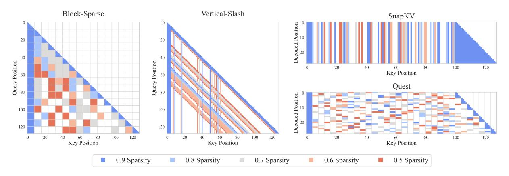
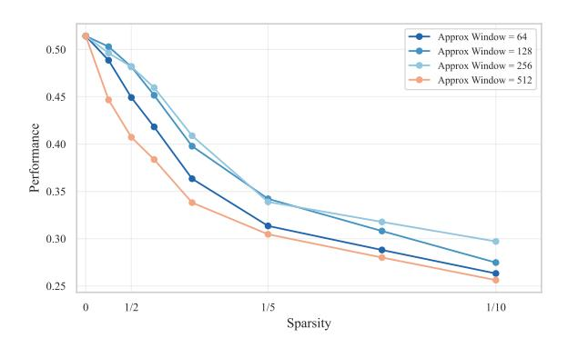
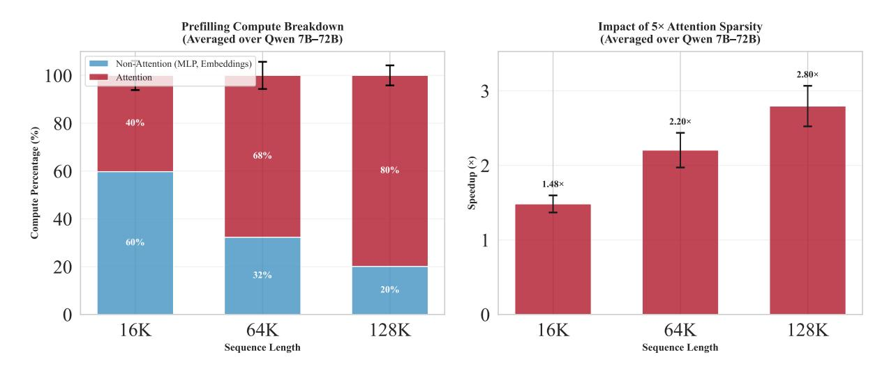
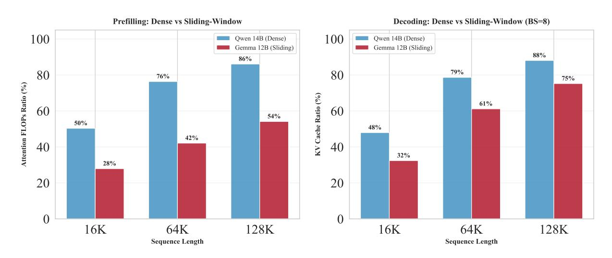

# References

- Dzmitry Bahdanau, Kyung Hyun Cho, and Yoshua Bengio. 2015. Neural machine translation by jointly learning to align and translate. In *3rd International Conference on Learning Representations, ICLR 2015*.
- Zefan Cai, Yichi Zhang, Bofei Gao, Yuliang Liu, Tianyu Liu, Keming Lu, Wayne Xiong, Yue Dong, Baobao Chang, Junjie Hu, and Wen Xiao. 2024. Pyramidkv: Dynamic kv cache compression based on pyramidal information funneling. *arXiv:2406.02069*.
- Zhuoming Chen, Ranajoy Sadhukhan, Zihao Ye, Yang Zhou, Jianyu Zhang, Niklas Nolte, Yuandong Tian,

- Matthijs Douze, Leon Bottou, Zhihao Jia, and Beidi Chen. 2024. Magicpig: LSH sampling for efficient LLM generation. *arXiv:2410.16179*.
- Alessio Devoto, Yu Zhao, Simone Scardapane, and Pasquale Minervini. 2024. A simple and effective l2 norm-based strategy for kv cache compression. In *Proceedings of the 2024 Conference on Empirical Methods in Natural Language Processing*, pages 18476–18499.
- Abhimanyu Dubey, Abhinav Jauhri, Abhinav Pandey, Abhishek Kadian, Ahmad Al-Dahle, Aiesha Letman, Akhil Mathur, Alan Schelten, Amy Yang, Angela Fan, et al. 2024. The Llama 3 herd of models. *arXiv:2407.21783*.
- Yuan Feng, Junlin Lv, Yukun Cao, Xike Xie, and S Kevin Zhou. 2024. Ada-kv: Optimizing kv cache eviction by adaptive budget allocation for efficient LLM inference. *arXiv:2407.11550*.
- Tianyu Fu, Haofeng Huang, Xuefei Ning, Genghan Zhang, Boju Chen, Tianqi Wu, Hongyi Wang, Zixiao Huang, Shiyao Li, Shengen Yan, Guohao Dai, Huazhong Yang, and Yu Wang. 2024. Moa: Mixture of sparse attention for automatic large language model compression. *arXiv:2406.14909*.
- Yao Fu. 2024. Challenges in deploying long-context transformers: A theoretical peak performance analysis. *arXiv:2405.08944*.
- Gemma Team. 2025. Gemma 3 technical report. *arXiv:2503.19786*.
- Omer Goldman, Alon Jacovi, Aviv Slobodkin, Aviya Maimon, Ido Dagan, and Reut Tsarfaty. 2024. Is it really long context if all you need is retrieval? Towards genuinely difficult long context NLP. In *Proceedings of the 2024 Conference on Empirical Methods in Natural Language Processing*, pages 16576–16586.
- Zhiyu Guo, Hidetaka Kamigaito, and Taro Watanabe. 2024. Attention score is not all you need for token importance indicator in kv cache reduction: Value also matters. In *Proceedings of the 2024 Conference on Empirical Methods in Natural Language Processing*, pages 21158–21166.
- Chi Han, Qifan Wang, Hao Peng, Wenhan Xiong, Yu Chen, Heng Ji, and Sinong Wang. 2024. Lminfinite: Zero-shot extreme length generalization for large language models. In *Proceedings of the 2024 Conference of the North American Chapter of the Association for Computational Linguistics: Human Language Technologies (Volume 1: Long Papers)*, pages 3991–4008.
- Gustav Herdan. 1960. *Type-Token Mathematics*. Mouton, The Hague.
- Cheng-Ping Hsieh, Simeng Sun, Samuel Kriman, Shantanu Acharya, Dima Rekesh, Fei Jia, Yang Zhang, and Boris Ginsburg. 2024. Ruler: What's the real context size of your long-context language models? *arXiv:2404.06654*.

- Huiqiang Jiang, Yucheng Li, Chengruidong Zhang, Qianhui Wu, Xufang Luo, Surin Ahn, Zhenhua Han, Amir H. Abdi, Dongsheng Li, Chin-Yew Lin, Yuqing Yang, and Lili Qiu. 2024. MInference 1.0: Accelerating pre-filling for long-context LLMs via dynamic sparse attention. In *The Thirty-eighth Annual Conference on Neural Information Processing Systems*.
- Marzena Karpinska, Katherine Thai, Kyle Lo, Tanya Goyal, and Mohit Iyyer. 2024. One thousand and one pairs: A "novel" challenge for long-context language models. *arXiv:2406.16264*.
- Woosuk Kwon, Zhuohan Li, Siyuan Zhuang, Ying Sheng, Lianmin Zheng, Cody Hao Yu, Joseph E. Gonzalez, Hao Zhang, and Ion Stoica. 2023. Efficient memory management for large language model serving with pagedattention. In *Proceedings of the ACM SIGOPS 29th Symposium on Operating Systems Principles*.
- Xunhao Lai, Jianqiao Lu, Yao Luo, Yiyuan Ma, and Xun Zhou. 2025. Flexprefill: A context-aware sparse attention mechanism for efficient long-sequence inference. In *The Thirteenth International Conference on Learning Representations*.
- Adrian Łancucki, Konrad Staniszewski, Piotr Nawrot, ´ and Edoardo Maria Ponti. 2025. Inference-time hyper-scaling with KV cache compression. In *Advances in Neural Information Processing Systems*.
- Xinze Li, Yixin Cao, Yubo Ma, and Aixin Sun. 2024a. Long context vs. RAG for LLMs: An evaluation and revisits. *arXiv:2501.01880*.
- Yucheng Li, Huiqiang Jiang, Qianhui Wu, Xufang Luo, Surin Ahn, Chengruidong Zhang, Amir H. Abdi, Dongsheng Li, Jianfeng Gao, Yuqing Yang, and Lili Qiu. 2025. SCBench: A kv cache-centric analysis of long-context methods. In *The Thirteenth International Conference on Learning Representations*.
- Yuhong Li, Yingbing Huang, Bowen Yang, Bharat Venkitesh, Acyr Locatelli, Hanchen Ye, Tianle Cai, Patrick Lewis, and Deming Chen. 2024b. Snapkv: LLM knows what you are looking for before generation. *arXiv:2404.14469*.
- Chaofan Lin, Jiaming Tang, Shuo Yang, Hanshuo Wang, Tian Tang, Boyu Tian, Ion Stoica, Song Han, and Mingyu Gao. 2025. Twilight: Adaptive attention sparsity with hierarchical top-p pruning. *arXiv:2502.02770*.
- Jiaheng Liu, Dawei Zhu, Zhiqi Bai, Yancheng He, Huanxuan Liao, Haoran Que, Zekun Wang, Chenchen Zhang, Ge Zhang, Jiebin Zhang, et al. 2025a. A comprehensive survey on long context language modeling. *arXiv:2503.17407*.
- Xiang Liu, Zhenheng Tang, Hong Chen, Peijie Dong, Zeyu Li, Xiuze Zhou, Bo Li, Xuming Hu, and Xiaowen Chu. 2025b. Can LLMs maintain fundamental abilities under kv cache compression? *arXiv:2502.01941*.

- Xiang Liu, Zhenheng Tang, Hong Chen, Peijie Dong, Zeyu Li, Xiuze Zhou, Bo Li, Xuming Hu, and Xiaowen Chu. 2025c. Can LLMs maintain fundamental abilities under kv cache compression? *arXiv:2502.01941*.
- Xiaoran Liu, Ruixiao Li, Qipeng Guo, Zhigeng Liu, Yuerong Song, Kai Lv, Hang Yan, Linlin Li, Qun Liu, and Xipeng Qiu. 2024. Reattention: Trainingfree infinite context with finite attention scope. *arXiv:2407.15176*.
- Niklas Muennighoff, Zitong Yang, Weijia Shi, Xiang Lisa Li, Li Fei-Fei, Hannaneh Hajishirzi, Luke Zettlemoyer, Percy Liang, Emmanuel Candes, and ` Tatsunori Hashimoto. 2025. s1: Simple test-time scaling. *arXiv:2501.19393*.
- Piotr Nawrot, Adrian Łancucki, Marcin Chochowski, ´ David Tarjan, and Edoardo M. Ponti. 2024. Dynamic memory compression: Retrofitting LLMs for accelerated inference. In *Proceedings of the 41st International Conference on Machine Learning*.
- Matanel Oren, Michael Hassid, Nir Yarden, Yossi Adi, and Roy Schwartz. 2024. Transformers are multistate RNNs. In *Proceedings of the 2024 Conference on Empirical Methods in Natural Language Processing*, pages 18724–18741.
- Richard Yuanzhe Pang, Alicia Parrish, Nitish Joshi, Nikita Nangia, Jason Phang, Angelica Chen, Vishakh Padmakumar, Johnny Ma, Jana Thompson, He He, et al. 2022. Quality: Question answering with long input texts, yes! In *Proceedings of the 2022 Conference of the North American Chapter of the Association for Computational Linguistics*, pages 5336– 5358.
- Pranav Rajpurkar, Robin Jia, and Percy Liang. 2018. Know what you don't know: Unanswerable questions for squad. In *Proceedings of the 56th Annual Meeting of the Association for Computational Linguistics*, pages 784–789.
- Luka Ribar, Ivan Chelombiev, Luke Hudlass-Galley, Charlie Blake, Carlo Luschi, and Douglas Orr. 2024. Sparq attention: Bandwidth-efficient LLM inference. In *International Conference on Machine Learning*, pages 42558–42583. PMLR.
- Charlie Snell, Jaehoon Lee, Kelvin Xu, and Aviral Kumar. 2024. Scaling LLM test-time compute optimally can be more effective than scaling model parameters. *arXiv:2408.03314*.
- Jiaming Tang, Yilong Zhao, Kan Zhu, Guangxuan Xiao, Baris Kasikci, and Song Han. 2024. Quest: Queryaware sparsity for efficient long-context LLM inference. In *International Conference on Machine Learning*, pages 47901–47911. PMLR.
- Bo-Hsiang Tseng, Sheng-Syun Shen, Hung-Yi Lee, and Lin-Shan Lee. 2016. Towards machine comprehension of spoken content: Initial toefl listening comprehension test by machine. *arXiv:1608.06378*.

- Ashish Vaswani, Noam Shazeer, Niki Parmar, Jakob Uszkoreit, Llion Jones, Aidan N Gomez, Łukasz Kaiser, and Illia Polosukhin. 2017. Attention is all you need. *Advances in Neural Information Processing Systems*, 30.
- Zheng Wang, Boxiao Jin, Zhongzhi Yu, and Minjia Zhang. 2024. Model tells you where to merge: Adaptive kv cache merging for LLMs on long-context tasks. *arXiv:2407.08454*.
- Chaojun Xiao, Pengle Zhang, Xu Han, Guangxuan Xiao, Yankai Lin, Zhengyan Zhang, Zhiyuan Liu, and Maosong Sun. 2024a. InfLLM: Training-free long-context extrapolation for LLMs with an efficient context memory. In *The Thirty-eighth Annual Conference on Neural Information Processing Systems*.
- Guangxuan Xiao, Yuandong Tian, Beidi Chen, Song Han, and Mike Lewis. 2024b. Efficient streaming language models with attention sinks. *arXiv:2309.17453*.
- An Yang, Baosong Yang, Beichen Zhang, Binyuan Hui, Bo Zheng, Bowen Yu, Chengyuan Li, Dayiheng Liu, Fei Huang, Haoran Wei, et al. 2024a. Qwen2.5 technical report. *arXiv:2412.15115*.
- An Yang, Bowen Yu, Chengyuan Li, Dayiheng Liu, Fei Huang, Haoyan Huang, Jiandong Jiang, Jianhong Tu, Jianwei Zhang, Jingren Zhou, Junyang Lin, Kai Dang, Kexin Yang, Le Yu, Mei Li, Minmin Sun, Qin Zhu, Rui Men, Tao He, Weijia Xu, Wenbiao Yin, Wenyuan Yu, Xiafei Qiu, Xingzhang Ren, Xinlong Yang, Yong Li, Zhiying Xu, and Zipeng Zhang. 2025. Qwen2.5-1M technical report. *arXiv:2501.15383*.
- Dongjie Yang, Xiaodong Han, Yan Gao, Yao Hu, Shilin Zhang, and Hai Zhao. 2024b. Pyramidinfer: Pyramid kv cache compression for high-throughput LLM inference. In *Findings of the Association for Computational Linguistics ACL 2024*, pages 3258–3270.
- Jiayi Ye, Yanbo Wang, Yue Huang, Dongping Chen, Qihui Zhang, Nuno Moniz, Tian Gao, Werner Geyer, Chao Huang, Pin-Yu Chen, Nitesh V Chawla, and Xiangliang Zhang. 2024. Justice or prejudice? Quantifying biases in LLM-as-a-judge. In *Neurips Safe Generative AI Workshop 2024*.
- Howard Yen, Tianyu Gao, Minmin Hou, Ke Ding, Daniel Fleischer, Peter Izsak, Moshe Wasserblat, and Danqi Chen. 2024. Helmet: How to evaluate longcontext language models effectively and thoroughly. *arXiv:2410.02694*.
- Jiayi Yuan, Hongyi Liu, Shaochen Zhong, Yu-Neng Chuang, Songchen Li, Guanchu Wang, Duy Le, Hongye Jin, Vipin Chaudhary, Zhaozhuo Xu, Zirui Liu, and Xia Hu. 2024. Kv cache compression, but what must we give in return? A comprehensive benchmark of long context capable approaches. In *The 2024 Conference on Empirical Methods in Natural Language Processing*.

- Jingyang Yuan, Huazuo Gao, Damai Dai, Junyu Luo, Liang Zhao, Zhengyan Zhang, Zhenda Xie, Y. X. Wei, Lean Wang, Zhiping Xiao, Yuqing Wang, Chong Ruan, Ming Zhang, Wenfeng Liang, and Wangding Zeng. 2025. Native sparse attention: Hardware-aligned and natively trainable sparse attention. *arXiv:2502.11089*.
- Yanqi Zhang, Yuwei Hu, Runyuan Zhao, John C.S. Lui, and Haibo Chen. 2024. Unifying kv cache compression for large language models with leankv. *arXiv:2412.03131*.
- Zhenyu Zhang, Ying Sheng, Tianyi Zhou, Tianlong Chen, Lianmin Zheng, Ruisi Cai, Zhao Song, Yuandong Tian, Christopher Re, Clark Barrett, Zhangyang ´ Wang, and Beidi Chen. 2023. H2o: Heavy-hitter oracle for efficient generative inference of large language models. In *Proceedings of the 37th International Conference on Neural Information Processing Systems*, NIPS '23, Red Hook, NY, USA. Curran Associates Inc.
- Kan Zhu, Tian Tang, Qinyu Xu, Yile Gu, Zhichen Zeng, Rohan Kadekodi, Liangyu Zhao, Ang Li, Arvind Krishnamurthy, and Baris Kasikci. 2025. Tactic: Adaptive sparse attention with clustering and distribution fitting for long-context LLMs. *arXiv:2502.12216*.
- Qianchao Zhu, Jiangfei Duan, Chang Chen, Siran Liu, Xiuhong Li, Guanyu Feng, Xin Lv, Huanqi Cao, Xiao Chuanfu, Xingcheng Zhang, Dahua Lin, and Chao Yang. 2024. Sampleattention: Near-lossless acceleration of long context LLM inference with adaptive structured sparse attention. *arXiv:2406.15486*.

#### A Experimental details

#### A.1 Implementation Details

This section provides supplementary details on the sparse attention patterns evaluated, focusing on hyperparameter tuning and specific configurations used to achieve target sparsity levels. We tuned hyperparameters for each pattern using ablation studies on the Qwen-7B model with a 16K sequence length across all tasks, varying sparsity from 0 to 0.9. Our main experiments evaluated performance at sparsity levels 0.33, 0.5, 0.6, 0.7, 0.8, 0.87, 0.9, 0.93, 0.95 (corresponding to attention budgets 1/1.5, 1/2, 1/2.5, 1/3.33, 1/5, 1/7.5, 1/10, 1/15, 1/20), using linear interpolation for intermediate values where necessary. Table 3 summarizes the final parameters we used for each pattern, sequence length, and sparsity level. In total we evaluated 7065 configurations with 100 samples per configuration. We used approximately 4 compute nodes with 8 H100 GPUs each for 21 days.

Figure 4: Visualization of sparse attention patterns. Block-Sparse and Vertical-Slash operate during prefilling (showing query-key attention matrix), while SnapKV and Quest operate during decoding (showing decoded tokens attending to KV cache positions). Colors indicate different sparsity levels from 0.5 (red) to 0.9 (blue). The black vertical lines in SnapKV and Quest mark the prefill/decode boundary.

#### **A.1.1** Block-Sparse Attention

We implement block-sparse attention by dividing the attention matrix into fixed-size blocks. The original implementation is available under the MIT license. Based on our ablation studies (Figure 5), we selected a block size of 16x16, as smaller blocks consistently yielded better performance. To achieve a target sparsity level, we select the top-k key blocks for each query block, where k is determined via binary search. We always preserve attention sinks (the first key block) and local context (diagonal key blocks corresponding to the query block).

#### A.1.2 Vertical-Slash Pattern

We implement the Vertical-Slash pattern (Jiang et al., 2024), available under the MIT license, by allocating a uniform budget to global (vertical columns) and local (slash diagonals) attention components. We select the most important verticals and slashes by approximating attention scores using a limited window of recent query tokens. Our ablation studies (Figure 11) revealed task-dependent optimal approximation window sizes: 512 tokens for retrieval-heavy tasks (Ruler NIAH, Story Retrieval) and 256 tokens for other tasks. This observation correlates with the typical query lengths for these tasks (see Table 2). We consistently preserve the first 4 (prefix) and the most recent 64 (local) tokens. To achieve target sparsity levels, we compute the required number of verticals and slashes based on collected attention statistics for each sequence length.

#### A.1.3 FlexPrefill

We implement FlexPrefill (Lai et al., 2025), available under the Apache-2.0 license, which enhances Vertical-Slash by introducing dynamic budget allocation per layer and head, controlled by a coverage parameter  $\alpha$  and a minimum budget (min\_budget). We set  $\tau = 0$  in our experiments, hence disabling

Table 2: Statistics of token lengths of question and instruction for each task across 100 samples, informing the choice of approximation window size for Vertical-Slash and FlexPrefill.

| Task            | Mean Tokens | Min Tokens | Max Tokens |  |
|-----------------|-------------|------------|------------|--|
| QA QuALITY      | 243.63      | 196        | 423        |  |
| QA SQuAD        | 217.08      | 210        | 235        |  |
| QA ToeflQA      | 237.67      | 202        | 270        |  |
| RULER CWE       | 227.00      | 227        | 227        |  |
| RULER NIAH      | 337.74      | 330        | 350        |  |
| RULER VT        | 230.00      | 230        | 230        |  |
| Story Filtering | 184.00      | 184        | 184        |  |
| Story Multi-hop | 192.97      | 192        | 195        |  |
| Story Retrieval | 457.54      | 452        | 462        |  |

Query-Aware attention. This choice stemmed from two key considerations: first, our preliminary tests indicated no significant performance gains from enabling it, aligning with the findings reported in the original work; second, this setting isolates the dynamic budget allocation mechanism, allowing us to specifically evaluate its impact compared to the fixed allocation used in the Vertical-Slash pattern. We employ the same task-dependent approximation windows (256 / 512 tokens) and critical token preservation strategy (first 4 prefix, most recent 64 local) as in our Vertical-Slash implementation. Our ablations (Figure [8\)](#page-14-1) indicated that setting min budget to 512 significantly improved performance, suggesting the importance of maintaining a minimum level of connectivity during prefilling. We achieved target compression ratios by selecting the appropriate α based on attention statistics while keeping min budget fixed at 512. For high compression ratios where dynamic allocation proved less effective, we set α = 0, effectively reverting to a uniform allocation of Vertical-Slash.

### A.1.4 SnapKV

We implement SnapKV [\(Li et al.,](#page-9-13) [2024b\)](#page-9-13), available under the CC-BY 4.0 license, by compressing the Key-Value (KV) cache after the prefilling stage and applying a uniform token budget across all heads for the subsequent decoding phase. We predict token importance for decoding by computing attention scores using a window of recent query tokens (approximation window). Our ablations showed an optimal approximation window size of 256 tokens (Figure [9\)](#page-14-2), with no significant task dependency observed, unlike Vertical-Slash and FlexPrefill. We smooth the calculated token importance scores using 1D average pooling with a kernel size of 21 (chosen based on Figure [10\)](#page-14-2). We always preserve the first 4 and the most recent 128 tokens. We control sparsity by setting the 'token capacity' (token limit per head) to achieve the target sparsity level.

### A.1.5 Ada-SnapKV

We implement Ada-SnapKV [\(Feng et al.,](#page-8-9) [2024\)](#page-8-9), available under the MIT license, which extends SnapKV by incorporating dynamic token budget allocation per head. One difference in our implementation between Ada-SnapKV and SnapKV is that we use max-aggregation (instead of averaging) across query positions and heads for score calculation; this empirically proved more effective for adaptive allocation but had no effect for uniform (SnapKV) allocation. We utilize the same smoothing kernel size (21) and critical token preservation strategy (first 4 prefix, most recent 128 local) as in our SnapKV implementation. Our ablations (Figure [7\)](#page-14-1) indicated that providing each head with a minimum budget of 20% of its capacity was optimal. Performance was found to be less sensitive to minimum budget (performing well within the 10-50% range) compared to FlexPrefill's sensitivity, but degraded sharply when approaching 100% (uniform allocation), underscoring the benefits of dynamic allocation during decoding. We control sparsity by setting 'token capacity', identically to SnapKV.

#### A.1.6 Quest

We implement Quest (Tang et al., 2024), available under the CC-BY 4.0 license, which applies dynamic sparse attention during the decoding phase at the page level. Based on our ablations (Figure 6), we used a page size of 16 tokens. We represent pages by their minimum and maximum key values to enable efficient similarity computation with queries. At each decoding step, we select the most relevant pages based on query-page similarity scores, always including the page containing the current token. We control sparsity by setting the 'token\_budget' (number of tokens selected per step) to achieve the target sparsity level.

Table 3: Pattern parameters for different sequence lengths and sparsity levels. At 128k tokens, we only evaluate Vertical-Slash and Quest.

| Pattern          | Parameter                | Sequence Length | Values for Different Sparsity Levels                                                  |
|------------------|--------------------------|-----------------|---------------------------------------------------------------------------------------|
|                  |                          | 16384           | 164, 240, 315, 400, 448, 576, 768, 1024, 1536, 2304                                   |
| Vertical & Slash | Verticals/Slashes        | 32768           | 290, 384, 448, 576, 704, 1024, 1536, 2304, 3584, 4608                                 |
|                  |                          | 65536           | 400, 448, 544, 640, 960, 1280, 2304, 4096, 6144, 8192                                 |
|                  |                          | 128000          | 480, 768, 1024, 1536, 2048, 3584, 5632, 10240, 13312, 18432                           |
|                  |                          | 16384           | (0, 164), (0, 240), (0, 315), (0, 400), (0.55, 512), (0.71, 512), (0.88, 512)         |
| FlexPrefill      | $(\alpha, \min\_budget)$ | 32768           | (0, 290), (0, 384), (0.45, 512), (0.6, 512), (0.7, 512), (0.8, 512), (0.92, 512)      |
|                  |                          | 65536           | (0, 400), (0.45, 512), (0.55, 512), (0.7, 512), (0.77, 512), (0.85, 512), (0.94, 512) |
|                  |                          | 16384           | 26, 35, 53, 71, 108, 188, 300                                                         |
| Block Sparse     | top_chunks               | 32768           | 52, 69, 105, 141, 216, 376, 600                                                       |
|                  |                          | 65536           | 104, 139, 210, 283, 432, 752, 1200                                                    |
|                  |                          | 16384           | 819, 1092, 1638, 2183, 3276, 4915, 6553, 8192, 9830, 11468                            |
| SnapKV/AdaSnapKV | napKV token_capacity     | 32768           | 1638, 2185, 3276, 4367, 6553, 9830, 13107, 16384, 19660, 22937                        |
|                  |                          | 65536           | 3276, 4371, 6553, 8735, 13107, 19660, 26214, 32768, 39321, 45875                      |
|                  |                          | 16384           | 816, 1088, 1632, 2176, 3280, 4912, 6560, 8192, 9824, 11472                            |
| Overst           | 4-1 1 14                 | 32768           | 1632, 2192, 3280, 4368, 6560, 9824, 13104, 16384, 19664, 22944                        |
| Quest            | token_budget             | 65536           | 3280, 4368, 6560, 8736, 13104, 19664, 26208, 32768, 39328, 45872                      |
|                  |                          | 128000          | 6400, 8544, 12800, 17056, 25600, 38400, 51200, 64000, 76800, 89600                    |

Figure 5: Block-Sparse block size.

Figure 6: Quest page size.

0.42

0.40

0.40

0.40

0.30

0.31

0.32

0.30

0.31

0.32

0.30

0.30

0.30

0.30

0.30

0.30

0.30

0.30

0.30

0.30

0.30

0.30

0.30

0.30

0.30

0.30

0.30

0.30

Figure 7: Ada-SnapKV min budget.

Figure 8: FlexPrefill min budget.

Figure 9: SnapKV/Ada-SnapKV approximation window.

Figure 10: SnapKV/Ada-SnapKV kernel size.

Figure 11: Vertical-Slash approximation window ablation per task.

## A.2 Task Details

This section provides further details on the nine evaluation tasks used in our experiments. These tasks, summarized in Table [4](#page-16-0) at the end of this subsection, are grouped into Question Answering, synthetic tasks from RULER [\(Hsieh et al.,](#page-8-3) [2024\)](#page-8-3), and our Story tasks. We specify key hyperparameters, evaluation metrics, and characterize each task along the axes of Scope (Low vs. High) and Dispersion (Low vs. High). Scope refers to the amount of information required, while Dispersion indicates how difficult it is to locate the relevant information within the context.

## A.2.1 Question Answering (QA)

We use SQuAD [\(Rajpurkar et al.,](#page-9-9) [2018\)](#page-9-9) (CC BY-SA 4.0) from RULER (Apache-2.0) and two other QA datasets selected for minimal data contamination [\(Li et al.,](#page-9-20) [2024a\)](#page-9-20): QuALITY [\(Pang et al.,](#page-9-10) [2022\)](#page-9-10) (CC BY 4.0) and ToeflQA [\(Tseng et al.,](#page-9-11) [2016\)](#page-9-11) [§](#page-15-1) .

- Setup: Each example contains one answer-bearing document and distractor documents to reach the target sequence length. Documents are shuffled and numbered; the question refers to a specific document ID.
- Preprocessing: We remove duplicate question-context pairs and filter examples where the original context exceeds 8k tokens (ensuring space for at least one distractor at 16k sequence length).
- Evaluation: Exact Match Accuracy (QuALITY, ToeflQA multiple-choice), token-level F1 (SQuAD open-ended).
- Characteristics: Natural text. Requires identifying and processing a specific document, thus characterised by Low Dispersion and Low Scope. See Section [G.1.](#page-30-1)

### A.2.2 Synthetic – RULER Tasks

We use three synthetic tasks from the RULER benchmark [\(Hsieh et al.,](#page-8-3) [2024\)](#page-8-3) (Apache-2.0).

- Needle-in-a-Haystack (NIAH): Extract values for 4 target keys from a document containing relevant and distractor key-value pairs (random hyphenated strings). Evaluated using Exact Match Accuracy. Requires finding specific items, characteristic of Low Dispersion and Low Scope. See Section [G.2.](#page-31-0)
- Common Word Extraction (CWE): Identify the 10 most frequent words (appearing 30 times each) among distractor words (appearing 3 times each), sampled from a vocabulary of ∼9,000 English words[¶](#page-15-2) . Evaluated using Intersection-over-Union (IoU). Requires processing the entire context to count frequencies, demanding Low Dispersion (words are presented directly as a list, not obscured within complex structures) but High Scope (all words must be processed to determine frequencies). See Section [G.3.](#page-32-0)
- Variable Tracking (VT): Resolve variable assignments (direct or chained) to identify all variables matching a target value. Context includes repeated filler text ("*The grass is green...*"). Evaluated using IoU. Requires tracking dependencies across the context, demanding High Dispersion (information location depends on chains) and Low Scope (only specific chains matter). See Section [G.4.](#page-33-0)

## A.2.3 Semi-Synthetic – Story Tasks

These tasks use procedurally generated multi-chapter narratives that scale with sequence length. Each chapter follows a schema involving travel, dialogue, and item transactions. See Section [F](#page-29-0) for an example narrative. We release them under the CC BY 4.0 license.

§Originally released at <https://github.com/iamyuanchung/TOEFL-QA>. License information is missing; a GitHub issue requesting clarification was opened on August 7, 2023, but has not received a response.

¶<https://github.com/mrmaxguns/wonderwordsmodule>

- Story Retrieval: Answer 16 factoid questions (e.g., location visited, item acquired) about specific chapters, with chapter IDs provided in the questions. Evaluated using Exact Match Accuracy. Requires accessing specific chapters, characteristic of Low Dispersion and Low Scope. See Section [G.5.](#page-34-0)
- Story Filtering: Identify the three specific chapters where no item purchases occurred. The prompt explicitly asks for these three chapter IDs, and the narrative is constructed such that exactly three chapters meet this condition. Evaluated using IoU. Requires checking all chapters, demanding Low Dispersion (information is chapter-based) but High Scope (all chapters must be checked). We found this task to be challenging even for the largest models evaluated. See Section [G.6.](#page-35-0)
- Story Multi-hop: Given a target item, identify the item acquired immediately before it, requiring reasoning across the transaction history in multiple chapters. In our setup, an item is acquired in every chapter; this simplifies the task to locating the chapter where the target item was acquired and retrieving the item name from the immediately preceding chapter. We found this simplified version to be highly challenging, even for the largest models evaluated, thus we did not explore more complex variants (e.g., selective item acquisition requiring longer lookbacks). Evaluated using Exact Match Accuracy. Requires tracking history across the narrative, demanding High Dispersion (relevant transactions can be far apart) and Low Scope (only specific transaction pairs matter). See Section [G.7.](#page-36-0)

| Task Name           | Description                                                                      | Dispersion | Scope | Natural |
|---------------------|----------------------------------------------------------------------------------|------------|-------|---------|
| QA (SQuAD)          | Open-ended QA on a specified document among distractors                          | Low        | Low   | ✓       |
| QA (QuALITY, TOEFL) | Multiple-choice QA on a specified document among distrac tors                 | Low        | Low   | ✓       |
| Ruler NIAH          | Extract 4 values for specified keys among many distractor key-value pairs     | Low        | Low   | ×       |
| Ruler VT            | Identify variables that resolve to a specific value via chained assignments   | High       | Low   | ×       |
| Ruler CWE           | Identify the 10 most frequent words from a list with distrac tors             | Low        | High  | ×       |
| Story Retrieval     | Answer 16 factoid-style questions about specific chapters in a long narrative | Low        | Low   | ✓       |
| Story Multi-hop     | Identify the item acquired immediately before a target item across chapters   | High       | Low   | ✓       |
| Story Filtering     | Identify chapters where no item purchases occurred in a long narrative        | Low        | High  | ✓       |

Table 4: Summary of 9 evaluation tasks: QA tasks are based on existing datasets—SQuAD [\(Rajpurkar et al.,](#page-9-9) [2018\)](#page-9-9), QuALITY [\(Pang et al.,](#page-9-10) [2022\)](#page-9-10), TOEFL [\(Tseng et al.,](#page-9-11) [2016\)](#page-9-11)—while NIAH, VT, and CWE are taken from the RULER benchmark [\(Hsieh et al.,](#page-8-3) [2024\)](#page-8-3). The remaining three (Story Retrieval, Multi-hop, and Filtering) are our contribution: we automatically generate multi-chapter narratives to evaluate the same skills as RULER tasks but expressed in naturalistic text. For each task, we indicate whether it has High or Low *dispersion* (information is difficult to locate), High or Low *scope* (large amount of necessary information), and whether it is based on *natural* text or is synthetic.

## A.3 Model Details

Our choice of Qwen 2.5 as the primary model family was driven by strict methodological requirements. We needed a model family satisfying three criteria simultaneously: (1) native 128k context support, since sparse attention benefits emerge primarily at very long sequences; (2) multiple model sizes maintaining reasonable (non-random) performance across all sequence lengths with consistent training procedures on identical data to enable rigorous size-based comparisons; and (3) instruction-tuned versions for chain-ofthought evaluation to mitigate short-output evaluation bias toward sparse decoding methods with dense prefill [\(Yuan et al.,](#page-10-3) [2024\)](#page-10-3).

After evaluating available open-source families, Qwen 2.5 was the only one meeting these requirements. Other families were excluded for the following reasons:

- Command: Different training data across sizes (8B vs 32B/104B).
- Llama 3.1/3.2: Smaller models (1B, 3B) failed at 16k–32k sequence length on most tasks; 405B exceeded our computational budget.
- Mistral: Multiple fine-tunes but fewer than three sizes with consistent training.
- Phi-3: The 14B model showed unexpectedly poor long-context performance, worse than 4B according to RULER evaluations.
- Yi: Limited to 32k sequence length.
- GPT-OSS: Only two model sizes; additionally requires custom attention implementation with variable attention head biases, which is not supported by training-free sparse attention methods.

To broaden our scope and provide additional evidence for our findings, we also evaluate on Llama 3.1 (8B, 70B) and Gemma 3 (4B, 12B, 27B). Gemma 3 employs hybrid attention where 5 out of 6 layers use sliding window attention with a window size of 1024 tokens, while every 6th layer uses global (dense) attention. This makes Gemma 3 particularly interesting for our study: it is already heavily sparsified by design, and we apply training-free sparse attention methods only to the dense layers. This allows us to analyze whether additional sparsification benefits models that already incorporate architectural sparsity.

| Family    | Size | Layers | Q Heads | KV Heads | Huggingface                       |
|-----------|------|--------|---------|----------|-----------------------------------|
|           | 8B   | 32     | 32      | 8        | meta-llama/Llama-3.1-8B-Instruct  |
| Llama 3.1 | 70B  | 80     | 64      | 8        | meta-llama/Llama-3.1-70B-Instruct |
|           | 7B   | 28     | 28      | 4        | Qwen/Qwen2.5-7B-Instruct          |
|           | 14B  | 48     | 40      | 8        | Qwen/Qwen2.5-14B-Instruct         |
| Qwen 2.5  | 32B  | 64     | 40      | 8        | Qwen/Qwen2.5-32B-Instruct         |
|           | 72B  | 80     | 64      | 8        | Qwen/Qwen2.5-72B-Instruct         |
|           | 4B   | 34     | 8       | 4        | google/gemma-3-4b-it              |
| Gemma 3   | 12B  | 48     | 16      | 8        | google/gemma-3-12b-it             |
|           | 27B  | 62     | 32      | 16       | google/gemma-3-27b-it             |

Table 5: Overview of models used in the evaluation. Qwen 2.5 and Llama 3.1 officially support context lengths up to 128k tokens; however, we evaluate 128k only for Vertical-Slash and Quest. Gemma 3 supports up to 128k tokens but exhibited near-zero performance at this length across most configurations, so we evaluate Gemma 3 up to 64k only. We use 100 samples per configuration for Qwen and 50 for Llama and Gemma.

## B Computational Cost Analysis

We analyze computational cost using implementation-agnostic metrics that correlate with wall-clock time under optimized implementations: FLOPs for prefilling (compute-bound) and memory transfers for decoding (memory-bound). This approach avoids confounds from implementation-specific inefficiencies while capturing the fundamental cost structure.

## B.1 Cost Formulas

For prefilling, which is compute-bound, we compute total FLOPs as:

$$FLOPS_{prefill} = B \cdot (FLOPS_{embedding} + FLOPS_{attention} + FLOPS_{mlp} + FLOPS_{logits})$$
 (1)

$$FLOPS_{embedding} = 2 \cdot L \cdot d \tag{2}$$

$$FLOPS_{attention} = N \cdot (2Ld \cdot (d + 2d_h n_{kv} + d) + \rho \cdot (2hL^2 d_h + 3hL^2 + 2hL^2 d_h))$$
(3)

$$FLOPS_{mlp} = N \cdot (6 \cdot L \cdot d \cdot d_{mlp} + 2 \cdot L \cdot d_{mlp})$$
(4)

$$FLOPS_{logits} = 2 \cdot L \cdot d \cdot |V| \tag{5}$$

For decoding, which is memory-bound, we measure memory accesses:

$$Memory_{decode} = Memory_{weights} + B \cdot Memory_{kv\_cache}$$
 (6)

$$Memory_{kv\_cache} = N \cdot 2 \cdot L \cdot d_h \cdot n_{kv} \cdot \rho \tag{7}$$

$$Memory_{weights} = N \cdot (4d^2 + 3d \cdot d_{mlp}) + d \cdot |V| + d$$
(8)

where L is sequence length, d is hidden dimension, h is number of query heads, dh is head dimension, nkv is number of key-value heads, N is number of layers, dmlp is MLP intermediate dimension, |V | is vocabulary size, ρ represents attention density (1 − sparsity), and B is batch size.

For sparse methods, we include importance estimation overhead. Vertical-Slash indexing:

$$FLOPS_{VS indexing} = B \cdot N \cdot h \cdot \left[ 2dLq + 3Lq + 2Lq + 2L\log_2(L) + \frac{L}{64}(k_v + k_s) \right]$$
(9)

Quest indexing requires loading page representations:

$$Memory_{Quest indexing} = B \cdot N \cdot n_{kv} \cdot 2d \cdot \frac{L}{p}$$
 (10)

where q is the number of queries for importance estimation, kv/ks are selected vertical/slash patterns, and p is page size (16).

### B.2 Prefilling: Sequence Length Drives Sparsity Impact

Attention cost scales quadratically with sequence length (O(L 2 )) during prefilling, while non-attention costs (MLP, embeddings, logits) scale linearly (O(L)). This creates two regimes: at shorter sequences, non-attention components dominate; at longer sequences, attention becomes the primary cost.

Figure [12](#page-19-0) illustrates the practical consequence. At 16K tokens, attention represents 40% of prefilling FLOPs (averaged across Qwen 7B–72B), so 5× sparsity yields only 1.5× speedup. At 64K tokens, attention rises to 68%, yielding 2.2× speedup. At 128K tokens, attention dominates at 80%, enabling 2.8× speedup. Notably, the standard deviation across model sizes is small (±4–6%), indicating this relationship holds regardless of model scale.

Figure 12: Prefilling compute breakdown and sparsity benefits, averaged over Qwen 7B–72B with error bars showing standard deviation across model sizes. **Left**: As sequence length increases from 16K to 128K, attention grows from 40% to 80% of total FLOPs. **Right**: Consequently,  $5 \times$  attention sparsity yields progressively greater speedups—from  $1.5 \times$  at 16K to  $2.8 \times$  at 128K.

Figure 13: Decoding cost breakdown and sparsity benefits, averaged over Qwen 7B–72B with error bars showing standard deviation across model sizes. **Left**: KV cache ratio increases with both sequence length and batch size. **Right**: Corresponding speedup from  $5 \times$  KV cache sparsity. At batch size 1, sparse attention provides minimal benefit. At batch size 64, speedups reach 2.8– $4.7 \times$ .

## B.3 Decoding: Sequence Length and Batch Size Both Matter

Unlike prefilling, decoding cost depends on both sequence length and batch size. KV cache access scales linearly with context length (O(L)) and batch size (O(B)), while model weight loading is constant. This creates an important distinction: for prefilling, all cost components scale linearly with batch size, so the attention-to-total ratio remains constant. Decoding behaves differently—model weights are loaded once per forward pass regardless of batch size, while KV cache access scales with batch size.

Figure [13](#page-19-1) shows this clearly (averaged across Qwen 7B–72B). At batch size 1, weight loading dominates: KV cache represents only 7% at 16K tokens, rising to 35% at 128K. At batch size 8, the picture shifts: KV cache reaches 35–80%. At batch size 64, KV cache dominates at 80–97%, and sparse attention becomes highly effective with 2.8–4.7× speedups. The standard deviation across model sizes remains modest (±1–9%), confirming these trends hold across model scales.

### B.4 Sliding-Window Architectures Need Longer Sequences

Figure 14: Attention cost ratio comparison between Qwen 14B (dense attention) and Gemma 12B (sliding-window attention) at batch size 8. Gemma's architectural sparsity results in substantially lower attention ratios, requiring longer sequences for additional sparse attention to provide meaningful cost reduction.

Models with built-in architectural sparsity, such as Gemma 3's sliding-window attention (5 out of 6 layers use 1024-token windows), have lower baseline attention ratios. Figure [14](#page-20-1) compares similar-sized models: at 64K tokens with batch size 8, Qwen 14B has 76% attention ratio for prefilling versus Gemma 12B's 42%. For decoding, Qwen reaches 79% versus Gemma's 61%. At 128K tokens, Gemma's attention ratio rises to 54% for prefilling and 75% for decoding.

This difference has practical implications for isoCost comparisons. Because Gemma has a lower attention-to-total ratio at 64K, sparse prefilling reduces a smaller fraction of total FLOPs than for Qwen, so the dense–sparse frontiers overlap later (i.e., at higher costs / longer sequences). In principle, one would expect stronger overlap for Gemma at longer contexts as the attention ratio rises, but in our experiments most model–task configurations at 128K exhibit near-zero performance, preventing a meaningful prefilling comparison at that length. Decoding is less constrained: at sufficiently high batch size (e.g., B = 64), KV-cache transfers dominate even for sliding-window models, so sparse decoding still yields practical benefits and can exhibit dense–sparse overlap in isoCost space (see Section [4\)](#page-4-3).

## C Comparison to Prior Work

Several concurrent works have explored evaluation of sparse attention methods. We summarise the key differences below.

SCBench [\(Li et al.,](#page-9-6) [2025\)](#page-9-6) does not control for sequence length and evaluates at most two models from a single family, making it difficult to analyse the effects of sequence length and model size on sparse attention performance. Our work systematically varies sequence length (16K–128K tokens) and evaluates multiple model sizes within each of three model families.

[Liu et al.](#page-9-7) [\(2025b\)](#page-9-7) only considers models up to 10B parameters and does not address sparse attention in the prefilling phase. In contrast, we evaluate models up to 72B parameters and analyse both prefilling and decoding phases separately, revealing phase-specific behaviours.

[Yuan et al.](#page-10-3) [\(2024\)](#page-10-3) tests sequence lengths only up to 32K tokens and includes models up to 10B parameters. Our evaluation extends to 128K tokens and 72B parameters, capturing the regime where sparse attention benefits are most pronounced.

In summary, our work is the first to systematically conduct an isoCost analysis for sparse attention, providing new insights into efficiency–accuracy trade-offs and generalisation across model size, sequence length, and sparsity.

## D Extra Results

## D.1 Statistical Error Bounds

We report standard error in Figure [2](#page-6-0) (main text, RQ2) for our per-task and per-method results. We omit standard error bars in isocost figures (Figure [1\)](#page-5-1) for visual clarity, as the standard error is negligible. Here we derive the upper bound for the standard error across all configurations.

Since performance metrics lie in the [0, 1] range, the maximum standard deviation is σmax = 0.5 (achieved when the metric has a Bernoulli distribution with p = 0.5). For configurations where we aggregate results over N samples, the standard error is:

$$SE = \frac{\sigma}{\sqrt{N}} \le \frac{\sigma_{\text{max}}}{\sqrt{N}} = \frac{0.5}{\sqrt{N}}$$
 (11)

In Figure [1,](#page-5-1) we aggregate performance across 9 tasks with 100 samples each (for Qwen), yielding N = 900 samples total:

$$SE_{\text{max}} = \frac{0.5}{\sqrt{900}} = \frac{0.5}{30} \approx 0.0167$$
 (12)

This upper bound of approximately 0.017 is substantially smaller than the performance differences we observe between configurations (typically > 0.05), justifying our decision to omit error bars for visual clarity in the isocost analysis.

