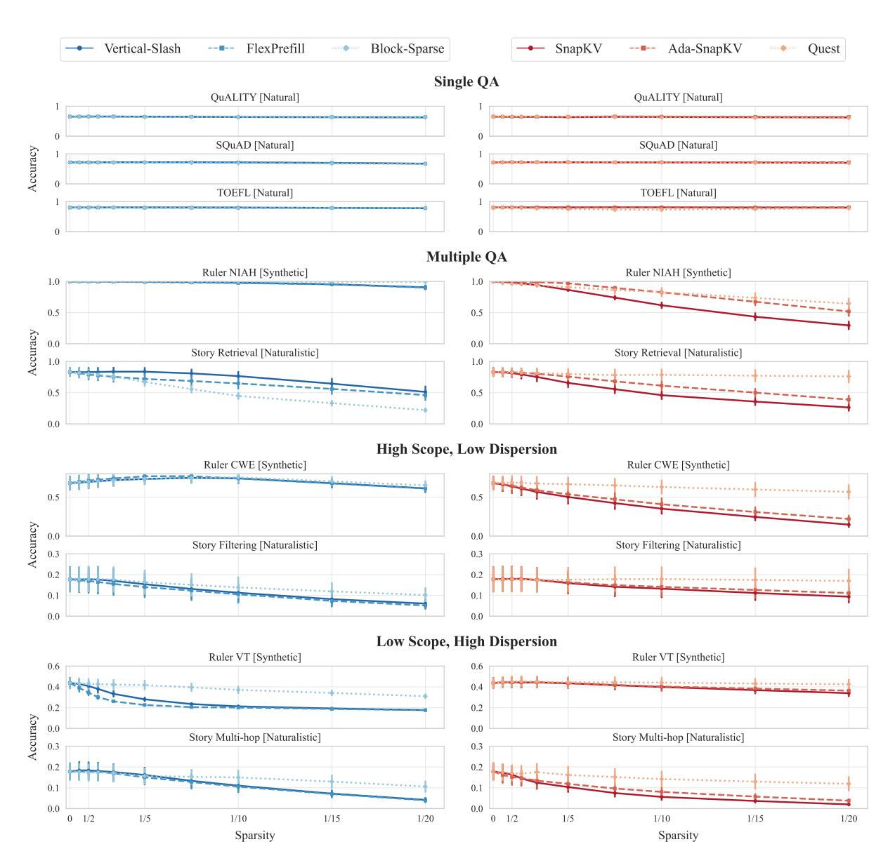
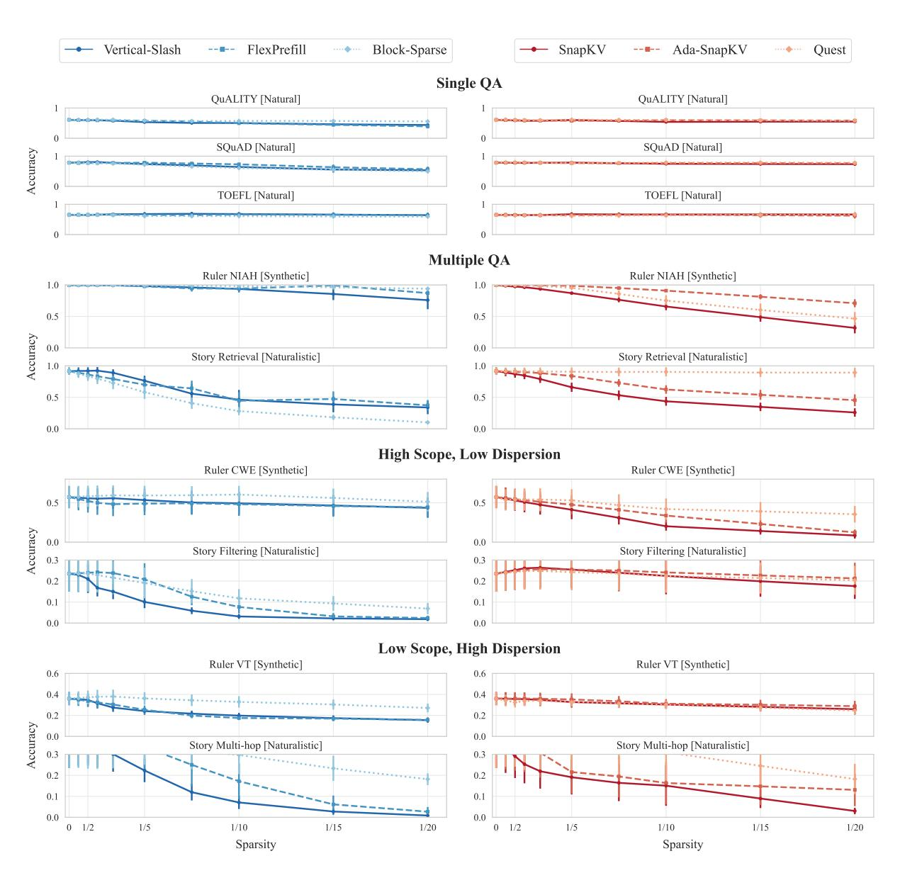
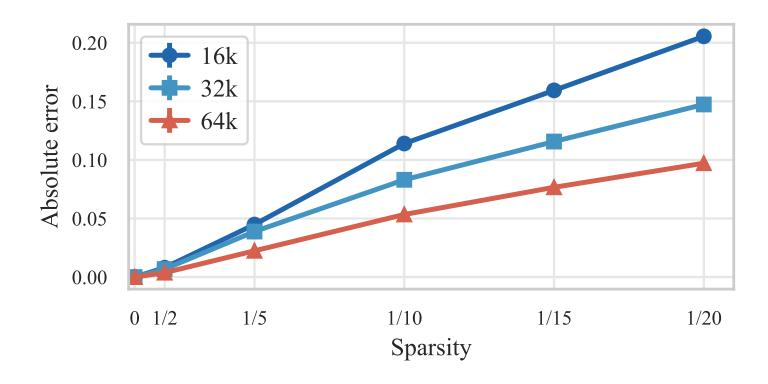

# <span id="page-22-1"></span>D.2 Per-Task Results by Model Family

This section provides per-task performance breakdowns for each model family, complementing the aggregated analysis in Section [4.2.](#page-5-0) Figures [15](#page-23-0) to [17](#page-25-0) show results for Qwen 2.5, Llama 3.1, and Gemma 3 respectively.

### <span id="page-22-2"></span>D.3 Sequence Length Effects

Figure [18](#page-26-0) presents the absolute error perspective on sequence length effects, complementing the relative error analysis in Section [4.3.](#page-7-0) The absolute error is p¯dense − p¯sparse, where p¯ denotes mean performance. The pattern mirrors the relative error findings: longer sequences tolerate higher sparsity with smaller absolute performance degradation.

Figure [19](#page-26-1) provides per-family breakdowns of the sequence length analysis. The trend of improved sparsity tolerance at longer sequences holds consistently across all three model families, with minor variations in magnitude.

### D.4 Model Size Analysis

We analyse how sparsity tolerance varies with model scale. Figure [20](#page-26-2) shows model size effects aggregated across all tasks, methods, and sequence lengths for each model family. On average, model size shows no clear correlation with sparsity tolerance—the lines for different model sizes largely overlap, indicating that larger models do not systematically tolerate more or less sparsity than smaller ones.

However, this aggregate finding masks important task-dependent patterns revealed in Figure [21.](#page-27-0)

Model size effects depend on task difficulty. Figure [21](#page-27-0) presents contrasting perspectives on model size effects. On tasks where all model sizes achieve near-perfect dense accuracy (left column: Story Retrieval, Ruler NIAH), larger models tolerate more sparsity—at sparsity 0.95 (1/20 budget), 72B shows 0.20 absolute error compared to 0.50 for 7B. Conversely, on challenging tasks where dense accuracy scales with model size (right column: Ruler VT, Story Filtering), larger models exhibit *larger* absolute errors at equivalent sparsity—72B shows 0.21 absolute error while 7B shows only 0.03 at sparsity 0.95. The relative error perspective (bottom row) shows consistent patterns: larger models have lower relative error on easy tasks but higher relative error on hard tasks.

<span id="page-23-0"></span>

Figure 15: Per-task performance for **Qwen 2.5** models (7B, 14B, 32B, 72B) at sequence lengths 16k, 32k, and 64k. **Left**: prefilling methods. **Right**: decoding methods.



Figure 16: Per-task performance for **Llama 3.1** models (8B, 70B) at sequence lengths 16k, 32k, and 64k. **Left**: prefilling methods. **Right**: decoding methods.

<span id="page-25-0"></span>

Figure 17: Per-task performance for **Gemma 3** models (4B, 12B, 27B) at sequence lengths 16k, 32k, and 64k. **Left**: prefilling methods. **Right**: decoding methods.

<span id="page-26-0"></span>

Figure 18: Absolute error vs. sparsity across sequence lengths. Results aggregated across all tasks, methods, and models (Qwen 2.5, Llama 3.1, Gemma 3).

<span id="page-26-1"></span>

Figure 19: Sequence length effects on sparsity tolerance by model family. **Top row**: absolute error vs. sparsity. **Bottom row**: relative error vs. sparsity. Results aggregated across all tasks and methods within each family.

<span id="page-26-2"></span>

Figure 20: Model size effects on sparsity tolerance aggregated across all tasks. **Top row**: absolute error vs. sparsity. **Bottom row**: relative error vs. sparsity. Results aggregated across all tasks, methods, and sequence lengths 16–64k for each model family.

<span id="page-27-0"></span>

Figure 21: Model size effects on sparsity tolerance for Qwen 2.5 (7B–72B). Absolute error is p¯dense −p¯sparse; relative error is (¯pdense − p¯sparse)/p¯dense, where p¯ denotes mean performance. Top row: absolute error vs. sparsity. Bottom row: relative error vs. sparsity. Left column: easy tasks (Story Retrieval, Ruler NIAH). Right column: hard tasks (Ruler VT, Story Filtering). Results aggregated across methods and sequence lengths 16–64k.

These divergent patterns arise from how sparsity interacts with model capacity. Sparse attention reduces effective model capacity by limiting information flow. When a model operates far above a task's difficulty threshold, this capacity reduction has minimal impact on outputs. When model capacity approximately matches task difficulty, even modest sparsity degrades performance. Larger models achieve higher dense accuracy on difficult tasks, operating closer to their capacity limits on these tasks—making them more vulnerable to capacity reductions from sparsity. Evaluations on tasks where models achieve perfect or near-perfect accuracy—common in benchmarks like Needle-in-a-Haystack—cannot reveal these vulnerabilities.

## <span id="page-28-0"></span>E Prompt Template

```
Input format:
You are provided with a task introduction, context, and a question.
{task_intro}
Below is your question. I will state it both before and after the context.
<question>
{question}
</question>
<context>
{context}
</context>
<question_repeated>
{question}
</question_repeated>
Instructions:
1. First, provide a brief explanation of your reasoning process. Explain how you identified
   the relevant information from the context and how you determined your answer.
2. Then, provide your final answer following this exact format:
<answer>
{answer_format}
</answer>
Your response must follow this structure exactly:
<explanation>
Your explanation here...
</explanation>
<answer>
Your answer here...
</answer>
Important:
{extra_instructions}
- Keep your explanations clear, coherent, concise, and to the point.
- Do not include any additional text, explanations, or reasoning in the answer section.
```

## <span id="page-29-0"></span>F Example Story Narrative

#### Chapter 1:

Beneath gentle breezes, Arion ventured into Athens, curious about its secrets. Long journeys had led Arion to Athens, a step closer to understanding. Soon enough, a tense negotiation seized everyone's attention. Cleo appeared as if expecting Arion, engaging them without delay. Carefully, they navigated the topic of old feuds, wary of awakening dormant animosities that still simmered. In a calm moment, they compared notes on the traders who passed through Athens, each leaving their subtle mark. In hushed tones, they spoke of local customs and distant rumors, sharing hints of hidden pathways. Following subtle bargaining with Cleo, Arion claimed ownership of lavish crystal lamp. With a light gesture, Arion acknowledged Cleo once more before departing. Nothing would be the same as Arion left Athens, thoughts turning inward. In quiet corners, ambitions simmered, waiting for a spark.

#### Chapter 2:

At dawn, Arion reached the gates of Hippo Regius, where merchants and travelers converged. This place might hold a clue Arion had long sought. Hardly had Arion arrived before a violent storm stirred uneasy whispers. Thanos approached Arion, eyes bright with opportunity. They lingered over tales of old alliances and forgotten disputes, weaving past into present. They debated the meaning of recent events, each seeking patterns in the chaos. Their reflections turned to the interplay of supply and demand, seeing how fortunes might turn in an instant. After reaching terms with Thanos, Arion took possession of ceremonial gold seal. Arion turned from Thanos, ready to move on. In parting, Arion acknowledged that the journey still had far to run. Hidden corners of the city promised knowledge or peril.

#### Chapter 3:

The threshold of Emerita Augusta welcomed Arion, who felt the weight of untold stories. Arion came here hoping to learn something new, or perhaps gain an advantage. Within hours, a violent storm disrupted the familiar routines. There, Arion encountered Niko, who seemed eager to exchange words or goods. Their words lingered on rumors of distant lands, where fortunes or ruin awaited bold seekers. They debated the meaning of recent events, each seeking patterns in the chaos. Their dialogue danced around subtle clues, each suggestion hinting at treasures undiscovered. The transaction concluded with Arion acquiring delicate porcelain sword from Niko. With a light gesture, Arion acknowledged Niko once more before departing. Eventually, Arion moved on, carrying new impressions forward. The distant hum of voices hinted at unseen deals.

#### Chapter 4:

Under fading daylight, Arion set foot in Berenice, eager to learn what it offered. A quiet determination brought Arion to Berenice, ever searching for meaning. a sudden market crash cast its shadow over Berenice, changing plans and minds. Roxana approached Arion, eyes bright with opportunity. Together, they reflected on the nature of trust and deceit, aware that fate often twists. They compared accounts of strange visitors bearing knowledge or confusion, each arrival a new riddle in Berenice. A short exchange revealed uncharted corners of Berenice, where knowledge or secrets might dwell. mystic bronze lamp changed hands as Arion completed the purchase from Roxana. Arion handed over lavish crystal lamp to Roxana as the deal closed. With a light gesture, Arion acknowledged Roxana once more before departing. As Arion prepared to depart, the path ahead remained uncertain but compelling. Somewhere, a whisper promised answers for those who dared.

#### Chapter 5:

Under fading daylight, Arion set foot in Syracuse, eager to learn what it offered. In pursuit of truth, Arion looked to Syracuse for subtle revelations. Not long after arriving, an opulent banquet shook the local order. Phaedra appeared as if expecting Arion, engaging them without delay. Their words traced over delicate negotiations that had once sealed lasting truces in Syracuse. Carefully, they navigated the topic of old feuds, wary of awakening dormant animosities that still simmered. They delved into the subtle art of earning trust in a place where trust was scarce and hard-won. With measured consideration, Arion purchased engraved emerald goblet from Phaedra, examining it closely. In quiet understanding, Arion left Phaedra, their paths diverging. In parting, Arion acknowledged that the journey still had far to run. A subtle tension lingered, as though fate held its breath.

## <span id="page-30-0"></span>G Example Task Inputs

## <span id="page-30-1"></span>G.1 Question Answering (QA)

```
Input format:
    I will provide you with multiple documents and ask you a question about one specific document.
    Below is your question. I will state it both before and after the context.
    <question>
    Question about document 39:
    Who works to get workers higher compensation?
    </question>
    <context>
    Document 1:
    [...text omitted...]
    Document 39:
    Jobs with high demand and low supply pay more. Professional and labor organizations
    can raise wages by limiting worker supply and using collective bargaining or political influence.
    Document 47:
    [...text omitted...]
    </context>
    <question_repeated>
    Question about document 39:
    Who works to get workers higher compensation?
    </question_repeated>
    Instructions:
    1. Provide a brief explanation of your reasoning process.
    2. Then, give your final answer in this format:
    <answer>
    Your answer here...
    </answer>
    Your response must follow this structure:
    <explanation>
    Your explanation here...
    </explanation>
    <answer>
    Your answer here...
    </answer>
    Important:
    - Do not use complete sentences in the answer.
    - For dates: Include ONLY the COMPLETE date if specifically asked.
    - For locations: Use the shortest unambiguous form (e.g., 'New York' not 'New York City').
    - For comparisons: State ONLY the answer that matches the criteria
    - Keep your explanations clear, coherent, concise, and to the point.
    - Do not include any additional text, explanations, or reasoning in the answer section.
Example answer:
    <explanation>
    I found the relevant sentence in document 39, which states that professional and labor
    organizations help increase wages using bargaining and political means.
    </explanation>
    <answer>
    Professional and labor organizations
    </answer>
```

### <span id="page-31-0"></span>G.2 RULER - Needle-in-a-Haystack (NIAH)

```
Input format:
    I will provide you with a document containing multiple key-value pairs.
    Your task is to extract specific values associated with given keys.
    Below are your questions. I will state them both before and after the context.
    <questions>
    Extract the values for the following keys:
    key-A, key-B, key-C, key-D
    </questions>
    <context>
    The value for key-A is: value-A.
    The value for key-X is: value-X.
    The value for key-B is: value-B.
    The value for key-Y is: value-Y.
    The value for key-C is: value-C.
    The value for key-Z is: value-Z.
    The value for key-D is: value-D.
    </context>
    <questions_repeated>
    Extract the values for the following keys:
    key-A, key-B, key-C, key-D
    </questions_repeated>
    Instructions:
    1. First, provide a brief explanation of your reasoning process. Explain how you identified
       the relevant information from the context and how you determined your answer.
    2. Then, provide your final answer following this exact format:
    <answer>
    1. The answer for <key1> is <value1>.
    2. The answer for <key2> is <value2>.
    etc.
    </answer>
    Your response must follow this structure exactly:
    <explanation>
    Your explanation here...
    </explanation>
    <answer>
    Your answer here...
    </answer>
    Important:
    - Provide answers in the exact order of the requested keys
    - Each answer must follow the format: "<number>. The answer for <key> is <value>."
    - Ensure exact key matches - do not modify or paraphrase the keys
    - Values must match exactly as they appear in the document
    - Keep your explanations clear, coherent, concise, and to the point.
    - Do not include any additional text, explanations, or reasoning in the answer section.
Example answer:
    <explanation>
    I scanned the context for exact matches of the requested keys. For each key, I extracted
    the value as stated directly after the pattern "The value for key-X is: ...".
    </explanation>
    <answer>
    1. The answer for key-A is value-A.
    2. The answer for key-B is value-B.
    3. The answer for key-C is value-C.
    4. The answer for key-D is value-D.
    </answer>
```

## <span id="page-32-0"></span>G.3 RULER - Common Word Extraction (CWE)

```
Input format:
    You will be given a numbered list of words. Your task is to identify the most
    frequently occurring words. You should solve this task by carefully reading
    and analyzing the word list. Do not attempt to write code or use programming
    tools to count frequencies. This is a test of your ability to track word
    frequencies directly.
    Below is your question. I will state it both before and after the context.
    <question>
    The list contains exactly 10 words that appear 30 times each.
    All other words appear 3 times each.
    Your task is to identify the 10 words that appear 30 times each.
    </question>
    <context>
    1. alpha
    2. beta
    3. gamma
    4. delta
    5. alpha
    6. epsilon
    [...list continues with randomized repeated words...]
    N. gamma
    </context>
    <question_repeated>
    The list contains exactly 10 words that appear 30 times each.
    All other words appear 3 times each.
    Your task is to identify the 10 words that appear 30 times each.
    </question_repeated>
    Instructions:
    1. First, provide a brief explanation of your reasoning process.
       Explain how you identified the relevant information from the context
       and how you determined your answer.
    2. Then, provide your final answer following this exact format:
    <answer>
    1. word_one
    2. word_two
    10. word_ten
    </answer>
    Your response must follow this structure exactly:
    <explanation>
    Your explanation here...
    </explanation>
    <answer>
    Your answer here...
    </answer>
    Important:
    - List exactly 10 words, one per line, numbered from 1 to 10.
    - Keep your explanations clear, coherent, concise, and to the point.
    - Do not include any additional text, explanations, or reasoning in the answer section.
Example answer:
    <explanation>
    I scanned the word list and tracked the frequency of each word.
    The following 10 words appeared 30 times each, which I confirmed by careful counting.
    </explanation>
    <answer>
    1. diligent
    2. ash
    3. pour
    4. chateau
    5. marble
    6. laparoscope
    7. grub
    8. vinyl
    9. mobility
    10. kettledrum
    </answer>
```

## <span id="page-33-0"></span>G.4 RULER - Variable Tracking (VT)

```
Input format:
    I will provide you with a text containing variable assignments. The text contains two types of assignments:
    1. Numeric assignments that set a variable to a number (e.g., "VAR ABC = 12345")
    2. Copy assignments that set a variable equal to another variable (e.g., "VAR XYZ = VAR ABC")
    Variables are sequences of uppercase letters. The assignments can appear in any order in the text.
    Below is your question. I will state it both before and after the context.
    <question>
    Which variables resolve to the value 41015? A variable resolves to 41015 if it is either directly assigned
    41015, or assigned to another variable that resolves to 41015.
    </question>
    <context>
    VAR A = VAR B
    VAR B = 41015
    VAR C = VAR D
    VAR D = VAR B
    VAR E = 12345
    VAR F = VAR G
    VAR G = VAR H
    VAR H = VAR B
    </context>
    <question_repeated>
    Which variables resolve to the value 41015? A variable resolves to 41015 if it is either directly assigned
    41015, or assigned to another variable that resolves to 41015.
    </question_repeated>
    Instructions:
    1. First, provide a brief explanation of your reasoning process. Explain how you identified
       the relevant information from the context and how you determined your answer.
    2. Then, provide your final answer following this exact format:
    <answer>
    VARIABLE_ONE VARIABLE_TWO etc.
    </answer>
    Your response must follow this structure exactly:
    <explanation>
    Your explanation here...
    </explanation>
    <answer>
    Your answer here...
    </answer>
    Important:
    - List ONLY the variable names that resolve to the target value.
    - Variables can be listed in any order.
    - Do not include "VAR" prefix in your answer. Do not include punctuation.
    - Keep your explanations clear, coherent, concise, and to the point.
    - Do not include any additional text, explanations, or reasoning in the answer section.
Example answer:
    <explanation>
    I traced each variable assignment to see if it leads to the value 41015. B is directly assigned 41015.
    A, D, and H point to B. C and G point to D and H, respectively. So A B C D G H resolve to 41015.
    </explanation>
    <answer>
    A B C D G H
    </answer>
```

## <span id="page-34-0"></span>G.5 Story Retrieval

```
Input format:
    You are given a narrative composed of multiple chapters. Throughout these chapters, the
    protagonist travels between different locations, meets various characters, and engages
    in trading activities. All items mentioned in the narrative are unique, and their
    ownership can change through trades. Your task is to carefully read the narrative and
    answer the questions based on the provided information.
    Below are your questions. I will state them both before and after the context.
    <questions>
    1. In Chapter 3, which character did the protagonist interact with?
    2. In Chapter 5, which specific item was acquired by the protagonist?
    3. In Chapter 7, which specific location did the protagonist visit?
    </questions>
    <context>
    Chapter 1:
    [...text omitted...]
    Chapter 3:
    Arion entered Babylon and met Thanos. After exchanging stories, Arion acquired a silver idol.
    Chapter 5:
    In Berenice Troglodytica, Arion encountered Xanthe and traded for a golden vase.
    Chapter 7:
    Delphi welcomed Arion with quiet mystery. A meeting with Vitalis ended with a jade idol.
    </context>
    <questions_repeated>
    1. In Chapter 3, which character did the protagonist interact with?
    2. In Chapter 5, which specific item was acquired by the protagonist?
    3. In Chapter 7, which specific location did the protagonist visit?
    </questions_repeated>
    Instructions:
    1. First, provide a brief explanation of your reasoning process. Explain how you identified
       the relevant information from the context and how you determined your answer.
    2. Then, provide your final answer following this exact format:
    <answer>
    1. ANSWER_ONE
    2. ANSWER_TWO
    etc.
    </answer>
    Your response must follow this structure exactly:
    <explanation>
    Your explanation here...
    </explanation>
    <answer>
    Your answer here...
    </answer>
    Important:
    - For answers, use one line per answer with the number prefix
    - Do not include articles like 'the' or 'a' in answers
    - Answers should be specific names/items/locations mentioned in the text
    - Keep your explanations clear, coherent, concise, and to the point.
    - Do not include any additional text, explanations, or reasoning in the answer section.
Example answer:
    <explanation>
    I located Chapter 3 in the context and identified Thanos as the mentioned character.
    In Chapter 5, Arion acquired a golden vase from Xanthe.
    Chapter 7 stated that Arion visited Delphi, so I used that as the answer.
    </explanation>
    <answer>
    1. Thanos
    2. Golden Vase
    3. Delphi
    </answer>
```

## <span id="page-35-0"></span>G.6 Story Filtering

```
Input format:
    You are given a narrative composed of multiple chapters. Throughout these chapters, the
    protagonist travels between different locations, meets various characters, and engages
    in trading activities. All items mentioned in the narrative are unique, and their
    ownership can change through trades. Your task is to carefully read the narrative and
    answer the questions based on the provided information.
    Below is your question. I will state it both before and after the context.
    <question>
    Identify all chapters where the protagonist did not buy any item.
    Note: There are exactly 2 chapters without any purchases.
    </question>
    <context>
    Chapter 1:
    [... Arion visits Athens and purchases a crystal lamp ...]
    Chapter 2:
    [... Arion travels to Hippo Regius and buys a gold seal ...]
    Chapter 3:
    [... Arion enters Babylon and engages in an ongoing event but do not buy anything ...]
    Chapter 4:
    [... Arion arrives in Pergamon and has conversations, but no purchases are mentioned ...]
    Chapter 5:
    [... Arion goes to Delphi and buys a jade idol ...]
    </context>
    <question_repeated>
    Identify all chapters where the protagonist did not buy any item.
    Note: There are exactly 2 chapters without any purchases.
    </question_repeated>
    Instructions:
    1. First, provide a brief explanation of your reasoning process. Explain how you identified
       the relevant information from the context and how you determined your answer.
    2. Then, provide your final answer following this exact format:
    <answer>
    chapter_id_1, chapter_id_2, ...
    </answer>
    Your response must follow this structure exactly:
    <explanation>
    Your explanation here...
    </explanation>
    <answer>
    Your answer here...
    </answer>
    Important:
    - In the answer section, provide only the chapter IDs separated by commas.
    - Keep your explanations clear, coherent, concise, and to the point.
    - Do not include any additional text, explanations, or reasoning in the answer section.
Example answer:
    <explanation>
    I scanned each chapter to check whether a purchase by the protagonist was explicitly
    described. In Chapter 3 and 4, no item acquisition are mentioned. Other chapters include
    phrases like "Arion purchased" or "Arion acquired", indicating a transaction.
    </explanation>
    <answer>
    3, 4
    </answer>
```

## <span id="page-36-0"></span>G.7 Story Multi-hop

```
Input format:
    You are given a narrative composed of multiple chapters. Throughout these chapters,
    the protagonist travels between different locations, meets various characters,
    and engages in trading activities. All items mentioned in the narrative are unique,
    and their ownership can change through trades. Your task is to carefully read the
    narrative and answer the questions based on the provided information.
    Below is your question. I will state it both before and after the context.
    <question>
    What was the last item that the protagonist acquired before acquiring timeworn amber sword?
    </question>
    <context>
    Chapter 1:
    [... narrative text omitted for brevity ...]
    Chapter 17:
    The transaction concluded with Arion acquiring pristine bronze seal from Damon.
    Chapter 18:
    After reaching terms with Marcus, Arion took possession of timeworn amber sword.
    </context>
    <question_repeated>
    What was the last item that the protagonist acquired before acquiring timeworn amber sword?
    </question_repeated>
    Instructions:
    1. First, provide a brief explanation of your reasoning process. Explain how you identified
       the relevant information from the context and how you determined your answer.
    2. Then, provide your final answer following this exact format:
    <answer>
    ITEM_NAME
    </answer>
    Your response must follow this structure exactly:
    <explanation>
    Your explanation here...
    </explanation>
    <answer>
    Your answer here...
    </answer>
    Important:
    - Provide only the item name in the answer section.
    - Do not include articles like 'the' or 'a' in your answer.
    - The item name must be exactly as mentioned in the text.
    - Keep your explanations clear, coherent, concise, and to the point.
    - Do not include any additional text, explanations, or reasoning in the answer section.
Example answer:
    <explanation>
    I located the chapter where the protagonist acquired the timeworn amber sword.
    Then, I scanned earlier chapters to find the most recent prior acquisition,
    which occurred in Chapter 17 with the item pristine bronze seal.
    </explanation>
    <answer>
    pristine bronze seal
    </answer>
```

## H Use of AI Assistants

We used Claude Opus 4.5 for grammar and style suggestions during the writing of this paper. All scientific content, analysis, and conclusions are the authors' own work.