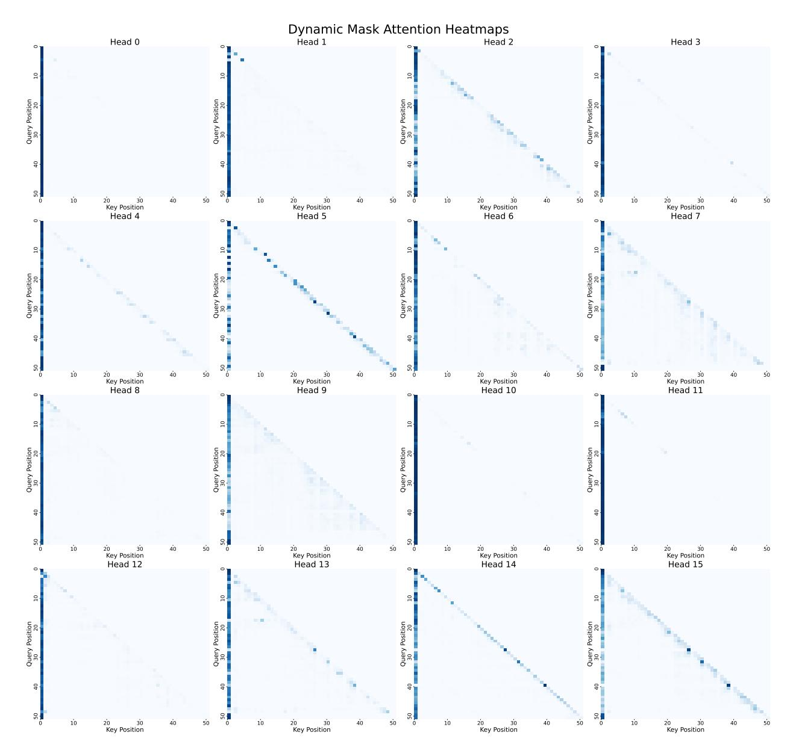

# C Attention Heatmaps

Figure 11: **Full Heatmaps of Dynamic Mask Attention**. The heatmaps show the attention weights of each head in the Dynamic Mask Attention mechanism, indicating which tokens each head focuses on.