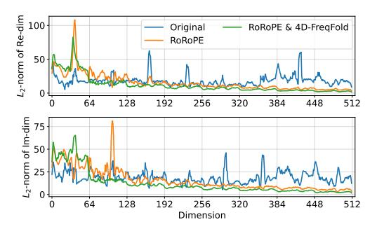
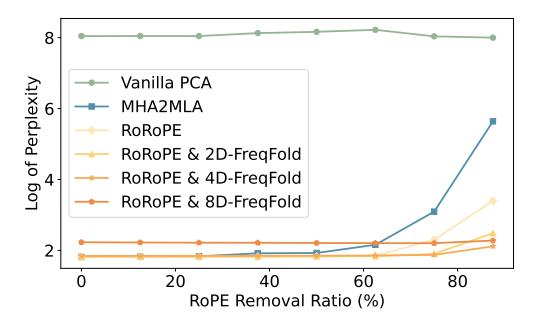
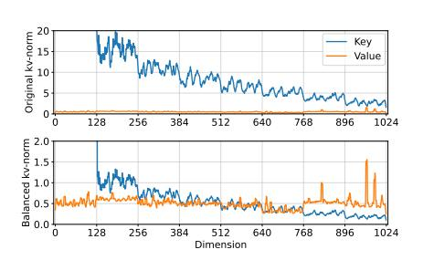
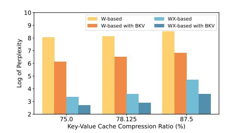

# 5.2 Key Norm Analysis Reveals the Impact of RoRoPE and FreqFold

In this section, we conduct a detailed analysis of the distribution of key activations in the attention module to demonstrate the effectiveness of our proposed methods.

Figure 3a presents the average L2 norm of each key dimension in the first attention layer of the LLaMA 3 8B model, computed on a subset of the WikiText-2 Merity et al. [2016] dataset. We compare the original model (in blue), the model transformed using our RoRoPE equivalence method (in orange), and the further approximated model using 4D FreqFold (in green). The top and bottom halves of the plot correspond to pairs of dimensions that share the same rotation angle in RoPE, which we refer to as the real (Re-dim) and imaginary (Im-dim) dimensions.

Table 1: Commonsense reasoning ability of two LLMs with TransMLA compared to MHA2MLA. The six benchmarks include MMLU [\(Hendrycks et al.](#page-12-13) [\[2021\]](#page-12-13)), ARC easy and challenge (ARC, [Clark et al.](#page-12-14) [\[2018\]](#page-12-14)), PIQA [\(Bisk et al.](#page-12-15) [\[2020\]](#page-12-15)), HellaSwag (HS, [Zellers et al.](#page-13-1) [\[2019\]](#page-13-1)), OpenBookQA (OBQA, [Mihaylov et al.](#page-13-2) [\[2018\]](#page-13-2)), and Winogrande (WG, [Sakaguchi et al.](#page-13-3) [\[2021\]](#page-13-3)). Tokens refers to the number of tokens used for further training after the TransMLA conversion. A value of 0 indicates that the model was evaluated immediately after conversion, without any fine-tuning.

| Model       | Tokens | KV Mem. | Avg.  | MMLU  | ARC   | PIQA  | HS    | OBQA  | WG    |
|-------------|--------|---------|-------|-------|-------|-------|-------|-------|-------|
| SmolLM-1.7B | 1T     | –       | 55.90 | 39.27 | 59.87 | 75.73 | 62.93 | 42.80 | 54.85 |
|             |        | -68.75% | 40.97 | 27.73 | 41.96 | 63.00 | 29.19 | 34.40 | 49.53 |
| - MHA2MLA   | 0      | -81.25% | 37.14 | 26.57 | 32.73 | 55.77 | 26.90 | 31.40 | 49.49 |
|             |        | -87.50% | 34.01 | 25.32 | 27.15 | 51.36 | 25.47 | 26.20 | 48.54 |
|             |        | -68.75% | 54.76 | 38.11 | 57.13 | 76.12 | 61.35 | 42.00 | 53.83 |
|             | 6B     | -81.25% | 54.65 | 37.87 | 56.81 | 75.84 | 60.41 | 42.60 | 54.38 |
|             |        | -87.50% | 53.61 | 37.17 | 55.50 | 74.86 | 58.55 | 41.20 | 54.38 |
|             |        | -68.75% | 51.95 | 35.70 | 55.68 | 73.94 | 53.04 | 39.80 | 53.51 |
|             | 0      | -81.25% | 47.73 | 32.87 | 47.89 | 69.75 | 48.16 | 36.20 | 51.46 |
|             |        | -87.50% | 44.12 | 29.97 | 41.72 | 66.87 | 41.15 | 34.80 | 50.28 |
| - TransMLA  | 300M   | -68.75% | 55.24 | 38.60 | 58.95 | 74.97 | 61.52 | 43.00 | 54.38 |
|             | 700M   | -81.25% | 54.78 | 37.79 | 57.53 | 75.52 | 59.88 | 42.80 | 55.17 |
|             | 1B     | -87.50% | 54.01 | 37.24 | 56.32 | 74.81 | 60.08 | 42.40 | 53.20 |
| LLaMA-2-7B  | 2T     | –       | 59.85 | 41.43 | 59.24 | 78.40 | 73.29 | 41.80 | 64.96 |
|             |        | -68.75% | 37.90 | 25.74 | 32.87 | 59.41 | 28.68 | 28.60 | 52.09 |
|             | 0      | -81.25% | 34.02 | 25.50 | 26.44 | 53.43 | 27.19 | 22.60 | 49.01 |
|             |        | -87.50% | 32.70 | 25.41 | 25.79 | 50.60 | 26.52 | 19.40 | 48.46 |
| - MHA2MLA   |        | -68.75% | 59.51 | 41.36 | 59.51 | 77.37 | 71.72 | 44.20 | 62.90 |
|             | 6B     | -81.25% | 59.61 | 40.86 | 59.74 | 77.75 | 70.75 | 45.60 | 62.98 |
|             |        | -87.50% | 58.96 | 40.39 | 59.29 | 77.75 | 69.70 | 43.40 | 63.22 |
| - TransMLA  |        | -68.75% | 58.20 | 39.90 | 57.66 | 77.48 | 70.22 | 41.00 | 62.90 |
|             | 0      | -87.50% | 51.19 | 34.39 | 45.38 | 71.27 | 60.73 | 37.40 | 57.93 |
|             |        | -92.97% | 43.26 | 28.93 | 36.32 | 63.38 | 45.87 | 31.60 | 53.43 |
|             | 500M   | -68.75% | 59.82 | 40.87 | 59.18 | 77.91 | 71.82 | 45.20 | 63.93 |
|             | 3B     | -87.50% | 59.36 | 40.77 | 58.84 | 78.18 | 71.28 | 43.60 | 63.46 |
|             | 6B     | -92.97% | 58.68 | 40.82 | 59.72 | 76.55 | 69.97 | 43.60 | 61.40 |

We observe that the original model exhibits a highly *uneven norm distribution* across key dimensions, with numerous outliers. This suggests that naively removing RoPE from certain heads would likely result in significant performance degradation. After applying our RoRoPE transformation, as shown by the orange line, the key dimensions with large norms are nearly all concentrated to the first two heads (dimension 0-128). Further applying the 4D FreqFold approximation compresses the tail (i.e., higher-index dimensions) even more, leading to an even sharper concentration of high-norm key dimensions. This concentrated structure is highly beneficial for the subsequent RoPE removal step as shown in Figure [3b.](#page-9-0)

In Figure [3b,](#page-9-0) we present the log-perplexity of the LLaMA 3 8B model on WikiText-2 as RoPE components are progressively removed. We observe that our proposed RoRoPE method *significantly outperforms* MHA2MLA's per-head dimension selection strategy, especially at high removal ratio. Furthermore, incorporating similar-dimension approximation leads to even better performance under extreme removal rates. At 90% removal ration, RoRoPE + 4D-FreqFold still maintains a logperplexity about 2, while MHA2MLA reaches nearly 6, which no longer generates meaningful outputs. At the same time, we observe that overly aggressive FreqFold (i.e., using too many dimensions) can degrade performance, as the loss introduced by approximation of nearby dimensions can outweigh the benefit in concentrating the principal components. This figure suggests that for LLaMA 3 8B, the sweet spot lies in applying RoRoPE combined with 4D FreqFold.

- (a) Key norms of the first layer.
- (b) RoPE removal results, evaluated on WikiText-2.

Figure 3: Visualization of key norms and RoPE removal results on LLaMA 3 8B model. The top and bottom halves of the left figure correspond to pairs of dimensions that share the same rotation angle in RoPE, which we refer to as the real (Re-dim) and imaginary (Im-dim) dimensions.

- (a) Norm magnitude of keys and values before and after KV balancing is applied.
- (b) Comparison of different methods of KV cache compression, with and without KV balancing.

Figure 4: Visualization of the norms of keys and values for the first layer of LLaMA 3 8B and the perplexity results after joint low-rank compression of keys and values under WikiText-2. Here, **W-based** and **WX-based** refer to PCA applied on the attention weights and the activation outputs, respectively. **BKV** denotes the application of KV balancing.

### 5.3 Key-Value Norm Disparity Motivates KV Balancing

In Figure 4a, we visualize the norm magnitudes of the key and value activations in the first layer of LLaMA 3 8B before and after KV balancing. Note that both the key and value shown here are activations after applying the RoRoPE principal component concentration, and the first head of the key—reserved for RoPE—is excluded. As a result, the value and the remaining key components shown in the figure are precisely the elements we aim to compress jointly into a lower-dimensional space via PCA.

It is evident that even after removing the first head with the highest norm, the overall norm of the key remains significantly larger than that of the value. This norm disparity poses a substantial challenge for joint compression into a shared latent space. In particular, such imbalance can bias the PCA toward directions aligned with the key, rather than the value, leading to suboptimal representation of the value components.

The lower part of Figure 4a shows the norm distribution of keys and values after applying KV balancing. At this point, the norms of keys and values become more aligned, which is beneficial for performing joint PCA. This observation is further supported by the results in Figure 4b, where KV balancing consistently reduces the loss incurred by jointly applying low-rank approximation to keys and values—whether the PCA is based on weights or on activations. Figure 4b also demonstrates that activation-based PCA yields significantly better results than weight-based PCA.

