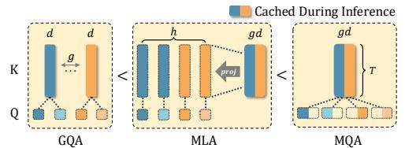
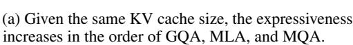
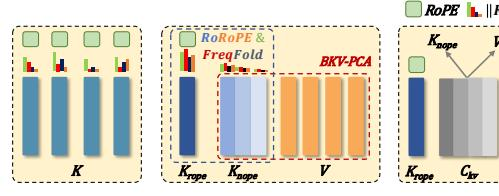

# **Abstract**

Modern large-language models often face communication bottlenecks on current hardware rather than computational limitations. Multi-head latent attention (MLA) addresses this by compressing the key-value cache using low-rank matrices, while the Absorb operation prevents the KV cache from reverting to its original size, significantly boosting both training and inference speed. Despite the success of DeepSeek V2/V3/R1, most model providers have heavily invested in optimizing GQA-based models and, therefore, lack strong incentives to retrain MLA-based models from scratch. This paper demonstrates that MLA provides superior expressive power compared to GQA with the same KV cache overhead, thereby offering a rationale for transitioning from GQA to MLA. In addition, we introduce TransMLA, a framework that seamlessly converts any GQA-based pre-trained model (e.g., LLaMA, Qwen, Gemma, Mistral/Mixtral) into an MLA-based model. For the first time, our method enables direct conversion of these models into a format compatible with DeepSeek's codebase, allowing them to fully leverage DeepSeek-specific optimizations such as vLLM and SGlang. By compressing 93% of the KV cache in LLaMA-2-7B, we achieve a 10.6x speedup with an 8K context length while maintaining meaningful output. Moreover, the model requires only 6B tokens for fine-tuning to recover comparable performance across multiple benchmarks. TransMLA provides a practical path for migrating GQA-based models to the MLA structure, and when combined with DeepSeek's advanced optimizations—such as FP8 quantization and Multi-Token Prediction—further inference acceleration can be achieved.

(b) TransMLA concentrates positional information into  $K_{rope}$  and compresses  $K_{nope}$  and V.

Figure 1: GQA, MLA, and MQA can be equivalently transformed in one direction, illustrating a gradual increase in expressive power. RoRoPE aggregates positional information in the first head, eliminating the need for RoPE in others. FreqFold further enhances this effect. Finally, after balancing the magnitudes of  $K_{rope}$  and V, a joint low-rank approximation is applied to compress the KV cache.

\*Equal contribution.

&lt;sup>†Corresponding author: muhan@pku.edu.cn

